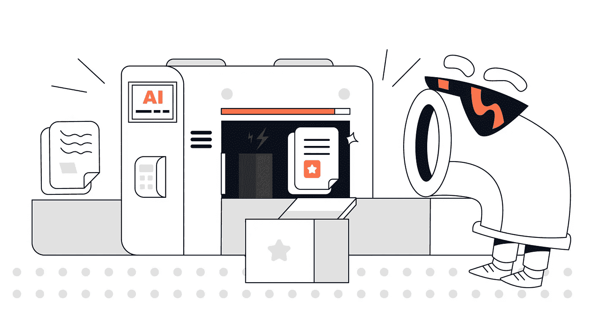

# 人工智能如何扰乱数据治理？

> 原文：[`towardsdatascience.com/how-is-ai-disrupting-data-governance-4bd79950905c?source=collection_archive---------7-----------------------#2023-07-14`](https://towardsdatascience.com/how-is-ai-disrupting-data-governance-4bd79950905c?source=collection_archive---------7-----------------------#2023-07-14)

## 数据治理与人工智能之间的共生关系

 [Louise de Leyritz](https://medium.com/@louise.de.leyritz?source=post_page-----4bd79950905c--------------------------------)

·

[阅读更多](https://medium.com/m/signin?actionUrl=https%3A%2F%2Fmedium.com%2F_%2Fsubscribe%2Fuser%2Fa926de8a6b3f&operation=register&redirect=https%3A%2F%2Ftowardsdatascience.com%2Fhow-is-ai-disrupting-data-governance-4bd79950905c&user=Louise+de+Leyritz&userId=a926de8a6b3f&source=post_page-a926de8a6b3f----4bd79950905c---------------------post_header-----------) 发表在 [Towards Data Science](https://towardsdatascience.com/?source=post_page-----4bd79950905c--------------------------------) ·8 分钟阅读·2023 年 7 月 14 日

--

人工智能正在改变数据治理的世界 — 图片由[CastorDoc](http://castordoc.com)提供

生成式人工智能已经开始震撼数据治理领域，并且这种影响还将继续下去。

自 ChatGPT 发布以来才过去了 6 个月，但我们已经觉得需要进行回顾。在这篇文章中，我将探讨生成式人工智能如何影响数据治理，以及它可能将我们带向何处。让我强调一下**近期**，因为事物发展迅速，可能会有很多不同的方向。这篇文章不是关于预测未来 100 年数据治理的情况，而是实用地看待当前正在发生的变化以及那些即将到来的变化。

在深入之前，让我们回顾一下数据治理涉及的内容。

简单来说，数据治理是一个组织为确保数据可信赖而遵循的一套规则或流程。它涉及 5 个关键领域：

+   元数据和文档

+   搜索和发现

+   政策和标准

+   数据隐私和安全

+   数据质量

在这篇文章中，我们将探讨一旦引入生成性 AI，每个领域将如何发展。
