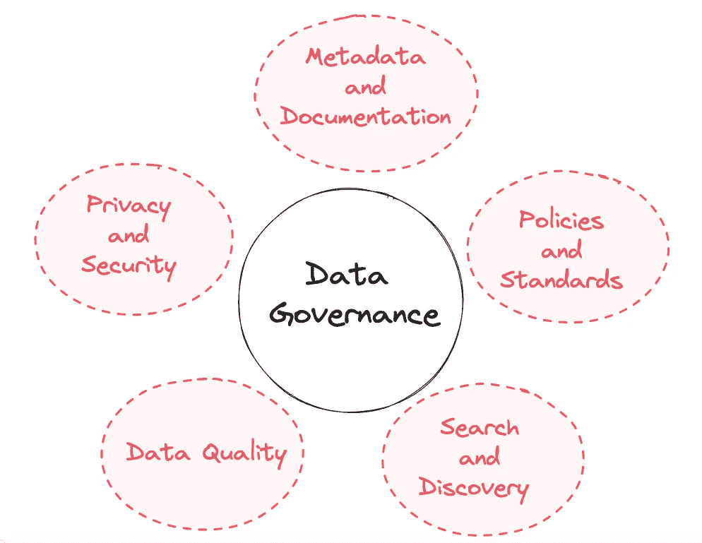
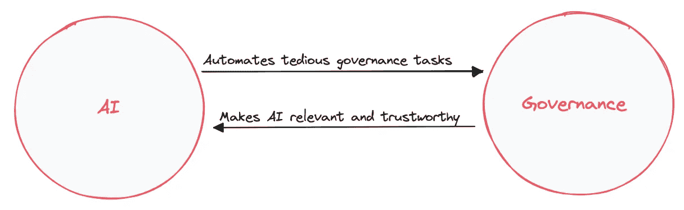

# AI 如何颠覆数据治理？

> 原文：[`towardsdatascience.com/how-is-ai-disrupting-data-governance-4bd79950905c`](https://towardsdatascience.com/how-is-ai-disrupting-data-governance-4bd79950905c)

## 数据治理与 AI 之间的共生关系

 [Louise de Leyritz](https://medium.com/@louise.de.leyritz?source=post_page-----4bd79950905c--------------------------------)

·发表于[Towards Data Science](https://towardsdatascience.com/?source=post_page-----4bd79950905c--------------------------------) ·阅读时长 8 分钟·2023 年 7 月 14 日

--

AI 正在改变数据治理的世界 — 图片来源：[CastorDoc](http://castordoc.com)

生成式 AI 已经开始动摇数据治理的世界，并且将继续这样做。

自 ChatGPT 发布已经过去了 6 个月，但感觉我们已经需要回顾一下了。在这篇文章中，我将探讨生成式 AI 如何影响数据治理，以及它可能会把我们带到什么地方。让我强调一下**近期**，因为事物发展迅速，可能会有很多不同的方向。这篇文章不是关于预测数据治理未来 100 年的，而是实用地看看现在正在发生的变化以及即将出现的变化。

在深入之前，让我们回顾一下数据治理涉及什么。

简单来说，数据治理是组织为确保数据可信而遵循的一套规则或流程。它涉及 5 个关键领域：

+   元数据与文档

+   搜索与发现

+   政策和标准

+   数据隐私与安全

+   数据质量

在这篇文章中，我们将探讨在引入生成式 AI 之后，这些领域将如何演变。

让我们开始吧！

数据治理的五大支柱 — 图片来源：[CastorDoc](https://www.castordoc.com/)

# 1\. 元数据与文档

元数据和文档可能是数据治理中最重要的部分，其他部分在很大程度上依赖于这一部分的正确完成。AI 已经开始，并将继续改变我们创建数据背景的方式。但我不想让你们抱有过高的期望。当涉及到文档时，我们仍然需要人工参与。

生成数据背景或记录数据分为两个部分。第一个部分，占工作的约 70%，涉及记录一般信息，这些信息对许多公司都是共通的。一个非常基础的例子是“电子邮件”的定义，这对所有公司来说都是共通的。第二部分则是记录公司特有的专业知识。

激动人心的部分是：AI 可以为前 70%的工作做很多繁重的工作。这是因为第一个部分涉及通用知识，而生成性 AI 在处理这些方面表现出色。

那么，关于公司特有的知识呢？每个组织都是独特的，这种独特性产生了你自己特有的公司语言。这种语言包括你的指标、KPI 和商业定义。这不是可以从外部导入的内容。它源于最了解业务的人——员工。

在我与数据领导者的对话中，我常常讨论如何创建对这些商业概念的共同理解。许多领导者表示，为了实现这种一致性，他们会把领域团队**聚集在同一个房间**进行讨论、辩论，并就最适合他们商业模型的定义达成一致。

举个例子，‘客户’的定义。对于订阅制业务，客户可以是当前订阅了他们服务的人。但对于零售业务，客户可能是过去 12 个月内进行过购买的人。每家公司都以最适合自己的方式定义‘客户’，这种理解通常来自组织内部。

对于这种特殊知识，尽管 AI 再智能，它目前还无法完成这部分。它不能参加你的会议，参与讨论，或帮助新概念的产生。对于 Andreessen Horowitz 来说，这可能会在[第二波 AI](https://a16z.com/2023/03/30/b2b-generative-ai-synthai/)到来时成为可能。目前，我们仍处于第一波。

我还想提到 Benn Stancil 提出的问题。Benn 问道：如果一个机器人可以按需为我们编写数据文档，[那编写它的意义何在](https://rachsmith.com/i-want-good-search/#:~:text=If%20a%20bot%20can%20write%20for%20me%2C%20what%20is%20the%20point%20of%20me%20writing%20in%20the%20first%20place%3F)?

这确实有些道理：如果生成性 AI 可以按需生成内容，那为什么不在需要时生成它，而不必费心记录一切呢？不幸的是，情况并非如此，原因有两个。

首先，正如我之前解释的，文档的一部分涵盖了公司特有的方面，这些是 AI**尚无法捕捉的**。这需要人类的专业知识。AI 无法即时生成这些内容。

其次，虽然 AI 很先进，但它并不是万无一失的。它生成的数据不总是准确的。你需要确保有人检查并确认所有 AI 生成的内容。

# 2\. 搜索和发现

生成式人工智能不仅改变了我们创建文档的方式，还改变了我们消费文档的方式。事实上，我们正在见证搜索和发现方法的范式转变。传统方法中，分析师通过你的数据目录寻找相关信息的方式正在迅速过时。

真正的改变者在于人工智能成为公司每个人的**个人数据助手**的能力。在某些数据目录中，你已经可以向人工智能询问特定的数据问题。你可以问诸如“是否可以使用数据执行动作 X？”，“为什么我无法用数据实现 Y？”或者“我们是否拥有展示 Z 的数据？”等问题。如果你的数据经过了正确的上下文补充，人工智能将帮助在公司内部传播这一上下文。

我们还预期另一个发展是人工智能将把数据目录从一个被动的实体转变为一个主动的助手。这样考虑一下：如果你使用公式不正确，人工智能助手可以提醒你。同样，如果你准备编写一个已经存在的查询，人工智能可以告诉你，并指导你到现有的工作成果。

过去，数据目录只是静静地存在，等待你去筛选答案。但有了人工智能，目录可以主动帮助你，提供洞察和解决方案**在你意识到需要之前**。这将彻底改变我们与数据的互动方式，并且可能很快就会发生。

然而，人工智能助手有效工作的一个前提是：你的数据目录必须得到维护。为了确保人工智能助手能向利益相关者提供可靠的指导，基础文档必须是 100%可信的。如果目录维护不善，或者政策没有明确规定，那么人工智能助手将会向公司传播错误信息。这比没有信息更为有害，因为它可能导致基于错误背景的糟糕决策。

你可能已经理解了：人工智能和数据治理是相互依赖的。人工智能可以增强数据治理，但反过来，强健的数据治理也需要来推动人工智能的能力。这导致了一个良性循环，每个组件都能提升另一个。但你需要记住**没有任何一个元素可以替代另一个。**

数据治理与人工智能的共生关系 — 图片来自 [CastorDoc](http://castordoc.com)

# 3\. 数据政策和标准

数据治理的另一个关键组成部分是制定和实施治理规则。

这通常涉及定义组织内的数据所有权和领域。目前，人工智能在制定这些政策和标准方面还做不到位。人工智能在执行规则或标记违规方面表现出色，但**在制定规则本身时则显得不足。**

这是因为一个简单的原因。定义所有权和领域涉及到人类政治。例如，所有权意味着决定组织内部谁对特定数据集拥有权力。这可能包括决定数据的使用方式和时间、谁可以访问这些数据以及如何维护和保护数据。做出这些决策通常涉及到个人、团队或部门之间的谈判，每个人都有自己的利益和观点。而人类的政治显然是人工智能无法取代的。

因此，我们预计人类在这一治理方面在不久的将来仍将发挥重要作用。生成型人工智能可以在起草所有权框架或建议数据领域方面发挥作用。然而，仍然必须保持人类的参与。

# 4. 数据隐私和安全

然而，生成型人工智能有望在隐私治理部门引发变革。管理隐私权利一直是治理中的一个传统挑战，没有人喜欢这项工作。它涉及手动创建复杂的权限架构，以确保敏感数据的保护。

好消息是：人工智能可以自动化这一过程的大部分。根据用户数量及其各自的角色，人工智能可以创建访问权限规则。访问权限的架构方面，基本上是基于代码的，这与人工智能的能力非常契合。人工智能系统可以处理这些参数，生成相关代码，并应用于有效地管理数据访问。

另一个人工智能可以产生重大影响的领域是个人身份信息（PII）的管理。如今，PII 标签通常是手动完成的，这对负责人员来说是一种负担。这是人工智能可以完全自动化的事情。通过利用人工智能的模式识别能力，PII 标签的处理可以比人工更准确。从这个意义上讲，使用人工智能实际上可以改善我们管理隐私保护的方式。

这并不意味着人工智能会完全取代人类的参与。尽管人工智能具有强大的能力，我们仍然需要人类监督来处理意外情况，并在必要时做出判断。

# 5. 数据质量

我们不能忽视数据质量，它是治理的重要支柱。数据质量确保公司使用的信息是准确、一致和可靠的。维护数据质量一直是一项复杂的工作，但随着生成型人工智能的出现，情况已经开始发生变化。

正如我之前提到的，人工智能擅长应用规则和标记违规行为。这使得算法能够轻松识别数据中的异常。你可以在[这篇文章](https://www.linkedin.com/advice/0/how-can-ai-improve-data-quality-consistency#:~:text=AI%20can%20use%20machine%20learning,currencies%20across%20different%20data%20sources)中找到关于人工智能如何影响数据质量不同方面的详细说明。

AI 还可以降低数据质量的技术门槛。这是 SODA 已经在实施的内容。他们的新工具，[**SodaGPT**](https://www.soda.io/resources/introducing-sodagpt)，提供了一种无代码的方式来表达数据质量检查，使用户能够仅通过自然语言进行质量检查。这使得数据质量维护变得更加直观和易于访问。

# 结论

我们已经看到 AI 可以以一种触发范式转变的方式大幅提升数据治理。许多变化已经发生，而且它们将持续存在。

然而，AI 只能建立在**已经稳固**的基础上。为了让 AI 改变您公司的搜索和发现体验，您必须已经在维护您的文档。AI 很强大，但它不能奇迹般地修补一个有缺陷的系统。

需要记住的第二点是，即使 AI 可以用来生成大部分数据上下文，它也不能完全取代人类元素。我们仍然需要人在验证和记录每个公司特有的知识时参与其中。所以我们对治理未来的预测一句话是：由 AI 加速，由人类洞察和认知支撑。

# 关于我们

在 CastorDoc，我们正在为 Notion、Figma、Slack 时代构建一个数据文档工具。

想要了解更多吗？[联系我们](https://www.castordoc.com/try-castor)，我们将向您展示一个演示。
