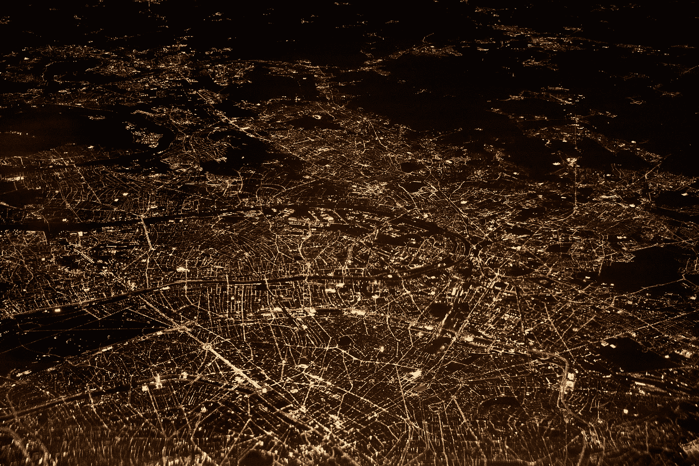
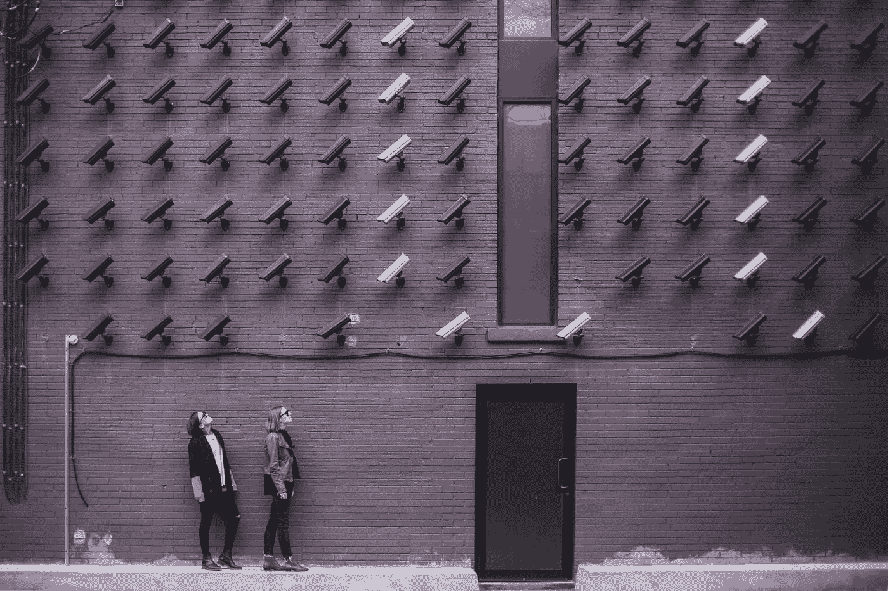
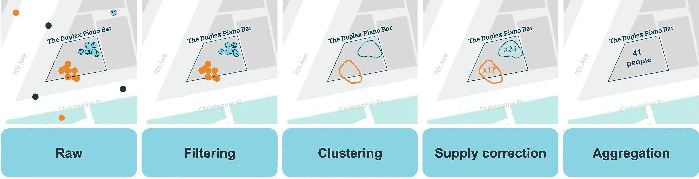
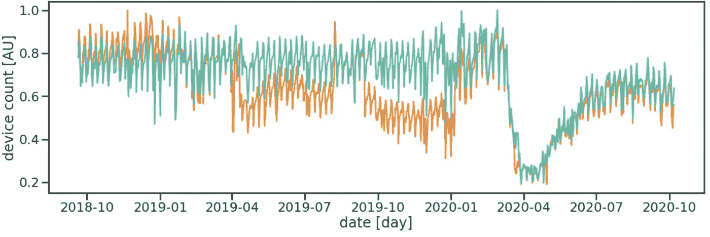
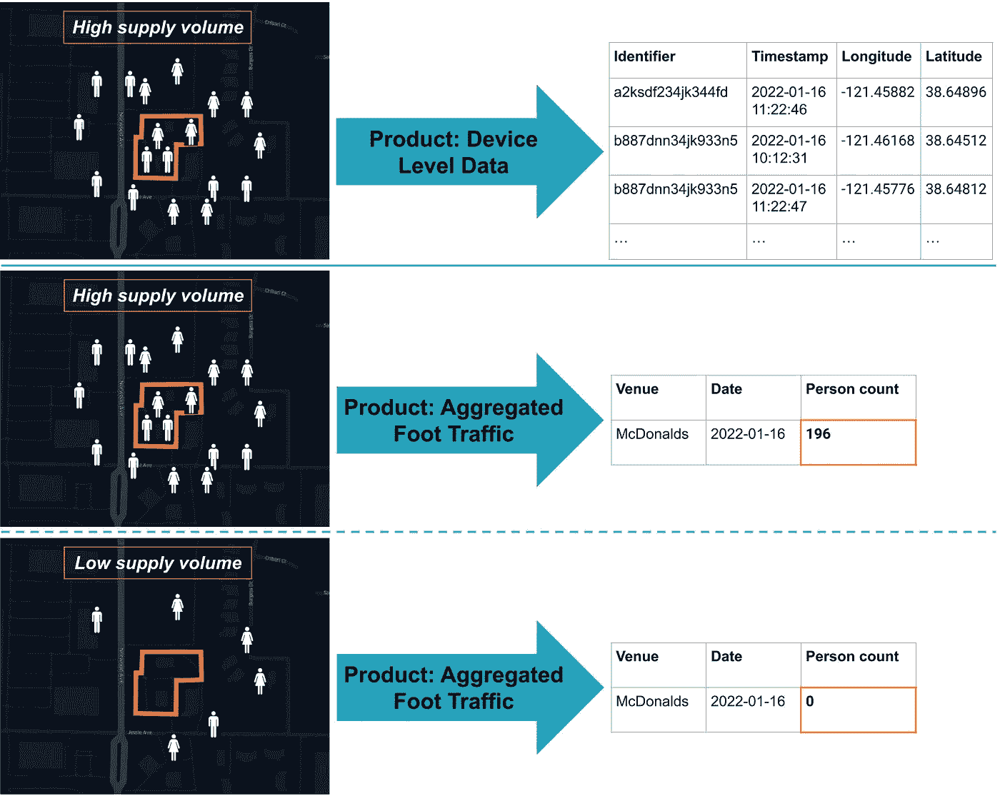
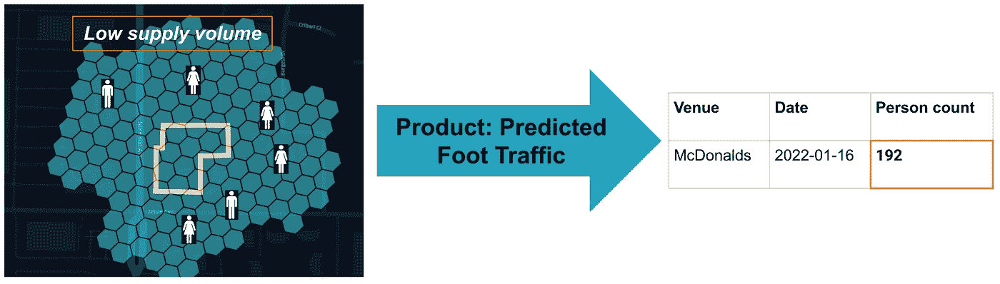
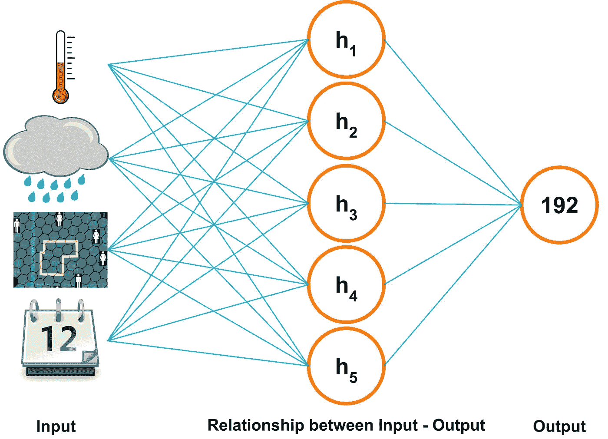

# 机器学习如何成为位置数据行业的游戏规则改变者

> 原文：[`towardsdatascience.com/how-machine-learning-will-become-a-game-changer-for-the-location-data-industry-10dde8f41f3e`](https://towardsdatascience.com/how-machine-learning-will-become-a-game-changer-for-the-location-data-industry-10dde8f41f3e)

## 位置数据可以提供独特的见解，但伴随着成本和隐私问题。机器学习可以克服这些缺陷并改善位置数据产品。

 [Benjamin Thürer](https://medium.com/@benjamin.thuerer?source=post_page-----10dde8f41f3e--------------------------------)

·发表于 [Towards Data Science](https://towardsdatascience.com/?source=post_page-----10dde8f41f3e--------------------------------) ·9 分钟阅读·2023 年 3 月 9 日

--

图片由 [Dennis Kummer](https://unsplash.com/@dekubaum?utm_source=medium&utm_medium=referral) 提供，来源于 [Unsplash](https://unsplash.com/?utm_source=medium&utm_medium=referral)

位置数据行业正快速增长，但仍处于技术初级阶段。基于位置数据的大多数产品在技术上相对简单，可以视为实现了描述性统计的一种形式（例如，店内看到的设备平均数量），或者在最坏的情况下，这些产品就是原始的位置信息数据。机器学习可以通过节省成本、提高产品质量和增强隐私来为这一行业带来巨大价值。

***本故事旨在提供一个高层次和直观的概述，说明机器学习如何提供更强大的位置数据产品，同时降低成本并增强隐私保护。***

# 引言

## 位置数据行业与隐私

位置数据行业是一个快速增长的业务领域，提供可以为客户提供独特见解的产品。基于位置数据的特定产品允许公司分析，例如，多少人去竞争对手的店铺，他们的客户来自哪里，多少人从一个地区移动到另一个地区等等。然而，处理位置数据远非简单，并且存在一个巨大的问题：**隐私**！

图片由 [Matthew Henry](https://unsplash.com/@matthewhenry?utm_source=medium&utm_medium=referral) 提供，来源于 [Unsplash](https://unsplash.com/?utm_source=medium&utm_medium=referral)

除了在处理位置数据时需要解决的其他技术和数据相关问题外，个人隐私是最重要的，并且从长远来看，可能是行业中最具挑战性的一个问题。无论位置数据是来自手机的 GPS 数据、Telco 数据还是卫星影像，都无关紧要。由于位置数据的全部目的是揭示位置，因此简单的产品（原始数据或汇总数据）并不能排除逆向工程的可能性，从而可能侵犯某人的隐私。

即使是“隐私友好”的数据转换，如对唯一标识符进行哈希处理、混淆经纬度以及数据汇总，也很难使逆向工程变得不可能。此外，即使第三方公司以完全隐私友好的方式汇总这些位置数据，个体可识别的数据已经被数字化传送给了该公司，因此，这些敏感数据不再由第一方数据拥有者或个人控制。

***因此，位置数据行业的未来在于两个方面的结合：在第一方数据侧以不可识别的格式进行早期数据汇总，并在这些汇总数据上应用机器学习以创建高质量的人类移动性洞察。***

## 位置数据行业的当前技术水平

基于位置数据的大多数产品提供了对人类移动性的洞察，并基于相当简单的技术方法。例如，一个常见的估算商店客流量的产品工作流程可能如下所示：

使用 GPS 数据估算到某位置的客流量的标准数据工作流程。原始 GPS 数据被过滤，然后仅将停留点聚集在一起。基于这些聚类，进行供应校正和外推，以推导出该商店的估计人数。

行业内更复杂的产品会将更多的背景信息，如家庭和工作地点或区域人口统计，纳入指标中。然而，流程始终相同：首先预处理原始数据，将单个数据点聚类到停留事件中，校正数据的技术问题，并汇总该区域内的所有停留事件。

这种方法简单但有效。它允许非常准确地估计客流量，尤其是在有人对时间模式感兴趣时。技术上的复杂性，主要是专有部分，体现在供应校正上，因为简单的汇总会受到供应中的潜在问题的高度影响。即使是供应量的微小变化也可能对汇总数据产品产生巨大的负面影响，如果没有适当的校正。因此，自动供应校正是高质量数据产品的关键。

自动化供应修正。受影响的汇总数据（橙色）可以通过复杂的供应修正技术进行修正，从而得出有用的信号（青色）。

然而，即使供应修正有效，它仍然存在重大局限性。其中一些包括：

+   供应不断变化，需要持续改进和新产品版本。

+   随着时间的推移，获取和存储所有设备级数据的成本很高。

+   越来越多的定位数据被操控、“重播”或甚至伪造，影响产品质量。

+   处理数据的公共声誉较低，并且由于隐私原因，可用数据的数量在减少。

因此，未来购买原始形式的定位数据并将其转售为某种衍生品的通用设置不是一种可行的路径，这将降低现有定位数据产品的稳健性和质量。

***在第一方侧汇总数据解决了上述限制，给每个人带来了双赢，但：我们如何基于已经汇总的数据构建产品？我们如何处理数据去重、数据分配到位置，或估算到店流量？答案是机器学习！***

## 什么是机器学习

有各种优秀的 AI 和机器学习基础介绍（[像这个](https://www.wired.co.uk/article/machine-learning-ai-explained)），简单的互联网搜索（或询问 LLM）会比这个故事提供更好的答案。然而，为了使其超级直观和简单：

***机器学习使人工系统能够在没有人工干预的情况下学习数据之间的关系。***

一个简单的现实生活中的比较是经典条件反射，其中狗在经常收到奖励时学会抬起爪子。简化地说，这种“抬爪子”和“奖励”之间的关系是机器在人工系统中学习的内容（尽管一只狗远比任何人类迄今为止建造的 AI 系统更聪明）。

需要注意的是，输入特征的数量不仅限于一个。实际上，机器学习通常使用大量特征来训练稳健的关系。其好处是多方面的。例如，当我们考虑来自第一方数据提供商的汇总数据问题时，机器学习可以让我们学习这些汇总数据与我们想要估算的目标（例如，到店流量）之间的关系。

# 如何使用机器学习与定位数据

## 估算到店流量

为了使事情更直观，这里选择了一个使用来自移动设备的 GPS 数据的案例研究。目标是开发一个可靠且高质量的产品，告知客户每天有多少人访问特定的商店。这对那些对竞争对手商店表现或选址感兴趣的公司非常有用。

## 目前的最先进的方法

截至今天，基于 GPS 数据估算店内流量的公司要么直接使用原始 GPS 数据，要么通过汇总原始数据并校正供应波动。然而，正如下文所示，这两种方法只有在有数据观察到感兴趣的店内情况后才能奏效。

当前的最先进技术是拥有大量数据以建立原始设备级数据源或底层数据的汇总。然而，在数据量较少时，这种方法存在局限性。

当产品具有足够高的数据量时，两种产品方法（设备级和汇总）都有效，主要关注点则更多是数据隐私、供应波动、成本以及对数据供应的信任。

然而，当数据量较低或商店位于市场份额普遍较低的地区时，简单的汇总无法生成产品，因为它总是会得出“0”计数。鉴于可用位置数据的普遍减少，这已经成为行业中的一个问题。

## 使用机器学习模型估算脚步流量

牢记之前的条件示例，机器学习模型确实只是学习条件之间的关系。类似于狗学会了举爪子会得到奖励，机器学习模型也能学会如果更多的人接近场所，场所内的人也更有可能增加。

机器学习模型允许训练周围脚步流量与场所内脚步流量之间的关系。这种方法即使在数据供应不足的情况下也适用。

换句话说，机器学习的目的是训练一个描述店内脚步流量如何根据店外流量波动而变化的关系（或模型）。例如，想象一个特定的星期六有一个盛大的开幕式，这会导致接近商店的人数是普通星期六的两倍。在这种情况下，店内也更有可能有更多的人进入。

当然，店外脚步流量与店内之间的关系不一定是线性的。但这也不是模型需要学习的唯一关系。想一想，还有哪些因素会影响到店内脚步流量并且可以被测量？因为本质上，所有与店内流量相关的数据都会提高模型的质量。一些增强这些关系的数据集包括降水量、区域人口、人口统计、星期几、假期等等。

***机器学习能够利用所有这些不同的数据集，并将它们结合成一个描述店内脚步流量如何根据描述周围环境的数据变化的单一模型。***

一个示意图，展示了机器学习如何在相关数据输入之间建立关系，从而估算脚步流量。

# 没有什么是完美的，那么有哪些优点和缺点呢？

尽管机器学习提供了许多机会，但它不是万能的，且存在需要解决的局限性。

*历史偏见*。训练出来的关系通常基于一些历史上的真实情况。这意味着最终产品在很大程度上受到历史关系的影响。然而，如果关系发生变化，模型需要重新训练，以确保预测保持最新，避免漂移。

*一些事情是不可预测的*。尽管当前 AI 的发展使机器学习看起来像是几乎所有问题的解决方案，但重要的是要记住，许多事情是不可预测的。没有模型可以预测疫情及其对商店的影响。此外，模型只能学习数据中现有的关系。那些未包含在训练数据中的事件或行为，或在数据中没有关系的行为是不可预测的。

*思维方式的转变*。尽管最终的产品可能看起来相同，但它们来自根本不同的方法论。这导致商业方面和产品用户面临挑战，以确保优点和缺点得到适当解决。

**然而，当我们公开解决机器学习的不足之处并对其进行适当教育时，优点将超过这些缺点。**

*符合伦理和隐私友好*。将机器学习与第一方聚合数据结合起来，将允许构建符合严格伦理标准的未来证明隐私友好的产品。

*稳健且高质量的产品*。构建一个不直接依赖 GPS 数据源的位置数据产品将使产品更加稳健和可靠。此外，由于产品可以基于各种高质量的数据源，最终产品的质量通常更高。

*减少数据量和成本*。与当前构建位置数据产品所需的数据量相比，机器学习可以在更少的数据上运行。这不仅允许供应来源的独立性，还减少了对大量数据的存储。此外，数据处理和维护的成本与机器学习基础设施相比更便宜。

*新产品创新*。在改进隐私之后，也许最大的优势之一是新产品创新的可能性。机器学习本质上结合了不同的数据集和上下文，从而允许构建目前在位置数据行业中不存在的产品。

# 摘要

位置数据行业正在迅速增长，但仍处于早期阶段。基于位置数据的大多数产品都很简单，缺乏稳健性，并且隐私保护不足。基于机器学习的方法有潜力为这一行业带来额外价值，通过降低成本、提高产品质量和增强隐私保护。我们在 Unacast 相信，位置数据行业的未来在于将早期数据以不可识别的格式进行汇总，再通过这些汇总数据应用机器学习技术，从而创造出高质量的人类移动洞察产品。

— — —

*除非另有说明，所有图片均由作者提供。*

*如果你想了解更多关于我以及我所写的内容，请点击* [*这里*](https://medium.com/@benjamin.thuerer/about) *并随时关注我。*
