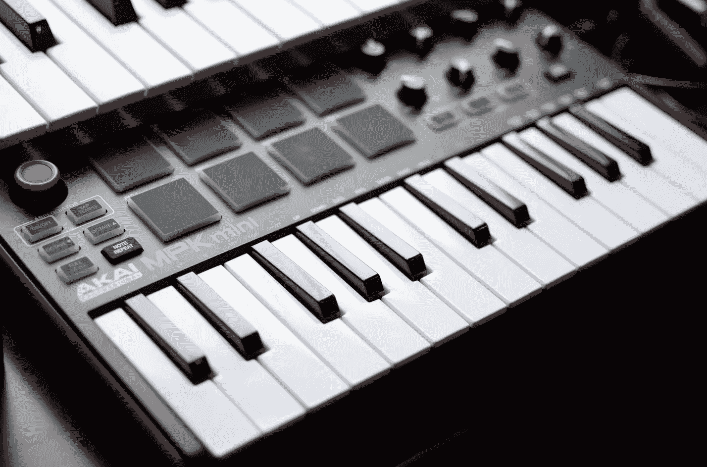
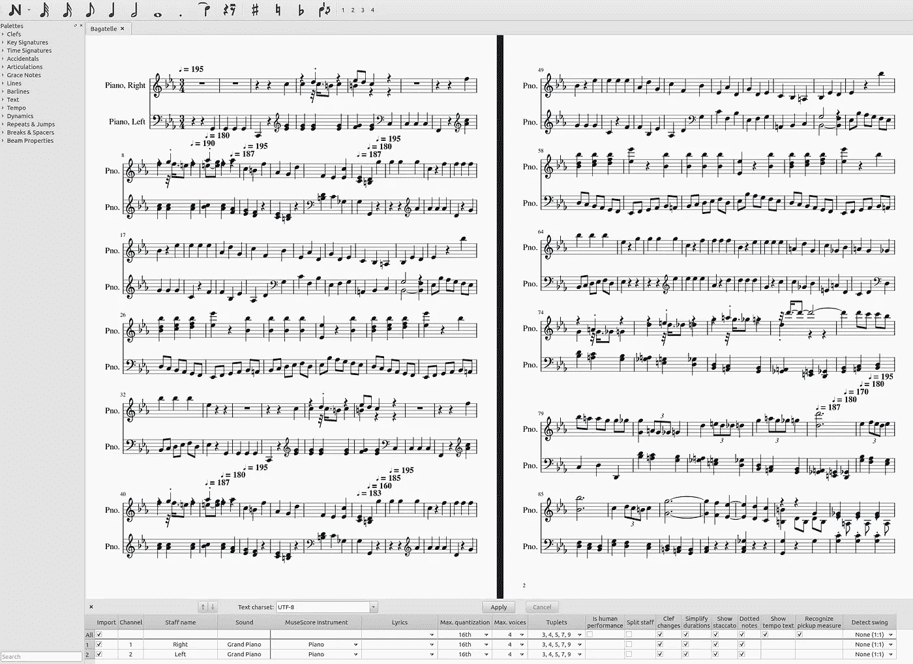
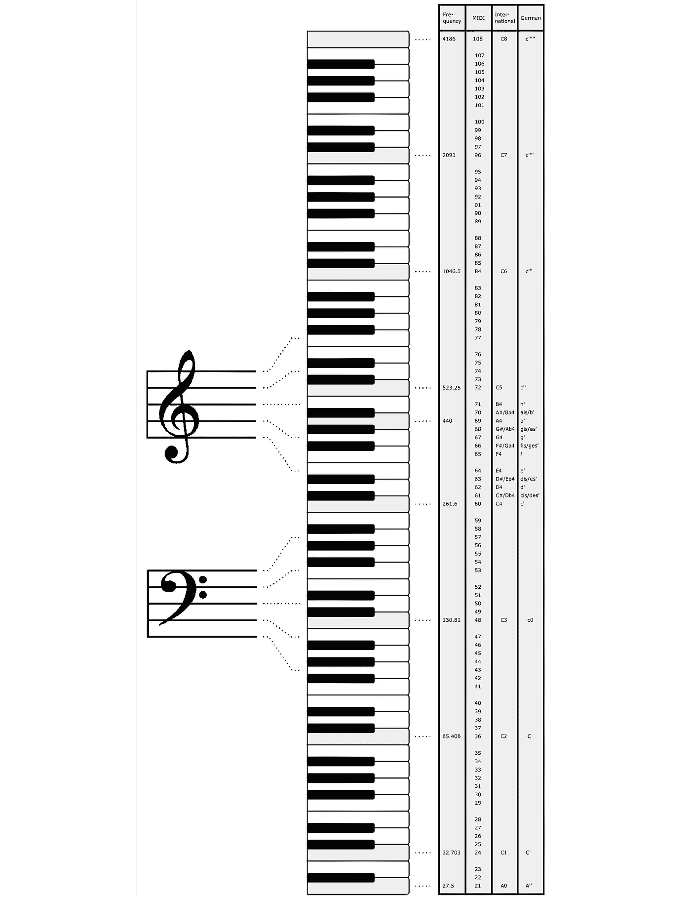
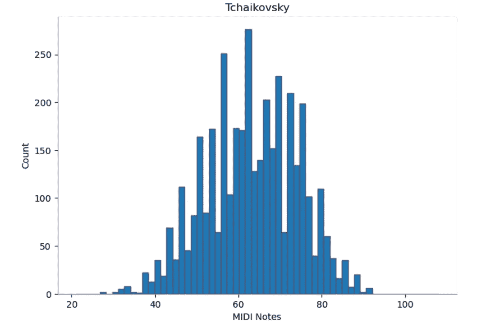
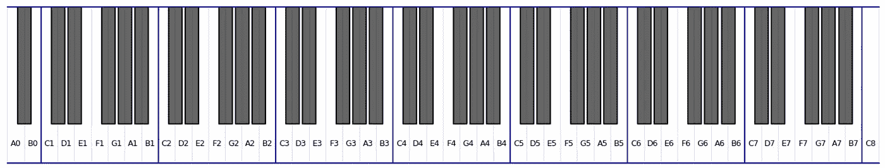
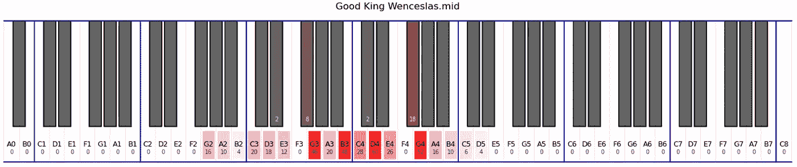
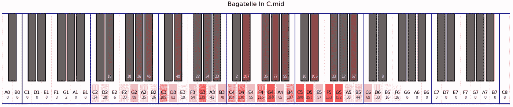
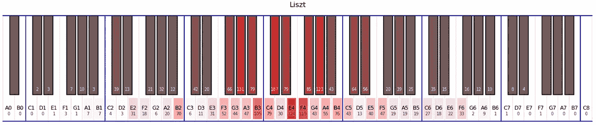
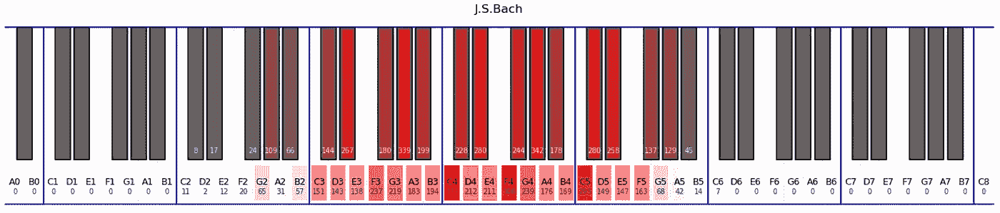

# 多少键位足够弹奏钢琴？

> 原文：[`towardsdatascience.com/how-many-keys-are-enough-to-play-the-piano-639916f47a22`](https://towardsdatascience.com/how-many-keys-are-enough-to-play-the-piano-639916f47a22)

## 使用 Python、MIDI 和 Matplotlib 寻找答案

[](https://dmitryelj.medium.com/?source=post_page-----639916f47a22--------------------------------)[](https://towardsdatascience.com/?source=post_page-----639916f47a22--------------------------------) [Dmitrii Eliuseev](https://dmitryelj.medium.com/?source=post_page-----639916f47a22--------------------------------)

·发表于[数据科学前沿](https://towardsdatascience.com/?source=post_page-----639916f47a22--------------------------------) ·阅读时长 9 分钟·2023 年 12 月 23 日

--



照片由 Cedrik Malabanan 拍摄，[Unsplash](https://unsplash.com/@ohboyced)

学习弹钢琴是一个具有挑战性且有趣的过程，但每个新手都会面临一个困境：应该买什么样的乐器？市场上的选择非常广泛，从上面照片中的小型两八度乐器到 70 公斤重的全尺寸木质键盘。一方面，额外的键位永远不会有害；另一方面，尺寸、重量和价格之间总是存在权衡。

显然，一种方法是直接问老师他或她推荐什么，但也许大多数音乐家从未从那个角度考虑过音乐。有没有更量化的方法来寻找答案？事实上，答案是肯定的；我们可以使用 Python 轻松制作音乐音符分布。

本教程对数据科学初学者很有用；它不需要复杂的数学或库，并且结果易于解释。它也对那些想学习音乐但尚未决定购买哪种乐器的人很有用。

让我们开始吧！

## 数据来源

对于数据分析，我将使用[MIDI](https://en.wikipedia.org/wiki/MIDI)文件。这是一种相当古老的格式；第一个 MIDI（Musical Instrument Digital Interface）规格发布于 1983 年。MIDI 文件的关键特征是，它们存储的音乐不是原始音频，而是以“原始”符号形式。MIDI 文件中的每个记录包含乐器类型、音高、时序和其他参数。例如，我可以在免费的[MuseScore](https://github.com/musescore/MuseScore)应用程序中打开贝多芬的*降 C 小调小品*，并看到如下内容：



MuseScore 编辑器，作者截屏

让我们在 Python 中打开同一个文件并转储其内容：

```py
import mido  # pip3 install mido

mid = mido.MidiFile("Beethoven/Bagatelle.mid", clip=True)
for ind, track in enumerate(mid.tracks):
    print(f"Track {ind}")
    for item in track[:10]:
        print(item)
```

输出如下（完整文件更长；在这里，我仅打印每个轨道的前几行）：

```py
Track 0
MetaMessage('track_name', name='L.v.Beethoven Bagatelle in C minor WoO 52', time=0)
MetaMessage('text', text='XFhd:2001/08/21:JP:Classical::::L.v.Beethoven::', time=0)
MetaMessage('time_signature', numerator=3, denominator=4, clocks_per_click=96, notated_32nd_notes_per_beat=8, time=0)
MetaMessage('sequencer_specific', data=(0, 0, 65), time=0)
...
Track 1
MetaMessage('track_name', name='Right', time=0)
MetaMessage('key_signature', key='Eb', time=0)
note_on channel=0 note=72 velocity=80 time=3072
note_off channel=0 note=72 velocity=100 time=380
note_on channel=0 note=72 velocity=80 time=4
...
Track 2
MetaMessage('track_name', name='Left', time=0)
MetaMessage('key_signature', key='Eb', time=0)
note_on channel=1 note=43 velocity=100 time=768
note_off channel=1 note=43 velocity=100 time=380
note_on channel=1 note=43 velocity=100 time=4
...
```

如我们所见，文件包含三个轨道，第一个轨道只有元数据，另外两个轨道包含一些额外的数据和音乐音符。为了找出音乐片段中有多少不同的音符，我们将仅使用`note_on`记录。每个 MIDI 音符在 21..108 范围内有一个数字代码：



MIDI 音符代码，图片来源 [Wikipedia](https://fr.wikipedia.org/wiki/Musical_Instrument_Digital_Interface)

使用这些信息，让我们创建一个函数，将 MIDI 文件中的所有音符提取到 Python 列表中：

```py
def extract_midi_notes(file_path: str) -> List[int]:
    """ Get all notes from a MIDI file """
    notes = []
    mid = mido.MidiFile(file_path, clip=True)
    for track in mid.tracks:
        for item in track:
            # Example:
            # {'type': 'note_on', 'time': 241, 'note': 67, 'velocity': 56, 'channel': 0}
            item_data = item.dict()
            if item_data["type"] == "note_on":
                note = item_data["note"]
                velocity = item_data["velocity"]
                if velocity > 0:
                    notes.append(note)
    return notes
```

下一步，让我们创建一个处理文件夹中所有 MIDI 文件的函数：

```py
def get_notes(files_mask: str):
    """ Get all notes from several files """
    midi_notes = []
    for file_path in glob.glob(files_mask):
        midi_notes += extract_midi_notes(file_path)
    return midi_notes
```

我们还需要一些 MIDI 文件。这些文件，特别是古典音乐（已进入公有领域），通常可以免费获得，并且很容易找到。对于我的分析，我使用了来自 [`www.piano-midi.de`](http://www.piano-midi.de/) 的文件（CC BY-SA 德国许可）。

## 分布

此时，我们有一种方法，可以从一组 MIDI 文件中提取所有音乐音符。我们可以很容易地使用 Matplotlib 中的**直方图**查看哪些音符使用得更频繁：

```py
import matplotlib.pyplot as plt

# Get data
files_mask = "Tchaikovsky/*.mid"
midi_notes = get_notes(files_mask)

# Draw
fig, ax = plt.subplots(figsize=(7, 5))
plt.hist(midi_notes, density=False, bins=60, range=[21, 108], edgecolor='#505070')
plt.ylabel('Count')
plt.xlabel('MIDI Notes')
ax.spines['top'].set_color('#EEEEEE')
ax.spines['right'].set_color('#EEEEEE')
ax.spines['bottom'].set_color('#888888')
ax.spines['left'].set_color('#888888')
plt.tight_layout()
plt.title(files_mask.split("/")[0])
plt.show()
```

输出如下所示：



音符分布，图片来源：作者

`plt.hist`方法完成了计算列表中值分布并绘制图表所需的所有工作。我们可以看到，分布看起来正常。最常用的键位于键盘的中央，这很有意义。

## 可视化

**键盘** 从技术上讲，问题已解决，使用大约 20 行 Python 代码，我们可以查看不同音乐片段的音符分布。但实际上，这不够方便，特别是对音乐家而言，我们可以做得更好。Matplotlib 库可以绘制的不仅仅是科学图表。让我们绘制一个钢琴键盘：

```py
fig, ax = plt.subplots(figsize=(14, 3))

def draw_patch(ax, x: int, y: int, w: int, h: int, color: str, alpha=0.6):
    """ Draw a patch in specific coordinates and color """
    #  H
    #  |
    # (xy)--W
    ax.add_patch(Rectangle((x, y), w, h,
                            facecolor=color, edgecolor=None,
                            alpha=alpha, fill=True,
                            linewidth=1, zorder=2))

def draw_black_note(ax, x_pos: int, key_width: int, keyb_height: int):
    """ Draw a black note in a specific X-position """
    note_w = 0.4*key_width
    ax.plot([x_pos - note_w, x_pos - note_w, x_pos + note_w, x_pos + note_w],
            [keyb_height-1, 0.25*keyb_height, 0.25*keyb_height, keyb_height-1], color="#111111")

    draw_patch(ax, x_pos - note_w, 0.25*keyb_height, 2*note_w, 0.75*keyb_height, color="#000000")

num_octaves = 9
note_per_octave = 7
key_width, key_height = 20, 160

# Key names
key_names = ["C", "D", "E", "F", "G", "A", "B"]

# Draw frame
keyb_width = num_octaves*note_per_octave*key_width
ax.plot([0, keyb_width, keyb_width, 0, 0], [0, 0, key_height, key_height, 0], color="#0000AA")

# Draw octaves
for oct_num in range(num_octaves):
    oct_xpos = oct_num*key_width*7
    # Octave separator
    ax.plot([oct_xpos, oct_xpos], [0, key_height-1], color="#0000AA")
    # Note separator
    for note_num in range(1, 7):
        x_pos = oct_num*key_width*7 + note_num*key_width
        ax.plot([x_pos, x_pos], [1, key_height-1], color="#EEEEEE")

    # Black keys
    for black_pos_ind in [1, 2, 4, 5, 6]:
        x_pos = oct_xpos + black_pos_ind*key_width
        draw_black_note(ax, x_pos, key_width, key_height)

    # White keys
    for note_ind in range(note_per_octave):
        x_pos = oct_num*key_width*7 + note_ind*key_width
        key_name = f"{key_names[note_ind]}{oct_num}"

        # Text
        ax.text(x_pos + key_width/2, 0.1*key_height, key_name, verticalalignment='bottom',
                horizontalalignment='center', color='black', fontsize=9)

plt.axis("off")
plt.xlim(5*key_width - 1, 57*key_width + 1)
plt.tight_layout()
plt.show()
```

输出如下，这比直方图要好得多：



Matplotlib 中的钢琴键盘，图片来源：作者

**热图** 下一步是可视化分布。一个方便的方法是使用热图，我们可以在键盘上绘制它。首先，我们需要一个方法将键名（C3，D3 等）转换为 MIDI 代码。这只是一个简单的线性转换：

```py
def get_midi_code(key_name: str) -> int:
    """ Convert key name to the MIDI code. 'E3' => 52 """
    # MIDI codes: C0 - 12, D0 - 14, etc; 12 keys in octave
    key_names = ["C", "C#", "D", "D#", "E", "F", "F#", "G", "G#", "A", "A#", "B"]
    # "E1" => E, 1
    name, octave = key_name[0], int(key_name[1])
    return (octave + 1)*12 + key_names.index(name)
```

其次，我们可以使用 Python 的`Counter`类来了解每个音符的使用频率：

```py
midi_notes = get_notes("Tchaikovsky/*.mid")
notes_counter = Counter(midi_notes)

most_common = notes_counter.most_common(1)[0]
print(f"Most common MIDI code {most_common[0]}, was used {most_common[1]} times")
#> Most common MIDI code 61, was used 171 times

midi_code = get_midi_code("C4")
print(f"C4 note was used {notes_counter[midi_code]} times")
#> C4 note was used 123 times
```

使用这段代码，我们可以将每个音符的出现频率作为热图的 alpha 通道：

```py
for note_ind in range(note_per_octave):
    x_pos = oct_num*key_width*7 + note_ind*key_width
    key_name = f"{key_names[note_ind]}{oct_num}"

    midi_code = get_midi_code(key_name)
    # Number as a heatmap
    use_count = notes_counter[midi_code]
    if use_count > 0:
        color = "#FF0000"
        max_note_count = most_common[1]
        alpha = use_count/max_note_count
        margin = 0.1*key_width
        draw_patch(ax, x_pos + margin, 0.02*key_height, key_width - 2*margin,
                   0.2*key_height, color, alpha=alpha)

    # Number as text
    ax.text(x_pos + key_width/2, 0.05*key_height, str(use_count),
            verticalalignment='bottom', horizontalalignment='center',
            color='#333333', fontsize=7)
```

相同的逻辑适用于黑键；为了简便起见，我将在这里省略这段代码。

## 结果

最后，让我们回答故事标题中的问题。我们需要学习多少个钢琴键才能弹奏钢琴？

要得到答案，我们首先需要找到合适的曲目。在亚马逊上有很多钢琴课程的书籍，通常可以免费查看其第一页，这足以收集标题列表。有了标题，就容易找到 MIDI 文件。好吧，让我们看看一些结果。

**第一年学习：** **好国王温塞斯拉斯**（圣诞颂歌）：



作者截图

如我们所见，这首旋律很简单，主要只使用白键，实际音符范围大约为 3 个音域。但没有 3 音域范围的钢琴可用，最接近的是 4 个音域。

**第二年学习：C 小调的小品，WoO 52**（贝多芬）



作者截图

如我们所见，这更复杂，使用了更多的黑键，这首曲子的范围大约为 4.5 个音域。

**第三年学习：慰藉曲，S. 172**（弗朗茨·李斯特）



作者截图

在这种情况下，范围更广；几乎所有的 7 个音域都需要来演奏这首曲子。

## 结论

在这篇文章中，我展示了如何处理 MIDI 文件，并以直方图和钢琴键盘热图的形式制作音乐音符分布。这不仅对回答“我们需要多少个键”这样的问题有用。将旋律或文件列表转换为热图，可以比较不同作品、不同作曲家或不同流派的风格，例如古典与流行。这可以成为音乐学或文化人类学领域更大分析的一部分。例如，这是 J.S.巴赫音乐中的音符分布，很明显范围更小：



J.S.巴赫音符分布，作者图像

读者可能会想知道原因，答案很简单：巴赫为[大键琴](https://en.wikipedia.org/wiki/Harpsichord)创作音乐，而现代钢琴在那时还未发明。有趣的是，现在，300 多年后，我们可以很容易地在热图中看到这一点！

关于钢琴课程，我必须承认，我最初认为一个 4 音域范围的乐器足以学习钢琴是错误的。这可能适合第一年的学习，但正如从热图中看到的，至少需要 6 音域范围才能演奏音乐，即使在第二年的学习中也是如此。

对社会数据分析感兴趣的人也欢迎阅读其他文章：

+   探索性数据分析：我们对 YouTube 频道了解多少

+   [德国住房租赁市场：使用 Python 的探索性数据分析](https://medium.com/towards-data-science/housing-rental-market-in-germany-exploratory-data-analysis-with-python-3975428d07d2)

+   [人们关于气候的书写：使用 Python 进行 Twitter 数据聚类](https://medium.com/towards-data-science/what-people-write-about-climate-twitter-data-clustering-in-python-2fbbd2b95906)

+   [在 Twitter 帖子中寻找时间模式：使用 Python 进行探索性数据分析](https://medium.com/towards-data-science/finding-temporal-patterns-in-twitter-posts-exploratory-data-analysis-with-python-8aac618c8699)

+   [Python 数据分析：我们对流行歌曲了解多少？](https://blog.devgenius.io/python-data-analysis-what-do-we-know-about-pop-songs-b6197d85d4)

如果你喜欢这个故事，可以随时[订阅](https://medium.com/@dmitryelj/membership)Medium，你将会在我的新文章发布时收到通知，并且可以完全访问其他作者的成千上万篇故事。本文的完整源代码和 Jupyter 笔记本也可以在我的[Patreon 页面](https://www.patreon.com/deliuseev)找到。

感谢阅读。
