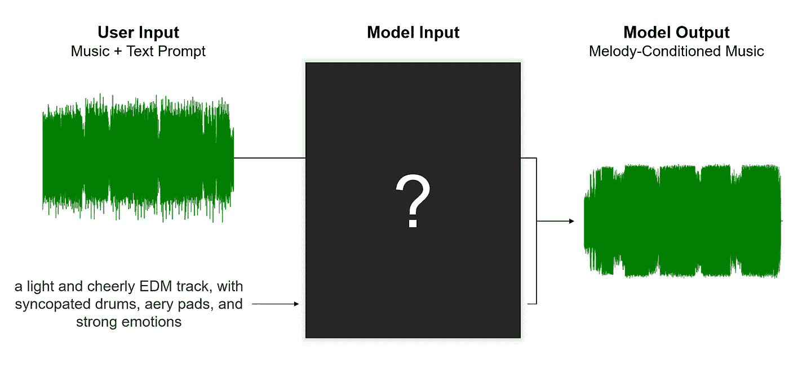

# Meta 的人工智能如何基于参考旋律生成音乐

> 原文：[`towardsdatascience.com/how-metas-ai-generates-music-based-on-a-reference-melody-de34acd783?source=collection_archive---------2-----------------------#2023-06-23`](https://towardsdatascience.com/how-metas-ai-generates-music-based-on-a-reference-melody-de34acd783?source=collection_archive---------2-----------------------#2023-06-23)

## MusicGen，分析

 [Max Hilsdorf](https://medium.com/@maxhilsdorf?source=post_page-----de34acd783--------------------------------)

·

[关注](https://medium.com/m/signin?actionUrl=https%3A%2F%2Fmedium.com%2F_%2Fsubscribe%2Fuser%2Fd0c085a74ae8&operation=register&redirect=https%3A%2F%2Ftowardsdatascience.com%2Fhow-metas-ai-generates-music-based-on-a-reference-melody-de34acd783&user=Max+Hilsdorf&userId=d0c085a74ae8&source=post_page-d0c085a74ae8----de34acd783---------------------post_header-----------) 发表在 [Towards Data Science](https://towardsdatascience.com/?source=post_page-----de34acd783--------------------------------) ·10 分钟阅读·2023 年 6 月 23 日

--

作者提供的图片。

# Meta 的 MusicGen

2023 年 6 月 13 日，Meta（前身为 Facebook）在音乐和人工智能领域引起了轰动，发布了他们的生成音乐模型 MusicGen。这个模型不仅在能力上超越了今年早些时候发布的 Google MusicLM，还使用了许可的音乐数据进行训练，并且为了非商业用途进行了开源。

这意味着你不仅可以阅读[研究论文](https://arxiv.org/abs/2306.05284)或听[示例](https://ai.honu.io/papers/musicgen/)，还可以从[GitHub](https://github.com/facebookresearch/audiocraft)复制它们的代码，或者在[HuggingFace](https://huggingface.co/spaces/facebook/MusicGen)的网页应用中实验该模型。

除了根据文本提示生成音频外，MusicGen 还可以基于给定的参考旋律生成音乐，这一功能被称为旋律条件。在这篇博客文章中，我将展示 Meta 如何将这一有用且迷人的功能实现到他们的模型中。但在我们**深入探讨**之前，让我们首先了解旋律条件在实践中的工作原理。

# 展示

## 基础曲目

以下是我为本文制作的短电子音乐片段。它包含电子鼓、突出的 808 低音和两个切分的合成器。在聆听时，试着识别曲目的“主旋律”。
