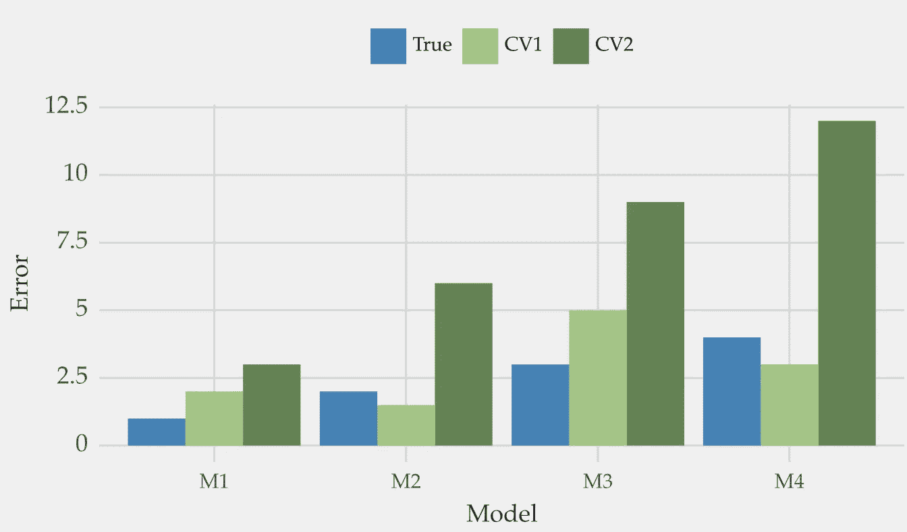
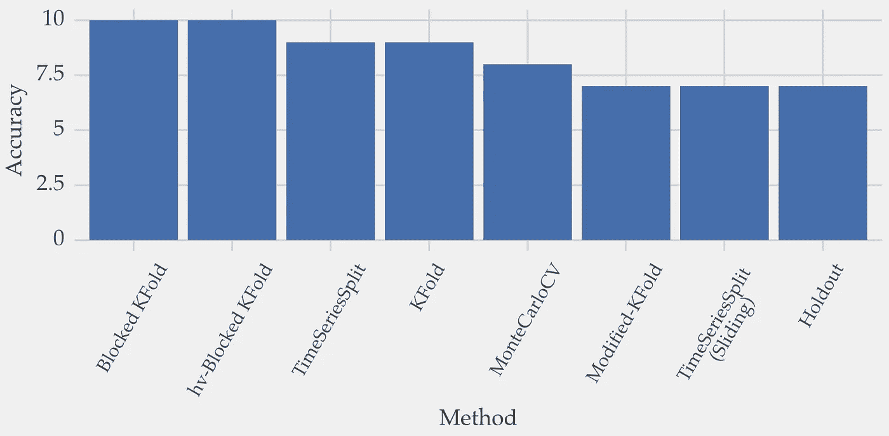
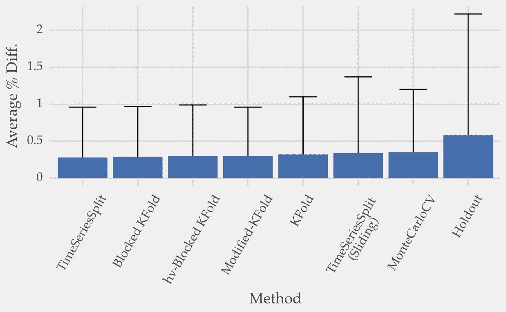

# 在模型选择过程中，你会损失多少预测性能？

> 原文：[`towardsdatascience.com/how-much-forecasting-performance-do-you-lose-during-model-selection-923889e2f2dc`](https://towardsdatascience.com/how-much-forecasting-performance-do-you-lose-during-model-selection-923889e2f2dc)

## 交叉验证多频繁地选择最佳预测模型？当它未能选择最佳模型时会发生什么？

 [Vitor Cerqueira](https://vcerq.medium.com/?source=post_page-----923889e2f2dc--------------------------------)

·发表于 [Towards Data Science](https://towardsdatascience.com/?source=post_page-----923889e2f2dc--------------------------------) ·阅读时间 5 分钟·2023 年 1 月 6 日

--

[Héctor J. Rivas](https://unsplash.com/@hjrc33?utm_source=medium&utm_medium=referral) 拍摄的照片，来源于 [Unsplash](https://unsplash.com/?utm_source=medium&utm_medium=referral)

假设你有一个预测问题。你需要选择一个模型来解决它。你可能想用交叉验证测试一些替代方案。

你是否曾想过交叉验证选择到最佳模型的几率有多大？如果没有选择到最佳模型，那么选择到的模型会差多少？

让我们找出答案。

# 介绍

交叉验证，无论是时间序列还是其他类型，都解决了两个问题：

+   **性能估计。** 模型在新数据上的表现如何？你可以使用这些估计来评估模型是否可以部署；

+   **模型选择。** 使用上述估计来对可用模型池进行排名。例如，不同配置的学习算法用于超参数调整。在这种情况下，你选择具有最佳性能估计的模型。

等等！这两个问题不是一样的吗？

并不是完全如此。某个特定方法（例如，[TimeSeriesSplits](https://scikit-learn.org/stable/modules/generated/sklearn.model_selection.TimeSeriesSplit.html)）可能提供良好的性能估计，平均而言。但在对可用模型进行排名时，它可能表现较差，从而在模型选择上表现不佳。

## 例子

让我举个例子。假设你想比较四个模型：*M1*、*M2*、*M3*和*M4*。它们显示在下面图 1 的 x 轴上。

这些模型的真实测试损失以蓝色条形图显示。它们的排名是*M1* > *M2* > *M3* > *M4*。因此，*M1*是最佳模型，因为它显示了最低的误差（比如说，平均绝对误差）。

然后，使用两种交叉验证方法（*CV1* 和 *CV2*）来估计每个模型的误差。

图 1：交叉验证的目标是接近真实误差（蓝色条）。CV1（浅绿色蓝色）平均提供了比 CV2（深绿色）更好的估计。但 CV2 能够完美地排名模型，而 CV1 则不能。

*CV1* 平均产生最好的估计（最接近真实误差）。但，估计的排名（*M2* > *M1* > *M4* > *M3*）与实际的排名不同。它也比*CV2*产生的排名更差。

尽管提供了较差的性能估计，*CV2* 输出了模型的完美排名。

这个例子表明，一种 CV 技术可能在性能估计上更好（*CV1*），但另一种在模型选择上更好（*CV2*）。

# 模型选择中的性能损失

假设你正在进行预测模型选择。你可能会想到两个问题：

1.  交叉验证选择最佳模型的机会有多大？即在测试集上表现最佳的模型。

1.  如果没有发生这种情况会怎样？所选模型的表现会差多少？

## 测试不同的交叉验证方法

我们可以通过模拟一个现实的场景来回答这些问题。首先，使用训练数据应用交叉验证来选择一个模型。然后，检查这个模型在测试集上的表现。

让我们一步一步来做。

我准备了 50 个不同的预测模型。这些包括不同配置的线性模型、决策树等。 这些模型使用了一种名为自回归的监督学习方法进行训练。 不详细说明，最近的过去值被用作解释变量。目标变量是未来的观测值。

然后，我应用了几种交叉验证技术来选择最佳模型。这些包括 TimeSeriesSplits（即时间序列交叉验证）、 [MonteCarloCV](https://medium.com/towards-data-science/monte-carlo-cross-validation-for-time-series-ed01c41e2995) 或 [K-fold Cross-validation](https://scikit-learn.org/stable/modules/generated/sklearn.model_selection.KFold.html)。你可以在[之前的文章](https://medium.com/@vcerq/9-techniques-for-cross-validating-time-series-data-7828fc3f781d)中查看每种方法的描述。

我重复了这个过程近 3000 个不同的时间序列。

结果如下。

## 交叉验证选择准确率

选择准确率是指交叉验证方法选择最佳模型的次数百分比。

图 2：不同交叉验证方法在选择最佳预测模型时的准确度。每种方法的描述请参见[之前的文章](https://medium.com/@vcerq/9-techniques-for-cross-validating-time-series-data-7828fc3f781d)。图像来源于作者。

分数范围从 7%到 10%。

听起来很低对吧？然而，如果你随机选择一个模型，你的期望准确度是 2%（50 个可能模型中有一个）。因此，7%到 10%要好得多。

然而，所有方法可能都无法选择最佳模型。接下来就是第二个问题。

## 选择的模型有多好？

为了回答这个问题，我们将所选模型与应该选择的模型进行比较。

我们可以测量这两个模型之间错误的百分比差异。当交叉验证选择最佳模型时，差异为 0。

图 3：所选模型与最佳模型之间的平均百分比误差差异（及其标准差）。图像来源于作者。

大多数估计器选择的模型比最佳模型平均表现差 0.3%。这里有一些差异，但总体而言，不同的交叉验证方法在模型选择上表现相似。

例外的是*Holdout*，它代表了[单次拆分](https://scikit-learn.org/stable/modules/generated/sklearn.model_selection.train_test_split.html)。这印证了我在[之前的文章](https://medium.com/towards-data-science/4-things-to-do-when-applying-cross-validation-with-time-series-c6a5674ebf3a)中提出的建议。除非时间序列很大，否则如果可以的话，请进行多次拆分。

你可以在[文章](https://arxiv.org/pdf/2104.00584.pdf)中查看完整实验，这些实验可以通过[我的 Github](https://github.com/vcerqueira/model_selection_forecasting)上的代码重现。

# 主要结论

+   模型选择是利用交叉验证从多个替代模型中选择一个模型的过程；

+   对于 50 个替代模型，交叉验证有 7%-10%的概率选择最佳模型；

+   当没有选择最佳模型时，所选模型的表现会比最佳模型差 0.3–0.35%，平均而言；

+   多个交叉验证拆分对更好的模型选择非常重要。

感谢阅读，下次故事见！

## 相关文章

+   [应用时间序列交叉验证时要做的 4 件事](https://medium.com/towards-data-science/4-things-to-do-when-applying-cross-validation-with-time-series-c6a5674ebf3a)

+   时间序列的蒙特卡罗交叉验证

## 进一步阅读

[1] Cerqueira, Vitor, Luis Torgo, 和 Carlos Soares. “时间序列预测的模型选择：不同估计器的实证分析。” *arXiv 预印本 arXiv:2104.00584* (2021)。

[2] Arlot, Sylvain 和 Alain Celisse. “模型选择的交叉验证程序综述。” *统计调查* 4 (2010): 40–79.
