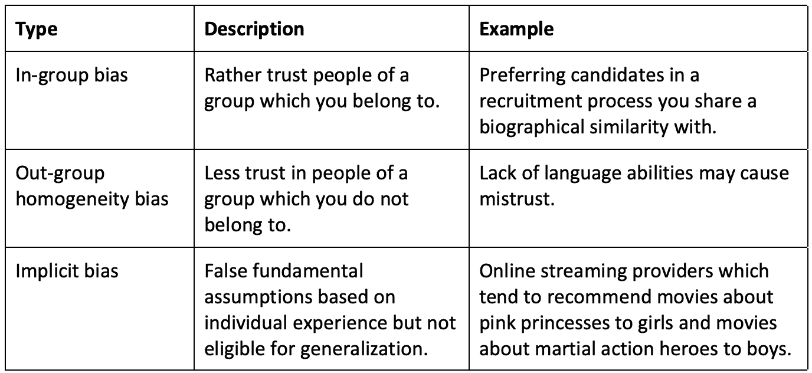
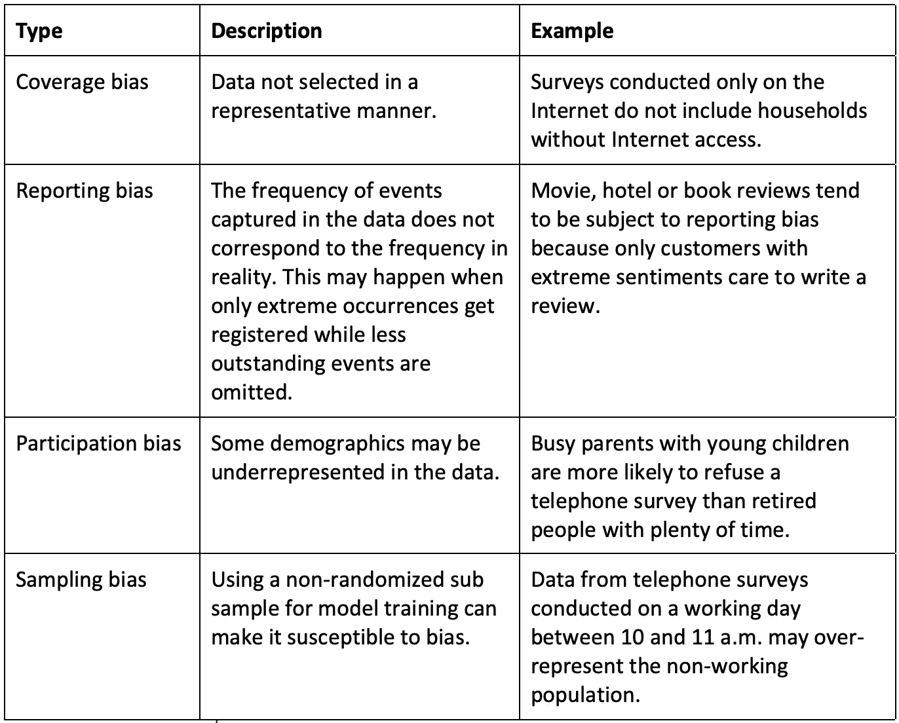

# 偏见如何渗透到 AI 系统中

> 原文：[`towardsdatascience.com/how-prejudice-creeps-into-ai-systems-3673646ae8e3?source=collection_archive---------8-----------------------#2023-02-03`](https://towardsdatascience.com/how-prejudice-creeps-into-ai-systems-3673646ae8e3?source=collection_archive---------8-----------------------#2023-02-03)

## AI 偏见实际上源于哪里？

 [Boris Ruf](https://medium.com/@boris-ruf?source=post_page-----3673646ae8e3--------------------------------)

·

[关注](https://medium.com/m/signin?actionUrl=https%3A%2F%2Fmedium.com%2F_%2Fsubscribe%2Fuser%2Fed341456850c&operation=register&redirect=https%3A%2F%2Ftowardsdatascience.com%2Fhow-prejudice-creeps-into-ai-systems-3673646ae8e3&user=Boris+Ruf&userId=ed341456850c&source=post_page-ed341456850c----3673646ae8e3---------------------post_header-----------) 发布于 [Towards Data Science](https://towardsdatascience.com/?source=post_page-----3673646ae8e3--------------------------------) ·4 分钟阅读·2023 年 2 月 3 日

--

图片由 [Lucas Benjamin](https://unsplash.com/@aznbokchoy?utm_source=medium&utm_medium=referral) 提供，来源于 [Unsplash](https://unsplash.com/?utm_source=medium&utm_medium=referral)

*一个挑战是，人工智能（AI）系统可能会在算法中嵌入偏见。在* *我之前的文章**中，我解释了当 AI 行为异常时发生的内部过程。接下来，我将深入探讨这些偏见实际上来自哪里——以及这些来源如何与传统技术中研究得较多的偏见问题不同。*

机器学习（ML）算法识别数据中的模式。它们的主要优势在于能够在训练数据中找到和区分类别，并利用这些洞察对新数据进行预测。

在“大数据”时代，有大量的数据可用，并且变量种类繁多。一般的假设是，数据越多，算法及其预测就会越精确。在使用大量数据时，数据中显然包含了许多相关性。然而，并非所有相关性都意味着因果关系。不论数据集有多大，它仍然只是现实的一个快照。

让我们举个例子：

> 在一个汽车保险的理赔训练数据集中，红色汽车可能比其他颜色的汽车导致了更多的事故。机器学习算法检测到了这种相关性。然而，并没有科学证据表明汽车颜色与事故风险之间存在因果关系。

单纯为了算法的性能，注意并消除这种不想要的相关性至关重要。否则，算法会有偏见，对新数据的结果可能会很差。在这个例子中，拥有更好算法的竞争对手，如果没有错误地将更高风险归因于红色汽车的驾驶员，就可以为这些客户提供更低的价格，并将他们吸引走。

除了性能方面，还有一个更严重的问题，这种问题出现时预测影响到人们，并且算法偏向于优待特权群体而非非特权群体，从而导致歧视。

需要注意的是，这些不希望出现的歧视可能在没有明确提供敏感个人数据的情况下发生。实际上，其他属性可以隐含地揭示这些信息作为代理。例如，一款汽车型号可以暗示车主的性别，或者邮政编码可能与居民的种族或宗教相关。

# 它的来源是什么？

偏见问题显然不是新的。即使在人工智能出现之前，[已经知道了多种不同形式的偏见](https://en.wikipedia.org/wiki/List_of_cognitive_biases)，这些偏见可能导致技术系统中出现不必要和意外的结果。例如，自动化偏见是指人们信任自动系统的建议而非人类推理。[过去发生过几起严重的飞机事故](https://www.newyorker.com/science/maria-konnikova/hazards-automation)，因为飞行员信任了自动驾驶仪而不是自己的判断。另一种偏见可能发生在算法被应用于最初未训练的环境中。例如，如果它被应用于不同的地理区域或不同的人群中。

尽管算法中显式编程的规则或其在实践中的使用方式可能产生偏差结果，但这是一个长期存在的问题，也适用于传统的确定性算法。在本文中，我专注于**新的偏差来源**，这些偏差随着机器学习技术的兴起而变得越来越重要。更具体地说，我讨论了数据中的人为偏差和选择偏差。

# 人为偏差

第一个自然想到的偏差来源是人为偏差。下面概述了这种类型的偏差的不同类型。

人为偏差的不同来源

训练数据可以包括来自测量设备的客观观察标签。然而，训练数据也可能涉及人为评估。包括人为判断的数据标签可能存在偏见。由于这些标签作为*真实标准*，算法的表现直接依赖于它们，任何包含的偏差都在模型中大规模复制。因此，基本上，一种经过充分研究的偏差形式在这里进入了新技术中。

# 选择偏差

另一个不那么明显的偏差来源是数据收集的过程。如果数据未能反映真实的分布，那么使用这些数据进行训练的机器学习算法将会学习并加剧这种偏差。下表列出了可能导致数据选择偏差的不同类型的偏差。

不同来源的选择偏差

# 那又如何

机器学习算法在创建预测模型时非常依赖于其使用的数据。这些训练数据可能存在偏差，特别是形式上的人为偏差或选择偏差。由于算法容易受到这些影响，并且由于有可能在大规模应用中出现，即使是算法中的微小系统性错误也可能导致加剧的歧视。

*特别感谢 Antoine Pietri 在撰写这篇文章时提供的宝贵支持。在* [*我的下一篇文章*](https://medium.com/towards-data-science/to-guarantee-impartial-ai-decisions-lady-justice-needs-to-blink-2992167b2591)*中，我将解释为什么删除敏感属性并不是确保 AI 公平性的简单解决方案。*
