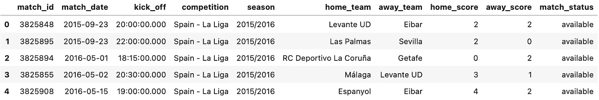
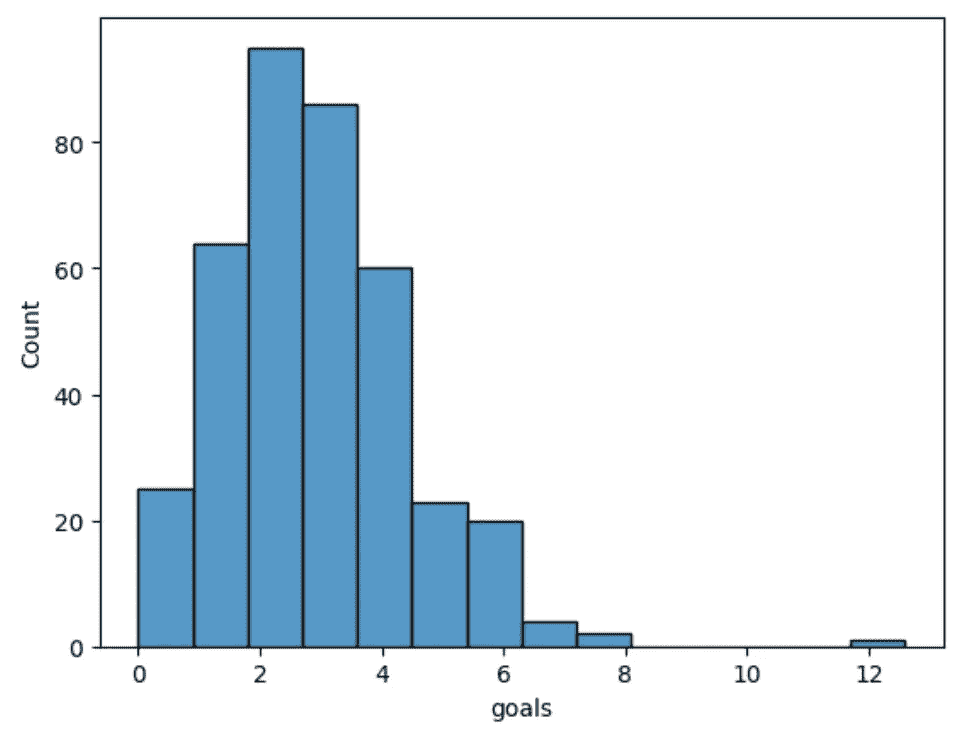
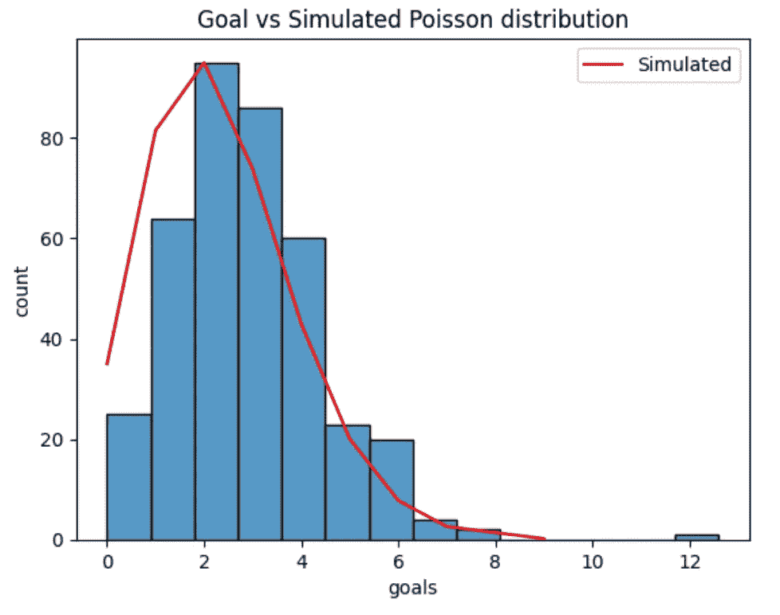

# 足球进球的随机性如何？

> 原文：[`towardsdatascience.com/how-random-are-goals-in-soccer-8a822c1f3bc`](https://towardsdatascience.com/how-random-are-goals-in-soccer-8a822c1f3bc)

## 体育分析

## 通过频率统计理解进球事件

[](https://polmarin.medium.com/?source=post_page-----8a822c1f3bc--------------------------------)[](https://towardsdatascience.com/?source=post_page-----8a822c1f3bc--------------------------------) [Pol Marin](https://polmarin.medium.com/?source=post_page-----8a822c1f3bc--------------------------------)

·发表于 [Towards Data Science](https://towardsdatascience.com/?source=post_page-----8a822c1f3bc--------------------------------) ·7 min read·2023 年 7 月 29 日

--


足球进球——照片由 [Chaos Soccer Gear](https://unsplash.com/@chaossoccergear?utm_source=medium&utm_medium=referral) 提供，来自 [Unsplash](https://unsplash.com/?utm_source=medium&utm_medium=referral)

足球（对于美国读者来说是 soccer）是一项了不起的运动。它不可能凭借巧合成为世界上最受欢迎的运动。

足球将人们聚集在一起，它是从忙碌生活中断开的借口，因为比赛时间是娱乐时间。我们点一些快餐，边吃边看梅西用球创造魔法——我们能享受他的表现真是太幸运了。我们还能观看像 2010 年的巴萨或 2023 年的曼城这样许多了不起的球队。

许多人会说没有两场比赛是相同的。这就是足球，没有其他运动可比。但是我认为这是错误的。

尽管它如此杰出，但它仍然受数学的支配。就像其他一切一样。

生活充满了数学模型。足球也不例外。

我一生都是**巴萨**的忠实粉丝。再加上我目前的职业状况，结果就是对**体育分析**产生了真正的兴趣——显然是倾向于足球。

这篇文章是我关于体育分析的第一篇，因此我会保持相对简单。不过，我计划写更多的文章，深入了解数学如何应用于足球（以及其他运动如手球）——并与大家分享这些见解。

数据科学家被聘用从事体育分析工作的数量正在强劲增长，这种趋势似乎不会很快停止。利用数据进行体育分析比以往任何时候都更有意义，尤其是考虑到数据生成的速度也在快速增长。

所以，这篇文章将是所有有志于成为体育分析师或对体育感兴趣的数据相关人员的绝佳入门工具。

在这里，我将使用 StatsBomb 的[1] 开放且免费的数据[2] 来检查我随机选择的 2015–2016 赛季的西甲。我邀请你做同样的分析，看看是否对其他赛季和联赛也适用。

那么，让我们开始深入挖掘吧！

## 准备数据

现在有一个很棒的 Python 模块可以让我们获取所有需要的数据：`statsbombpy`[3]。我们首先需要做的是逻辑上安装它：

```py
pip install statsbombpy
```

然后打开你的 Python 文件或笔记本，开始导入下列模块：

```py
import pandas as pd
from statsbombpy import sb
import seaborn as sns
```

接下来，我们需要获取 2015–16 赛季的所有西甲比赛：

```py
competition_row = sb.competitions()[
    (sb.competitions()['competition_name'] == 'La Liga') 
    & (sb.competitions()['season_name'] == '2015/2016')
]
competition_id = pd.unique(
    competition_row['competition_id']
)[0]
season_id = pd.unique(
    competition_row['season_id']
)[0]

matches = sb.matches(competition_id=competition_id, season_id=season_id)
```

这就是**比赛**数据框的样子：



数据框的前 5 行和前 10 列——图片由作者提供

现在，我们要检查进球情况，但没有一列显示比赛中的进球数。我们可以通过将 `home_score` 和 `away_score` 列相加来创建它：

```py
matches['goals'] = matches['home_score'] + matches['away_score']
```

我们现在准备开始分析。

## 之前的进球是否会影响未来的进球？

在进行任何计算之前，我喜欢先可视化数据。这是理解你所处理数据的最佳方式。让我们构建一个直方图：

```py
import seaborn as sns
sns.histplot(
    x='goals', 
    data=matches, 
    bins=matches['goals'].nunique(), 
    binwidth=0.9
)
```



西甲 2015/16 赛季的进球分布——图片由作者提供

正如预期的那样，大多数比赛中进球数在 1 到 4 个之间。我们都知道最常见的结果总是 1–0、2–0、2–1、3–0、3–1（客队同样如此）。有一个进球数为 12 的比赛案例是明显的异常值——皇马对阵拉约·巴列卡诺，最终比分为 10–2。

到目前为止没有新内容，仅仅是有趣的事实。

该赛季的平均进球数为 2.74（四舍五入）。这转化为每分钟平均 0.030497（四舍五入）个进球（或 1/32.79）。换句话说，我们可以说在每个 90 分钟的时间段内有 0.030497 的进球概率。

有趣的部分来了：**我们将模拟整个赛季**。由于我们只关注比赛进球——而不是比赛胜负或赛季排名——我们将使用的唯一参数是进球的分钟概率。

```py
# Creating a simulation
import random

mean_goals = matches['goals'].mean()

def simulate_match():
    goals = 0

    for i in range(90):
        goals += np.random.choice(
            np.arange(0, 2), 
            p=[1-(mean_goals/90), mean_goals/90]
        )
    return goals

def simulate_season(n_games):
    goals_per_game = []

    for i in range(n_games):
        goals_per_game.append(simulate_match())

    return goals_per_game
```

现在我们有了 `simulate_match()` 和 `simulate_season()` 函数，它们每个都包含一个简单的循环（即在每场比赛的每分钟循环），然后随机计算这一分钟是否有进球。

为此，我们使用 `random.choice()`，它以指定的概率从 0 或 1 中选择（~0.030497 选择 1，~0.969503 选择 0）。

使用我们之前看到的直方图，让我们绘制模拟分布线叠加在上面：

```py
goals_per_game = simulate_season(len(matches))

mu = np.var(goals_per_game)
pmf = poisson.pmf(goals_per_game, mu)
pmf *= (most_repeated_count/pmf.max())

sns.lineplot(
    x=goals_per_game, 
    y=pmf, 
    color='red', 
    label="Simulated"
).set(ylabel='count')
sns.histplot(
    x='goals', 
    data=matches, 
    bins=matches['goals'].nunique(), 
    binwidth=0.9
).set(title='Goal vs Simulated Poisson distribution')
```



西甲 2015/16 赛季的进球和模拟的泊松分布——图片由作者提供

根据模拟数据，实线红色曲线显示了泊松分布。当之前事件的时间对未来事件没有影响时，这种分布适用。

换句话说，使用维基百科的话：“泊松分布表示在固定时间或空间间隔内发生给定数量事件的概率，如果这些事件以已知的恒定平均速率发生，并且独立于上一个事件以来的时间。”[4]

这个图表的要点非常直接：这是一个通过随机模拟生成的模型，它与实际结果非常接近。

所以我们有了答案：**进球不受目前进球数或比赛时间的影响。** 它们在时间上是不可预测的。

正如 David Sumpter 在《Soccermatics》[5]中所说：“正是足球比赛从一刻到下一刻的不可预测性，在 90 分钟后产生了泊松分布。我们知道比赛中的平均进球数，但它们的时机是不可预测的。因此，一些比分比其他比分更可能出现。这里的悖论是，比分是由随机性解释的。进球时间的高度随机性使得结果中的模式是可预测的。”

## 结论

目标本身并非随机的，它们发生是有原因的。但它们确实是不可预测的。当某些条件满足时，我们才会有目标：防守者犯错，进攻者传球顺利，梅西得到球，守门员无法阻止球进门……

一次关键的比赛瞬间可以在任何时候完全改变比赛的方向。我们今天已经用数学证明了这一点——进球不受之前进球或发生时间的影响。

但我们不应局限于足球来得出结论。我们所做的这个简单分析也可以应用于任何与足球无关的数据。我不仅仅是在谈论冰球进球、手球进球或篮球得分。

数据科学家可以期望在合理假设事件可以意外发生、在任何时间、独立于之前发生的事件数量时，出现泊松分布。

你看到这有多强大了吗？一个简单却强大的数学建模工具。

如果你不相信我，可以尝试用你喜欢的任何数据进行分析。例如，试着分析某一天有多少人去超市、工厂中发生的事故数量，或跨越两个国家边界的汽车数量。你会发现它们也无法逃脱泊松分布。

再次强调，这对数据科学家来说是一个理解我们所处理数据的强大工具。

回到足球上来，显然它不是一项随机的运动。它远不止于此：它涉及挫折、逆转、阵容、战术、技能……

如果我们不想深入探讨，随机性可能足以研究一个赛季中的进球数。但足球远比仅仅解释进球分布更有趣。

在我接下来的足球分析帖子中，我们将进一步探讨超越简单随机性的内容。

```py
**Thanks for reading the post!** 

I really hope you enjoyed it and found it insightful.

Follow me and subscribe to my mailing list for more 
content like this one, it helps a lot!

**@polmarin**
```

如果你想进一步支持我，可以通过下面的链接订阅 Medium 的会员：这不会增加你的额外费用，但会帮助我完成这个过程。

[](https://medium.com/@polmarin/membership?source=post_page-----8a822c1f3bc--------------------------------) [## 通过我的推荐链接加入 Medium - Pol Marin

### 阅读 Pol Marin（以及 Medium 上其他数千名作家）的每一个故事。你的会员费用直接支持 Pol…

medium.com](https://medium.com/@polmarin/membership?source=post_page-----8a822c1f3bc--------------------------------)

## 资源

[1] [StatsBomb](https://statsbomb.com/)

[2] [StatsBomb 的许可证 — GitHub](https://github.com/statsbomb/statsbombpy/blob/master/doc/LICENSE.pdf)

[3] [statsbombpy — GitHub](https://github.com/statsbomb/statsbombpy)

[4] [泊松分布 — 维基百科](https://en.wikipedia.org/wiki/Poisson_distribution)

[5] [Soccermatics: 足球中的数学冒险](https://amzn.to/43MsVeK)
