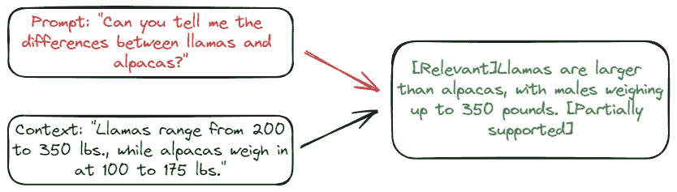
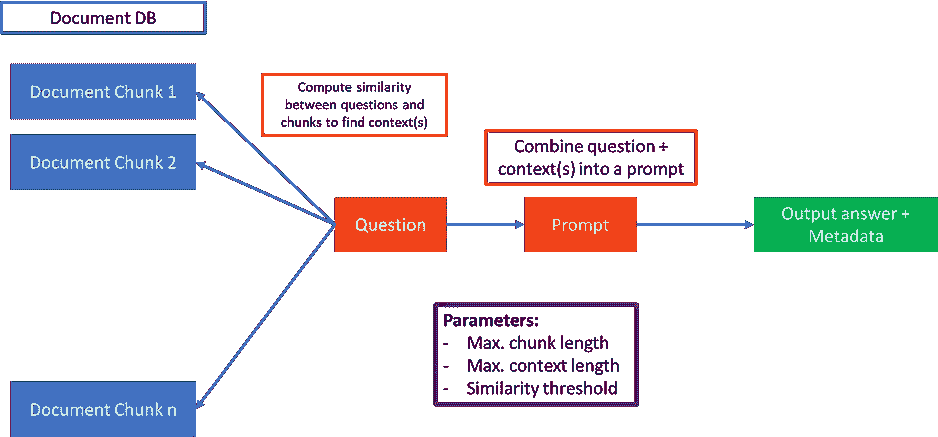

# 如何自我 RAG 可能会彻底改变工业 LLMs

> 原文：[`towardsdatascience.com/how-self-rag-could-revolutionize-industrial-llms-b33d9f810264?source=collection_archive---------4-----------------------#2023-11-14`](https://towardsdatascience.com/how-self-rag-could-revolutionize-industrial-llms-b33d9f810264?source=collection_archive---------4-----------------------#2023-11-14)

## 让我们面对现实 —— 普通的 RAG 相当愚蠢。不能保证返回的响应是相关的。了解如何自我 RAG 可以大大帮助

 [Skanda Vivek](https://skanda-vivek.medium.com/?source=post_page-----b33d9f810264--------------------------------)

·

[跟进](https://medium.com/m/signin?actionUrl=https%3A%2F%2Fmedium.com%2F_%2Fsubscribe%2Fuser%2F220d9bbb8014&operation=register&redirect=https%3A%2F%2Ftowardsdatascience.com%2Fhow-self-rag-could-revolutionize-industrial-llms-b33d9f810264&user=Skanda+Vivek&userId=220d9bbb8014&source=post_page-220d9bbb8014----b33d9f810264---------------------post_header-----------) 发表在 [Towards Data Science](https://towardsdatascience.com/?source=post_page-----b33d9f810264--------------------------------) ·7 分钟阅读·Nov 14, 2023

--

自我 RAG 演示 | Skanda Vivek

大型语言模型（LLMs）即将彻底改变各个行业。以金融行业为例，LLMs 可以用来快速查阅大量文档，并在分析师完成相同任务的时间和成本的极小部分内发现趋势。但问题在于，你得到的答案往往是不完整的。例如，假设你有一份包含公司 X 过去 15 年的年度收入的文档，但这些信息分散在不同的部分。在下面所示的标准检索增强生成（RAG）架构中，你通常会检索前 k 个文档，或者选择固定上下文长度内的文档。

RAG 原型 | Skanda Vivek

然而，这可能会有几个问题。其中一个问题是，前 k 个文档可能没有包含所有答案——例如，可能只对应过去的 5 年或 10 年。另一个问题是计算文档块和提示之间的相似性…
