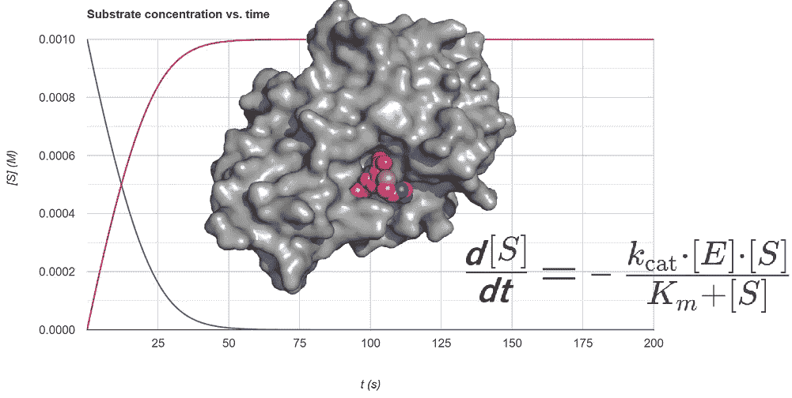

# 简单的数值积分如何使你的方程建模任务变得更轻松

> 原文：[`towardsdatascience.com/how-simple-numerical-integration-can-make-your-life-easier-in-equation-modeling-tasks-7b5a90b97056?source=collection_archive---------8-----------------------#2023-10-05`](https://towardsdatascience.com/how-simple-numerical-integration-can-make-your-life-easier-in-equation-modeling-tasks-7b5a90b97056?source=collection_archive---------8-----------------------#2023-10-05)

## 模拟与数值建模

## 以迈克利斯-门腾方程为例，讲解酶催化反应，并包含一个可运行的网络应用及其代码

 [LucianoSphere (Luciano Abriata, PhD)](https://lucianosphere.medium.com/?source=post_page-----7b5a90b97056--------------------------------)

·

[关注](https://medium.com/m/signin?actionUrl=https%3A%2F%2Fmedium.com%2F_%2Fsubscribe%2Fuser%2Fd28939b5ab78&operation=register&redirect=https%3A%2F%2Ftowardsdatascience.com%2Fhow-simple-numerical-integration-can-make-your-life-easier-in-equation-modeling-tasks-7b5a90b97056&user=LucianoSphere+%28Luciano+Abriata%2C+PhD%29&userId=d28939b5ab78&source=post_page-d28939b5ab78----7b5a90b97056---------------------post_header-----------) 发表在 [Towards Data Science](https://towardsdatascience.com/?source=post_page-----7b5a90b97056--------------------------------) ·10 分钟阅读·2023 年 10 月 5 日

--

图表由作者从自己的截图和免费软件中制作而成。

在自然科学、工程学和经济学的数学中，数值积分的艺术作为描述动态系统随时间变化行为的强大工具。该技术在这些领域中的许多问题上都有大量具体应用，特别是在处理微分方程时。

从技术上讲，主要的挑战在于微分方程将一个或多个变量与它们的导数混合在一起，使得解析积分将不同的变量出现方式缠绕在一起，导致这些变量无法组合在一起并作为其他变量的函数求解。在这种情况下，数值积分，而非常规积分，成为救援之道。

尽管有专门的研究和方法来有效地实现微分方程的数值积分，如龙格-库塔方法，但我们可以从基础出发，以非常简单的“欧拉类似”方法直接解决问题，这…
