# 辛普森悖论如何误导统计数据

> 原文：[`towardsdatascience.com/how-simpsons-paradox-can-mislead-statistics-f63d1c6a8e15`](https://towardsdatascience.com/how-simpsons-paradox-can-mislead-statistics-f63d1c6a8e15)

## 以及为什么机器学习的解释并不总是可靠

[](https://medium.com/@jacky.kaub?source=post_page-----f63d1c6a8e15--------------------------------)[](https://towardsdatascience.com/?source=post_page-----f63d1c6a8e15--------------------------------) [Jacky Kaub](https://medium.com/@jacky.kaub?source=post_page-----f63d1c6a8e15--------------------------------)

·发表于 [Towards Data Science](https://towardsdatascience.com/?source=post_page-----f63d1c6a8e15--------------------------------) ·阅读时间 12 分钟·2023 年 1 月 18 日

--


图片由 [Jason Leung](https://unsplash.com/es/@ninjason?utm_source=medium&utm_medium=referral) 提供，来源于 [Unsplash](https://unsplash.com/?utm_source=medium&utm_medium=referral)

如果有我真正讨厌听到的话，那就是经典的权威论证“统计数据显示*插入一个事实*”。

随着统计工具和机器学习的民主化，将一些数据转化为洞察比以往任何时候都更加容易。然而，每个人都应该注意不要陷入一些非常违反直觉的陷阱，这些陷阱可能导致研究偏差，尤其是在研究速度过快或没有专家视角的情况下。

在这篇文章中，我们将深入探讨一个经典的统计陷阱，即**辛普森悖论**，它可能导致由于存在隐藏的相关因素而对模型中特征的解释产生误解。

我设计这篇文章是为了那些具备基本统计和机器学习知识的人，特别是那些对这个悖论不了解的数据科学家和分析师。不过，第二部分中展示的案例可能会引起任何有意发现数据被操控以表达相反观点的人的兴趣。

# 这个悖论是什么？

你正在对一个数据集进行分析。你有一堆特征 X1, … Xn，你正在使用这些特征来预测目标变量“y”。

辛普森悖论出现的条件是：

+   你至少缺少一个变量（我们称之为 Xs），这个变量解释了你的目标“y”方差的一部分。

+   这个隐藏变量 Xs 和你的一个特征 Xb 之间存在直接的因果关系。

在这种情况下，忽略 Xs 可能会直接导致对 Xb 对目标变量 y 影响的误解。

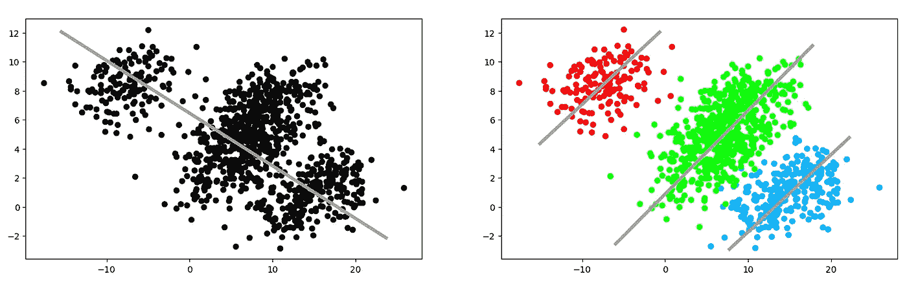

悖论的插图

## 线性回归的情况

为了理解这个悖论的背后，我们来研究一个简单的线性回归案例，其中目标“y”与两个变量“X1”和“X2”相关。我们还添加了一个误差项，该误差项独立且分布相同：

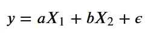

在正常情况下，当变量 X1 和 X2 不相关时，忽略 X2 并对 X1 进行回归将会得到：

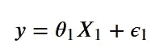

具有：

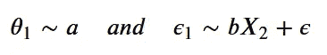

让我们用一堆模拟数据来验证这一点，取 a = 1 和 b = 1：

```py
a = 1
b = 1
#Let's draw some random points
X1 = np.random.normal(0, 1, 5000)
X2 = np.random.normal(0, 1, 5000)
eps = np.random.normal(0,1, 5000)

#Create our target value
y = a*X1 + b*X2 + eps

#Get the coefficients of the linear regression of y on X1
lr = LinearRegression().fit(X1.reshape(-1,1),y)
theta_1,theta_0 = lr.coef_[0], lr.intercept_
```

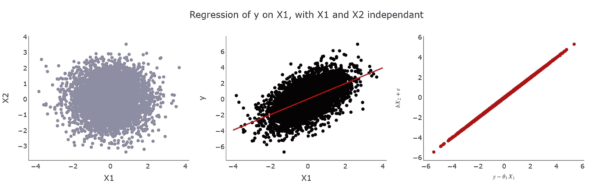

我们确认，当 X2 和 X1 之间没有相关性时：

+   y 对 X1 的线性回归的斜率等于“a”（第二张图）

+   回归的误差 epsilon1 等于 bX2 + epsilon（第三张图）。

## 当 X1 和 X2 不是独立的

我们现在假设 X1 和 X2 之间存在直接相关性：

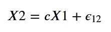

在这种情况下，我们不能直接将 X2 再注入误差项，因为误差将不再是独立的（由于 X1 和 X2 之间的相关性）

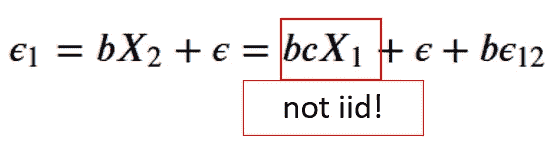

由于 X1 中的项，误差不再是独立的

要恢复一个独立的误差，我们需要重新排列 X1 的方程：

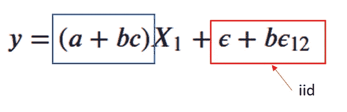

这次，不像之前，系数不再等于“a”，而是包含一个考虑 X1 和 X2 之间相关性的项（a + bc）。

这就是辛普森悖论所在：根据 b（X2 对 y 的解释方差）和 c（X2 对 X1 的解释方差）的值，我们现在可以得到 y 和 X1 之间的相关性，这种相关性可能更高，更低，甚至… 相反！

*注意，如果 b = 0 或 c = 0，则悖论消失，确认了在这个简化案例中之前暴露的两个条件。*

为了直观地展示这个效果，让我们修改我们的模拟：

```py
a = 1
b = -1
c = 2
X1 = np.random.normal(0, 1, 5000)

#Define X2 as correlated to X1
eps_2 = np.random.normal(0,1,5000)
X2 = c * X1 + eps_2

#Define the target as before
eps = np.random.normal(0,1, 5000)
y = a*X1 + b*X2 + eps

lr = LinearRegression().fit(X1.reshape(-1,1),y)
theta_1,theta_0 = lr.coef_[0], lr.intercept_
```

当 b = -1 和 c = 2 时，我们应该在对 X1 进行回归时发现一个负系数，而不是一个正系数…

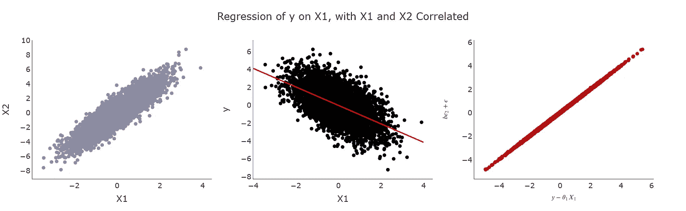

… 这正是我们发现的（第二张图）。注意我们还找到了线性回归误差为 epsilon + b epsilon_2（第三张图），这是我们的小计算所预期的。

就是这样，我们揭示了我们线性系统中的辛普森悖论。通过忽略变量 X2 的影响，X2 与 X1 和 y 都相关，我们使自己暴露于对 y 对 X1 回归系数的错误解释中。

*注意，根据我们的简单例子，悖论可能发生在 b 和 c 的广泛值范围内。例如，b = 2 和 c = -1 也会创建一个辛普森悖论，其中 X1 和 X2 负相关，而 X2 对 y 具有强影响。*

这当然是一个非常简单的例子，但有助于发展对这一特定现象的直觉。

# 一些著名的辛普森悖论

这看起来像一个有趣的理论问题，但这种悖论在现实情况中有很多表现。让我们深入探讨两个真实案例，以查看统计数据如何可能误导那些不完全了解这些细微差别的人，并看看它如何与我们在上一部分中强调的内容相关。

我参考了**David Louapre**的[优秀文章](https://scienceetonnante.com/2013/04/29/le-paradoxe-de-simpson/)（法文），这激发了我深入分析悖论。

## 吸烟与预期寿命

在“忽略一个协变量：辛普森悖论的一个例子”[1]的第一部分中，David R. Appleton、Joyce M. French 和 Mark PJ Vanderpump 研究了吸烟和非吸烟女性（X0）的生存率（y）。

为了方便可视化这种情况中的悖论，我们将模拟一个类似的数据集：

```py
#Proba to use for non-smokers
proba_not_smoke = {
    "18-25":0.52,
    "26-35":0.55,
    "36-44":0.51,
    "45-55":0.46,
    "56-67":0.53,
    "68-75":0.8,
    "76+":0.85
}

#Proba to use for people dying naturally
proba_die_naturally = {
    "18-25":0.01,
    "26-35":0.01,
    "36-44":0.05,
    "45-55":0.13,
    "56-67":0.3,
    "68-75":0.6,
    "76+":0.95    
}

#Proba to use for people dying smoking
proba_die_smoking = {
    "18-25":0.001,
    "26-35":0.004,
    "36-44":0.008,
    "45-55":0.01,
    "56-67":0.01,
    "68-75":0.01,
    "76+":0.01    
}

def get_group(age):
    '''Simple function to transform age into a category'''
    if age<=25:
        return "18-25"
    if age<=35:
        return "26-35"
    if age<=44:
        return "36-44"
    if age<=55:
        return "45-55"
    if age<=67:
        return "56-67"
    if age<=75:
        return "68-75"
    else:
        return "76+"

POPULATION = 5000

#Create a random population
population_ages = np.random.randint(18,90, POPULATION)
dataset = []
for age in population_ages:
    group = get_group(age)

    #draw the probas
    p_not_smoke = proba_not_smoke[group]
    p_die_naturally = proba_die_naturally[group]
    p_die_smoking = proba_die_smoking[group]

    #calculate the condition of the person based on the proba drawns
    smoker = np.random.random()>p_not_smoke
    died_naturally = np.random.random()<p_die_naturally
    died_smoking = np.random.random()<p_die_naturally
    died = died_naturally | ((died_smoking) & (smoker))
    dataset.append({"smoker":smoker*1,"age_group":group,"lived_after_20_years":1-died})

df = pd.DataFrame(dataset)
```

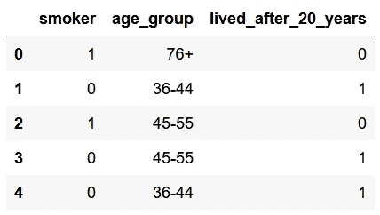

数据集样本（合成的）

下图显示了我们模拟数据集中的预期寿命：

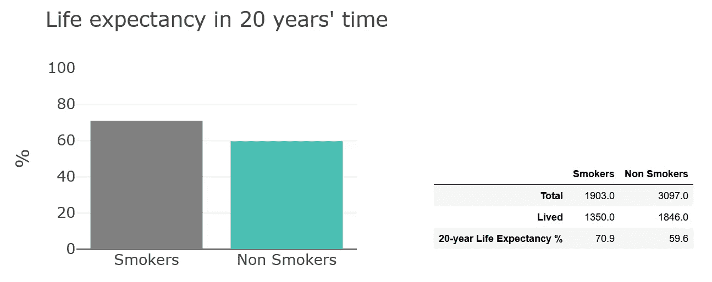

在模拟数据集中，按我们关注的特征（吸烟）拆分数据集后的预期寿命

如我们所见，在对总体人群进行简单分析时，初步结果似乎表明吸烟者的预期寿命较高。

这个非常奇怪的结果来源于一个混杂变量，即所研究人群的年龄（我们的变量 X2，参见第一部分的例子）在图表中被省略了。

现在让我们看看在分析中添加年龄变量后结果如何。

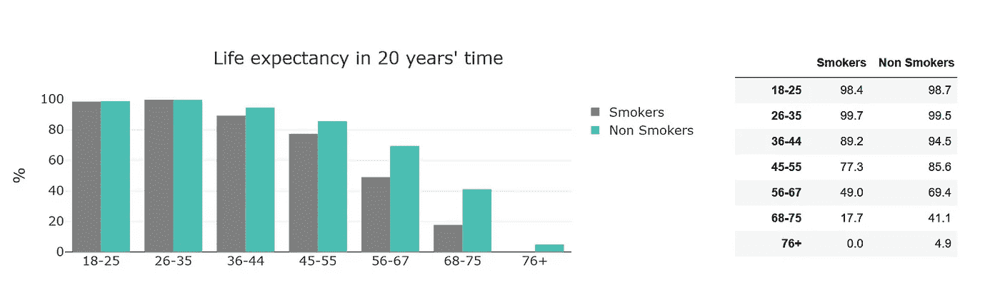

在模拟数据集中，按我们关注的特征（吸烟）和年龄拆分数据集后的预期寿命

这次我们可以看到，每个组的 20 年后的预期寿命在每个年龄组中对非吸烟者更好。

当我们从不同的角度查看数据时，我们可以发现年龄（X2）与吸烟者/非吸烟者类别（X1）之间的相关性。

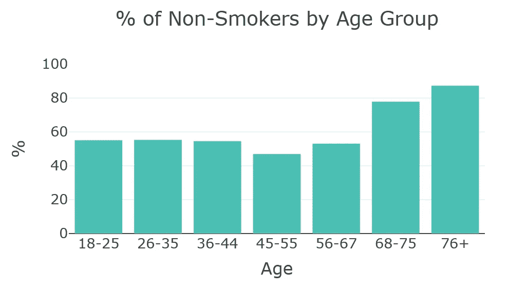

在我们模拟的数据集中，按年龄组分配吸烟者的情况

我们回到第一部分中暴露的条件集：

+   我们的变量年龄“X2”与目标（y）“20 年后的预期寿命”（b << 0）呈强负相关，因为老年人不太可能比年轻人多活 20 年。

+   同时，年龄（X2）与吸烟者（X1）之间呈负相关（c < 0）

+   如果忽略年龄 X2 的话，结果会给人一种吸烟能提高预期寿命的印象（a + bc > 0），而实际上它会降低预期寿命（a < 0）。

## 性别和学校录取

另一个非常著名的例子是《[研究生招生中的性别偏见：来自伯克利的数据](http://www.unc.edu/~nielsen/soci708/cdocs/Berkeley_admissions_bias.pdf)》[2]中突出的辛普森悖论。

原始数据集展示了 1973 年伯克利按部门和性别的招生情况，我们还将准备类似的合成变体以作说明。

```py
#Probabilities of admission in the major
admissions_proba = {
    "Major_1":0.74,
    "Major_2":0.64,
    "Major_3":0.35,
    "Major_4":0.34,
    "Major_5":0.24,
    "Major_6":0.06
}

#Probabilities of selection a major as a man
gender_proba = {
    "Major_1":0.08,
    "Major_2":0.04,
    "Major_3":0.65,
    "Major_4":0.47,
    "Major_5":0.67,
    "Major_6":0.47,    
}

def get_major(p):
    """This function is used to select a major randomly based on some
       probabilities"""
    if p<0.25:
        return "Major_1"
    if p<0.37:
        return "Major_2"
    if p<0.54:
        return "Major_3"
    if p<0.70:
        return "Major_4"
    if p<0.82:
        return "Major_5"
    else:
        return "Major_6"

POPULATION = 12000
dataset = []
for i in range(POPULATION):
    p_major = np.random.random()
    major = get_major(p_major)
    gender = ['M','F'][np.random.random()<gender_proba[major]]
    admission = ['Accepted','Rejected'][np.random.random()>admissions_proba[major]]
    dataset.append({"Major":major,"Gender":gender,"Admission":admission})
df = pd.DataFrame(dataset)
```

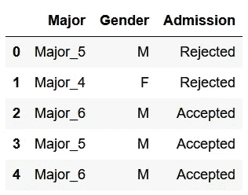

合成数据用于说明研究生招生中的性别偏见悖论

当我们简单查看按性别（X1）的统计数据时，我们发现男性性别的招生百分比（y）存在统计学上显著的偏见。

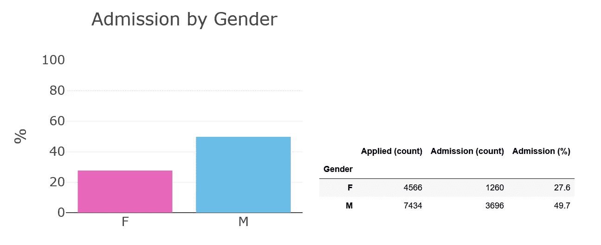

按性别分割的简单招生率，在合成数据上

另一方面，添加主修（X2）进行分析会在大多数部门中颠倒性别偏见的结论，揭示出悖论。

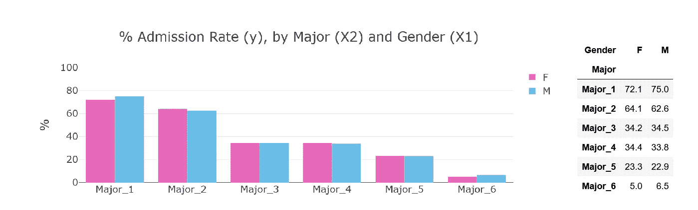

添加主修暴露了悖论，合成数据上的示例

与之前的例子一样，这个悖论可以通过主修（X2）与目标 y（选择性）和原始特征 X1（性别）的关联来解释。

下图显示，在数据集中，女性倾向于申请非常有选择性的专业，而男性则申请选择性较低的专业。

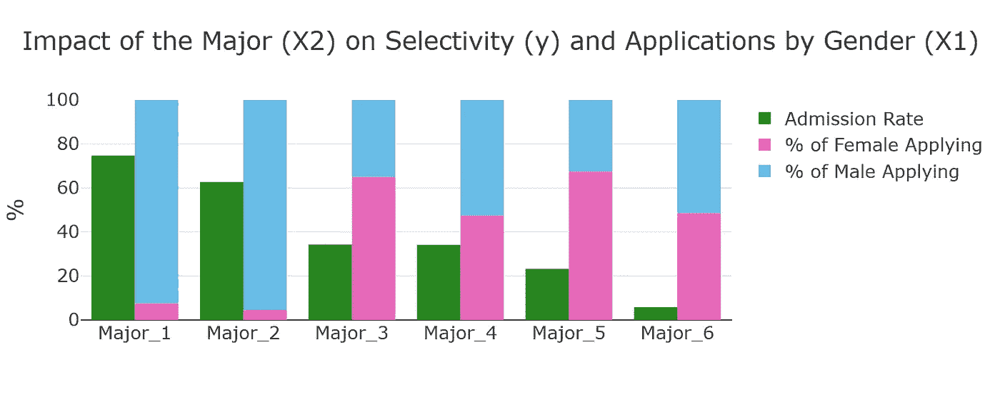

主修（X2）与我们的目标以及原始特征之间的隐藏关联

# 高级机器学习工具中的悖论

直到现在，我们讨论了相对简单数据集中的辛普森悖论。但也有可能生成更复杂的例子，当高级机器学习和特征解释算法可能会产生误导，如果不包括所有相关数据的话。

在这一部分，我模拟了一个由 5 个特征组成的“房价数据集”：

+   资产表面

+   车库面积

+   花园面积

+   房屋状况

+   区域豪华度（可选参数）

我们将根据这 5 个特征预测资产价格。

作为一个心机深沉的人，我设计了稍微不同的区域豪华度特征：

我构建了这个特征，使得区域的豪华度对我们的目标（销售价格）有不可忽视的影响，同时对车库面积也有影响，这将成为悖论的受害特征（前面例子的“X1”）：例如，我们可以想象在豪华区域，可能没有足够的空间容纳大车库，从而解释负相关性。

这当然是完全虚构的，所以不要太当真，但这将帮助我阐明我的观点。

```py
N = 3000
n_clusters = 10
inc = N//n_clusters
n_samples = inc*n_clusters
#Create our main features
asset_surface = np.random.normal(90, 25, n_samples)
garden_surface = np.random.normal(500, 100, n_samples)
house_condition = np.random.randint(0, 5, n_samples)/10+1

#Build the two last features so they have a negative correlation
garage_surface = np.array([])
fanciness_area = np.array([])
for i in range(n_clusters):
    gs = np.random.normal(i, 1, inc)
    fa = np.random.normal(-i, 1, inc)
    garage_surface = np.hstack([garage_surface, gs])
    fanciness_area = np.hstack([fanciness_area, fa])

#Just make it a bit more non-linear...
fanciness_area = np.exp((fanciness_area + 12)/10)

df = pd.DataFrame([asset_surface, garden_surface, house_condition, garage_surface, fanciness_area])

#We build our target so that the formula is non-linear and stay in the range of a house price...
sale_price = (asset_surface*(fanciness_area**0.5)*2 + garden_surface/5 + garage_surface/2)*house_condition*100+50000+np.random.normal(0, 20000, n_samples)
```

我将跳过特征工程和清理，直接进入结论。我使用了经过微调的**xgboost**来预测 y，使用数据集中的所有特征（包括和不包括我们的“区域豪华度”特征），并利用**shap**库检查特征解释的结果，就像我在经典机器学习项目中所做的一样。

*注意：对于那些不熟悉这个库的人，* [*shap*](https://github.com/slundberg/shap) *是一个出色的工具，用于执行特征解释，特别是对于基于树的算法特别高效。*

*一些解释图表的关键，对于那些不熟悉 shap 的人：*

+   *特征按重要性从上到下排序，列表顶部的特征对目标有较大影响，而底部的特征影响较小。*

+   *每个点代表一个样本。红色表示特征在给定样本中值较高，而蓝色表示值较低。*

+   *一个点位于左侧越多，该特征对该样本的负面影响越大。越往右，该特征的正面影响越大。*

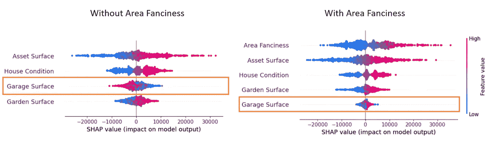

Shap 值根据区域时尚特征（X2）的存在，对车库表面（X1）给出了不同的解释。

在我们的场景中，我们可以清楚地观察到悖论：如果我们忘记包括“时尚区域”特征，即使分数没有那么不同，它也会影响我们对结果的解释。它将带来两个重大后果：

+   高估车库表面的影响：在没有区域时尚的情况下排名更高

+   改变我们对车库表面特征的解释：如果我们不考虑区域时尚，shap 模型告诉我们，高车库表面倾向于对销售价格产生负面影响，而解释是高车库表面如果包括该区域时尚将提升销售价格。

在这种情况下，我们可以简单地理解存在一个问题，并且一个大的车库理论上应该增加资产的价值。

然而，在其他情况下，当特征数量较多且更难以解释时，你可能会在未意识到的情况下陷入悖论，并对你的结果做出错误的解释。

# 结论

在这篇文章中，我尝试向你解释著名的辛普森悖论背后的直觉，并突显一些可能隐藏在统计分析背后的危险。

我们特别看到，拥有最好的机器学习模型和最先进的解释算法是不足以避免这种情况的，如果你对所研究的数据没有全面的了解。

我个人没有避免这种悖论的解决方案，但作为数据科学家和数据分析师，我们需要记住“天下没有免费的午餐”，在可能的情况下寻求领域专家的帮助，并始终质疑我们的结果。

这篇文章对我特别重要，因为当我第一次了解到这个悖论时，我变得非常渴望学习更多的统计学知识，这也使我走到了今天的道路上。

我希望你阅读它时和我写作时一样享受。

> [1] Appleton, David R., Joyce M. French, 和 Mark PJ Vanderpump. « 忽略协变量：辛普森悖论的一个例子。 »《美国统计学家》50.4 (1996): 340–341。
> 
> [2] Bickel, Peter J., Eugene A. Hammel 和 J. William O’Connell. « [研究生招生中的性别偏见：来自伯克利的数据。](http://www.unc.edu/~nielsen/soci708/cdocs/Berkeley_admissions_bias.pdf) » *科学* 187.4175 (1975): 398–404.
