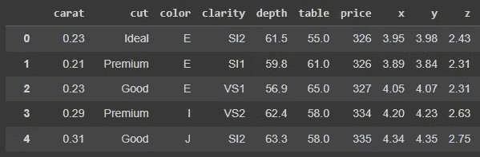
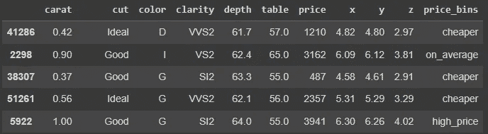
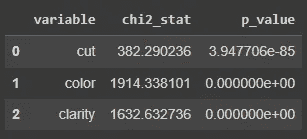
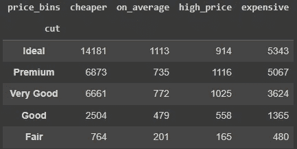
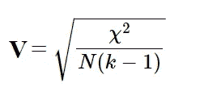

# 变量之间的关联强度有多大？

> 原文：[`towardsdatascience.com/how-strongly-associated-are-your-variables-80493127b3a2`](https://towardsdatascience.com/how-strongly-associated-are-your-variables-80493127b3a2)

## 使用 Cramer’s V 检验来检查两个分类变量的关联强度

[](https://gustavorsantos.medium.com/?source=post_page-----80493127b3a2--------------------------------)[](https://towardsdatascience.com/?source=post_page-----80493127b3a2--------------------------------) [Gustavo Santos](https://gustavorsantos.medium.com/?source=post_page-----80493127b3a2--------------------------------)

·发表于 [Towards Data Science](https://towardsdatascience.com/?source=post_page-----80493127b3a2--------------------------------) ·阅读时间 7 分钟·2023 年 2 月 28 日

--


图片由 [Susan Holt Simpson](https://unsplash.com/pt-br/@shs521?utm_source=unsplash&utm_medium=referral&utm_content=creditCopyText) 提供，刊登于 [Unsplash](https://unsplash.com/photos/H7SCRwU1aiM?utm_source=unsplash&utm_medium=referral&utm_content=creditCopyText)

# 介绍

特征选择是任何数据科学项目中的一个重要步骤。我可以想象如果你对这个领域不陌生，你已经听到过无数次了，如果你是新手，我相信你也听说过，但我还是要再说一遍：*如果你给模型喂垃圾，你将得到垃圾作为结果。*

好了，现在我们把这件事放在一边，接下来继续。选择最佳特征有几种好的方法，例如运行随机森林模型，然后检查 `feature_importances_` 属性，使用 sklearn 的 `SelectKBest`，分别进行统计测试，以及其他技术。

**sklearn** 提供的这些自动化测试非常实用，是我们快速进行特征选择的优秀选择。它们是使用统计测试（如 F 检验、相关性、卡方检验）的自动化方法，可以快速执行假设检验，以根据结果选择变量。

当我们谈论分类变量时，例如，如果我们运行 `SelectKBest`，我们将不得不使用评分函数 `chi2` 来找出 p 值是否低于变量依赖的统计显著性阈值。

> Ho = 变量独立
> 
> Ha = 变量不独立
> 
> 常用的显著性水平是 0.05。

然而，返回的值仅包括 p 值和检验统计量。这意味着该工具旨在仅提供快速结果，例如 p 值低于阈值，确认我们有证据拒绝零假设，并指出两个分类变量之间存在依赖关系。但它不会告诉你这种关联有多强。

一个简单的解决方案是 **执行 Cramer’s V 检验**，将在本帖中介绍。

在继续之前，让我介绍一下本帖中示例使用的数据集。这是 *diamonds* 数据集，一个来自 Seaborn 包的开放样本数据。

```py
import seaborn as sns

# Load the dataset
df = sns.load_dataset('diamonds')
```



来自 seaborn 的钻石数据集。图片由作者提供。

该数据集包含钻石的切割、颜色、大小、克拉和价格的观察值。**我们的目的是检查分类变量之间的关联** `**cut, color, clarity**` **以及** `**price**`。

可以自由导入包进行代码编写。

```py
import pandas as pd
import scipy.stats as scs
from sklearn.feature_selection import SelectKBest
from sklearn.feature_selection import chi2
```

# 使用 Select K Best

好的，一旦我们介绍了数据集和 `SelectKBest` 工具要执行的检验，让我们看看它是如何工作的以及结果如何。

首先，由于我们将检查两个分类变量之间的关联，让我们将 `price` 变量变成分类变量。为此，我将钻石的价格分成几个区间：

+   **便宜**：从 0 到低于平均值的 20%

+   **平均值**：从平均值 - 20% 到平均值

+   **高价格**：从平均值到平均值 + 20%

+   **昂贵**：从平均值 + 20% 到最大值

```py
# Create a price bin variable
df['price_bins'] = pd.cut(
    df['price'],
    bins= [0, df.price.mean()*0.8, df.price.mean(), df.price.mean()*1.2, np.inf],
    labels= ['cheaper', 'on_average', 'high_price', 'expensive']
    )
```

这就是它的样子。



添加了 price_bins 变量。图片由作者提供。

接下来，我们将数据分成 X（解释变量）和 y（被解释变量）。

```py
# Split X and y
X = df.drop(['price', 'x', 'y', 'z', 'depth', 
             'table', 'carat', 'price_bins'], axis=1)
y= df.price_bins
```

在此过程中，我们选择分类变量并对其值进行编码。

```py
# Select categorial variables
categorical_vars = X.select_dtypes(include='category').columns.to_list()

# Encode the categorial variables
X[categorical_vars] = X[categorical_vars].apply(lambda x: x.cat.codes)
```

有了这些，我们就准备好拟合数据并提取结果了。

```py
# Instance of SelectKBest
fsel= SelectKBest(score_func=chi2, k=3)

# Fit
fsel.fit(X, y)

# Show a dataframe of the results
(
    pd.DataFrame({
    'variable': X.columns,
    'chi2_stat': fsel.scores_,
    'p_value': fsel.pvalues_})
    .sort_values(by='p_value', ascending=False)
)
```

结果数据框见下图。



`SelectKBest` 工具的结果。图片由作者提供。

太好了！现在我们可以看到这 3 个特征在 95% 的统计显著性水平下与价格相关（*p 值 < 0.05；拒绝 Ho*）。但我们如何确保这些关联是否强烈呢？

让我们进行 Cramer’s V 检验并找出结果。

# Cramer’s V 检验

如果我们做个快速研究，会发现：

> **Cramer’s V** 是两个分类变量之间的关联度量，其值介于 0（弱）和 1（强）之间。

要在 Python 中执行此操作，我们需要 `Pandas` 来创建列联表，`scipy` 用于运行 Chi² 检验，这将导致 V 值的最终计算。

好的，从我们的数据集中，让我们创建一个 `cut` 和我们最近创建的 `price_bins` 变量之间的列联表。

```py
# Creating a contingency table
cont_table = pd.crosstab(index= df['cut'], 
                         columns= df['price_bins'])
```

接下来是结果列联表。这仅仅是计算每对关联中存在的观察数量。例如，有 14,181 颗钻石的切割为“理想”，价格为“更便宜”。735 颗钻石的切割为“优质”，价格“平均”。



切割 x 价格分箱的列联表。图像由作者提供。

要执行 Chi²检验，我们将使用`scipy`中的`chi2_contingency`函数。因此，我们将列联表传递给该函数。它返回很多有趣的信息：（1）Chi²统计量；（2）p 值；（3）自由度；（4）期望值。由于我们只需要 Chi²进行此测试，因此我们取第一个索引`chi_stat = X2[0]`。

```py
# Chi-square value
X2 = scs.chi2_contingency(cont_table)
chi_stat = X2[0]

# Print X2
X2

[OUT]
(1603.5199669055353,
 0.0,
 12,
 array([[12378.84006303,  1318.4705228 ,  1509.44898035,  6344.24043382],
        [ 7921.51562848,   843.72080089,   965.93248053,  4059.8310901 ],
        [ 6939.87033741,   739.16573971,   846.23277716,  3556.73114572],
        [ 2817.9940304 ,   300.14460512,   343.6200964 ,  1444.24126808],
        [  924.77994067,    98.49833148,   112.76566555,   473.95606229]]))
```

现在，让我们计算 Cramer 的 V 值。V 的公式是：



V 的公式：X²是卡方统计量；N 是样本大小；k 是行和列中类别数的最小值。

在 Python 中，计算通过以下代码片段完成。

```py
# Size of the sample
N = len(df)
# Minimum dimension
# Minimum between Number of categories in rows-1, # categs columns-1
minimum_dimension = (min(cont_table.shape)-1)

# Calculate Cramer's V
result = np.sqrt((chi_stat/N) / minimum_dimension)

# Print the result
print(result)

[OUT]
0.09954537514956
```

切割与价格分箱之间的 Cramer’s V 强度值为 0.099，即 9.9%，可以理解为从小到中等效果之间的范围（参见[此处的值解释表](https://www.statology.org/interpret-cramers-v/)）对于 3 个自由度（`minimum_dimension = 3`）。

为了`clarity`，这是结果：

```py
# Creating a contingency table
cont_table = pd.crosstab(index= df.clarity, 
                         columns= df['price_bins'])

# Chi-square value
X2 = scs.chi2_contingency(cont_table)
chi_stat = X2[0]

# Performing Cramer's V calculation

# Size of the sample
N = len(df)
# Minimum dimension
minimum_dimension = (min(cont_table.shape)-1)

# Calculate Cramer's V
result = np.sqrt((chi_stat/N) / minimum_dimension)

# Print the result
print(result)

[OUT]
0.18476912508901078
```

为了`clarity`，数字 0.18 大约是中等强度。对于`color`，V = 0.115，也在小效果范围内。

# 在你离开之前

这个主题引起了我的注意，因为确实，我们很多时候只是使用像 sklearn 的`SelectKBest`这样的自动化解决方案，并且将它们的 p 值视为决定模型变量的唯一标准。

现在你读完了这篇文章，你拥有了另一个统计工具来选择模型的最佳变量。

总结：

1.  选择两个分类变量

1.  使用`pd.crosstab()`创建列联表

1.  运行`scs.chi2_contingency(contingency_table)`以收集 Chi²统计量。

1.  计算 Cramer 的 V：`np.sqrt((chi_stat/N) / minimum_dimension)`

代码：

[](https://github.com/gurezende/Studying/blob/master/Python/statistics/Cramers_V.ipynb?source=post_page-----80493127b3a2--------------------------------) [## Studying/Cramers_V.ipynb at master · gurezende/Studying

### 你目前不能执行该操作。你在另一个标签或窗口中登录。你在另一个标签或窗口中注销了……

[github.com](https://github.com/gurezende/Studying/blob/master/Python/statistics/Cramers_V.ipynb?source=post_page-----80493127b3a2--------------------------------)

如果你喜欢这个内容，[关注我的博客获取更多](http://gustavorsantos.medium.com/)。在[Linkedin](https://www.linkedin.com/in/gurezende/)上找到我。

# 参考资料

[## Cramér's V - 维基百科

### 来自维基百科，自由百科全书。在统计学中，Cramér's V（有时称为 Cramér's phi，记作）…

[en.wikipedia.org](https://en.wikipedia.org/wiki/Cram%C3%A9r%27s_V?source=post_page-----80493127b3a2--------------------------------) [Statology](https://www.statology.org/interpret-cramers-v/?source=post_page-----80493127b3a2--------------------------------) [## 如何解释 Cramér's V（带例子） - Statology]

### 它的范围从 0 到 1，其中：0 表示两个变量之间没有关联。1 表示完全关联…

[www.statology.org](https://www.statology.org/interpret-cramers-v/?source=post_page-----80493127b3a2--------------------------------) spss-tutorials.com [## 列联表、卡方检验与 Cramer’s V]

### 如何轻松检查分类变量之间的关联

towardsdatascience.com [SciPy 文档](https://docs.scipy.org/doc/scipy/reference/generated/scipy.stats.chi2_contingency.html?source=post_page-----80493127b3a2--------------------------------) [## scipy.stats.chi2_contingency - SciPy v1.10.1 手册]

### 卡方独立性检验用于检验列联表中变量的独立性。此函数计算卡方统计量…

[docs.scipy.org](https://docs.scipy.org/doc/scipy/reference/generated/scipy.stats.chi2_contingency.html?source=post_page-----80493127b3a2--------------------------------) [Statology](https://www.statology.org/interpret-cramers-v/?source=post_page-----80493127b3a2--------------------------------) [## 如何解释 Cramer's V（带例子） - Statology]

### 它的范围从 0 到 1，其中：0 表示两个变量之间没有关联。1 表示完全关联…

[www.statology.org](https://www.statology.org/interpret-cramers-v/?source=post_page-----80493127b3a2--------------------------------) [spss-tutorials.com](https://www.spss-tutorials.com/cramers-v-what-and-why/?source=post_page-----80493127b3a2--------------------------------) [## Cramér's V - 初学者教程]

### Cramér's V 是一个介于 0 和 1 之间的数字，表示两个分类变量之间的关联强度。如果我们…

[spss-tutorials.com](https://www.spss-tutorials.com/cramers-v-what-and-why/?source=post_page-----80493127b3a2--------------------------------)
