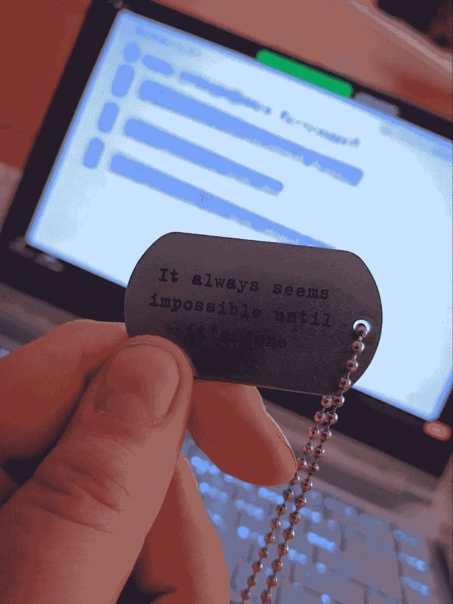

# 如何在数据科学训练营中表现出色：完整指南

> 原文：[`towardsdatascience.com/how-to-ace-the-data-science-bootcamp-a-complete-guide-aad1eb10da18?source=collection_archive---------1-----------------------#2023-09-02`](https://towardsdatascience.com/how-to-ace-the-data-science-bootcamp-a-complete-guide-aad1eb10da18?source=collection_archive---------1-----------------------#2023-09-02)

## 关于如何准备训练营、成功完成课程以及之后的行动的完整指南

 [亚历山德拉·奥贝雷莫克](https://medium.com/@oberemokalexandra1?source=post_page-----aad1eb10da18--------------------------------)

·

[关注](https://medium.com/m/signin?actionUrl=https%3A%2F%2Fmedium.com%2F_%2Fsubscribe%2Fuser%2F346def7ad86&operation=register&redirect=https%3A%2F%2Ftowardsdatascience.com%2Fhow-to-ace-the-data-science-bootcamp-a-complete-guide-aad1eb10da18&user=Alexandra+Oberemok&userId=346def7ad86&source=post_page-346def7ad86----aad1eb10da18---------------------post_header-----------) 发表在 [Towards Data Science](https://towardsdatascience.com/?source=post_page-----aad1eb10da18--------------------------------) ·13 分钟阅读·2023 年 9 月 2 日

--

一张神经网络如何看待数据科学训练营中的女孩的图像（由作者使用 Kandinsky 2.2 生成）

*我在 2021 年 5 月从线下训练营毕业。现在我在 IT 领域工作了将近 2 年。此外，我仍然被邀请作为客座毕业生参与训练营的各种活动。我将指导你如何在每个阶段表现出色——从选择一个优秀的项目到毕业后的沟通。*

*这些信息适用于有现场讲座/网络研讨会的全日制训练营项目，不适用于大规模开放在线课程（MOOCS）。*

# 在训练营开始之前

**做你的研究**

训练营是你未来职业（甚至生活）中的一个重要步骤。这就是为什么我建议尽可能多地了解信息。仅仅阅读训练营网站和浏览社交网络是不够的。我强烈建议参加所有免费的活动并积极参与。在网络研讨会上随时向工作人员提问。我还建议联系校友和学生，向他们询问任何问题。如果可能的话，尽量访问线下校园，亲自了解学习环境。这将帮助你在脑海中形成一个完整的图像。

在我阅读了有关我感兴趣的项目的所有信息后，我采取了行动。我在他们的 Instagram 上留言：“我计划申请这个训练营。毕业生和学生们，请点赞评论，我会联系你们。”几个人回复了我，我问了所有我想知道的事情。

我还参加了一个免费的 Python 马拉松。参与者每天会得到一个任务，并且必须在同一天提交解决方案。在活动期间，我积极参与聊天并保持了一致性。一切都很顺利，我赢得了活动。这让我有机会线下访问训练营办公室，感受那里的氛围。我还参加了数据科学项目的在线介绍会。

多亏了这些行动，我了解了关于训练营的所有信息。

**记录所有观察结果**

记住所有内容是很困难的，因此我强烈建议记笔记。特别是当你考虑多个学校时，这些笔记将对未来的比较和最终决策非常有用。

在我居住的城市，只有一个地方提供全日制训练营，但记录日志帮助我跟踪了一切。我做对了，选择了一个优秀的项目，拥有支持性的导师、强大的课程大纲、出色的职业支持以及周围优秀的人。

**选择有入学考试的项目**

听起来有点意外，不是吗？入学考试并不是为了折磨你。这样做的主要原因是检查每个学生是否具备理解快节奏和复杂程序所需的基础。训练营也是检查学生是否有动力和是否具备良好素质的方式。训练营不仅是学习技能的地方，它们还建立了一个社区。

*通过考试意味着你已经准备好开始一个密集的训练营*

当我加入训练营时，我也参加了一次考试。介绍部分是关于我的动机和我的背景，第二部分是关于 Python 基础知识，最后我需要解决 2 道练习题（这是我第一次进行现场编码体验 🤣）。第一个编码任务很简单（“在字符串中找到最长的单词”或类似的任务），而第二个则很难。

这是故意为之的。考官们测试了我们应对困难情况的能力，我们的思维能力，以及分解问题的能力。我花了 45 分钟完成这个任务。

**养成学习和获取信息的习惯**

在训练营中，你每天都会接收到大量信息。开始阅读新的文章，每天写一些简单的代码片段。每天从 15 到 30 分钟开始。这样你会更容易跳入全职学习。你将习惯于学习和自我提升。

这也将帮助你更好地为考试做准备。比起一个月内吸收大量信息，这要好得多。

**在你掌握一些基础知识后去参加训练营**

*我认为这是这里最重要的建议之一。*

训练营不是灵丹妙药或魔法地方，你去那里就能神奇地成为一个超级强的专家。在我看来，训练营更像是一个加速器，而不是数据科学的首次接触。

我坚信，获得一些基础知识是个好主意，因为训练营会让你的知识更好、更深入。你将有一些已经掌握的知识，而训练营会进一步深化和拓宽它。

你不需要掌握一切——一些基础事实和理解就足够让你以 x5 的强度开始训练营。

根据我的观察，那些带着一些知识来参加训练营的学生进步比那些考试后刚来的人要多。而且，他们通过技术面试也更容易。

另一个令我惊讶的效果（😅）：有些事情我第一次不理解，第二次却理解了。更重要的是，它帮助我解开了那些完全困惑并困在我脑中的问题。

突然间，我比预期的要更准备好。我从 2020 年初封锁期间开始对数据科学感兴趣，并在 Coursera 上参加了一个课程。之后，我阅读了很多关于数据的书籍，观看了许多 YouTube 视频。结果，我学到了关于经典机器学习的一些知识。

尽管如此，我还是感到困惑，将正则化和回归搞混在一起。我以为自己太笨，无法理解神经网络是如何工作的。我决定参加训练营，“为了在可衡量的时间内做好面试准备”。

当然，经典机器学习是训练营课程的一部分，我理清了很多东西。当我的小组伙伴们试图拟合他们的第一个线性回归时，我对创建新的多项式函数和寻找更复杂的依赖关系感兴趣。以便更深入地了解我已经熟悉的事物。而且，是的，经典机器学习中的一些基础帮助我更好地理解了神经网络。

*这是我推荐你熟悉的主题列表（如果你想在训练营期间让自己的生活更轻松高效）。实际操作要比阅读更有效：*

1.  Bash（基本命令）。提高工作效率

1.  Git（你必须练习它，从理论上讲，它可能会让人困惑）。我第一次在训练营中使用 git，并被所有的 push/pull/merge 等操作惊呆了。

1.  超越基础数据结构的 Python 练习。我建议你深入了解 OS 模块、文件操作、JSON、日期时间模块和 itertools。面向对象编程基础也是有用的。

1.  数据科学的流行 Python 库：pandas、NumPy、sklearn。它们的基础知识以及如何使用它们。

1.  适合初学者的机器学习和神经网络材料。

1.  …以及你对数据感兴趣的任何内容。

**规划你的财务和日常生活**

这是枯燥的一部分，但非常重要。当你在 bootcamp 学习时，你的所有思绪都会集中在学习上。我曾经做过一个关于代码的梦。你不会有太多时间去思考日常生活。在你开始全职项目之前，这里有一系列问题需要你回答

1.  在项目期间以及找工作时我将住在哪里？

1.  我将如何支付 Bootcamp 课程费用？哪种选项最适合我？

1.  我将如何支付住宿费用？

1.  我需要多少资金才能吃到健康而美味的食物？我在哪里吃早餐、午餐和晚餐？

1.  我的学习将如何影响他人？（例如，谁来遛我的狗？）

1.  我是否有足够的储蓄来应对求职期间的开支？

计划是有效的。我有一个组员是一个有两个孩子的女性。由于她出色的规划能力，她在学习上取得了成功，家庭生活也一切顺利。

就我而言，我意识到良好的饮食和睡眠时间表可以帮助你获得知识。这并不意味着你必须遵循严格的饮食，只是意味着你摄入足够的脂肪、蛋白质和健康的碳水化合物，不滥用酒精和能量饮料。

我也确保每晚至少睡 8 小时。如果我睡得少，我早上无法集中注意力，白天感到愚蠢。关于良好睡眠的重要性已经有很多讨论。

# 在 bootcamp 期间

*你已经做好了准备，开始了你的 Bootcamp 之旅。以下是一些帮助你顺利学习的提示*

**合理地做笔记**

我见过两种笔记方式：“我会逐字抄写演示文稿”和“我会记住，不需要写”。这两种方法都是错误的。在第一种情况下，导师会分享幻灯片和笔记，在第二种情况下，你会忘记你没有记住的内容。

我有两种类型的笔记：第一种是在讲座中用手写的，另一种是我在电脑上输入与实践相关的有用信息。

第一种类型：我记录了对关键思想的个人理解。这不是对幻灯片的简单重写，而是用我自己的话描述我对特定思想的理解。我还记录了重要的参考资料以及我可以在哪里阅读/观看更多关于这个话题的信息。我总是留出一点空间用于提问。

在我的电脑上，我将实际笔记分成了几组（例如：bash 命令、git、sklearn 技巧等），每当发现有趣或重要的内容时，我都会立即填写。我还设置了一个“杂项”部分，用来写下随机的笔记。

这种记录方式在准备面试时拯救了我的生命。

**尝试理解，而不是复制/粘贴**

*这些建议不仅对你的训练营有帮助，而且对你的整个职业生涯都有益。*

通常，你会有一个 Jupyter notebook 或者一个 .py 脚本，其中包含了一个给定主题的示例。你可能会有很强的冲动去复制代码，稍微调整一下，然后让它运行。但这是一个低效的方法。

我坚信，首先要理解代码内部发生了什么，它是如何工作的，然后自己实现它。至少你会明白特定代码片段是如何工作的，并且将来能够实现它。作弊不是一个好主意，你只是在欺骗自己。

**不要害怕提问**

我花了前两周时间学会了提问。我们的导师告诉我们，没有所谓的愚蠢问题，世界上最愚蠢的问题就是没有提出的问题。

在我的情况下，训练营为学习和发展创造了一个很好的环境，我开始融入并与他们交流。

在实践过程中，我制定了一个正确提问的公式

*当是理论时：*

1.  你解释了“这个”，但我不理解“那个”。你能多给些例子/为什么会这样吗？

*如果是编码错误/实际问题*

1.  尽可能地尝试解决它

1.  用谷歌搜索一下，然后再试一次

1.  写下一个问题，列出我所有的解决方法，解释为什么不奏效，并给出另一个想法。所有这些信息带来了问题。

这帮助我将问题从“它不工作，帮我”改进为正确、完整且合理的问题。我非常感谢我们的导师，他们耐心地回答了我们所有的问题。幸运的是，大家得到了足够的关注。我非常感谢他们，我学到了很多。

**对自己要有耐心**

参加训练营是一个勇敢的决定。学习者经历了一个快速而复杂的课程，每天写很多行代码，消耗大量的信息。

所以不要责怪自己整个周末都没有学习，也不要坐到一天 24 小时。这里的关键是平衡和倾听自己身体的能力。保持努力工作和良好休息之间的平衡非常重要。没有适当的放松，很难取得太多成就。我们的目标是支持你度过这段复杂的旅程。

**与组员沟通**

比萨派对（作者提供的图片）

不要害怕在组员面前显得奇怪。你正在经历训练营——这将把你们聚在一起。讨论当天的话题、数据科学新闻或只是聊聊天是个好主意。这在训练营的日子里对我帮助很大。你需要知道你的组员是你在行业中的网络基础。现在他们是训练营的学生，但 1 年、2 年、3 年后他们会成为什么样的人呢？

我的训练营同事是我生活中最大的福分之一。这真是不可思议的好运。从第一周开始，我们就开始了大量的沟通。我们在咖啡休息时聊天，一起吃午饭，玩桌游。他们是最棒的同事榜样。两年后，我仍然与他们保持联系，并在不同的活动中见面。

我从未想过我会如此提高我的软技能。在训练营之前，我几乎无法与销售人员交谈，谁会知道我会成为一个优秀的沟通者呢？

我还坚信友好的氛围比有毒和竞争的环境更有利于成长。这不是《饥饿游戏》，其中只有一个人得到工作，所以一起合作更有效。

我与优秀的人一起学习。我们在面试中互相支持，讨论如何提出一个问题或另一个问题。每一个录用通知对整个小组来说都是一次庆祝。有一次，我和我的小组成员申请了同一个职位，并且得到了相同的测试。我们没有竞争，而是一起坐下来互相帮助完成这些测试。有些部分对我来说比较容易，有些部分对我的小组成员来说比较容易。结果，我们都完成了测试。

**不要害怕参加黑客马拉松和其他活动**

我在 2021 年第一次线下黑客马拉松中的手臂（图片来源：作者）

我相信，行业中的每一个活动都是学习新知识、认识行业内的人或向 IT 界展示自己的机会。

我知道在训练营学习期间参加活动可能会让人感到害怕。我为自己设定了活动的目的，这使得事情变得更容易。例如，“我想做一个关于零售行业数据的项目”。在黑客马拉松中，我设定了提高技能的目标，一切都很顺利。

我很早就开始参加黑客马拉松——在训练营的第 5 周。当然，我们的团队由训练营的成员组成。我们有一个优势——我们作为一个团队团结一致。我去那里是为了测试我的技能和学习一些新东西。那是一个线下活动，我感受到了整个氛围——几排桌子上坐着很多团队，通宵编程，免费能量饮料。我在那次活动中表现出色，并且（意外地）在 Pandas 上取得了很大的进步。

聚会和会议比黑客马拉松需要的勇气少——你只需要报名。组织委员会希望看到相关的观众——而你正是那样。还有一个生活小窍门：你可以请训练营的管理部门邀请某人来为你的观众做演讲。当我还是学生的时候，我在反馈表中写道，能有一个演讲嘉宾会很不错。五周后，那个人被邀请来专门为我们做了一次演讲。

**不要害怕犯错**

关于从错误中学习已经写了无数次。这里是我在学习期间如何搞砸一个模块项目的故事。

在 NLP 模块的项目日，我在处理 CUDA 时遇到了困难。我想比较 Markov 链和神经网络之间的文本生成。当 Markov 链部分完成时，我无法让神经网络工作。我不想在组员和导师面前做演讲。我记得说了类似“这是一个大失败，它没用，我不想来”的话。他们回答说你的经历和实验很重要，分享它们是个好主意。观众非常感兴趣，认真听我讲解。

# 训练营结束后

**不要害怕在职业支持会议中讨论你自己的案例。**

训练营可以提供职业支持。在我的学校，我们学习了如何写一份好的简历，如何展示我们的 git 作品集，如何在不同类型的面试中表现出色，以及更多。我发现当我开始直接寻求反馈时，这些帮助变得更加有用：第一次我来找人审阅我刚准备好的简历，并提出了一些问题。这非常有用，因为每个人都有自己的背景，其中一些可以在简历中呈现。我得到了可以在面试中使用的直接帮助。

**在你的小组内分享你的经验**

你的训练营导师和小组成员可以帮助你进行第一次找工作。例如，我询问了如何回答面试中那些我无法处理的难题。我得到了帮助和很好的解释。我寻求了帮助，并检查了我的测试卷。我还与职业教练讨论了与人力资源的面试，并与其他人分享了。

我的组员们也分享了他们的故事。我们讨论了面试，收集了问题，互相支持。我的意识有了显著提升。我的经验 + 他人的经验 = 职业智慧。

**不要错过毕业生活动**

幕后花絮：我在为未来申请者举办的活动中（图片来自作者）

对毕业生可以提供不同的活动。例如，在开放日发言或有机会从候选人那里考取考试。我曾经举办过关于 Python 基础的讲座，参加了考试，并在各种活动中发言。你不必参加每一个活动，但自己做点什么是有意义的。这将有助于确保你被记住。拥有额外的支持，知道你在职业道路上并不孤单，训练营可以在困难情况下提供帮助或建议。

**感恩并分享你的成功**

优秀的训练营（我相信你在阅读完这篇文章后会选择一个好的训练营）会关注他们的毕业生去了哪里。因此，找到工作后告诉他们是有意义的。谈谈公司、薪资、职责，并感谢训练营的帮助。我相信他们会非常高兴。

*现在你知道了如何选择一个好的训练营并为课程做准备，如何在学习期间进行学习和行动，以及如何在之后留下良好的印象。训练营是一个独特而难忘的经历，它对我影响很大。祝你好运！*
