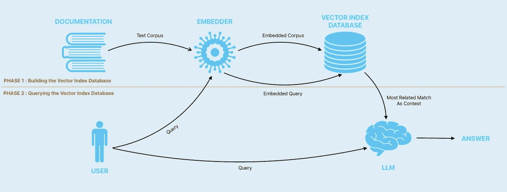
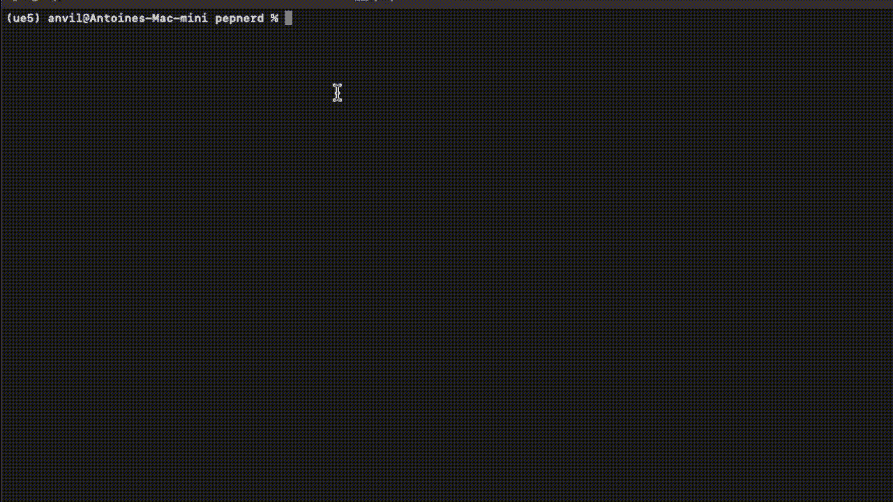

# 如何根据您的数据将领域特定知识添加到 LLM

> 原文：[`towardsdatascience.com/how-to-add-domain-specific-knowledge-to-an-llm-based-on-your-data-884a5f6a13ca`](https://towardsdatascience.com/how-to-add-domain-specific-knowledge-to-an-llm-based-on-your-data-884a5f6a13ca)

## 将你的 LLM 转变为领域专家

[](https://medium.com/@villatteantoine?source=post_page-----884a5f6a13ca--------------------------------)[](https://towardsdatascience.com/?source=post_page-----884a5f6a13ca--------------------------------) [Antoine Villatte](https://medium.com/@villatteantoine?source=post_page-----884a5f6a13ca--------------------------------)

·发表于 [Towards Data Science](https://towardsdatascience.com/?source=post_page-----884a5f6a13ca--------------------------------) ·7 分钟阅读·2023 年 7 月 11 日

--


由 [Hubi's Tavern](https://unsplash.com/fr/@hubistavern?utm_source=medium&utm_medium=referral) 在 [Unsplash](https://unsplash.com/?utm_source=medium&utm_medium=referral) 提供的照片

# 介绍

近年来，大型语言模型（LLMs）已经深刻改变了我们与技术的工作和互动方式，并且在各种领域中被证明是有用的工具，充当写作助手、代码生成器，甚至是创造性合作伙伴。它们理解上下文、生成类似人类的文本以及执行广泛的语言相关任务的能力使其成为人工智能研究的前沿。

虽然大型语言模型（LLMs）在生成通用文本方面表现优异，但当面对需要精确知识和细致理解的高度专业领域时，它们往往表现得较差。在用于特定领域任务时，这些模型可能会表现出局限性，甚至在某些情况下产生错误或虚假的回答。这突显了将领域知识融入 LLMs 的必要性，使其能够更好地应对复杂的行业术语，展示更细致的上下文理解，并减少生成虚假信息的风险。

在这篇文章中，我们将探讨将领域知识注入 LLMs 的几种策略和技术之一，使其在特定专业环境中表现最佳，通过将文档片段作为上下文添加到 LLM 中来注入查询。

***该方法适用于任何类型的文档，仅使用安全的开源技术，这些技术将在你的计算机上本地运行，无需访问互联网。借助这一点，我可以在个人和机密数据上使用它，而不必担心第三方网站的访问。***

# 原理

这是如何工作的详细说明：



过程的图解。图像由作者提供。

第一步是拿到我们的文档，并基于这些文档构建一个向量索引数据库。

向量数据库是一种旨在高效存储和查询高维向量的数据库。这些数据库支持快速的相似性和语义搜索，同时允许用户根据某些距离度量找到与给定查询向量最接近的向量，而不是像传统的 OLTP 和 OLAP 数据库那样对行和列中的值进行查询。

这意味着我们可以创建表示任何文档的嵌入，并用它来填充数据库。

然后，一旦构建完成，我们可以执行一个查询，该查询也将被嵌入，并注入到向量索引数据库中，这样将返回与我们的查询最相关的文档片段。

最后，这些向量可以作为上下文注入到本地 LLM 中，与我们原始的查询一起。这种方式下，选择的上下文将足够小，以被大多数 LLM 接受，并且由于与我们的查询相关，模型将拥有足够的知识来准确回答问题。一点点提示工程也会有所帮助。

# 案例示例和代码库

在这篇文章中，我们将使用一个本地的开源 LLM，并注入所有 Python 增强提案（PEPs）的领域知识。这一原则可以应用于任何文档类型，但我将使用 PEP，因为它易于获取且属于公共领域，这使它成为一个理想的示例数据集。

你可以在这个代码库中找到我用于撰写这篇文章的完整代码：

[`github.com/Anvil-Late/knowledge_llm/tree/main`](https://github.com/Anvil-Late/knowledge_llm/tree/main)

[](https://github.com/Anvil-Late/knowledge_llm?source=post_page-----884a5f6a13ca--------------------------------) [## GitHub - Anvil-Late/knowledge_llm: 向 LLM 添加领域知识的指南

### 向 LLM 添加领域知识的指南。通过创建一个帐户来为 Anvil-Late/knowledge_llm 的开发做贡献…

[github.com](https://github.com/Anvil-Late/knowledge_llm?source=post_page-----884a5f6a13ca--------------------------------)

# 结果的快速预览

结果的展示样例



查询被处理和回答的示例。图像由作者提供。

# 如何安装 LLM

如果你的计算机上没有安装 LLM，你可以在这里找到如何安装的逐步指南：

[`medium.com/better-programming/how-to-run-your-personal-chatgpt-like-model-locally-505c093924bc`](https://medium.com/better-programming/how-to-run-your-personal-chatgpt-like-model-locally-505c093924bc)

[](https://betterprogramming.pub/how-to-run-your-personal-chatgpt-like-model-locally-505c093924bc?source=post_page-----884a5f6a13ca--------------------------------) [## [GPT 教程] 如何在本地运行您的个人 ChatGPT 类模型

### 您自己的个人 AI 助手

betterprogramming.pub](https://betterprogramming.pub/how-to-run-your-personal-chatgpt-like-model-locally-505c093924bc?source=post_page-----884a5f6a13ca--------------------------------)

# 如何构建和查询向量索引数据库

您可以在这个仓库中找到构建向量索引数据库的完整代码：

[`github.com/Anvil-Late/knowledge_llm/tree/main`](https://github.com/Anvil-Late/knowledge_llm/tree/main)

广义而言，在 src 文件夹中：

+   parse.py 创建 PEP 语料库

+   embed.py 创建嵌入的语料库

+   您可以拉取 Qdrant 向量索引数据库的 Docker 镜像，并使用 `docker pull qdrant/qdrant` 命令运行它

    `docker run -d -p 6333:6333 qdrant/qdrant`

+   create_index.py 创建并填充向量索引数据库

+   query_index.py 嵌入一个查询并检索最相关的文档

如果您需要更多细节，您可以在这里找到我的逐步指南：

[`betterprogramming.pub/efficiently-navigate-massive-documentations-ai-powered-natural-language-queries-for-knowledge-372f4711a7c8`](https://betterprogramming.pub/efficiently-navigate-massive-documentations-ai-powered-natural-language-queries-for-knowledge-372f4711a7c8)

[](https://betterprogramming.pub/efficiently-navigate-massive-documentations-ai-powered-natural-language-queries-for-knowledge-372f4711a7c8?source=post_page-----884a5f6a13ca--------------------------------) [## 基于 AI 的文档搜索 — 使用自然语言查询导航您的数据库

### 高效文档导航

betterprogramming.pub](https://betterprogramming.pub/efficiently-navigate-massive-documentations-ai-powered-natural-language-queries-for-knowledge-372f4711a7c8?source=post_page-----884a5f6a13ca--------------------------------)

# 将所有内容结合起来

首先，我们将编写一个生成 LLM 提示的脚本：

```py
import os
from query_index import DocSearch
import logging
import re
from utils.parse_tools import remove_tabbed_lines
logging.disable(logging.INFO)

def set_global_logging_level(level=logging.ERROR, prefices=[""]):
    """
    Override logging levels of different modules based on their name as a prefix.
    It needs to be invoked after the modules have been loaded so that their loggers have been initialized.

    Args:
        - level: desired level. e.g. logging.INFO. Optional. Default is logging.ERROR
        - prefices: list of one or more str prefices to match (e.g. ["transformers", "torch"]). Optional.
          Default is `[""]` to match all active loggers.
          The match is a case-sensitive `module_name.startswith(prefix)`
    """
    prefix_re = re.compile(fr'^(?:{ "|".join(prefices) })')
    for name in logging.root.manager.loggerDict:
        if re.match(prefix_re, name):
            logging.getLogger(name).setLevel(level)

def main(
    query,
    embedder = "instructor",
    top_k = None, 
    block_types = None, 
    score = False, 
    open_url = True,
    print_output = True
    ):

    # Set up query
    query_machine = DocSearch(
        embedder=embedder,
        top_k=top_k,
        block_types=block_types,
        score=score,
        open_url=open_url,
        print_output=print_output
    )

    query_output = query_machine(query)

    # Generate prompt
    prompt = f"""
Below is an relevant documentation and a query. Write a response that appropriately completes the query based on the relevant documentation provided.

Relevant documentation: {remove_tabbed_lines(query_output)}

Query: {query}

Response: Here's the answer to your query:"""

    print(prompt)
    return prompt

if __name__ == '__main__':
    set_global_logging_level(logging.ERROR, ["transformers", "nlp", "torch", "tensorflow", "tensorboard", "wandb"])
    import argparse
    parser = argparse.ArgumentParser()
    parser.add_argument('--query', type=str, default=None)
    parser.add_argument('--top_k', type=int, default=5)
    parser.add_argument('--block_types', type=str, default='text')
    parser.add_argument('--score', type=bool, default=False)
    parser.add_argument('--open_url', type=bool, default=False)
    parser.add_argument('--embedder', type=str, default='instructor')
    parser.add_argument('--print_output', type=bool, default=False)
    args = parser.parse_args()
    main(**vars(args))
```

`logging.disable(logging.INFO)` 和 `set_global_logging_level` 可以防止代码执行过程中打印过多内容，因为该脚本打印的所有内容都会被捕获。

我们将这个提示生成与提示注入结合起来，使用以下 bash 脚本：

```py
#!/bin/bash

# Get the query from the command-line argument
query="$1"

# Launch prompt generation script with argument --query
if ! prompt=$(python src/query_llm.py --query "$query" --top_k 1); then
    echo "Error running query_llm.py"
    exit 1
fi

# Run the terminal command
<PATH_TO_LLAMA.CPP>/main \
    -t 8 \
    -m <PATH_TO_LLAMA.CPP>/models/Wizard-Vicuna-13B-Uncensored.ggmlv3.q4_0.bin \
    --color \
    -c 4000 \
    --temp 0.1 \
    --repeat_penalty 1.1 \
    -n -1 \
    -p "$prompt" \
    -ngl 1 
```

这里发生的情况是，提示生成脚本打印出提示，bash 脚本将其捕获到 `$prompt` 变量中，然后在 llama.cpp `./main` 命令中使用 `-p`（或 `--prompt`）参数。

然后 LLM 将接管并完成提示，从‘Response: Here’s the answer to your query:’开始。

记得将 `<PATH_TO_LLAMA.CPP>` 替换为你计算机上 llama.cpp 克隆的路径，将 `Wizard-Vicuna-13B-Uncensored.ggmlv3.q4_0.bin` 替换为你的 LLM。我个人选择了这个，因为它给了我很好的结果，并且没有受到限制性许可证的约束，但你可以尝试其他模型！

# 结论

让我们回顾一下我们在这里完成的工作：

在本文中，我们深入探讨了一种有效的策略，通过将领域知识注入 LLM 来增强其能力。尽管 LLM 在各种任务中表现出色，但它们在面对需要精确知识和细致理解的高度专业化领域时，往往会遇到困难。

为了解决这些局限性，我们探索了一种方法，将领域特定的文档纳入 LLM。通过基于文档构建一个向量索引数据库，我们建立了一个高效的相似性和语义搜索基础。这使我们能够识别出与特定查询最相关的文档，然后将其注入本地 LLM 作为上下文。

我们所提出的方法通过使用 Python 增强程序（PEPs）作为代表性数据集来进行示例。然而，值得注意的是，这种方法适用于任何形式的文档。本文中提供的代码片段和仓库作为实际演示，展示了实施过程。

按照 outlined steps，用户可以提升 LLM 在特定专业环境中的表现，使模型能够处理复杂的行业术语并生成更准确的响应。此外，所使用的安全和开源技术确保了这一过程可以在本地执行，无需外部互联网依赖，从而保护隐私和机密性。

总之，将领域知识融入 LLM（大语言模型）中，使这些模型能够在专业任务中表现出色，因为它们对其操作的背景有了更深入的理解。这种方法的影响跨越了不同领域，使 LLM 能够提供量身定制的宝贵帮助和见解。通过利用 LLM 和领域专业知识的潜力，我们为提升人类与 AI 的互动以及在专业领域利用人工智能的力量打开了新的可能性。

# 感谢阅读！

如果你有任何问题，请不要犹豫，留下评论，我会尽力回答！

***如果你喜欢这个内容，你也可以通过我的推荐链接直接在 Medium 上支持我的工作，并成为会员以获得无限制访问*** [***这里***](https://medium.com/@villatteantoine/membership) ***:)***
