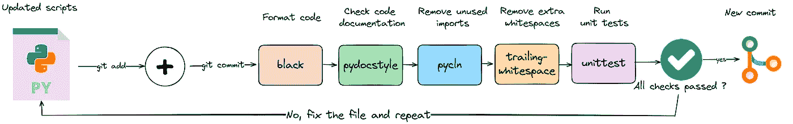
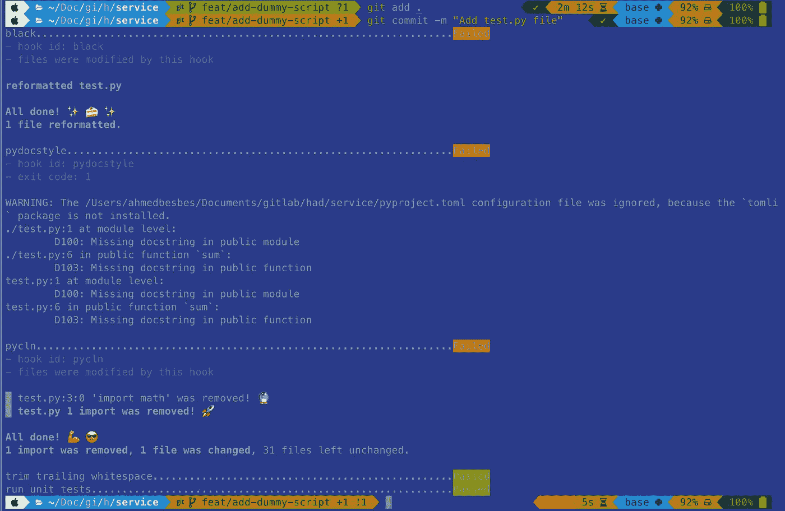
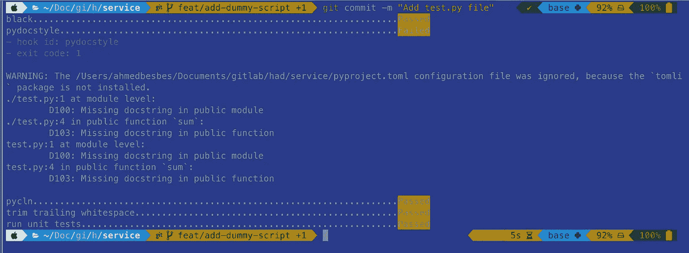
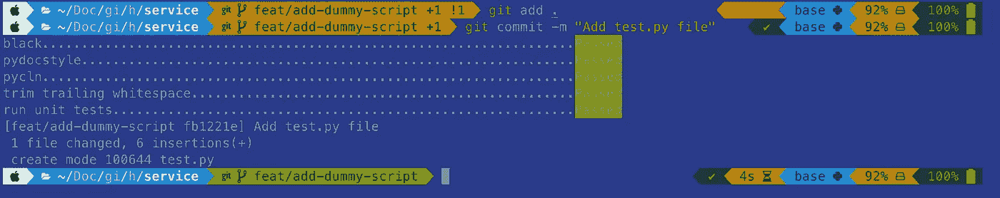

# 如何通过 Python 预提交钩子提升代码质量？

> 原文：[`towardsdatascience.com/how-to-automate-code-quality-with-python-pre-commit-hooks-e550debbd62e`](https://towardsdatascience.com/how-to-automate-code-quality-with-python-pre-commit-hooks-e550debbd62e)

## 安心提交你的代码

[](https://ahmedbesbes.medium.com/?source=post_page-----e550debbd62e--------------------------------)[](https://towardsdatascience.com/?source=post_page-----e550debbd62e--------------------------------) [Ahmed Besbes](https://ahmedbesbes.medium.com/?source=post_page-----e550debbd62e--------------------------------)

·发布于 [Towards Data Science](https://towardsdatascience.com/?source=post_page-----e550debbd62e--------------------------------) ·7 分钟阅读·2023 年 7 月 22 日

--


[Roman Synkevych](https://unsplash.com/@synkevych?utm_source=medium&utm_medium=referral) 的照片，来自 [Unsplash](https://unsplash.com/?utm_source=medium&utm_medium=referral)

如果你是 Python 开发者，你可能经常遇到团队成员有不同的编码风格，这使得代码库不一致。因此，**这会导致错误，降低生产力**，并且**使合作变得困难**。

作为一个努力保持代码质量的人，我知道这种情况有多么痛苦。

👉 幸运的是，有一个解决方案可以解决这个问题：**预提交钩子**。

预提交钩子是提交代码到版本控制系统之前运行的脚本或工具。它们可以自动格式化你的代码，运行测试，检查 lint 错误等等。

我开始在个人和专业项目中使用预提交钩子。它们帮助我早期发现并修复潜在问题，确保我的代码始终干净和一致。此外，它们通过自动化重复任务为我节省了大量时间和精力。

> 在***这篇实用的博客文章中，我们将深入探讨这个话题。我们将探索如何设置预提交钩子，定制它们以满足你的需求，并将它们整合到你的开发工作流中。***

如果你是一个希望提升团队代码质量和生产力的 Python 开发者，这篇文章适合你。

所以，事不宜迟，让我们来看看 🔍

# 预提交：它们如何融入 Git 工作流

预提交钩子是自动运行的脚本，在每次提交之前检查你的代码是否有错误。这些钩子是语言无关的，帮助在提交到仓库之前捕捉问题，确保只有高质量的代码被提交。

以下图示展示了一个包含预提交钩子的 git 工作流程：当您执行 `git commit` 命令时，这些脚本会被触发。执行完成后，最后一步会验证所有检查是否通过。



我个人项目的预提交配置

+   ✅ 如果预提交检查未通过，您需要在代码库中进行迭代，并相应地提供修复。

+   ❌ 如果预提交检查通过，您的代码将成功提交

# 在 Python 项目中设置和配置预提交钩子

要在 Python 项目中开始使用预提交，首先需要安装它。您可以使用 Python 包管理器 pip 来完成这一操作。在终端中运行以下命令：

```py
pip install pre-commit
```

安装完预提交后，您需要在项目的根目录中设置一个名为 `.pre-commit-config.yaml` 的配置文件。此文件将指定预提交应该使用哪些钩子。

以下是我在 `.pre-commit-config.yaml` 文件中使用的配置：

```py
repos:
-   repo: https://github.com/pre-commit/pre-commit-hooks
    rev: v3.4.0
    hooks:
    -   id: trailing-whitespace
    -   id: check-yaml
    -   id: end-of-file-fixer
```

在此配置中，我们使用了来自预提交钩子 [repository](https://github.com/pre-commit/pre-commit-hooks)（一个包含一些开箱即用钩子的库）中的三个钩子 `trailing-whitespace`、`check-yaml` 和 `end-of-file-fixer`。

+   `trailing-whitespace`修剪尾随空白字符

+   `check-yaml` 检查 YAML 文件是否格式正确

+   `end-of-file-fixer` 确保文件以换行符结束，并且仅以换行符结束

设置完配置文件后，您需要安装 git 钩子。在终端中运行以下命令：

```py
pre-commit install
```

现在，预提交将在 `git commit` 时自动运行。如果配置文件中的任何钩子失败，提交将被中止。

记住，您可以自定义 `.pre-commit-config.yaml` 文件，以包括与您的项目相关的任何钩子。虽然有许多现成的钩子可用，但如果需要，您也可以创建自己的钩子。

# 一些常见的 Python 预提交钩子

有许多现成的钩子可以帮助提升您的 Python 代码质量。以下是一些常见的：

1 — `black` : 这是一个 Python 代码格式化工具。它会自动格式化您的代码，使其更具可读性和一致性。以下是如何将它添加到 `.pre-commit-config.yaml` 文件中：

```py
repos:
-   repo: https://github.com/psf/black
    rev: '23.1.0'
    hooks:
    -   id: black
```

2 — `flake8` : 这是一个用于强制执行 Python 编码标准的工具。它会检查您的代码是否符合 PEP8（Python 的官方风格指南），同时也会查找逻辑错误。以下是如何添加它：

```py
repos:
-   repo: https://gitlab.com/pycqa/flake8
    rev: 3.9.2
    hooks:
    -   id: flake8
```

3 — `isort` : 这个工具会自动排序和格式化您的 Python 导入。以下是如何添加它：

```py
repos:
-   repo: https://github.com/pycqa/isort
    rev: 5.8.0
    hooks:
    -   id: isort
```

4 — `mypy` : 这是一个用于 Python 的静态类型检查器。它有助于在代码运行之前捕捉某些类型的错误。以下是如何添加它：

```py
repos:
-   repo: https://github.com/pre-commit/mirrors-mypy
    rev: v0.812
    hooks:
    -   id: mypy
```

5 — `pycln` : 这是一个帮助查找和删除未使用的导入语句的工具

```py
repos:
-   repo: https://github.com/hadialqattan/pycln
    rev: 'v2.1.5'
    hooks:
    -   id: pycln
        args: ['.', "--all"]
```

6 — `pydocstyle` : 这是一个静态分析工具，用于检查是否符合 Python docstring 规范。

```py
repos:
-   repo: https://github.com/pycqa/pydocstyle
    rev: '6.3.0'
    hooks:
    -   id: pydocstyle
        args: ['.']
```

7 — 运行 **单元测试** 的自定义钩子：你可以指定一个自定义命令，在每次提交时触发，而不是引用外部仓库。在这个示例中，我们运行单元测试。这可能会引入一个轻微的开销，具体取决于你的测试套件。

```py
 -   repo: local
    hooks:
    -   id: unittest
        name: run unit tests
        language: system
        pass_filenames: false
        entry: poetry run coverage run -m pytest
```

这些只是许多可用于 Python 的 pre-commit 钩子中的几个示例。有关更多信息，你可以查看这个 [repository](https://github.com/pre-commit/pre-commit-hooks) 或添加你自定义的质量代码检查。

# 如何运行 pre-commit 钩子并修复代码库

在这一部分，我将与你分享我在个人项目中使用的 pre-commit 配置。然后，我将展示它如何在实践中工作，并防止潜在的错误。

首先，这是我的配置：

```py
repos:
-   repo: https://github.com/psf/black
    rev: '23.1.0'
    hooks:
    -   id: black
        args: [--config=pyproject.toml]

-   repo: https://github.com/pycqa/pydocstyle
    rev: '6.3.0'
    hooks:
    -   id: pydocstyle
        args: ['.']

-   repo: https://github.com/hadialqattan/pycln
    rev: 'v2.1.5'
    hooks:
    -   id: pycln
        args: ['.']

-   repo: https://github.com/pre-commit/pre-commit-hooks
    rev: 'v4.4.0'
    hooks:
    -   id: trailing-whitespace

-   repo: local
    hooks:
    -   id: unittest
        name: run unit tests
        language: system
        pass_filenames: false
        entry: poetry run coverage run -m pytest
```

现在我要将以下格式不良的虚拟脚本添加到现有的代码库中：

```py
# dummy_script.py

import math

def sum(a,   b):   
    return a +  b 
```

如你所见，这个脚本有许多问题：

+   未使用的导入语句：`math`

+   无黑色格式化：参数和变量之间有多余的空格

+   许多尾随空格

如果我们添加这个文件并提交代码，我们会从钩子中得到这些错误：



作者截图

+   `black` 失败但自动重新格式化了代码

+   `pydoctyle` 失败并指出了文档缺失的地方

+   `pycln` 失败并自动移除了未使用的导入语句

如果我们添加自动修改过的脚本并再次提交代码，我们会发现除了 `pyodstyle` 钩子外，其他都通过了。



作者截图

在这种情况下，我们必须手动更新文档，

```py
"""This is a dummy script."""

def sum(a, b):
    """Sum two numbers."""
    return a + b
```

添加代码，并提交：



作者截图

现在，你准备好推送你的代码了。

# 观察 pre-commit 对代码质量的影响

pre-commit 对代码质量的影响是显著而多方面的。以下是 pre-commit 可以提升你的 Python 代码质量的几种方式：

1.  **一致的代码格式化**：使用 `black` 和 `isort` 等钩子，你的代码将遵循一致的风格。这使得代码不仅对你自己，更对任何可能参与你项目的其他人来说都更易读和理解。

1.  **早期捕获错误**：像 `flake8` 和 `mypy` 这样的钩子可以在代码运行之前捕获潜在的错误和漏洞。这可以节省你很多后续调试的时间。

1.  **强制最佳实践**：许多钩子强制执行 Python 最佳实践，例如 PEP8 合规性。这可以帮助你编写更清晰、更高效的代码。

1.  **运行单元测试**：pre-commits 允许你在本地运行单元测试并检查它们是否成功，然后再推送你的代码。这可以防止你在 CICD 过程中遇到测试错误。

通过将 pre-commit 集成到你的开发工作流中，你可以确保你的代码始终保持最高质量。这是一个可以在长远中节省时间、精力和潜在很多麻烦的工具。

# 结论

pre-commit 是一个强大的工具，可以显著提升你的 Python 代码质量。通过自动检查常见问题、执行最佳实践并防止错误提交，pre-commit 可以节省你大量的时间和调试精力。

它很容易集成到你的开发工作流程中，并且高度可定制，让你可以选择最适合你项目需求的钩子。

# 刚刚接触 Medium？你可以每月以 $5 订阅，解锁各种主题的无限文章（技术、设计、创业…）你可以通过点击我的推荐[链接](https://ahmedbesbes.medium.com/membership)来支持我。

[## 使用我的推荐链接加入 Medium - Ahmed Besbes](https://ahmedbesbes.medium.com/membership?source=post_page-----e550debbd62e--------------------------------)

### 作为 Medium 会员，你的部分会费将分配给你阅读的作者，同时你可以全面访问每一篇文章…

[ahmedbesbes.medium.com](https://ahmedbesbes.medium.com/membership?source=post_page-----e550debbd62e--------------------------------)

# 资源

+   [`pre-commit.com/`](https://pre-commit.com/)

+   [`github.com/pre-commit/pre-commit/`](https://github.com/pre-commit/pre-commit/)

+   [`www.youtube.com/watch?v=psjz6rwzMdk&ab_channel=mCoding`](https://www.youtube.com/watch?v=psjz6rwzMdk&ab_channel=mCoding)
