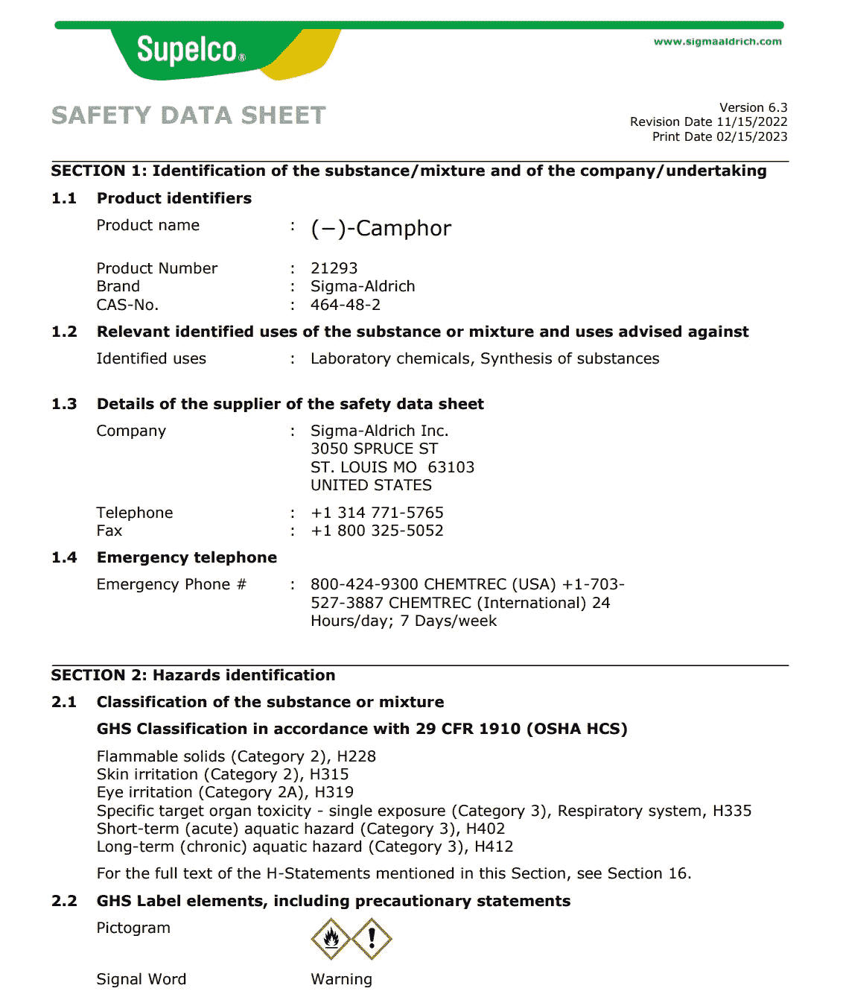
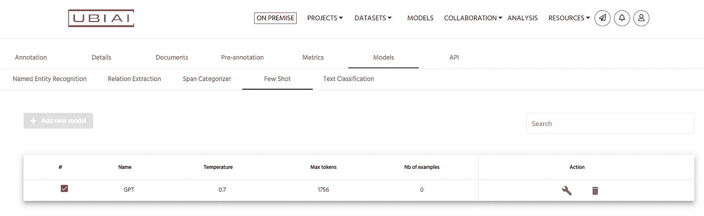
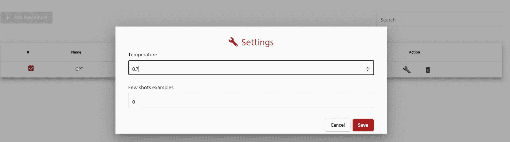
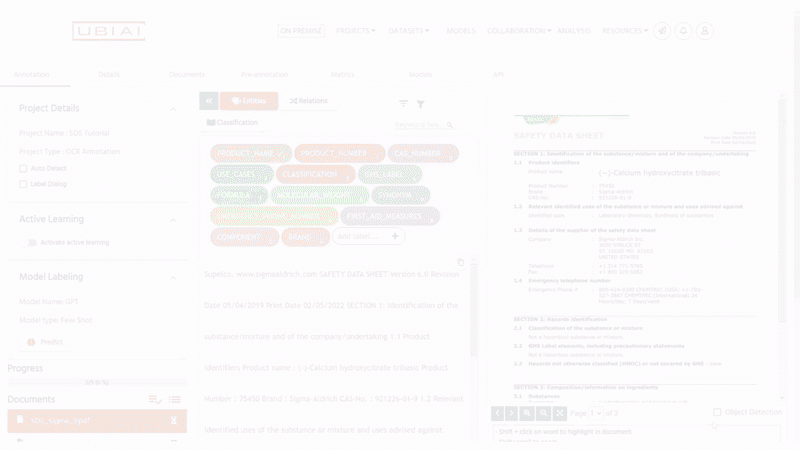

# 如何使用 LLMs 自动提取 PDF 中的实体

> 原文：[`towardsdatascience.com/how-to-automate-entity-extraction-from-pdf-using-llms-ea9c1351f531`](https://towardsdatascience.com/how-to-automate-entity-extraction-from-pdf-using-llms-ea9c1351f531)

## 利用零样本标注

 [Walid Amamou](https://walidamamou.medium.com/?source=post_page-----ea9c1351f531--------------------------------)

·发表于[Towards Data Science](https://towardsdatascience.com/?source=post_page-----ea9c1351f531--------------------------------) ·阅读时间 5 分钟·2023 年 6 月 15 日

--

由[Google DeepMind](https://unsplash.com/@deepmind?utm_source=unsplash&utm_medium=referral&utm_content=creditCopyText)拍摄，[Unsplash](https://unsplash.com/s/photos/large-language-AI?utm_source=unsplash&utm_medium=referral&utm_content=creditCopyText)提供

在现代机器学习应用中，高质量标注数据的重要性不容忽视。从提升模型性能到确保公平性，标注数据的力量巨大。然而，创建这样的数据集所需的时间和精力同样不容小觑。但是，如果我们能够将这一任务所需的时间从几天缩短到仅仅几个小时，同时保持甚至提高标注质量呢？这是一个乌托邦式的梦想？不再是。

机器学习中的新兴范式——零样本学习、少样本学习和模型辅助标注——为这一关键过程提供了变革性的方法。这些技术利用先进算法的力量，减少了对大量标注数据集的需求，实现了更快、更高效且极具效果的数据注释。

在本教程中，我们将介绍一种利用大型语言模型（LLM）上下文学习能力自动标注非结构化和半结构化文档的方法。

# 从 SDS 中提取信息

与传统的需要大量标注数据以训练特定任务的监督模型不同，LLMs 可以通过利用其庞大的知识库，从少量示例中进行概括和推断。这种新兴的能力，被称为上下文学习，使得 LLM 成为许多任务的多功能选择，涵盖了不仅仅是文本生成，还包括命名实体识别等数据提取任务。

在本教程中，我们将使用 GPT 3.5（也称为 ChatGPT）的零样本和少样本标注功能，对来自不同公司的安全数据表（SDS）进行标注。SDS 提供了关于特定物质或混合物的全面信息，旨在帮助工作场所有效管理化学品。这些文件在提供有关危害的详细见解方面发挥着至关重要的作用，包括环境风险，并提供宝贵的安全防护指导。SDS 作为知识的重要来源，使员工能够在工作场所安全处理和使用化学品时做出明智的决策。SDS 通常以不同布局的 PDF 格式出现，但通常包含相同的信息。在本教程中，我们的目标是训练一个 AI 模型，自动识别以下实体：

+   产品编号

+   CAS 号

+   用例

+   分类

+   GHS 标签

+   公式

+   分子量

+   同义词

+   紧急联系电话

+   急救措施

+   组件

+   品牌

提取这些相关信息并将其存储在可搜索的数据库中对许多公司非常有价值，因为它允许快速搜索和检索危险成分。以下是一个 SDS 的示例：

公开可用的 SDS。图片由作者提供

# 零样本标注

与文本生成不同，信息提取对 LLM 来说是一个更具挑战性的任务。LLM 已经接受了文本补全任务的训练，通常在被提示提取相关信息时，倾向于出现幻觉或生成额外的评论或文本。

为了正确解析 LLM 的结果，我们需要从 LLM 获得一致的输出，如 JSON。这需要一些提示工程以确保准确。此外，一旦结果被解析，我们需要将其映射到输入文本中的原始标记。

幸运的是，所有这些步骤都已经完成，并通过[UBIAI 标注工具](https://ubiai.tools)进行了抽象化。在后台，UBIAI 进行提示、分块数据以确保在上下文长度限制内，并将其发送到 OpenAI 的 GPT3.5 Turbo API 进行推断。一旦输出返回，数据将被解析、处理并应用到您的文档中进行自动标注。

首先，上传您的文档，无论是原生 PDF、图片还是简单的 Docx，然后进入标注页面，选择标注界面中的 Few-shot 选项卡：

UBIAI 少样本仪表板。图片由作者提供

欲了解更多详细信息，请查看文档：[`ubiai.gitbook.io/ubiai-documentation/zero-shot-and-few-shot-labeling`](https://ubiai.gitbook.io/ubiai-documentation/zero-shot-and-few-shot-labeling)

UBIAI 使您能够配置模型学习的示例数量，以自动标记下一个文档。该应用程序会自动从您已经标记的数据集中选择最具信息量的文档，并将它们串联在提示中。这种方法被称为“少量示例标记”，其中“少量”范围从 0 到 n。要配置示例数量，只需点击配置按钮并输入示例数量，如下所示。

UBIAI 少量示例配置窗口。图像来源：作者

在本教程中，我们将向 LLM 提供零个示例来学习，并要求它仅根据实体本身的描述来标记数据。令人惊讶的是，LLM 能够很好地理解我们的文档，并正确完成大部分标记！

以下是对 SDS PDF 进行零-shot 标记的结果，没有任何示例，非常令人印象深刻！

使用 UBIAI 进行零-shot 标记。图像来源：作者

# 结论

利用大型语言模型（LLMs）自动从 PDF 中提取实体已经成为现实，得益于 LLM 的上下文学习能力，例如零-shot 学习和少量示例学习。这些技术利用 LLM 的潜在知识，减少对大量标记数据集的依赖，实现更快、更高效且效果显著的数据注释。

本教程展示了一种自动标记半结构化文档的方法，特别关注于安全数据表（SDS），但也适用于非结构化文本。通过利用 LLM 的上下文学习能力，特别是 GPT 3.5（chatGPT），教程展示了能够自动识别 SDS 中的重要实体，例如产品编号、CAS 号、使用案例、分类、GHS 标签等。

提取的信息，如果存储在可搜索的数据库中，将为公司提供重大价值，因为它允许快速搜索和检索危险成分。教程强调了零-shot 标记的潜力，其中 LLM 可以理解并从 SDS 中提取信息，而无需任何明确的示例。这展示了 LLM 的多功能性和泛化能力，超越了文本生成任务。

如果您有兴趣使用 LLM 的零-shot 能力创建自己的训练数据集，请[点击这里](https://calendly.com/ubiai/ubiai-demo)安排演示。

在 Twitter 上关注我们 [@UBIAI5](http://twitter.com/UBIAI5)！
