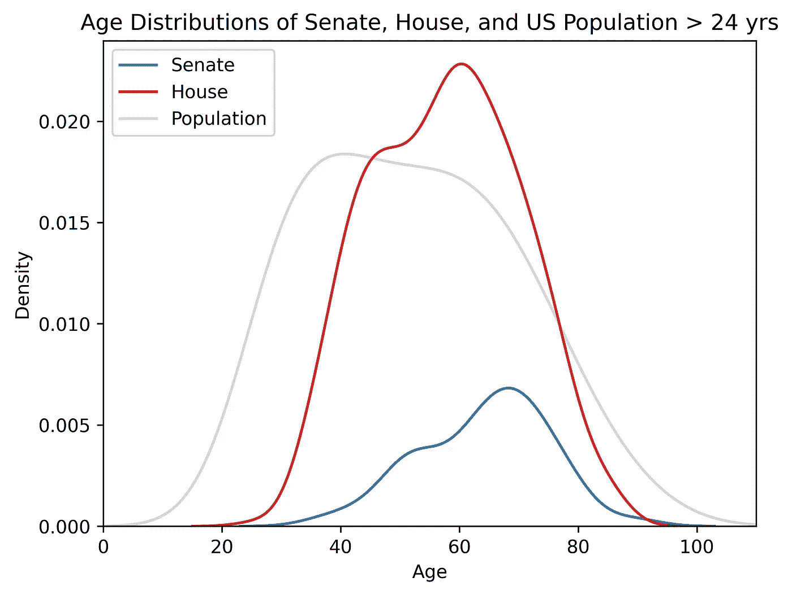
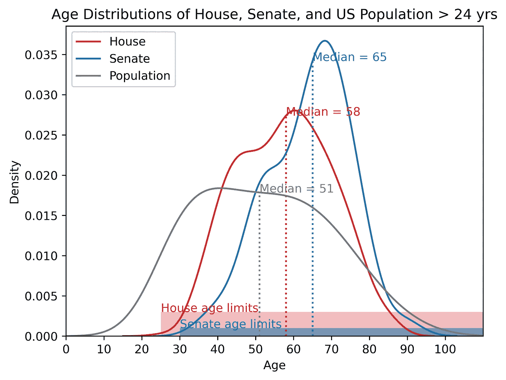

# 如何自动提取和标记 Seaborn KDE 图上的数据点

> 原文：[`towardsdatascience.com/how-to-automatically-extract-and-label-data-points-on-a-seaborn-kde-plot-52a576238301`](https://towardsdatascience.com/how-to-automatically-extract-and-label-data-points-on-a-seaborn-kde-plot-52a576238301)

[](https://medium.com/@lee_vaughan?source=post_page-----52a576238301--------------------------------)[](https://towardsdatascience.com/?source=post_page-----52a576238301--------------------------------) [Lee Vaughan](https://medium.com/@lee_vaughan?source=post_page-----52a576238301--------------------------------)

·发表于 [Towards Data Science](https://towardsdatascience.com/?source=post_page-----52a576238301--------------------------------) ·8 分钟阅读·2023 年 9 月 5 日

--


DALL·E 2023——一幅印象派风格的山脉起伏画作，山脊线上带有明亮的彩色圆圈（其余图片均由作者提供）。

*核密度估计图* 是一种方法——类似于直方图——用于可视化数据点的分布。虽然直方图*对观测值进行分箱和计数*，但 KDE 图*使用高斯核*平滑观测值。作为直方图的替代方案，KDE 图可能更具吸引力，更易于在同一图形中进行比较，并且更好地突出数据分布中的模式。


直方图与 KDE 图

在 KDE 图上注释统计度量值如均值、中位数或众数，使其更具意义。虽然为这些度量值添加线条是*简单*的，但使它们看起来整洁且不杂乱却并非易事。


使用简单方法添加的标记线（左）与使用更复杂但更具吸引力的方法（右）

在这个*快速成功数据科学*项目中，我们将使用美国人口普查和国会数据集，程序化地注释多个 KDE 图并标记*中位数值*。这种方法将确保图形注释*自动*调整数据集的更新。

欲了解有关 KDE 图的更多细节，请参见我之前的文章 [这里](https://medium.com/towards-data-science/when-are-songwriters-most-successful-9fdf90708e77)。

# 数据集

由于美国有[*候选年龄*](https://en.wikipedia.org/wiki/Age_of_candidacy)法律，国会成员的生日是公共记录的一部分。为了方便起见，我已编制了一份包含现任国会成员姓名、生日、政府部门和政党的 CSV 文件，并将其存储在此[Gist](https://gist.github.com/rlvaugh/35069885b74ca52a63aab217863440e0)中。

对于美国人口，我们将使用人口普查局的[*月度后普查平民人口*](https://www.census.gov/data/tables/time-series/demo/popest/2020s-national-detail.html)表格，数据截止到 2023 年 7 月。与前面的数据集一样，这些是公开信息，我已将其保存到此[Gist](https://gist.github.com/rlvaugh/51bcfe65693183da26c38a41402f9094)的 CSV 文件中。

# 安装库

对于这个项目，我们需要安装 seaborn 用于绘图，pandas 用于数据分析。你可以按以下方式安装这些库：

使用 conda: `conda install pandas seaborn`

使用 pip: `pip install pandas seaborn`

# 代码

以下代码在 JuptyerLab 中编写，并按*单元格*描述。

## 导入库

从 seaborn KDE 图中提取值的秘诀是导入 matplotlib 的`[Line2D](https://matplotlib.org/stable/api/_as_gen/matplotlib.lines.Line2D.html)`类，这使我们可以访问曲线上的点坐标。此外，我们将使用 matplotlib 的`[patches](https://matplotlib.org/stable/api/_as_gen/matplotlib.patches.Patch.html)`绘制矩形，以标示出众议院和参议院的合法年龄限制。`patch`是一个具有*面色*和*边缘颜色*的 matplotlib `artist`对象。

```py
import numpy as np
import matplotlib.pyplot as plt
from matplotlib.lines import Line2D
from matplotlib.patches import Rectangle
import seaborn as sns
import pandas as pd
```

## 加载国会数据集并计算年龄

以下代码加载国会数据集并计算每位成员截至 2023 年 8 月 25 日的年龄。它首先将参考日期和数据框的“生日”列转换为`datetime`格式，使用 pandas 的`to_datetime()`方法。然后利用这些“日期感知”格式生成“年龄”列，通过减去两个值、提取天数，然后将天数除以 365.25 转换为年份。

```py
# Load the data:
df = pd.read_csv('https://bit.ly/3EdQrai')

# Assign the current date:
current_date = pd.to_datetime('8/25/2023')

# Convert "Birthday" column to datetime:
df['Birthday'] = pd.to_datetime(df['Birthday'])

# Make a new "Age" column in years:
df['Age'] = ((current_date - df['Birthday']).dt.days) / 365.25
df['Age'] = df['Age'].astype(int)

df.head(3)
```


## 加载人口数据集

接下来，我们将人口数据加载为 pandas DataFrame。

```py
# Load the US population data for July 2023:
df_popl = pd.read_csv('https://bit.ly/3Po0Syf').astype(int)
display(df_popl)
```


## 计算美国人口的中位年龄

这是一个有趣的问题。你如何找到美国人口的中位年龄？也就是说，你如何将中位人口值与年龄关联起来？

关键是将人口的*累计分布*绘制与*年龄*进行对比。由于你必须年满 25 岁或以上才能在国会服务，我们首先将数据框过滤到这些年龄。这里是这个概念：


使用累计分布图找到美国人口中年龄大于 24 岁的中位年龄

这是带有注释的代码：

```py
# Calculate the cumulative sum of the population over 24 years:
df_popl = df_popl[df_popl['Age'] >= 25].copy()
df_popl['Cumulative_Population'] = df_popl['Population'].cumsum()

# Find the total population:
total_population = df_popl['Population'].sum()

# Find row where the cumulative population crosses half the total population:
median_row = df_popl[df_popl['Cumulative_Population'] 
                     >= total_population / 2].iloc[0]

# Get the median age:
popl_median_age = median_row['Age']

# Get the median population:
popl_median = total_population / 2
```

## 制作一个简单的堆叠 KDE 图

在我们注释图表之前，让我们看看“开箱即用”的效果如何。我们将在同一图形中分层多个 KDE 图。这些包括众议院一个、参议院一个，以及一个针对 24 岁以上美国人口的图。

```py
# Make a list of median member ages by branch of government:
median_ages = df.groupby('Branch')['Age'].median()

# Make a custom (red-blue-gray) color palette (optional):
colors = ['#d62728', '#1f77b4', '#7f7f7f']
sns.set_palette(sns.color_palette(colors))

# Plot Congressional ages as a KDE and overlay with population KDE:
fig, ax = plt.subplots()

sns.kdeplot(data=df, 
            x='Age', 
            hue='Branch', 
            multiple='layer', 
            common_norm=True)

sns.kdeplot(df_popl, 
            x='Age', 
            weights='Population', 
            color='grey', 
            alpha=0.3, 
            legend=False, 
            multiple='layer')

ax.set_title('Age Distributions of Senate, House, and US Population > 24 yrs')
ax.legend(loc='upper left', labels=['Senate', 'House', 'Population'])
ax.set_xlim((0, 110));
```



一个简单的分层 KDE 图

`kdeplot()` 方法的一个重要参数是 `common_norm`，代表“公共归一化”。

> 根据 seaborn 的 [文档](https://seaborn.pydata.org/generated/seaborn.kdeplot.html)，“当 `common_norm` 设置为 `True` 时，所有 KDE 曲线将使用相同的比例进行归一化。这在你想比较不同组的总体分布形状时非常有用。尤其是在你有多个组具有不同样本量或不同值范围时，它确保了曲线在形状上可以直接比较。”

请注意，在这种情况下，归一化仅应用于众议院和参议院曲线，因为人口数据是从不同的 DataFrame 中单独绘制的。这是因为我们需要*加权*年龄数据，以适应我们的人口数据集没有每个人的独特年龄值的情况。

## 寻找众议院和参议院的中位年龄值

尽管前面的图表很吸引人，但它让读者工作过于繁重。x 轴需要更多的分辨率，而且知道均值或中位数值在曲线上的位置会更好。由于两院都包括一些非常年长的成员，这可能会影响均值，因此我们将关注中位数值。

首先，我们需要为每个分支找到中位值（我们之前已经找到了人口中位值）。由于我们希望程序化地找到注释的图表坐标，我们将为每个*分支*创建一个*单独的* DataFrame。这将使得提取曲线数据更容易。

```py
# Filter the DataFrame to each branch of government:
df_house = df.loc[df['Branch'] == 'House'].copy()
df_senate = df.loc[df['Branch'] == 'Senate'].copy()

# Find the median age values for each branch:
median_house = int(df_house['Age'].median())
median_senate = int(df_senate['Age'].median())
```

## 绘制和注释 KDE

以下注释代码绘制并注释了图表。我们的目标是找到曲线上的 (x, y) 坐标，以便我们在绘制线条和发布文本时可以程序化地提供这些坐标。这使得代码能够适应输入数据的任何变化。

那么我们该怎么做呢？当 seaborn 创建一个 KDE 图时，它会返回一个 matplotlib `[axes](https://matplotlib.org/stable/api/axes_api.html)` 对象。这个类型的对象具有一个 `[get_lines()](https://matplotlib.org/stable/api/_as_gen/matplotlib.axes.Axes.get_lines.html)` 方法，返回一个包含该对象的*线段列表*。这些线段是 `[Line2D](https://matplotlib.org/stable/api/_as_gen/matplotlib.lines.Line2D.html)` 对象，具有一个 `get_data()` 方法，该方法以 (x, y) 对的形式返回线数据。因为这些坐标可能不包括我们想要的确切值，我们将使用 NumPy 的 `[interp()](https://numpy.org/doc/stable/reference/generated/numpy.interp.html)` 方法来插值这些值。

```py
# Create figure and title:
fig, ax = plt.subplots()
ax.set_xlim((0, 110))
ax.set_xticks(range(0, 110, 10))
ax.set_title('Age Distributions of House, Senate, and US Population > 24 yrs')

# Define colors and labels:
colors = ['#d62728', '#1f77b4', '#7f7f7f']
labels = ['House', 'Senate', 'Population']

# Loop through the datasets and plot KDE, median lines, and labels:
datasets = [df_house, df_senate]
medians = [median_house, median_senate]

for i, (data, color, label) in enumerate(zip(datasets, colors, labels)):
    sns.kdeplot(data=data, x='Age', color=color, fill=False, label=label)
    x, y = ax.get_lines()[i].get_data()
    f = np.interp(medians[i], x, y)
    ax.vlines(x=medians[i], ymin=0, ymax=f, ls=':', color=color)
    ax.text(x=medians[i], y=f, s=f'Median = {medians[i]}', color=color)

# Make and annotate the population KDE plot:
sns.kdeplot(df_popl, x='Age', weights='Population', color='#7f7f7f', fill=False)
x, y = ax.get_lines()[2].get_data()  # Note that this is the 3rd line([2]).
f = np.interp(popl_median_age, x, y)
ax.vlines(x=popl_median_age, ymin=0, ymax=f, ls=':', color='#7f7f7f')
ax.text(x=popl_median_age, y=f, 
        s=f'Median = {popl_median_age}', color='#7f7f7f')

# Build a custom legend:
legend_handles = [Line2D(xdata=[0, 1], ydata=[0, 1], ls='-', 
                         color=color) for color in colors]
ax.legend(handles=legend_handles, loc='upper left', labels=labels)

# Manually annotate the Age Limit shading:
age_limit_rects = [
    Rectangle((25, 0), 85, 0.003, facecolor='#d62728', alpha=0.3),
    Rectangle((30, 0), 85, 0.001, facecolor='#1f77b4', alpha=0.6)
    ]

for age_rect, label, color in zip(
    age_limit_rects, ['House age limits', 'Senate age limits'], 
    ['#d62728', '#1f77b4']):
    age_rect.set_zorder(0)  # Move rect below other elements.
    ax.add_patch(age_rect)
    ax.text(x=age_rect.get_x(), y=age_rect.get_height(), 
            s=label, color=color)
```



注释过的 KDE 图

在之前的代码中，我们将人口 KDE 图绘制在循环*之外*，因为年龄数据需要按其人口值加权。

我们还*手动*标注了年龄限制的彩色矩形和文本，因为程序化的解决方案不是很吸引人。将这些注释“硬编码”是可以接受的，因为这些信息是*固定的*，不会随着输入数据的变化而改变。

# 总结

在这个项目中，我们通过编程提取了 KDE 曲线上点的(x, y)坐标，并用它们来标注图表。结果是图表看起来更加整洁，其中垂直标记线在与曲线相交时终止，而文本注释从该交点开始。这使得代码更加灵活，因为这些注释会随着输入数据的变化自动更新。

我们还使用了*累积分布*来找到一个 pandas DataFrame 列的中位数值，该值对应于相关列的中位数值。我们必须这样做，因为我们的年龄与人口输入数据已被分箱。

# 谢谢！

感谢阅读，请关注我以获取更多未来的*快速成功数据科学*项目。
