# 如何使用 ChatGPT 构建数据科学作品集网站

> 原文：[`towardsdatascience.com/how-to-build-a-data-science-portfolio-website-with-chatgpt-e57d29badf7f`](https://towardsdatascience.com/how-to-build-a-data-science-portfolio-website-with-chatgpt-e57d29badf7f)

## 利用 AI 的力量创建一个就业准备好的作品集网站

[](https://natassha6789.medium.com/?source=post_page-----e57d29badf7f--------------------------------)[](https://towardsdatascience.com/?source=post_page-----e57d29badf7f--------------------------------) [Natassha Selvaraj](https://natassha6789.medium.com/?source=post_page-----e57d29badf7f--------------------------------)

·发表于[Towards Data Science](https://towardsdatascience.com/?source=post_page-----e57d29badf7f--------------------------------) ·9 分钟阅读·2023 年 7 月 11 日

--


图片来源于 Midjourney

作为一名初级数据科学家，进入这个行业可能会很有挑战性，因为竞争空前激烈。

如果你没有学位或任何正式的资格证书来突出你的专业能力，这一点尤为重要。

我总是建议领域的初学者创建解决问题的数据科学项目，这样你会脱颖而出。

当你构建解决现实问题的数据项目时，你让雇主相信你能够丰富他们的业务并作为数据科学家创造收益。

记住，你正在与拥有硕士学位和博士学位的申请者竞争，因此如果你没有这些学位，你必须在项目建设上具有创意，以便使自己与其他候选人区分开来。

如果你想构建数据科学项目但不知道从哪里开始，我建议查看[这篇](https://towardsdatascience.com/5-of-my-best-data-science-portfolio-projects-8cd7f81f1b1)文章，我在其中介绍了一些帮助我进入该领域的最佳项目。

我很乐意你能采纳一些这些想法，并将它们改造为你自己的项目。

# 为什么要构建数据科学作品集网站

一旦你完成了 2 到 3 个数据科学项目，我强烈建议创建一个网站，将所有的作品集中在一个地方展示。

实际上，我通过简单地给招聘人员发消息并发送我的作品集网站链接获得了我的前几个数据科学职位：

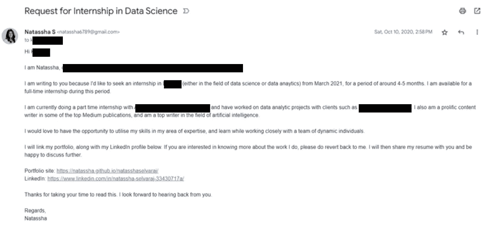

图片由作者提供

你的作品集网站是一个可以向潜在雇主展示你是谁以及你能带来什么的地方。

招聘经理不必通过你的 GitHub 仓库查看代码来了解你做过的工作，他们可以直接浏览你的作品集网站，一目了然地了解你。

# 使用 ChatGPT，你可以轻松构建一个引人注目的作品集网站。

我用 HTML、CSS 和 JavaScript 从零开始构建了我的第一个作品集网站。我还在之前的文章中写了这个过程。

由于我对网页开发了解甚少，并且不得不自己编写和调试所有代码，所以我花了大约一周时间才让我的网站上线。

然而，像 ChatGPT 这样的 AI 工具可以比以前更快地帮助你创建网站。

使用正确的提示，你可以简单地向 ChatGPT 描述你希望网站的样子，模型将为你提供代码来构建一个高度可定制的作品集网站，以满足你的具体要求。

在本教程中，我将展示如何使用 ChatGPT 构建一个数据科学作品集网站。

# 步骤 1：你应该如何结构化你的作品集网站？

在实际编码作品集网站之前，你需要决定它应该如何结构化——需要包含哪些部分，以便展现你的最佳面貌。

让我们向 ChatGPT 请求一些想法。

我将使用 GPT-4 模型进行本教程。如果你没有 ChatGPT 的付费订阅，可以使用默认的 GPT-3.5 模型，效果也应该很好。

这是我输入到 ChatGPT 的提示：

```py
I am a data scientist with 3 years of experience in the field. 
Can you give me some ideas as to how I can structure my portfolio website?
```

这是我从模型得到的回复：

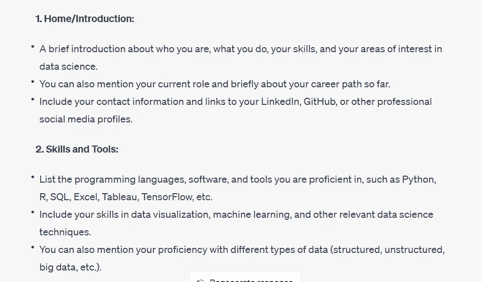

图片由作者提供

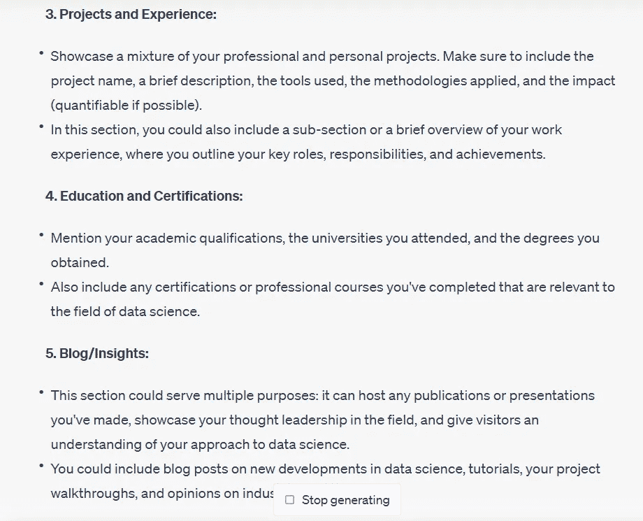

图片由作者提供

好的，ChatGPT 建议我们将作品集网站分为 5 个部分——主页、技能、项目、教育和博客。

这是一个典型作品集网站的结构。

你可以根据自己的需求进行调整，并要求它根据你的要求增加或减少部分。

# 步骤 2：为你的数据科学作品集网站构建内容

下一步是实际编写你想在网站每个部分中包含的内容。

如果你希望你的站点在 Google 搜索中排名靠前，你需要创建 SEO 友好的内容并使用正确的关键词。

你可以通过两种方式做到这一点：

## 方法 1：

只需输入一段关于你自己的简短介绍，并要求 ChatGPT 为作品集网站的每个部分生成 SEO 友好的内容。

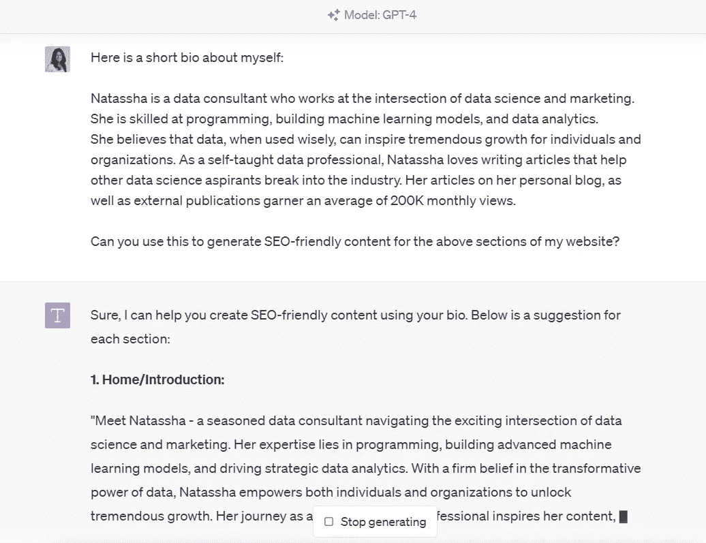

图片由作者提供

这样做的一个好处是你不必花时间自己编写内容，ChatGPT 能很好地将正确的关键词融入其中，并创建引人入胜的内容。

然而，如果你的雇主使用 AI 检测工具来筛查你的作品集，你的工作可能会被标记为 ChatGPT 生成的内容，这可能对你作为求职者的形象不利。

## 方法 2：

由于 ChatGPT 生成的内容可能会引起潜在雇主的警惕，我建议你自己编写每个部分的文本。

然后你可以将内容粘贴到 ChatGPT 中，要求模型修复文本中的任何语法错误，并提高其 SEO 分数。

我推荐这样做，因为你不仅仅是在使用 AI 生成的文本来构建你的网站。实际上，你是在创建自己的内容，并只是请求 ChatGPT 对其进行优化，以提高排名和可读性。

下面是一个可以帮助你实现这一目标的提示示例：

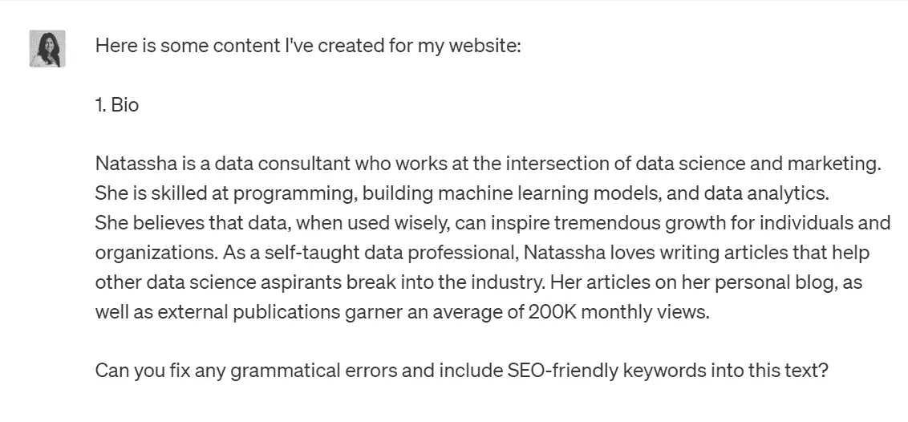

图片来源于作者

以下是 ChatGPT 对我提示的回应：

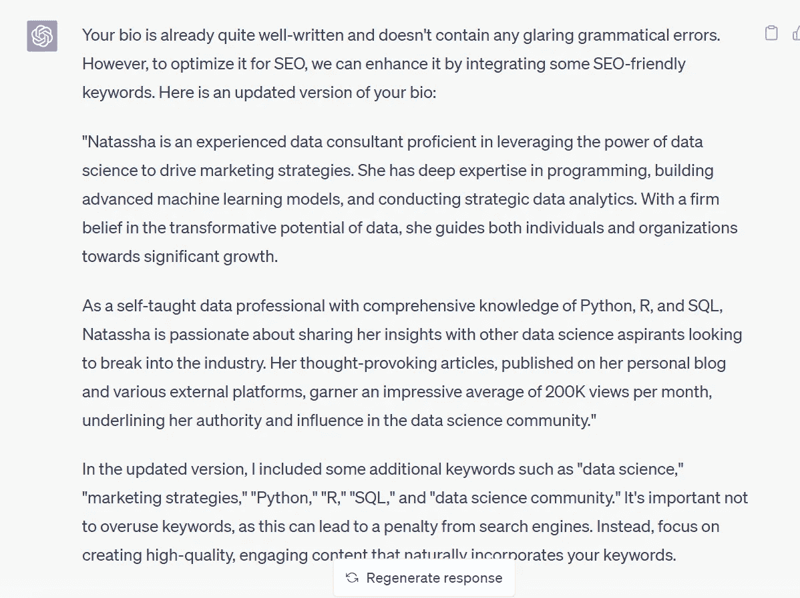

图片来源于作者

注意到 ChatGPT 对我的内容没有做任何重大更改。相反，它包括了“Python”、“R”和“SQL”等术语，这些术语与招聘人员寻找具有特定技能的数据科学家有关。

招聘经理通常使用自动化工具扫描简历中的特定关键词，仅筛选符合要求的候选人。

这就是为什么优化你的作品集以适应招聘人员关注的特定专业领域如此重要。

ChatGPT 可以帮助你完成这项任务——实际上，根据内容营销专家的说法，它的一个主要用途包括内容增强和 [提供量身定制的关键词](https://neilpatel.com/blog/chatgpt-seo/)，这些关键词有助于让网站脱颖而出。

# 步骤 3：使用 ChatGPT 创建你的作品集网站

现在，我们终于可以使用 ChatGPT 构建作品集网站了。

为了做到这一点，让我们提示 ChatGPT 给我们一些代码来构建作品集网站：

```py
Can you create a portfolio website with the following elements using HTML, CSS, and JavaScript:
```

```py
1\. Bio/Introduction: This section should have a header tag (H1) that says "Bio." You can use the same text I pasted in the <p> tag of this section. On the right hand side of this section, please use this image: [`unsplash.com/photos/hgFY1mZY-Y0.`](https://unsplash.com/photos/hgFY1mZY-Y0.)2\. Projects: This section should have a H1 tag that says "Projects." It should also have three cards that are clickable, I will provide the URLs myself. Each card should have the following images respectively: [`unsplash.com/photos/zwsHjakE_iI,`](https://unsplash.com/photos/zwsHjakE_iI,) [`unsplash.com/photos/hGV2TfOh0ns,`](https://unsplash.com/photos/hGV2TfOh0ns,) [`unsplash.com/photos/s9CC2SKySJM.`](https://unsplash.com/photos/s9CC2SKySJM.) Please style this using Bootstrap's card component.3\. Skills: This section should have a H1 tag that says "Skills." It should list Python, SQL, Data Analysis, and R. Create this in the form of small bar charts - Python (80%), SQL (70%), Data Analysts (90%) and R (30%).4\. Contact: This section is the footer, and should have a sign up box that allows users to enter their email addresses and click subscribe. It should have a H1 tag that says "Contact Me."Please style all the code using Bootstrap, and structure it in the form of a portfolio website.
```

当要求 ChatGPT 编写代码或构建最终产品时，你需要非常具体，这就是为什么我清楚地概述了我希望每个部分的结构。

我指定了我想要创建的所有部分，以及我想使用的标题类型。我甚至提供了想在网站上包含的 Unsplash 图片的链接。

最后，我要求它使用 Bootstrap 来为网站设计样式。这是一个流行的 CSS 框架，用于构建美观、响应式的网站，并减少从头设计页面所需的时间。

你可以根据你希望网站的结构来更改要求。

ChatGPT 根据我提供的指示给了我一些代码：

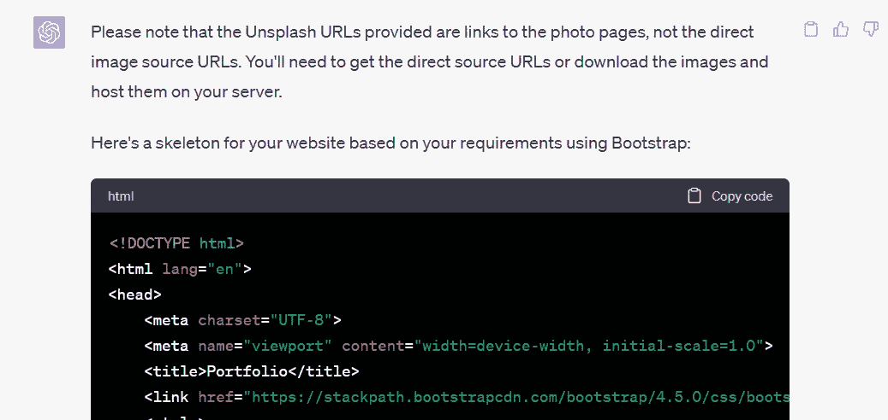

它告诉我自己上传每个部分的图片，因为 Unsplash 不允许直接嵌入链接，并为我提供了两个单独文件的代码——HTML 和 CSS。

我将它们保存在同一目录下并运行了代码，结果网站看起来像这样：

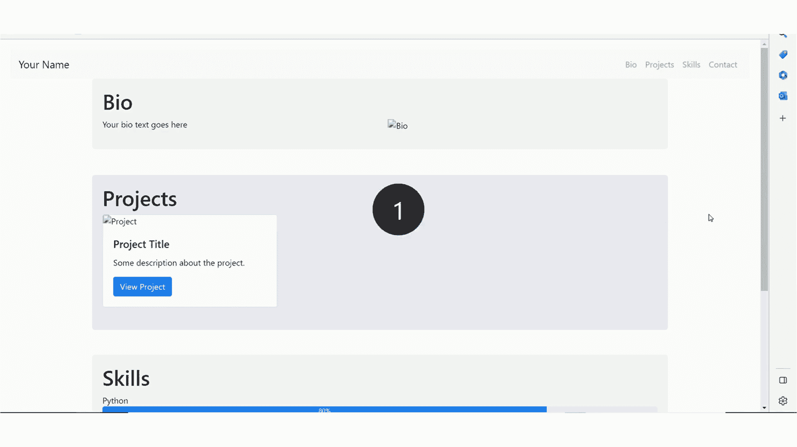

图片来源于作者

这是一个简单的框架，需要用文本和图片内容进行丰富。

为了确保我们确切知道需要进行哪些更改，ChatGPT 在代码的特定部分留下了注释，这些部分需要由文本描述或图片替换：

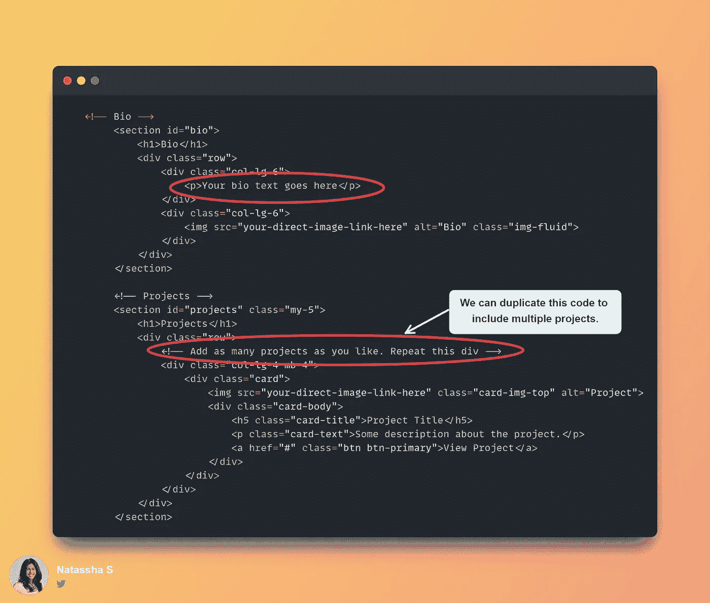

作者提供的图片

如果你还没有相关的个人或项目图片可以在网站上使用，只需从[Unsplash](https://unsplash.com/)或[Pexels](https://pexels.com/)下载一些作为占位符即可。

在代码中包含相关内容和图片后，让我们刷新网站，看看效果如何：

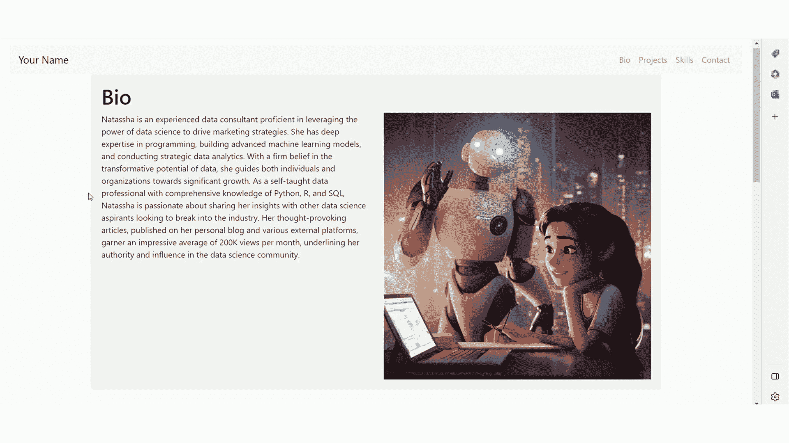

作者提供的图片

我觉得这看起来还不错，不过感觉需要一些小的改动，使其更专业。

例如，导航栏和“简介”部分有点太靠近了。它们应该分开一点，导航栏也应该更深一些，以便提高可见性。

简介中的文字太短，留有很多空白，使得视觉效果不佳。

让我们请 ChatGPT 进行一些修改：

```py
Can you do these things:
```

```py
1\. Make the navigation bar darker, and separate it from the "Bio" section. They are currently almost overlapping. If you make this bar dark, the text should be made lighter for it to be visible.2\. The text in the "Bio" section should be made slightly bigger, as there currently is a lot of empty space at the bottom.3\. The "Email Address" text should be made bigger or highlighted in bold, and centered horizontally. The "Subscribe" button, project title, project description, and "View Project" button should also be centered horizontally.
```

请记住，ChatGPT 可能会忽略这些指示中的一个或多个（它对我确实有），但你只需再次提示它，以提醒其确切需要做出的更改，它最终会做对的。

这是 ChatGPT 为我提供更新代码后的最终版本网站：

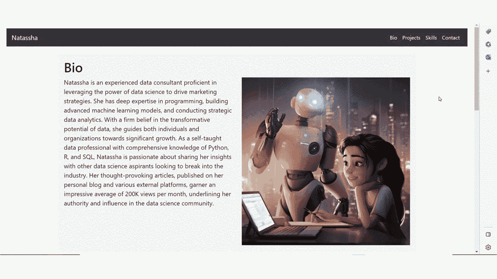

作者提供的图片

*注意：ChatGPT 刚刚设计了联系按钮，但它目前没有任何功能。如果你想让它工作，只需请 ChatGPT 提供如何使用类似 MailChimp 的免费邮件订阅服务的指示。*

看！就是这样！

我们成功地在不到一天的时间内与 ChatGPT 一起构建了一个有吸引力的作品集网站。

下一步是部署这个网站，这可以通过[GitHub Pages](https://pages.github.com/)瞬间完成。

ChatGPT 生成的用于构建作品集网站的完整代码可以在我的[GitHub 仓库](https://github.com/Natassha/GitHub-Portfolio-Site)中找到。

这篇文章就到这里，谢谢阅读！
