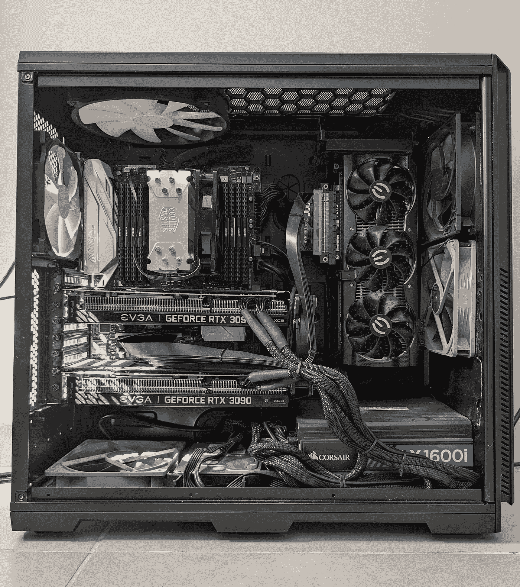
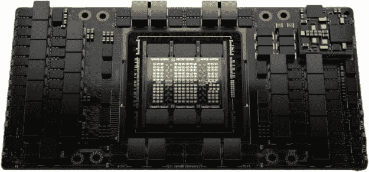
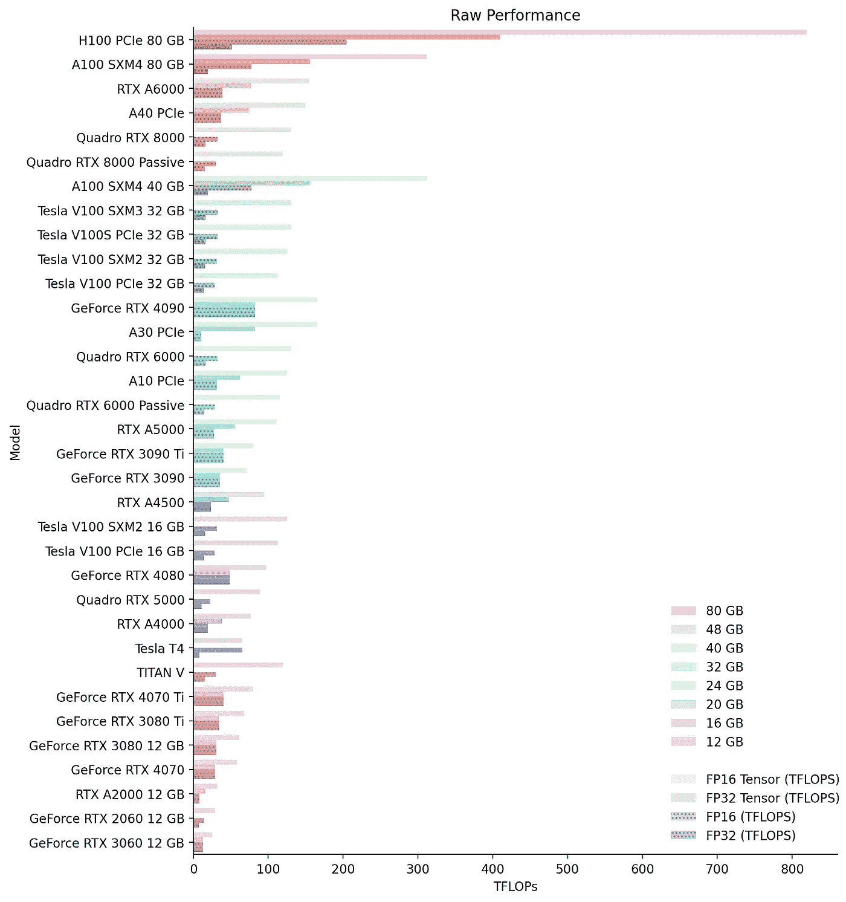
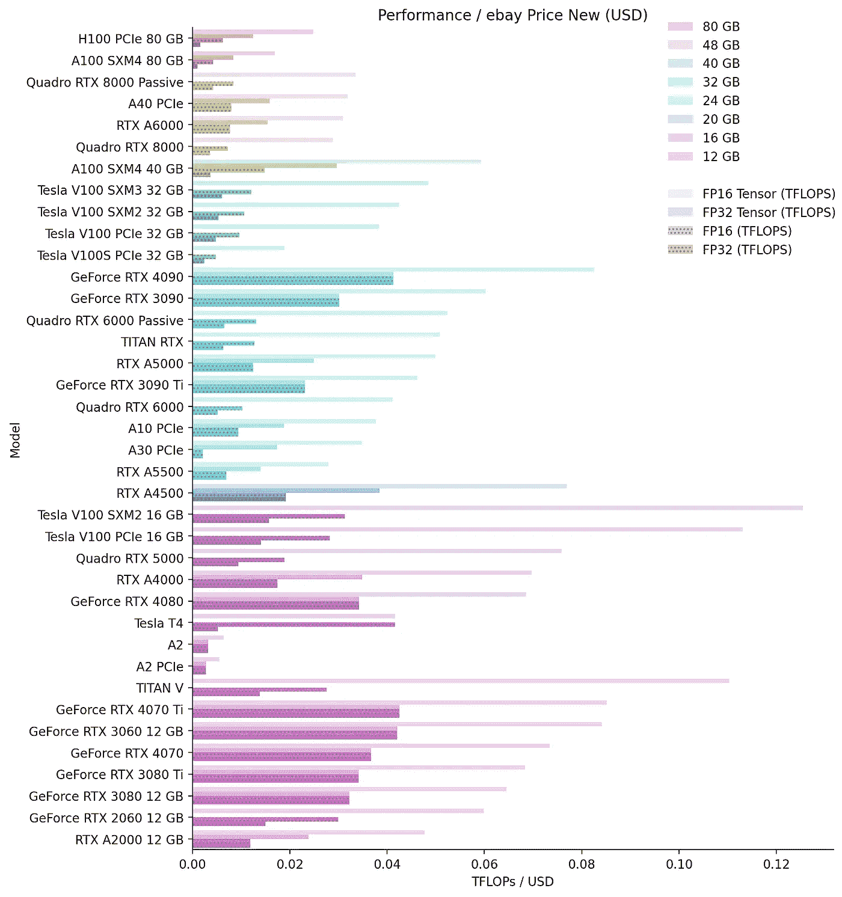
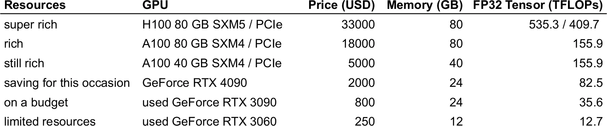
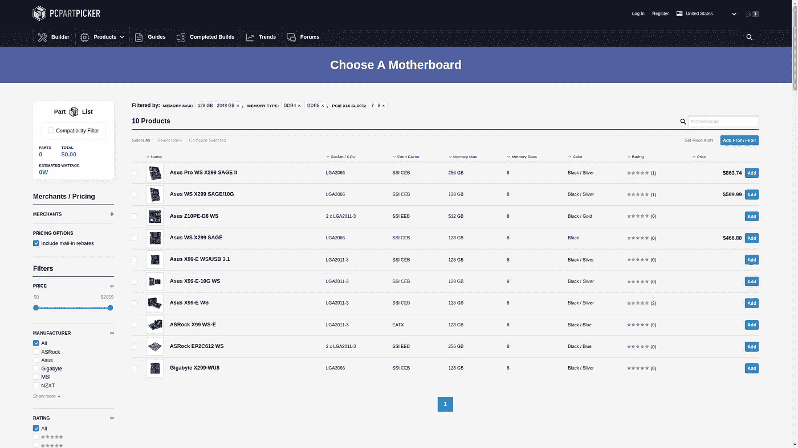
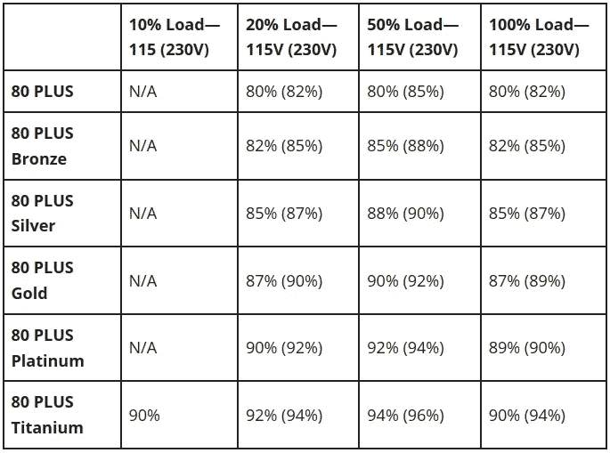
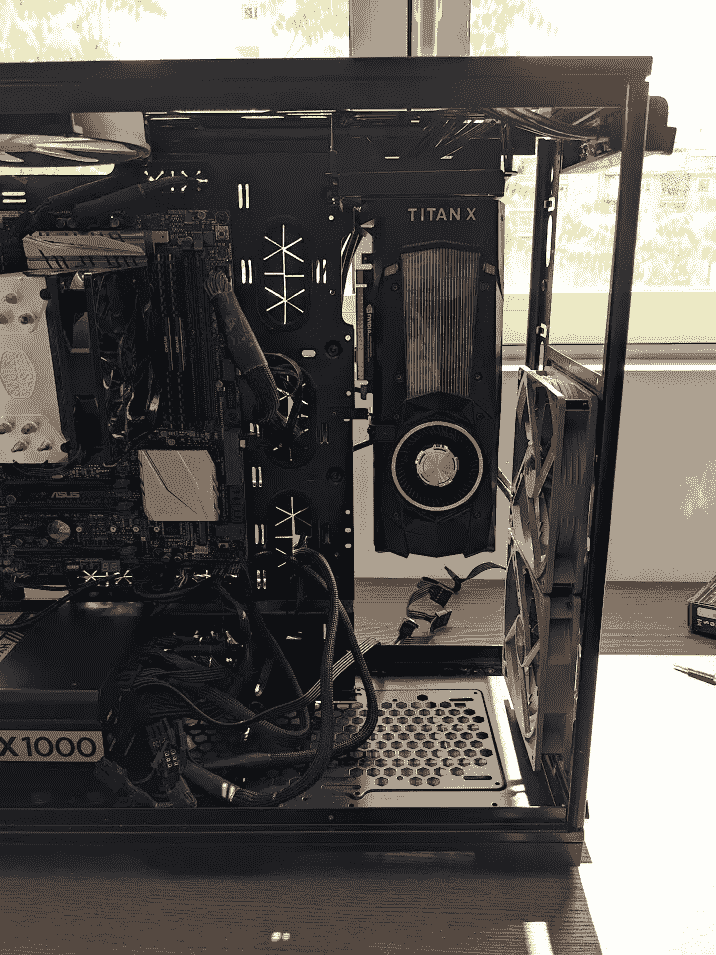

# 如何在 2023 年构建多 GPU 系统进行深度学习

> 原文：[`towardsdatascience.com/how-to-build-a-multi-gpu-system-for-deep-learning-in-2023-e5bbb905d935?source=collection_archive---------0-----------------------#2023-09-16`](https://towardsdatascience.com/how-to-build-a-multi-gpu-system-for-deep-learning-in-2023-e5bbb905d935?source=collection_archive---------0-----------------------#2023-09-16)

[](https://benuix.medium.com/?source=post_page-----e5bbb905d935--------------------------------)[](https://towardsdatascience.com/?source=post_page-----e5bbb905d935--------------------------------) [Antonis Makropoulos](https://benuix.medium.com/?source=post_page-----e5bbb905d935--------------------------------)

·

[关注](https://medium.com/m/signin?actionUrl=https%3A%2F%2Fmedium.com%2F_%2Fsubscribe%2Fuser%2F866c99d649d0&operation=register&redirect=https%3A%2F%2Ftowardsdatascience.com%2Fhow-to-build-a-multi-gpu-system-for-deep-learning-in-2023-e5bbb905d935&user=Antonis+Makropoulos&userId=866c99d649d0&source=post_page-866c99d649d0----e5bbb905d935---------------------post_header-----------) 发布于 [Towards Data Science](https://towardsdatascience.com/?source=post_page-----e5bbb905d935--------------------------------) ·10 min read·2023 年 9 月 16 日[](https://medium.com/m/signin?actionUrl=https%3A%2F%2Fmedium.com%2F_%2Fvote%2Ftowards-data-science%2Fe5bbb905d935&operation=register&redirect=https%3A%2F%2Ftowardsdatascience.com%2Fhow-to-build-a-multi-gpu-system-for-deep-learning-in-2023-e5bbb905d935&user=Antonis+Makropoulos&userId=866c99d649d0&source=-----e5bbb905d935---------------------clap_footer-----------)

--

[](https://medium.com/m/signin?actionUrl=https%3A%2F%2Fmedium.com%2F_%2Fbookmark%2Fp%2Fe5bbb905d935&operation=register&redirect=https%3A%2F%2Ftowardsdatascience.com%2Fhow-to-build-a-multi-gpu-system-for-deep-learning-in-2023-e5bbb905d935&source=-----e5bbb905d935---------------------bookmark_footer-----------)

我的深度学习搭建——始终在进行中 :).

本文提供了如何构建多 GPU 系统进行深度学习的指南，希望能节省你的研究时间和实验。

# 目标

> 构建一个多 GPU 系统，用于计算机视觉和 LLMs 模型的训练，而不会破坏预算！ *🏦*

# 第一步\. GPU

让我们从有趣（和昂贵的 💸💸💸）部分开始吧！



H100 怪兽！图片来自 [NVIDIA](https://developer.nvidia.com/blog/nvidia-hopper-architecture-in-depth/)。

购买 GPU 时的主要考虑因素是：

+   内存（VRAM）

+   性能（张量核心，时钟速度）

+   插槽宽度

+   功率（TDP）

## 内存

现在深度学习任务需要大量内存。即使是微调 LLMs 也很庞大，而计算机视觉任务，特别是 3D 网络，也可能变得内存密集。自然，最重要的方面是 GPU 的**VRAM**。对于 LLMs，我建议至少 24 GB 内存，对于计算机视觉任务，我建议不低于 12 GB。

## 性能

第二个标准是性能，可以通过 FLOPS（每秒浮点运算）来估算：


过去的关键数字是电路中的 CUDA 核心数量。然而，随着深度学习的兴起，NVIDIA 推出了专门的**张量核心**，每时钟周期可以执行更多的 FMA（融合加法）操作。这些已经被主要深度学习框架支持，2023 年您应该关注这些。

以下是我在经过大量手动工作后编制的按内存分组的 GPU 原始性能图表：



基于 CUDA 和张量核心（TFLOPs）的 GPU 原始性能。

注意在比较不同 GPU 的性能时必须*格外小心*。不同代/架构的 Tensor 核心不可比。例如，A100 每时钟周期执行 256 FP16 FMA 操作，而 V100“仅”执行 64 个。此外，较旧的架构（Turing, Volta）不支持 32 位张量操作。更难比较的是 NVIDIA 并不总是报告 FMA，甚至在白皮书中也没有，且相同架构的 GPU 可能有不同的 FMA。我一直在[这个](https://forums.developer.nvidia.com/t/tf32-tflops-of-geforce-rtx-3090-vs-a40/265828)上碰壁😵‍💫。还要注意，NVIDIA 通常用稀疏性来宣传张量 FLOPS，而这一特性仅在推理时可用。

为了识别性价比最高的 GPU，我使用 eBay API 收集了 eBay 价格，并计算了新卡的每美元相对性能：



基于 CUDA 和张量核心（TFLOPs / USD）的 GPU 相对性能。价格基于当前 eBay 价格（2023 年 9 月）。

我对二手卡做了相同的处理，但由于排名变化不大，所以省略了图表。

为了选择最适合您预算的 GPU，您可以选择拥有最大内存的顶级 GPU。我的推荐是：



根据当前 eBay 价格（2023 年 9 月），不同预算的 GPU 推荐。

如果您想深入了解更多技术细节，建议阅读 Tim Dettmers 的优秀指南[选择适合深度学习的 GPU](https://timdettmers.com/2023/01/30/which-gpu-for-deep-learning/)。

## 插槽宽度

在构建多 GPU 系统时，我们需要规划如何将 GPU 物理安装到 PC 机箱中。由于 GPU 越来越大，尤其是游戏系列，这成为了一个问题。消费级主板最多有 7 个 PCIe 插槽，PC 机箱也围绕这个设置进行设计。一块 4090 根据制造商的不同，可能会占用 4 个插槽，因此你可以理解为什么这会成为问题。此外，我们应该在非风冷或水冷的 GPU 之间至少留出 1 个插槽，以避免过热。我们有以下选项：

**水冷**

水冷变体将占用最多 2 个插槽，但它们价格更贵。你也可以将风冷 GPU 改装成水冷，但这会使保修失效。如果你不选择一体式（AIO）解决方案，你将需要构建自定义水冷系统。如果你想安装多个水冷 GPU，这一点尤其重要，因为 AIO 散热器可能无法适配机箱。自行构建系统有风险，我个人不会在昂贵的显卡上尝试。我只会直接从制造商处购买 AIO 解决方案（风险规避 🙈）。

**风冷 2-3 槽显卡和 PCIe 扩展卡**

在这种情况下，你可以将显卡交错地安装在 PCIe 插槽上，并通过 PCIe 扩展卡连接显卡。PCIe 扩展卡可以放置在 PC 机箱内部的某个位置，或放在开放空气中。在任何情况下，你都应该确保 GPU 固定好（另见关于 PC 机箱的部分）。

## 功率（TDP）

现代 GPU 的功耗越来越大。例如，一块 4090 需要 450W，而 H100 可以达到 700W。除了电费，安装三块或更多显卡也成为了一个问题。这在美国尤其如此，因为电源插座的最大功率约为 1800w。

如果你接近电源/电源插座的最大功率，解决这个问题的一个方案是功率限制。要减少 GPU 可以吸取的最大功率，你只需：

```py
sudo nvidia-smi -i <GPU_index> -pl <power_limit>

where:
GPU_index: the index (number) of the card as it shown with nvidia-smi
power_limit: the power in W you want to use
```

通过将功率限制在 10-20%之间，已被证明可以将性能降低不到 5%，并且能使显卡保持更凉爽（[Puget Systems 的实验](https://www.pugetsystems.com/labs/hpc/NVIDIA-GPU-Power-Limit-vs-Performance-2296/?utm=)）。例如，将四块 3090 显卡的功率限制为 20%会将其功耗降低到 1120w，并且可以轻松适配 1600w 的电源/1800w 的插座（假设其余组件消耗 400w）。

# 步骤 2\. 主板和 CPU

构建的下一步是选择一个允许多个 GPU 的主板。在这里主要考虑的是 PCIe 通道。我们需要**每块显卡至少有 PCIe 3.0 x8 通道**（见[Tim Dettmers 的帖子](https://timdettmers.com/2018/12/16/deep-learning-hardware-guide/#PCIe_Lanes_and_Multi-GPU_Parallelism)）。PCIe 4.0 或 5.0 更为稀有，对于大多数深度学习用途并不必要。

除了插槽类型外，插槽的间距将决定你可以放置 GPU 的位置。确保你已经检查了间距，并且你的 GPU 确实可以放在你想要的位置。请注意，大多数主板在使用多个 GPU 时会将一些 x16 插槽配置为 x8。获取这些信息的唯一可靠途径是查阅显卡的手册。

最简单的方法是避免花费数小时的研究，并使你的系统未来-proof，是选择一个到处都有 x16 插槽的主板。你可以使用 PCPartPicker 并筛选出具有 [7+ PCIe x16 插槽](https://pcpartpicker.com/products/motherboard/#h=7,8&xcx=0) 的主板。这给我们提供了 21 种产品选择。然后我们 [缩减列表](https://pcpartpicker.com/products/motherboard/#h=7,8&xcx=0&D=137438953472,2199023255552&mt=ddr4,ddr5) 选择我们想要的最小 RAM 数量（例如 128 GB），并选择 DDR4 / DDR5 类型，将产品数量减少到 10 种：



基于 [PCPartPicker](https://pcpartpicker.com/products/motherboard/#h=7,8&xcx=0&D=137438953472,2199023255552&mt=ddr4,ddr5) 的主板至少有 7 个 PCIe x16 插槽和 128 GB DDR4/DDR5 RAM。

上述列表中支持的 CPU 插槽是 LGA2011–3 和 LGA2066。接下来，我们转到 CPU 选择，选择具有所需核心数量的 CPU。这些主要用于数据加载和批处理准备。每个 GPU 至少应有 **2 核心 / 4 线程**。对于 CPU，我们还应检查它支持的 PCIe 通道。过去十年的任何 CPU 应该至少支持 40 条通道（覆盖 4 个 GPU，每个 GPU x8 通道），但最好还是谨慎为好。通过筛选例如 [具有上述插槽的 16+ 核 CPU](https://pcpartpicker.com/products/cpu/#C=16,64&k=28,35&xcx=0)，我们得到以下 CPU：

+   Intel Xeon E5 (LGA2011–3)：8 个结果

+   Intel Core i9 (LGA2066)：9 个结果

然后，我们根据核心数量、可用性和价格选择我们喜欢的主板和 CPU 组合。

LGA2011–3 和 LGA2066 插槽都已经非常老旧（分别是 2014 年和 2017 年），因此你可以在 eBay 上找到这两个主板和 CPU 的好交易。一块 ASRock X99 WS-E 主板和一颗 18 核的 Intel Xeon E5–2697 V4 在二手状态下可能花费不到 300 美元。不要购买便宜的 ES 或 QS 版本的 CPU，因为这些是工程样品，可能会出现故障 ⚠️️。

如果你想购买更强大和/或更新的组件和/或 AMD CPU，可以查看例如 4+ PCIe x16 插槽的主板，但确保检查插槽间距。

> 在这个阶段，开始一个 [PCPartPicker 构建](https://pcpartpicker.com/list/) 是个好主意。 🛠️
> 
> PCPartPicker 会为你检查组件之间的兼容性，让你的生活更轻松。

# 第 3 步。RAM 🐏

在这里，最重要的方面是 RAM 的数量。RAM 在深度学习循环中的不同地方使用：从硬盘加载数据以创建批次、加载模型以及当然是原型设计。所需的 RAM 数量很大程度上取决于您的应用程序（例如，3D 图像数据需要更多的额外 RAM），但您应该以 GPU VRAM 总量的 1 倍到 2 倍为目标。类型至少应为 DDR4，但 RAM 时钟不是非常重要，所以不要把钱花在这里 🕳️。

在购买 RAM 时，您应该确保其形状因素、类型、模块数量和每个模块的内存都与您的主板规格一致（PCPartPicker 是您的好帮手！）。

# 第 4 步。硬盘

另一个可以节省开支的组件是硬盘 😌。硬盘空间的大小很重要，并且取决于应用程序。您不一定需要超高速硬盘或 NVME，因为它们不会影响您的深度学习性能。数据最终会加载到 RAM 中，为了避免成为瓶颈，您可以简单地使用更多的并行 CPU 工作线程。

# 第 5 步。电源供应器 (PSU) 🔌

正如我们所见，GPU 是高功耗组件。在设置多 GPU 系统时，选择 PSU 成为一个重要的考虑因素。大多数 PSU 能提供高达 1600w 的功率 —— 这符合美国插座的功率限制。有一些 PSU 可以提供更高的功率，但需要一些研究，并且它们特别针对矿工。


PCPartPicker 为您的构建提供的估算功率。

要确定系统的功率，您可以再次使用 PCPartPicker 来计算您构建的总功率。为了确保安全，我们需要额外增加 10%以上的功率，因为 GPU 的实际功耗有时会超过其规格。

一个重要的标准是**PSU 效率**，这由 80 PLUS 评级标记。电源将达到其宣传的功率，但在过程中会损失一些功率。80 PLUS 铜牌电源的效率为 82%，而例如金牌电源的效率为 87%。如果我们有一个功率需求为 1600w 的系统，并且我们在 20% 的时间内使用它，我们将节省 22 美元每年，前提是电价为 0.16 美元/千瓦时。在比较价格时，请将这一点纳入您的计算中。



PSU 效率评级。表格来源于 [techguided](https://techguided.com/80-plus-bronze-vs-gold-vs-platinum-vs-titanium-which-psu-rating-do-you-need/)。

在满负荷运行时，一些 PSU 比其他的**噪音**更大，因为它们使用高速运转的风扇。如果您在靠近机箱的地方工作（或睡觉！），这可能会有一些影响，因此查看手册中的分贝数是个好主意 😵。

在选择电源时，我们需要确认它是否有足够的连接器来支持所有部件。特别是 GPU 使用 8 针（或 6+2）电缆。这里有一个重要的提示：对于 GPU 的每个电源插槽，我们应该使用**单独的 8 针电缆**，而不是使用同一根电缆的多个输出（串联连接）。8 针电缆通常额定功率约为 150w。当使用单根电缆为多个电源插槽供电时，GPU 可能无法获得足够的电力，从而导致降频。

# 步骤 6\. 机箱

最后但同样重要的是，选择一个 PC 机箱并不简单。GPU 可以非常庞大，一些机箱可能无法容纳它们。例如，4090 的长度可以达到 36 厘米 👻！

此外，使用 PCIe 延长条安装 GPU 可能需要一些技巧。有一些较新的机箱允许安装额外的显卡，特别是像 Phanteks Enthoo 719 这样的双系统机箱。另一个选择是 Lian-Li O11D EVO，它可以通过 Lian-Li Upright GPU Bracket 以直立位置容纳 GPU。我没有这些机箱，所以不确定它们如何适配，例如多个 3090 / 4090。然而，即使你的 PC 机箱不直接支持直立安装，你仍然可以使用 Lian-Li 支架来直立安装 GPU。你需要在机箱上钻 2-3 个孔，但并不是很复杂。



使用 Lian Li 直立支架将 GPU 安装在直立位置。

# 结束

希望你喜欢阅读本指南，并且发现了一些有用的提示。本指南旨在帮助你研究如何构建多 GPU 系统，而不是替代研究。如果你有任何问题或意见，请随时发给我。如果我在上述内容中有任何错误，我非常感谢你留下评论或私信，以便进一步改进 🙏！

注意：除非另有说明，所有图片均由作者提供。
