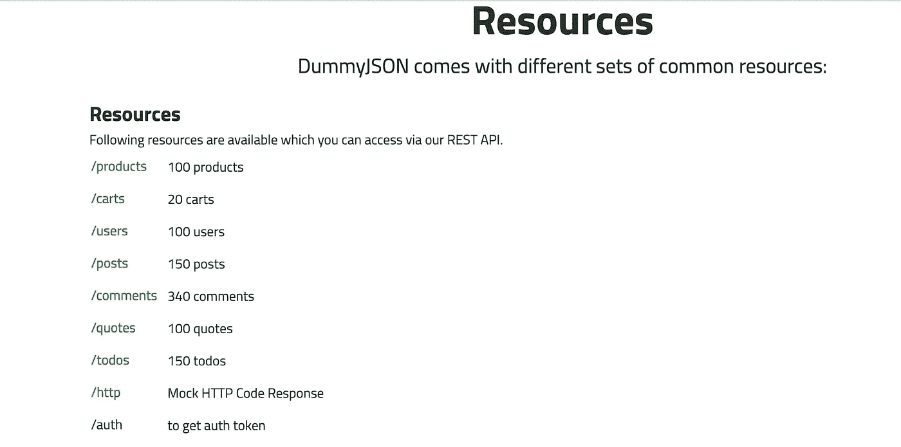

# 如何用 Python 构建 ELT

> 原文：[`towardsdatascience.com/how-to-build-an-elt-with-python-8f5d9d75a12e?source=collection_archive---------1-----------------------#2023-02-07`](https://towardsdatascience.com/how-to-build-an-elt-with-python-8f5d9d75a12e?source=collection_archive---------1-----------------------#2023-02-07)

## 提取、加载和转换数据

 [Marie Truong](https://medium.com/@marietruong?source=post_page-----8f5d9d75a12e--------------------------------)

·

[关注](https://medium.com/m/signin?actionUrl=https%3A%2F%2Fmedium.com%2F_%2Fsubscribe%2Fuser%2F4cfa1d0b321f&operation=register&redirect=https%3A%2F%2Ftowardsdatascience.com%2Fhow-to-build-an-elt-with-python-8f5d9d75a12e&user=Marie+Truong&userId=4cfa1d0b321f&source=post_page-4cfa1d0b321f----8f5d9d75a12e---------------------post_header-----------) 发表在 [Towards Data Science](https://towardsdatascience.com/?source=post_page-----8f5d9d75a12e--------------------------------) · 7 分钟阅读 · 2023 年 2 月 7 日 

--

照片由 [JJ Ying](https://unsplash.com/@jjying?utm_source=medium&utm_medium=referral) 提供，发布在 [Unsplash](https://unsplash.com/?utm_source=medium&utm_medium=referral)

ELT（提取、加载、转换）是一种现代数据集成方法，与 ETL（提取、转换、加载）略有不同。ETL 在将数据加载到数据仓库之前进行转换，而在 ELT 中，原始数据直接加载到数据仓库中，并使用 SQL 进行转换。

构建 ELT 是数据和分析工程师工作中非常重要的一部分，它也可以成为数据分析师和科学家的一项有用技能，或者是那些构建完整作品集的求职者的一项技能。

在这篇文章中，我们将使用来自 [dummyJSON](https://dummyjson.com/) 的数据在 Python 中构建一个简短的 ELT 管道。dummyJSON 是一个虚假的 REST API。它提供 9 种类型的资源：

dummyjson.com 的截图

我们将尝试找出哪些客户在我们的虚拟商店中花费了最多的钱。

这个脚本将包括 3 个步骤：

1.  从 dummyJSON API 中提取数据

1.  将原始数据加载到 BigQuery

1.  执行查询以进行分析

让我们开始构建我们的管道吧！

# 提取数据
