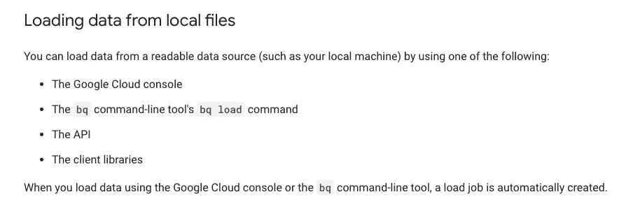
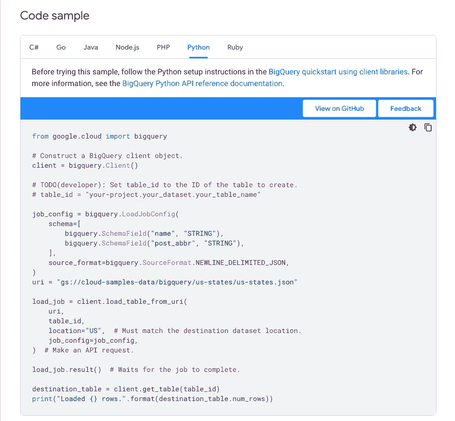
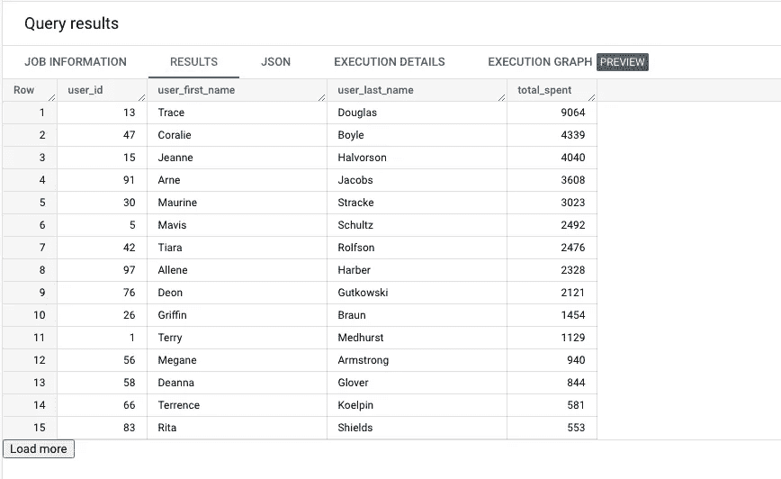
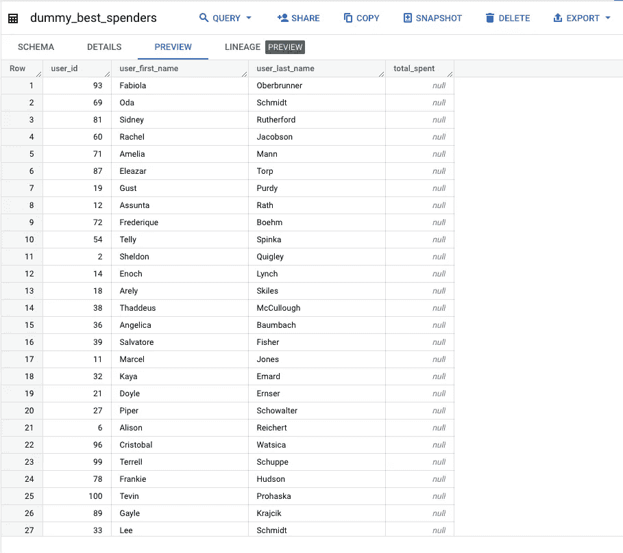

# 如何使用 Python 构建 ELT

> 原文：[`towardsdatascience.com/how-to-build-an-elt-with-python-8f5d9d75a12e`](https://towardsdatascience.com/how-to-build-an-elt-with-python-8f5d9d75a12e)

## 提取、加载和转换数据

[](https://medium.com/@marietruong?source=post_page-----8f5d9d75a12e--------------------------------)[](https://towardsdatascience.com/?source=post_page-----8f5d9d75a12e--------------------------------) [Marie Truong](https://medium.com/@marietruong?source=post_page-----8f5d9d75a12e--------------------------------)

·发表于 [Towards Data Science](https://towardsdatascience.com/?source=post_page-----8f5d9d75a12e--------------------------------) ·阅读时间 7 分钟·2023 年 2 月 7 日

--


图片由 [JJ Ying](https://unsplash.com/@jjying?utm_source=medium&utm_medium=referral) 提供，来源于 [Unsplash](https://unsplash.com/?utm_source=medium&utm_medium=referral)

ELT（提取、加载、转换）是一种现代的数据集成方法，与 ETL（提取、转换、加载）略有不同。ETL 在将数据加载到数据仓库之前进行转换，而 ELT 则将原始数据直接加载到数据仓库中，并使用 SQL 进行转换。

构建 ELT 是数据和分析工程师工作中非常重要的一部分，它也可以成为数据分析师和科学家更广泛领域的有用技能，或者是那些构建完整作品集的求职者。

在这篇文章中，我们将使用来自 [dummyJSON](https://dummyjson.com/) 的数据在 Python 中构建一个简短的 ELT 管道。dummyJSON 是一个虚假的 REST API，提供 9 种类型的资源：


dummyjson.com 的截图

我们将尝试找出哪些客户在我们的虚拟商店中花费了最多的钱。

这个脚本将包括 3 个步骤：

1.  从 dummyJSON API 提取数据

1.  将原始数据加载到 BigQuery

1.  执行查询以进行分析

让我们开始构建我们的数据管道吧！

# 提取数据

我们需要从 API 中检索 2 个资源：购物车和用户。

让我们创建一个函数，执行 API 调用并返回 JSON 数据：

```py
import requests

ENDPOINT = "https://dummyjson.com/"
def make_api_call(resource):
    ENDPOINT = "https://dummyjson.com/"
    response = requests.get(f"{ENDPOINT}{resource}") # making a request to the correct endpoint
    if response.status_code == 200:
        return response.json()
    else:
        raise Exception(response.text)

print(make_api_call("carts"))
```

我们使用 **requests** 库来发出简单的 HTTP GET 请求。我们通过状态码检查请求是否成功，并返回 JSON 数据。

```py
 {
  "carts": [
    {
      "id": 1,
      "products": [
        {
          "id": 59,
          "title": "Spring and summershoes",
          "price": 20,
          "quantity": 3,
          "total": 60,
          "discountPercentage": 8.71,
          "discountedPrice": 55
        },
        {...}
        // more products
      ],
      "total": 2328,
      "discountedTotal": 1941,
      "userId": 97,
      "totalProducts": 5,
      "totalQuantity": 10
    },
    {...},
    {...},
    {...}
    // 20 items
  ],
  "total": 20,
  "skip": 0,
  "limit": 20
}
```

我们已经有了关于订单的数据！让我们尝试获取客户数据：

```py
{
  "users": [
    {
      "id": 1,
      "firstName": "Terry",
      "lastName": "Medhurst",
      "maidenName": "Smitham",
      "age": 50,
      "gender": "male",
      "email": "atuny0@sohu.com",
      "phone": "+63 791 675 8914",
      "username": "atuny0",
      "password": "9uQFF1Lh",
      "birthDate": "2000-12-25",
      "image": "https://robohash.org/hicveldicta.png?size=50x50&set=set1",
      "bloodGroup": "A−",
      "height": 189,
      "weight": 75.4,
      "eyeColor": "Green",
      "hair": {
        "color": "Black",
        "type": "Strands"
      },
      "domain": "slashdot.org",
      "ip": "117.29.86.254",
      "address": {
        "address": "1745 T Street Southeast",
        "city": "Washington",
        "coordinates": {
          "lat": 38.867033,
          "lng": -76.979235
        },
        "postalCode": "20020",
        "state": "DC"
      },
      "macAddress": "13:69:BA:56:A3:74",
      "university": "Capitol University",
      "bank": {
        "cardExpire": "06/22",
        "cardNumber": "50380955204220685",
        "cardType": "maestro",
        "currency": "Peso",
        "iban": "NO17 0695 2754 967"
      },
      "company": {
        "address": {
          "address": "629 Debbie Drive",
          "city": "Nashville",
          "coordinates": {
            "lat": 36.208114,
            "lng": -86.58621199999999
          },
          "postalCode": "37076",
          "state": "TN"
        },
        "department": "Marketing",
        "name": "Blanda-O'Keefe",
        "title": "Help Desk Operator"
      },
      "ein": "20-9487066",
      "ssn": "661-64-2976",
      "userAgent": "Mozilla/5.0 ..."
    },
    {...},
    {...}
    // 30 items
  ],
  "total": 100,
  "skip": 0,
  "limit": 30
}
```

这次，有些事情引起了我们的注意：总共有 100 个用户，但我们只收到了 30 个。


作者截图

因此，我们需要再次调用那个 API，直到我们获取所有数据，跳过我们已经拥有的数据。然而，我们不希望将那些*total*、*skip*和*limit*键发送到数据仓库；让我们只保留用户和购物车。

这是我们更新后的函数：

```py
def make_api_call(resource):
    ENDPOINT = "https://dummyjson.com/"
    results_picked = 0
    total_results = 100 #We don't know yet, but we need to initialize
    all_data = []
    while results_picked < total_results:
        response = requests.get(f"{ENDPOINT}{resource}", params = {"skip" : results_picked})
        if response.status_code == 200:
            data = response.json()
            rows = data.get(resource)
            all_data += rows #concatening the two lists
            total_results = data.get("total")
            results_picked += len(rows) #to skip them in the next call
        else:
            raise Exception(response.text)
    return all_data

users_data = make_api_call("users")
print(len(users_data))
```

这一次，我们有了 100 个用户！

# 加载数据

现在，是时候将数据上传到 BigQuery 了。我们将使用[BigQuery Python 客户端库](https://cloud.google.com/bigquery/docs/reference/libraries)。



来源：[cloud.google.com/bigquery/docs/batch-loading-data](http://cloud.google.com/bigquery/docs/batch-loading-data)

从文档中可以看到，可以将本地文件加载到 BigQuery 中。目前，我们的 JSON 只是一个字典。让我们将其下载到本地文件中。

我们将使用原生库**json**并将 JSON 数据写入文件。需要记住的是，BigQuery 接受换行符分隔的 JSON 格式，而不是逗号分隔格式。

```py
import json    

def download_json(data, resource_name):
    file_path = f"{resource_name}.json"
    with open(file_path, "w") as file:
        file.write("\n".join([json.dumps(row) for row in data]))

download_json(carts_data, "carts")
download_json(users_data, "users")
```

我们现在可以检查我们的 carts.json 文件是否为正确的 JSON 格式：

```py
{"id": 1, "products": [{"id": 59, "title": "Spring and summershoes", "price": 20, "quantity": 3, "total": 60, "discountPercentage": 8.71, "discountedPrice": 55}, {"id": 88, "title": "TC Reusable Silicone Magic Washing Gloves", "price": 29, "quantity": 2, "total": 58, "discountPercentage": 3.19, "discountedPrice": 56}, {"id": 18, "title": "Oil Free Moisturizer 100ml", "price": 40, "quantity": 2, "total": 80, "discountPercentage": 13.1, "discountedPrice": 70}, {"id": 95, "title": "Wholesale cargo lashing Belt", "price": 930, "quantity": 1, "total": 930, "discountPercentage": 17.67, "discountedPrice": 766}, {"id": 39, "title": "Women Sweaters Wool", "price": 600, "quantity": 2, "total": 1200, "discountPercentage": 17.2, "discountedPrice": 994}], "total": 2328, "discountedTotal": 1941, "userId": 97, "totalProducts": 5, "totalQuantity": 10}
// other carts
{"id": 20, "products": [{"id": 66, "title": "Steel Analog Couple Watches", "price": 35, "quantity": 3, "total": 105, "discountPercentage": 3.23, "discountedPrice": 102}, {"id": 59, "title": "Spring and summershoes", "price": 20, "quantity": 1, "total": 20, "discountPercentage": 8.71, "discountedPrice": 18}, {"id": 29, "title": "Handcraft Chinese style", "price": 60, "quantity": 1, "total": 60, "discountPercentage": 15.34, "discountedPrice": 51}, {"id": 32, "title": "Sofa for Coffe Cafe", "price": 50, "quantity": 1, "total": 50, "discountPercentage": 15.59, "discountedPrice": 42}, {"id": 46, "title": "women's shoes", "price": 40, "quantity": 2, "total": 80, "discountPercentage": 16.96, "discountedPrice": 66}], "total": 315, "discountedTotal": 279, "userId": 75, "totalProducts": 5, "totalQuantity": 8}
```

现在让我们尝试上传我们的文件！

首先，我们需要[下载 Python 客户端库](https://cloud.google.com/bigquery/docs/reference/libraries)。

完成后，我们需要[下载服务账户密钥](https://cloud.google.com/bigquery/docs/authentication/service-account-file)并创建一个环境变量，以告诉 BigQuery 我们的凭证存储在哪里。在终端中，我们可以输入以下命令：

```py
export GOOGLE_APPLICATION_CREDENTIALS=service-account.json
```

然后，我们可以编写 Python 函数。幸运的是，BigQuery 文档为我们提供了代码示例：



作者截图

我们可以使用这个示例定义一个新函数：

```py
def load_file(resource, client):
    table_id = f"data-analysis-347920.medium.dummy_{resource}"

    job_config = bigquery.LoadJobConfig(
        source_format=bigquery.SourceFormat.NEWLINE_DELIMITED_JSON, 
        autodetect=True,
        write_disposition="write_truncate"
    )

    with open(f"{resource}.json", "rb") as source_file:
        job = client.load_table_from_file(source_file, table_id, job_config=job_config)

        job.result()  # Waits for the job to complete.

        table = client.get_table(table_id)  # Make an API request.
        print(
            "Loaded {} rows and {} columns to {}".format(
                table.num_rows, len(table.schema), table_id
            )
        )

client = bigquery.Client()
load_file("carts", client)
load_file("users", client)
```

```py
Loaded 20 rows and 7 columns to data-analysis-347920.medium.dummy_carts
Loaded 100 rows and 27 columns to data-analysis-347920.medium.dummy_users
```

我们告诉 BigQuery 每次都截断我们的表格，因此如果我们重新运行脚本，现有行将被覆盖。

我们现在在 BigQuery 中有了我们的两个表：


作者截图

# 转换数据

现在是时候进入 ELT 中的最后一部分了！

我们希望有一个包含用户及其在我们商店消费金额的表格。

让我们连接两个表格以获取这些信息：

```py
SELECT 
  u.id AS user_id,
  u.firstName AS user_first_name, 
  u.lastName AS user_last_name,
  SUM(total) AS total_spent
FROM `data-analysis-347920.medium.dummy_users` u
LEFT JOIN  `data-analysis-347920.medium.dummy_carts` c
ON u.id= c.userId
GROUP BY u.id,user_first_name,user_last_name
ORDER BY total_spent DESC
```



作者截图

看来 Trace Douglas 是我们的最高消费者！让我们将这个表格作为 ELT 的一部分添加。

```py
query= """
SELECT 
  u.id AS user_id,
  u.firstName AS user_first_name, 
  u.lastName AS user_last_name,
  SUM(total) AS total_spent
FROM `data-analysis-347920.medium.dummy_users` u
LEFT JOIN  `data-analysis-347920.medium.dummy_carts` c
ON u.id= c.userId
GROUP BY u.id,user_first_name,user_last_name
"""

query_config= bigquery.QueryJobConfig(
    destination = "data-analysis-347920.medium.dummy_best_spenders", 
    write_disposition= "write_truncate"
    )
client.query(query, job_config= query_config)
```

我移除了 ORDER BY，因为这在计算上很昂贵；我们仍然可以在查询**dummy_best_spenders**表时对结果进行排序。

让我们检查一下我们的表格是否已创建：



作者截图

就这样，我们用几行代码完成了第一个 ELT！

# 进一步探索 ELT

在处理实际和更大的项目时，还有一些其他事项需要考虑：

+   我们将处理更大的数据量。每天都有新数据，所以我们必须逐步追加数据到表格中，而不是每天处理所有数据。

+   -   随着我们的 ELT 变得越来越复杂，涉及多个数据源，我们可能需要使用像 Airflow 或 Prefect 这样的工作流编排工具。

+   -   我们只能将小于 10MB 的文件直接加载到 BigQuery 中。要加载更大的文件，我们需要先将其加载到 Cloud Storage 中。

# -   资源

+   [BigQuery 客户端库](https://cloud.google.com/python/docs/reference/bigquery/latest/google.cloud.bigquery.client.Client)

+   -   [Requests: HTTP for Humans](https://requests.readthedocs.io/en/latest/)

+   [JSON 编码器和解码器](https://docs.python.org/3/library/json.html)

-   希望你喜欢这篇文章！如果你喜欢，请关注我获取更多关于 Python、SQL 和分析的内容。

-   成为会员并阅读 Medium 上的所有故事。你的会员费用将直接支持我和你阅读的其他作者。你还将获得对 Medium 上每个故事的完全访问权限。

-   [## 通过我的推荐链接加入 Medium — Marie Truong](https://medium.com/@marietruong/membership?source=post_page-----8f5d9d75a12e--------------------------------)

### -   阅读 Marie Truong（以及 Medium 上其他成千上万位作者）的每个故事。你的会员费用直接支持…

-   [medium.com](https://medium.com/@marietruong/membership?source=post_page-----8f5d9d75a12e--------------------------------)
