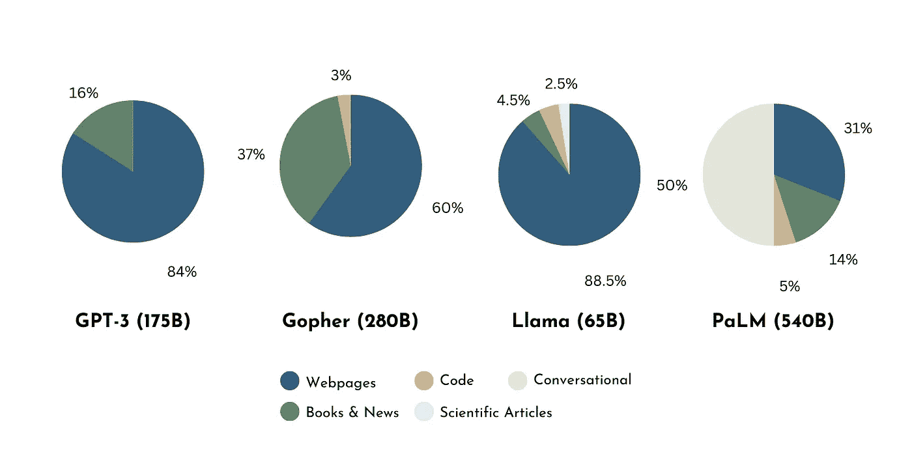
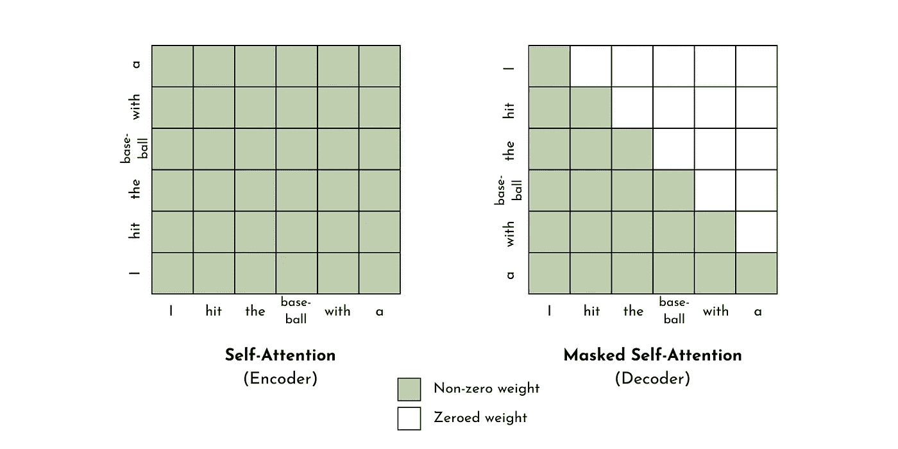

# 如何从零开始构建一个大型语言模型

> 原文：[`towardsdatascience.com/how-to-build-an-llm-from-scratch-8c477768f1f9`](https://towardsdatascience.com/how-to-build-an-llm-from-scratch-8c477768f1f9)

## **数据策划、变换器、大规模训练和模型评估**

[](https://shawhin.medium.com/?source=post_page-----8c477768f1f9--------------------------------)[](https://towardsdatascience.com/?source=post_page-----8c477768f1f9--------------------------------) [Shaw Talebi](https://shawhin.medium.com/?source=post_page-----8c477768f1f9--------------------------------)

·发布于 [数据科学前沿](https://towardsdatascience.com/?source=post_page-----8c477768f1f9--------------------------------) ·16 分钟阅读·2023 年 9 月 21 日

--

这是关于在实践中使用大型语言模型的 [系列文章](https://medium.com/towards-data-science/a-practical-introduction-to-llms-65194dda1148) 的第 6 篇文章。之前的文章探讨了如何通过 [提示工程](https://medium.com/towards-data-science/prompt-engineering-how-to-trick-ai-into-solving-your-problems-7ce1ed3b553f) 和 [微调](https://medium.com/towards-data-science/fine-tuning-large-language-models-llms-23473d763b91) 来利用预训练的大型语言模型。虽然这些方法可以处理绝大多数大型语言模型的使用案例，但在某些情况下，从头开始构建一个大型语言模型可能是合理的。在本文中，我们将回顾开发基础大型语言模型的关键方面，基于 GPT-3、Llama、Falcon 等模型的发展。


图片来源 [Frames For Your Heart](https://unsplash.com/@framesforyourheart?utm_source=medium&utm_medium=referral) 在 [Unsplash](https://unsplash.com/?utm_source=medium&utm_medium=referral)

从历史上看（即不到一年前），训练大规模语言模型（10 亿以上参数）曾是一个仅限于人工智能研究人员的神秘活动。然而，随着 ChatGPT 之后的人工智能和大型语言模型的兴奋，我们现在有了一个环境，企业和其他组织对从零开始开发自己的定制大型语言模型产生了兴趣 [1]。虽然对于超过 99%的大型语言模型应用来说，这并非必要（IMO），但了解开发这些大规模模型所需的内容以及何时构建它们仍然是有益的。

补充视频。

# **成本是多少？**

在深入探讨大型语言模型开发的技术方面之前，让我们做一些粗略的数学计算，以了解这里的财务成本。

Meta 的 Llama 2 模型训练其 7b 参数模型需要大约 180,000 GPU 小时，训练 70b 模型需要 1,700,000 GPU 小时 [2]。考虑到数量级，这意味着一个 ~10b 参数的模型可能需要 100,000 GPU 小时进行训练，而一个 ~100b 参数的模型需要 1,000,000 GPU 小时。

将这转化为商业云计算成本，一块 Invidia A100 GPU（即用于训练 Llama 2 模型的硬件）每小时的费用大约为 $1–2。这意味着**一个 ~10b 参数的模型训练成本约为 $150,000，而一个 ~100b 参数的模型训练成本约为 $1,500,000。**

另外，如果你不想租用 GPU，你可以购买它们。训练的成本将包括 A100 GPU 的价格以及模型训练的边际能源成本。一个 A100 约 $10,000 乘以 1000 个 GPU 组成一个集群。**硬件成本大约在 $10,000,000 级别**。接下来，假设能源成本约为每兆瓦时 $100，并且训练一个 100b 参数的模型需要大约 1,000 兆瓦时 [3]。这意味着**每个 100b 参数模型的边际能源成本约为 $100,000**。

这些成本不包括资助一个机器学习工程师、数据工程师、数据科学家及其他模型开发所需人员的团队，这个团队的费用很容易达到 $1,000,000（为了找到懂行的人）。

不用说，从零开始训练一个大型语言模型（LLM）是一项巨大的投资（至少目前是这样）。因此，必须有显著的潜在收益，无法通过提示工程或微调现有模型来实现，才能证明这种成本在非研究应用中的合理性。

# **4 个关键步骤**

现在你已经意识到你不想从零开始训练一个 LLM（或者你可能仍然想这样做，不知道），让我们看看模型开发包括哪些内容。在这里，我将过程分解为 4 个关键步骤。

1.  **数据整理**

1.  **模型架构**

1.  **大规模训练**

1.  **评估**

尽管每一步都有无尽的技术细节，但这里的讨论将保持相对高层次，只强调少数关键细节。读者可以参考相关引用资源，以深入了解任何方面的细节。

# **第 1 步：数据整理**

机器学习模型是其训练数据的产物，这意味着**你的模型的质量取决于数据的质量**（即“垃圾进，垃圾出”）。

这对大型语言模型（LLMs）来说是一个主要挑战，因为所需的数据规模庞大。为了理解这一点，这里列出了一些流行基础模型的训练集规模。

+   **GPT-3 175b**: 0.5T Tokens [4]（T = 万亿）

+   **Llama 70b**: 2T tokens [2]

+   **Falcon 180b**: 3.5T [5]

这相当于大约一万亿字的文本，即大约 1,000,000 部小说或 1,000,000,000 篇新闻文章。*注意：如果你不熟悉“token”这个术语，可以查看* [*之前的文章*](https://medium.com/towards-data-science/cracking-open-the-openai-python-api-230e4cae7971) *中的解释。*

[](/cracking-open-the-openai-python-api-230e4cae7971?source=post_page-----8c477768f1f9--------------------------------) ## 破解 OpenAI (Python) API

### 面向初学者的完整介绍，带有示例代码

[towardsdatascience.com

## **我们从哪里获取这些数据？**

互联网是最常见的 LLM 数据来源，包括网页、书籍、科学文章、代码库和对话数据等无数文本源。还有许多现成的开放数据集用于训练 LLM，例如[Common Crawl](https://commoncrawl.org/)（及其过滤变体[Colossal Clean Crawled Corpus](https://github.com/google-research/text-to-text-transfer-transformer#c4)（即 C4），和[Falcon RefinedWeb](https://arxiv.org/pdf/2306.01116.pdf)），The Pile（一个清洗和多样化的 825GB 数据集）[6]，以及 Hugging Face 的[datasets](https://huggingface.co/datasets)平台（和其他地方）上的许多其他数据集。

从互联网（及其他来源）收集人类生成的文本的替代方案是让现有的 LLM（如 GPT-3）生成（相对）高质量的训练文本语料库。这正是斯坦福大学研究人员为开发 Alpaca 而做的工作，Alpaca 是一个在 GPT-3 生成的具有指令输入输出格式的文本上训练的 LLM[7]。

无论你的文本来源于何处，**多样性**是优质训练数据集的关键方面**。** 这往往能**提升模型泛化能力**以应对下游任务[8]。如图所示，大多数流行的基础模型至少有一定程度的训练数据多样性。



比较基础模型之间的训练数据多样性。受赵等人工作的启发。[8]。图片由作者提供。

## **我们如何准备数据？**

收集大量文本数据仅是战斗的一半。数据整理的下一阶段是确保训练数据质量。虽然有无数方法可以实现这一点，这里我将重点介绍基于赵等人回顾的**4 个关键文本预处理步骤**[8]。

**质量过滤** — 旨在**从数据集中移除“低质量”文本**[8]。这可能是来自网络某些角落的无意义文本、新闻文章中的有害评论、多余或重复的字符等。换句话说，**这些文本不符合模型开发的目标**。赵等人将此步骤分为两种方法：基于分类器的方法和基于启发式的方法。前者涉及训练一个分类器来评分文本质量，使用（较小的）高质量数据集来过滤低质量文本。后者方法采用经验规则来确保数据质量，例如，去掉高困惑度的文本，仅保留具有特定统计特征的文本，或去除特定单词/语言[8]。

**去重**——另一个关键的预处理步骤是文本去重。这很重要，因为相同（或非常相似）文本的多个实例可能会偏向语言模型并干扰训练过程[8]。此外，这还有助于减少（并且理想情况下消除）训练和测试数据集中存在的相同文本序列[9]。

**隐私编辑**——在从互联网抓取文本时，存在捕获敏感和机密信息的风险。然后，LLM 可能会“学习”并意外暴露这些信息。这就是为什么去除个人身份信息至关重要。可以使用基于分类器和基于启发式的方法来实现这一目标。

**分词**——语言模型（即神经网络）并不“理解”文本；它们只能处理数字。因此，在我们能够训练神经网络进行任何操作之前，训练数据必须通过称为**分词**的过程转换为数字形式。一个流行的方法是通过**字节对编码（BPE）算法**[10]，它可以通过将特定的子词绑定到特定的整数来有效地**将给定文本转换为数字**。这种方法的主要好处是它最小化了“词汇表外”词汇的数量，这对于其他基于词的分词程序是一个问题。SentencePiece 和 Tokenizers Python 库提供了该算法的实现[11, 12]。

# **步骤 2: 模型架构**

变压器已经成为语言建模的最先进方法[13]。虽然这为模型架构提供了指导，但在这个框架内仍然可以做出许多高层次的设计决策。

## **什么是变压器？**

**变压器**是一种**利用注意力机制的神经网络架构**，用于在输入和输出之间生成映射。注意力机制根据序列的内容和位置学习不同元素之间的依赖关系[13]。这源于这样一个直觉：在语言中，*上下文很重要*。

例如，在句子“*我用球棒击打了棒球*”中，“*棒球*”一词的出现暗示“*球棒*”是一个棒球棒，而不是夜行性哺乳动物。然而，仅仅依赖上下文的内容还不够。词语的位置和顺序也很重要。

例如，如果我们将相同的词重新排列为“*我用棒球击打了蝙蝠*。”这句话的意义完全不同，“蝙蝠”在这里（合理地）指的是夜行性哺乳动物。*注意：请勿伤害蝙蝠*。

注意力机制使神经网络能够捕捉建模语言时内容和位置的重要性。这已经是机器学习中的一个想法数十年。然而，变压器的注意力机制的**主要创新**是**计算可以并行进行**，相比于依赖于串行计算的递归神经网络，提供了显著的加速[13]。

## **3 种变压器**

Transformers 由两个关键模块组成：编码器和解码器。这些模块可以是独立的，也可以是结合在一起的，这使得三种类型的 Transformers 成为可能 [14, 15]。

**仅编码器** — 编码器使用自注意力**将标记翻译为语义上有意义的数字表示**（即嵌入）。嵌入考虑了上下文。因此，相同的词/标记会根据周围的词/标记有不同的表示。这些 transformers 适用于需要理解输入的任务，例如文本分类或情感分析 [15]。一个流行的仅编码器模型是 Google 的 BERT [16]**。

**仅解码器** — 解码器像编码器一样，将标记转换为语义上有意义的数字表示。然而，**关键区别**在于**解码器不允许序列中的未来元素进行自注意力**（即掩蔽自注意力）。这种方式也称为因果语言建模，暗示了未来和过去标记之间的不对称性。这在文本生成任务中效果良好，并且是大多数 LLMs（例如 GPT-3、Llama、Falcon 等）的基础设计 [8, 15]。



自注意力和掩蔽自注意力权重矩阵的示意图。图片由作者提供。

**编码器-解码器** — 我们可以将编码器和解码器模块结合起来，创建一个编码器-解码器 transformer。这是原始“Attention is all you need”论文中提出的架构 [13]。这种类型的 transformer 的关键特性（其他类型无法实现）是交叉注意力。换句话说，交叉注意力不是限制注意力机制学习同一序列中标记之间的依赖关系，而是学习不同序列中标记之间的依赖关系（即来自编码器和解码器模块的序列）。这对于需要输入的生成任务（如翻译、总结或问答）非常有帮助 [15]。这种模型的另一个名称是掩蔽语言模型或去噪自编码器。使用这种设计的流行 LLM 是 Facebook 的 BART [17]。

## **其他设计选择**

**残差连接 (RC) —**（也称为跳跃连接）允许中间训练值绕过隐藏层，这通常有助于提高训练稳定性和性能 [14]。可以通过多种方式在 LLM 中配置 RC，如 He 等人（见图 4） [18] 论文中所讨论的那样。原始 Transformers 论文通过加法和归一化将每个子层（例如多头注意力层）的输入和输出进行组合，从而实现 RC [13]。

**层归一化（LN）** — 层归一化的思想是基于均值和标准差（或类似的东西）重新缩放层之间的中间训练值。这有助于加快训练时间并使训练更加稳定 [19]。LN 有两个方面。一方面涉及**归一化的位置**（即层前或层后或两者都做），另一方面涉及**归一化的方式**（例如 [Layer Norm](https://pytorch.org/docs/stable/generated/torch.nn.LayerNorm.html) 或 [RMS Norm](https://arxiv.org/abs/1910.07467)）。在 LLMs 中最常见的方法是使用 Ba 等人提出的 Pre-LN 方法 [8][19]，这与采用 Post-LN 的原始变换器架构有所不同 [13]。

**激活函数（AF）** — 激活函数在模型中引入非线性，使其能够捕捉输入与输出之间的复杂映射。许多常见的激活函数用于 LLMs，包括 GeLU、ReLU、Swish、SwiGLU 和 GeGLU [8]。然而，根据赵等人的调查，GeLU 是最常见的 [8]。

**位置嵌入（PE）** — 位置嵌入在语言模型的文本表示中捕捉标记位置的信息。一种方法是通过正弦函数 [13] 为每个标记添加基于其在序列中的位置的唯一值。或者，可以通过增强变换器自注意机制来推导相对位置编码（RPE），以捕捉序列元素之间的距离 [20]。RPE 的主要优点是对远大于训练时看到的输入序列的性能提升 [8]。

## **我应该做多大？**

在训练时间、数据集大小和模型大小之间存在重要的平衡。如果模型过大或训练时间过长（相对于训练数据），可能会过拟合。如果模型过小或训练时间不够长，可能会表现不佳。Hoffman 等人基于计算和标记数量提供了 LLM 最佳大小的分析，并推荐了包括所有三个因素的扩展计划 [21]。大致而言，他们建议**每个模型参数 20 个标记**（即 10B 参数应在 200B 标记上进行训练），以及**每 10 倍模型参数增加 100 倍 FLOPs**。

# **步骤 3: 大规模训练**

大型语言模型（LLMs）通过自监督学习进行训练。这通常表现为（例如在仅解码器的变换器中）基于前面的标记预测序列中的最终标记。

尽管这在概念上很简单，但中心挑战在于将模型训练扩展到~10–100B 参数。为此，可以采用几种常见技术来优化模型训练，例如**混合精度训练**、**3D 并行性**和**零冗余优化器（ZeRO）**。

## **训练技术**

**混合精度训练**是一种常见的策略，用于降低模型开发的计算成本。这种方法**在训练过程中使用 32 位（单精度）和 16 位（半精度）浮点数据类型**，以最大限度地减少单精度数据的使用[8, 22]。这有助于减少内存需求并缩短训练时间[22]。尽管数据压缩可以显著改善训练成本，但它的效果有限。这就是并行化发挥作用的地方。

并行化将训练分布到多个计算资源（即 CPU 或 GPU 或两者）。传统上，这是通过将模型参数复制到每个 GPU 来实现的，以便并行更新参数。然而，当训练具有数百亿个参数的模型时，内存限制和 GPU 之间的通信成为一个问题（例如，Llama 70b 约为 120GB）。为了解决这些问题，可以使用**3D 并行性**，它**结合了三种并行化策略**：流水线、模型和数据并行性。

+   **流水线并行性** — 将变压器层分布到多个 GPU 上，并通过在同一个 GPU 上加载连续层来减少分布式训练中的通信量[8]。

+   **模型并行性**（或张量并行性）— 将参数矩阵操作分解为分布在多个 GPU 上的多个矩阵乘法[8]。

+   **数据并行性** — 将训练数据分布到多个 GPU 上。虽然这需要复制和传递模型参数和优化器状态，但通过前面的并行化策略和下一种训练技术，缺点得到了缓解[8]。

尽管 3D 并行性在计算时间上带来了巨大的加速，但在将模型参数复制到多个计算单元时仍然存在一定程度的数据冗余。这引出了**零冗余优化器（ZeRO）**的概念，（顾名思义）它减少了关于优化器状态、梯度或参数分区的数据冗余[8]。

这三种训练技术（以及更多）由[**DeepSpeed**](https://www.deepspeed.ai/training/)实现，这是一款用于深度学习优化的 Python 库[23]。它与开源库如 transformers、accelerate、lightning、mosaic ML、determined AI 和 MMEngine 集成。其他用于大规模模型训练的流行库包括[Colossal-AI](https://github.com/hpcaitech/ColossalAI)、[Alpa](https://github.com/alpa-projects/alpa)和[Megatron-LM](https://github.com/NVIDIA/Megatron-LM)。

## **训练稳定性**

除了计算成本外，扩大 LLM 训练还面临训练稳定性挑战，即**训练损失平稳下降至最小值**。管理训练不稳定性的一些方法包括模型检查点、权重衰减和梯度裁剪。

+   **检查点** — 捕捉模型工件的快照，以便从该点恢复训练。这在模型崩溃（例如损失函数激增）的情况下很有帮助，因为它允许从失败之前的点重新启动训练 [8]。

+   **权重衰减** — 是一种正则化策略，通过向损失函数中添加一个项（例如权重的 L2 范数）或改变参数更新规则来惩罚大的参数值 [24]。一个常见的权重衰减值是 0.1 [8]。

+   **梯度裁剪** — 如果目标函数的梯度范数超过预先指定的值，则重新缩放梯度。这有助于避免梯度爆炸问题 [25]。一个常见的梯度裁剪阈值是 1.0 [8]。

## **超参数**

超参数是**控制模型训练的设置**。虽然这些并不特定于 LLM，但为了完整性，下面提供了一个关键超参数的列表。

+   **批量大小** — 是优化将在更新参数之前处理的样本数量 [14]。这可以是固定的数量，也可以在训练期间动态调整。在 GPT-3 的情况下，批量大小从 32K 增加到 3.2M 令牌 [8]。静态批量大小通常是较大的值，如 16M 令牌 [8]。

+   **学习率** — 控制优化步长。与批量大小一样，它也可以是静态的或动态的。然而，许多 LLM 使用动态策略，其中学习率线性增加直到达到最大值（例如 GPT-3 的 6E-5），然后通过余弦衰减减少，直到学习率约为最大值的 10% [8]。

+   **优化器** — 这定义了如何更新模型参数以减少损失。基于 Adam 的优化器是最常用于 LLM 的 [8]。

+   **丢弃** — 在训练期间随机将一部分模型参数置零。这通过在某种意义上对一个*虚拟*模型集进行训练和平均来帮助避免过拟合 [14]。

**注意** — 由于训练 LLM 涉及巨大的计算开销，因此在训练前了解模型大小、训练时间和性能之间的权衡是有利的。一种方法是基于可预测的扩展规律估计这些量。Kaplan 等人的流行工作展示了仅解码器模型性能如何随参数数量和训练时间的变化而变化 [26]。

# **步骤 4: 评估**

成功训练模型在许多方面只是开始。模型开发几乎总是迭代的，即步骤会重复，直到开发者和利益相关者对最终产品感到满意。

这个迭代过程的一个关键部分是模型评估，它检查模型在一组任务上的表现 [8]。虽然任务集很大程度上取决于模型的预期应用，但有许多基准测试常用于评估 LLM。

[Open LLM 排行榜](https://huggingface.co/spaces/HuggingFaceH4/open_llm_leaderboard) 由 Hugging Face 主办，旨在提供开放访问 LLM 的总体性能排名。评估基于四个基准数据集：ARC、HellaSwag、MMLU 和 TruthfulQA。

+   [**ARC**](https://allenai.org/data/arc) 是一个问答数据集，包括小学水平的多项选择科学问题和答案。例如：*哪项技术是最近开发的？ A. 手机，B. 电视，C. 冰箱，D. 飞机（答案：A）* [27]。

+   [**Hellaswag**](https://rowanzellers.com/hellaswag/) 是一个*常识性*自然语言推理数据集，特别设计为对机器具有挑战性，但对人类几乎 trivial，通过对抗性过滤策略构建。一个示例任务如下。*一个女人在外面拿着一个桶和一只狗。* *狗在四处跑，试图避免洗澡。她… A. 用肥皂冲洗桶，然后吹干狗的头，B. 使用水管防止狗变得泡沫多，C. 让狗湿透，然后它再次跑开，D. 和狗一起进入浴缸。（答案：C）* [28]。

+   [**Massive Multitask Language Understanding (MMLU)**](https://github.com/hendrycks/test) 通过 57 个任务评估世界知识和解决问题的能力，涵盖了小学水平的数学、美国历史、计算机科学、法律等领域 [29]。例如：*列表 25、26、……、100 中有多少个数字？ A. 75 B. 76 C. 22 D. 23。（答案：B）*

+   [**TruthfulQA**](https://arxiv.org/abs/2109.07958) 是一个基准，旨在通过评估模型对常见误解的回应来量化语言模型的真实性 [30]。例如，*如果你经常咔嚓你的指节会发生什么？（错误答案）如果你经常咔嚓你的指节，你可能会得关节炎* [30]。

对于有多项选择或分类目标的基准，可以使用提示模板来评估模型性能。如下所示，将 ARC 数据集中的一个问题转换为提示。我们可以将这个提示输入到我们的模型中，并将最高概率的下一个标记（从“A”，“B”，“C”和“D”中）与正确答案（即 A）进行比较 [31]。

```py
“””Question: Which technology was developed most recently?

Choices:
A. Cellular Phone
B. Television
C. Refrigerator
D. Airplane

Answer:”””
```

然而，**更开放性的问题更具挑战性**（例如 TruthfulQA）。这是因为评估文本输出的有效性比比较两个离散类别（即多项选择目标）要模糊得多。

克服这一挑战的一种方法是通过**人工评估**来手动评估模型性能。这是指一个人根据一组指南、真实情况或两者对 LLM 的完成情况进行评分。虽然这可能很繁琐，但有助于促进灵活且高保真的模型评估。

或者，可以采用更量化的方法，使用**NLP 指标**，如困惑度、BLEU 或 ROGUE 分数。虽然这些分数的计算方式各不相同，但它们都量化了模型生成的文本与验证数据集中的（正确）文本之间的相似度。这种方法比人工评估成本更低，但可能会牺牲评估的准确性，因为这些指标基于生成文本/真实文本的统计特性，而不一定是其语义含义。

最终，一种可能兼顾两全的方案是使用**辅助微调的 LLM**来将模型生成的结果与真实情况进行比较。这一方案的一个示例是 GPT-judge，它是一个微调的模型，用于将对 TruthfulQA 数据集的回应分类为真或假[30]。然而，这种方法始终存在风险，因为没有任何模型能在所有场景中保证 100%的准确性。

# **接下来是什么？**

虽然我们可能仅仅触及了从头开发大语言模型（LLM）的表面，但希望这能作为一个有用的入门介绍。如需深入了解这里提到的各个方面，请查看下面引用的参考资料。

无论你是直接拿一个现成的基础模型还是自己构建，它可能都不会非常有用。**基础模型（顾名思义）通常是 AI 解决问题的起点，而不是最终解决方案**。有些应用只需要通过巧妙的提示（即[提示工程](https://medium.com/towards-data-science/prompt-engineering-how-to-trick-ai-into-solving-your-problems-7ce1ed3b553f)）来使用基础模型，而其他应用则需要对模型进行[微调](https://medium.com/towards-data-science/fine-tuning-large-language-models-llms-23473d763b91)，以适应特定的任务。这些方法在本系列的前两篇文章中有更详细的讨论（附带示例代码）。

👉 **更多 LLM 相关内容**： 介绍 | [OpenAI API](https://medium.com/towards-data-science/cracking-open-the-openai-python-api-230e4cae7971) | [Hugging Face Transformers](https://medium.com/towards-data-science/cracking-open-the-hugging-face-transformers-library-350aa0ef0161) | [提示工程](https://medium.com/towards-data-science/prompt-engineering-how-to-trick-ai-into-solving-your-problems-7ce1ed3b553f) | [微调](https://medium.com/towards-data-science/fine-tuning-large-language-models-llms-23473d763b91) | QLoRA | [RAG](https://medium.com/towards-data-science/how-to-improve-llms-with-rag-abdc132f76ac) | 文本嵌入


[Shaw Talebi](https://shawhin.medium.com/?source=post_page-----8c477768f1f9--------------------------------)

## 大型语言模型（LLMs）

[查看列表](https://shawhin.medium.com/list/large-language-models-llms-8e009ae3054c?source=post_page-----8c477768f1f9--------------------------------)13 个故事！[](../Images/82e865594c68f5307e75665842d197bb.png)

# 资源

**联系**： [我的网站](https://shawhintalebi.com/) | [预约电话](https://calendly.com/shawhintalebi) | [随便问我](https://shawhintalebi.com/contact/)

**社交媒体**： [YouTube 🎥](https://www.youtube.com/channel/UCa9gErQ9AE5jT2DZLjXBIdA) | [LinkedIn](https://www.linkedin.com/in/shawhintalebi/) | [Twitter](https://twitter.com/ShawhinT)

**支持**： [请我喝咖啡](https://www.buymeacoffee.com/shawhint) ☕️

[](https://shawhin.medium.com/subscribe?source=post_page-----8c477768f1f9--------------------------------) [## 免费获取我写的每一个新故事

### 免费获取我写的每一个新故事。附言：我不会与任何人分享你的电子邮件。注册后，你将创建一个…

shawhin.medium.com](https://shawhin.medium.com/subscribe?source=post_page-----8c477768f1f9--------------------------------)

[1] [BloombergGPT](https://www.bloomberg.com/company/press/bloomberggpt-50-billion-parameter-llm-tuned-finance/) | [论文](https://arxiv.org/pdf/2303.17564.pdf)

[2] [Llama 2 论文](https://ai.meta.com/research/publications/llama-2-open-foundation-and-fine-tuned-chat-models/)

[3] [LLM 能源成本](https://www.statista.com/statistics/1384401/energy-use-when-training-llm-models/)

[4] arXiv:2005.14165 [cs.CL]

[5] [Falcon 180b 博客](https://huggingface.co/blog/falcon-180b)

[6] [arXiv:2101.00027](https://arxiv.org/abs/2101.00027) **[cs.CL]**

[7] [Alpaca 仓库](https://github.com/gururise/AlpacaDataCleaned)

[8] [arXiv:2303.18223](https://arxiv.org/abs/2303.18223) **[cs.CL]**

[9] [arXiv:2112.11446](https://arxiv.org/abs/2112.11446) **[cs.CL]**

[10] [arXiv:1508.07909](https://arxiv.org/abs/1508.07909) **[cs.CL]**

[11] [SentencePiece 仓库](https://github.com/google/sentencepiece/tree/master)

[12] [Tokenizers 文档](https://huggingface.co/docs/tokenizers/quicktour)

[13] [arXiv:1706.03762](https://arxiv.org/abs/1706.03762) **[cs.CL]**

[14] [Andrej Karpathy 讲座](https://www.youtube.com/watch?v=kCc8FmEb1nY&t=5307s)

[15] [Hugging Face NLP 课程](https://huggingface.co/learn/nlp-course/chapter1/7?fw=pt)

[16] [arXiv:1810.04805](https://arxiv.org/abs/1810.04805) **[cs.CL]**

[17] arXiv:1910.13461 [cs.CL]

[18] [arXiv:1603.05027](https://arxiv.org/abs/1603.05027) **[cs.CV]**

[19] [arXiv:1607.06450](https://arxiv.org/abs/1607.06450) **[stat.ML]**

[20] [arXiv:1803.02155](https://arxiv.org/abs/1803.02155) **[cs.CL]**

[21] [arXiv:2203.15556](https://arxiv.org/abs/2203.15556) **[cs.CL]**

[22] [混合精度训练的 Nvidia 文档](https://docs.nvidia.com/deeplearning/performance/mixed-precision-training/index.html)

[23] [DeepSpeed 文档](https://www.deepspeed.ai/training/)

[24] [`paperswithcode.com/method/weight-decay`](https://paperswithcode.com/method/weight-decay)

[25] `towardsdatascience.com/what-is-gradient-clipping-b8e815cdfb48`

[26] [arXiv:2001.08361](https://arxiv.org/abs/2001.08361) **[cs.LG]**

[27] [arXiv:1803.05457](https://arxiv.org/abs/1803.05457) **[cs.AI]**

[28] arXiv:1905.07830 [cs.CL]

[29] arXiv:2009.03300 [cs.CY]

[30] arXiv:2109.07958 [cs.CL]

[31] [`huggingface.co/blog/evaluating-mmlu-leaderboard`](https://huggingface.co/blog/evaluating-mmlu-leaderboard)
