# 如何构建和管理数据资产组合

> 原文：[`towardsdatascience.com/how-to-build-and-manage-a-portfolio-of-data-assets-9df83bd39de6`](https://towardsdatascience.com/how-to-build-and-manage-a-portfolio-of-data-assets-9df83bd39de6)

## 分步方法

 [Willem Koenders](https://medium.com/@willemkoenders?source=post_page-----9df83bd39de6--------------------------------)

·发布于 [Towards Data Science](https://towardsdatascience.com/?source=post_page-----9df83bd39de6--------------------------------) ·13 分钟阅读·2023 年 9 月 14 日

--

图片由 [Viktor Forgacs](https://unsplash.com/@sonance) 通过 [Unsplash](https://unsplash.com/) 提供。

数据资产（或产品）——一组为一组已识别的用例而准备的数据或信息——在数据管理领域引起了极大的关注。能够识别、构建和管理单个数据产品是一回事，但在企业级别上如何操作呢？从哪里开始？

数据赋能领导者，特别是首席数据官，面临着这一动员挑战。在这一观点中，我们将讨论如何采用组合方法来管理数据资产。下面的图 1 展示了分步方法，本文其余部分将详细阐述这 7 个步骤。在过程中，我们将解释方法和方法论，并混合示例进行讲解。

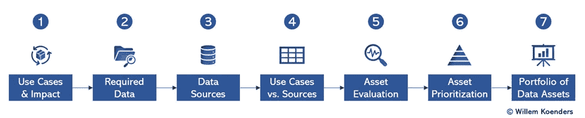

图 1——管理数据资产组合的 7 步法。图片由作者提供。

在我跟随的各种现实生活实例中，我采用了这种方法，但为了避免任何对数据来自特定客户的怀疑，同时展示生成性 AI 在正确提示下如何实际应用，我使用了 ChatGPT 4.0 生成这些示例。完整的聊天记录请见 [这里](https://chat.openai.com/share/2acbcb4e-e77c-437c-ab67-9f319c653c81)。

# 第一步：用例与影响

第一步是识别对组织重要的数据驱动用例。你不必一次性覆盖整个企业——可以从一个领域或业务线开始，这甚至可能是推荐的做法。

用例[是实现整体组织战略的具体机制](https://medium.com/@willemkoenders/my-simple-data-strategy-framework-c2cf90265d7a)。数据战略和数据治理本身并不会产生价值——它们只有在实现更广泛的战略目标时才会产生价值。因此，用例必须是第一步。

有多种方法可以实现这一目标。你可以通过访谈业务和分析领导者来内部建立用例库存。对于你的行业，你可以从外部来源拼凑出用例的概述。通常，最成功的方法是采用混合方法——引入外部用例列表，然后与内部领导者共同完善这一列表。

如上所述，本文的目的，我使用了[ChatGPT 4.0](https://chat.openai.com/share/2acbcb4e-e77c-437c-ab67-9f319c653c81)来建立库存，如下图 2 所示。例如，在财务与会计方面，*欺诈检测与预防*使用实时分析和机器学习模型结合客户和交易数据来识别模式并识别可疑事件。或者在市场营销与销售方面，作为*市场营销组合建模*的一部分，调查营销努力与销售业绩之间的历史关系，以优化营销预算的分配以及渠道和策略的使用。

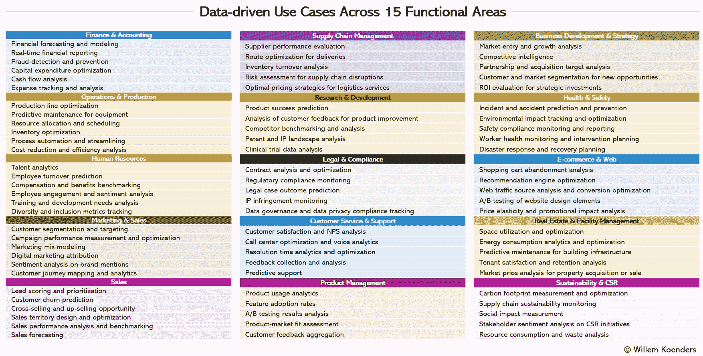

图 2 — 概述了 14 个业务和职能领域中的 90 个数据驱动用例。数据由 ChatGPT 4.0 生成，图像由作者提供。

拥有用例还不够——我们需要了解它们的重要性。用例可以通过 4 种关键方式驱动价值：

+   增加收入

+   降低成本

+   提升客户体验

+   缓解风险

有些人将“推动创新”列为第五个价值驱动因素，但在我看来，这只是时间表的问题，因为任何创新本身最终也会通过上述四种机制推动价值。

现在，在图 3 中，我们概览了与营销相关的用例以及与之相关的典型“营收影响”。实际上，对于我们刚刚介绍的*市场营销组合建模*（“MMM”）用例，我们看到“1 到 2%的营收影响”。如果你的公司年收入为 10 亿美元，这些估计表明*市场营销组合建模*可以额外带来 1000 万到 2000 万美元的收入。

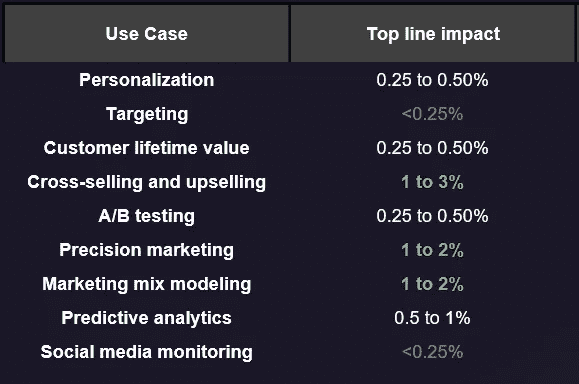

图 3 — 一组营销用例及其对整体企业收入的典型影响。来源：[识别数据驱动的用例与价值驱动树](https://medium.com/zs-associates/identifying-data-driven-use-cases-with-a-value-driver-tree-bd5795e26e21)（由作者共同撰写）。

在步骤 1 结束时，你会得到一组用例及其对组织的估计影响。

# 步骤 2：所需数据

在此步骤中，我们调查哪些数据是推动已识别的用例所需的。第一步是定义用例的关键数据输入是什么。例如，对于运营下的*产品线优化*，所需的数据包括生产量数据、机器性能日志和原材料可用性。或者对于人力资源下的*员工流失预测*，需要来自员工满意度调查、离职面谈反馈和行业流失率的数据。

一旦你拥有了部分或完整的用例列表，相应的 SMEs 或流程负责人可以帮助澄清需要哪些数据。随着你关键数据输入列表的增长，你将达到一个可以开始将数据分组到数据类型或领域中的阶段。在各个领域内，甚至在领域之间，这些数据类型和领域实际上相当稳定。几乎总是适用的数据领域包括客户（或相当于客户的类别，如学生、病人或会员）、员工和财务，因为大多数组织服务于某些人群，有员工来实现这一点，并且需要管理其预算。其他一些领域，如供应链或研究与安全数据，更为具体，可能仅适用于那些管理实际供应链的组织。

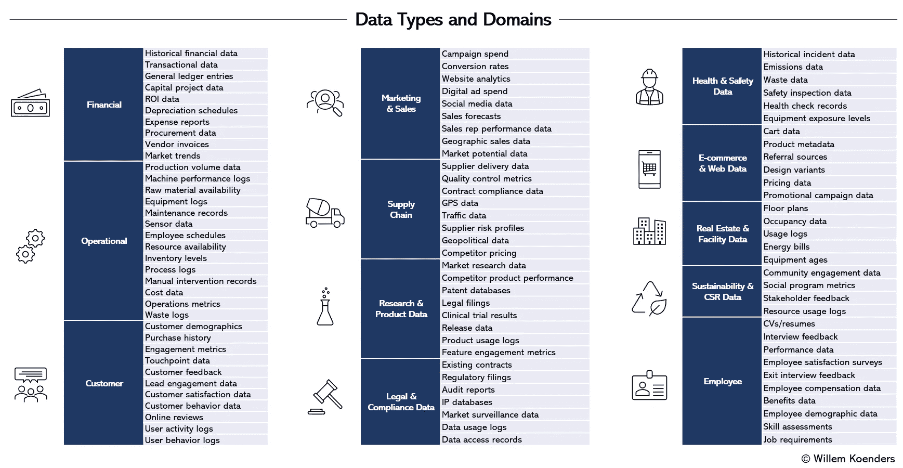

图 4 — 数据类型和领域概览。数据由 ChatGPT 4.0 生成，图像由作者提供。

上述图 4 展示了可能的结果。在那里，展示了 12 个数据领域和大约 100 个子领域。组织的所有数据可以映射回这里列出的类型。例如，营销与销售下的 Campaign Spend 数据可能包括有关数字广告、传统媒体活动和赞助的举措和成本的数据，而运营下的 Sensor Data 可能包括来自储存区域的温度传感器数据和监测工厂设备健康的振动传感器数据。

一旦你开始识别用例的关键数据输入，并将这些关键数据输入映射到数据类型或领域，你可以开始构建如图 5 所示的矩阵。在上述例子中，我们有*产品线优化*的用例，它被映射到运营数据领域，因为它确实需要运营数据。在图 5 中，用例被映射到更广泛的数据领域，以便在此处进行可视化，但在实际情况中，你可以（并且应该）将用例映射到更基础的、更加细化的子领域。

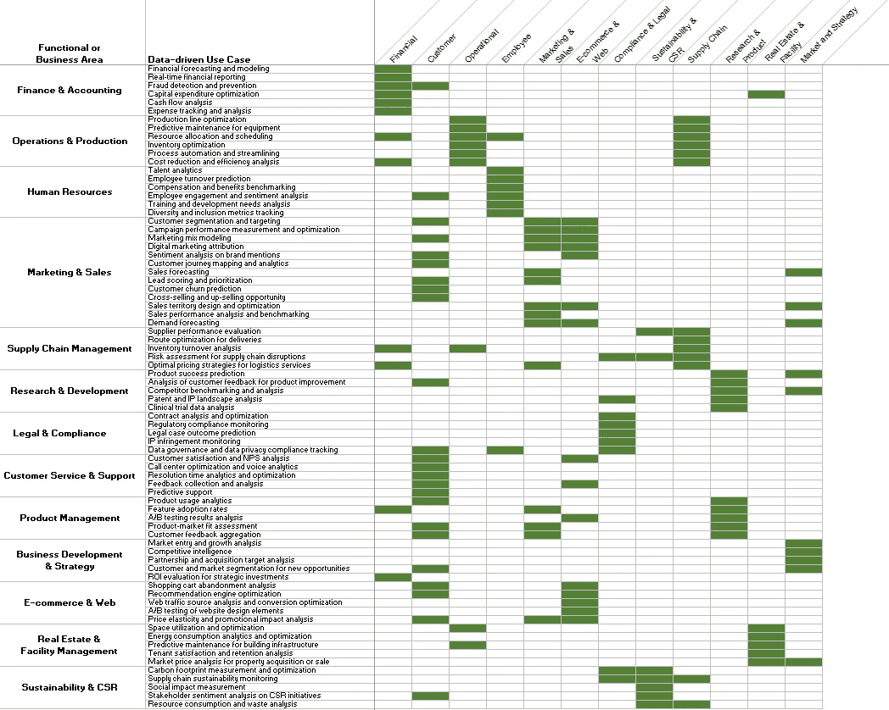

图 5 — 数据驱动的用例与数据类型的映射。数据由 ChatGPT 4.0 生成，并由作者完善；图像由作者提供。完整分辨率图像可应要求提供。

仅仅对这一点的全景理解——关键用例与其所需数据类型的映射——已经对制定数据战略和优先排序特定数据领域极其重要……但我们将更进一步，使其更具可操作性。

# 第 3 步：数据源

在我们根据第 2 步中的（逻辑）数据需求识别源系统之前，让我们先看一组用例并评估它们所需的数据。下图 6 展示了市场营销和销售用例的概述以及它们所依赖的关键数据。这与图 5 所示的内容一致，只是在更高的粒度层次上。

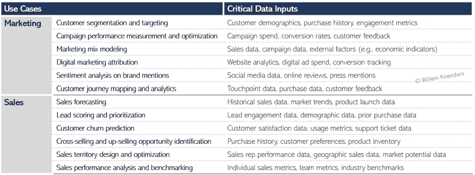

图 6 — 市场营销和销售的用例及其所需的关键数据输入。数据由 ChatGPT 4.0 生成，图片由作者提供。

例如，我们看到对于*客户细分与目标定位*的第一个用例，需要关于客户人口统计的数据。对于相关公司，这些数据存储在一个名为*全球 CRM*的物理系统中。同样，该用例所需的购买历史数据存储在两个系统中：*电子商务交易历史*和*零售销售点系统*。

如此等等。如果我们取出上面图 6 中的所有关键数据输入并识别源系统，我们将得到图 7 中的表格。正如你所看到的，一些数据源包含多种类型的关键数据。例如，*全球 CRM 主数据*包含客户人口统计数据，但也包括客户偏好、客户反馈和客户细分数据。

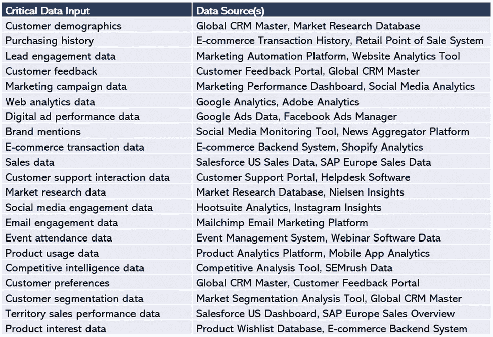

图 7 — 市场营销和销售用例的关键数据输入映射到该数据的源系统。数据由 ChatGPT 4.0 生成，图片由作者提供。

# 第 4 步：用例与源系统对比

我们识别了用例（第 2 步）所需的数据，然后将其映射到源系统（第 3 步）。现在可以创建的下一个视图是用例与源系统的映射，市场营销和销售的情况见下图 8。

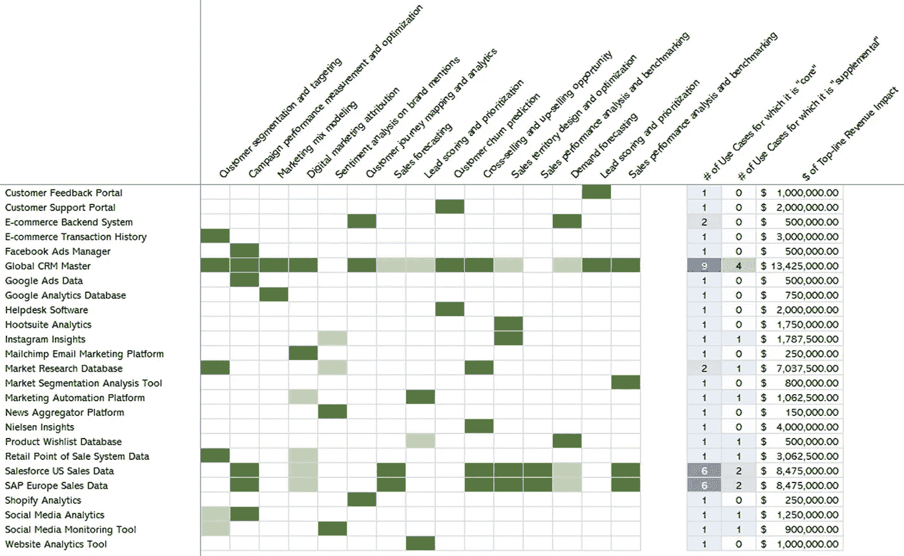

图 8 — 用例与源系统的映射。数据由 ChatGPT 4.0 生成，图片由作者提供。

在这里，深绿色表示数据对用例至关重要，浅绿色则表示数据是‘可有可无’或辅助的。例如，对于*客户细分与目标定位*，*全球 CRM 主数据*的数据至关重要，但*社交媒体分析*的数据则是‘可有可无’的。

但我们已经对用例了解了更多。事实上，在上面的第 1 步中，我们首先做的就是识别用例及这些用例可能驱动的增量收入。这使我们现在可以说一些关于依赖特定数据源的价值创造的事情。因为如果我们知道一个给定的数据集对 3 个用例至关重要，而这些用例分别预计能驱动 200 万、300 万和 500 万美元的增量收入，我们可以说 1000 万美元的收入依赖于这个数据集。

你不能在孤立的情况下完成这个练习 — 你需要与相关的用例和业务流程 SME（主题专家）及所有者进行接触。这可能需要一些时间来识别这些人，但一旦找到他们，你通常会发现他们是合作的，因为他们有确保用例成功的利益，因此需要澄清哪些数据是关键的以及它能带来的影响。

在进行过程中，你可以开始建立一个概览，如第 8 图右侧所示，其中顶线收入影响估计覆盖了所有对市场营销和销售用例至关重要的数据源。在这里要小心重复计算，并确保你解释和说明数字；例如，如果一个给定的用例具有 100 万美元的价值创造潜力，依赖于 2 个数据源，你不能说这两个数据源合起来驱动 200 万美元。

# 第 5 步：资产评估

在前一步中，我们将用例及其驱动的价值与一组数据源进行映射。现在我们知道这些数据源（可以）驱动价值，这意味着它们对公司具有内在价值，因此可以被视为*数据资产*。

虽然第 8 图已经非常有见地，但它还不能让我们优先考虑某些数据资产（及其投资）而非其他。如果一个给定的数据资产可以驱动很多价值，但它已经到位并且“适合目的”，可能不需要进一步的行动。

第 9 图呈现了四种数据资产评估状态，从“适合目的”到“缺失或存在大缺口”，使数据资产的评估保持一致。在这里，适合目的应广泛解读。在光谱的正面，这意味着正确的数据随时可用，具有正确的粒度和时效性；数据质量高且可靠，源系统从不宕机。在另一端，这意味着数据资产根本不存在，或者即使存在，数据也严重缺乏、不可靠和/或不完整。

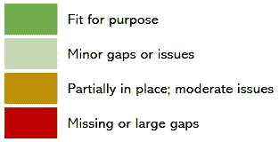

第 9 图 — 数据资产评估值。图片由作者提供。

我们现在拥有构建所谓热图的工具，其中“热点区域”（即红色或琥珀色部分）表示价值创造的机会，因为这些地方的用例无法依赖它们所需的关键数据 — 参见下图第 10 图。

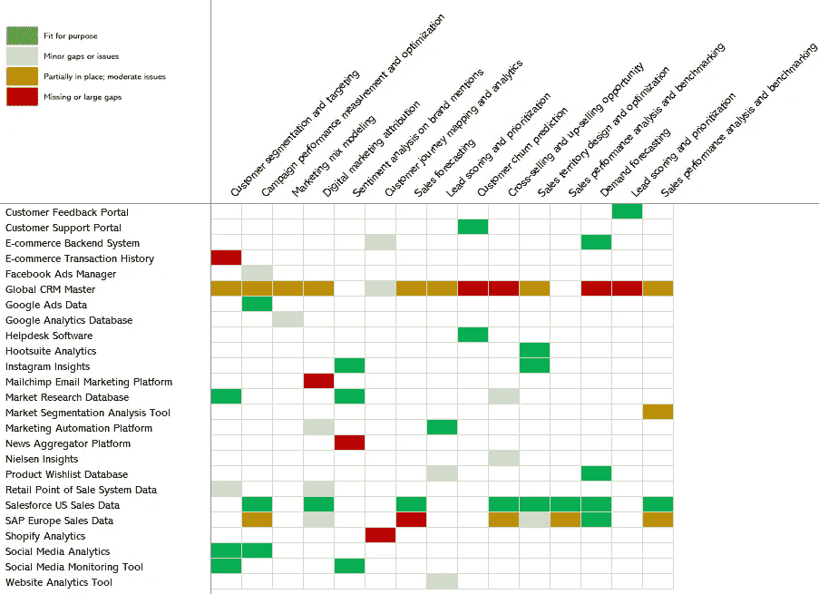

图 10 — 数据资产与用例的“热图”。图像由作者提供。

# 第 6 步：资产优先排序

下一步是根据我们现在对数据资产的了解来优先排序这些资产。图 11 展示了与图 10 相同的热图，但我重新加入了收入影响和依赖用例的数量。然后我重新排序了数据资产，将它们按产生的总收入影响降序排列。

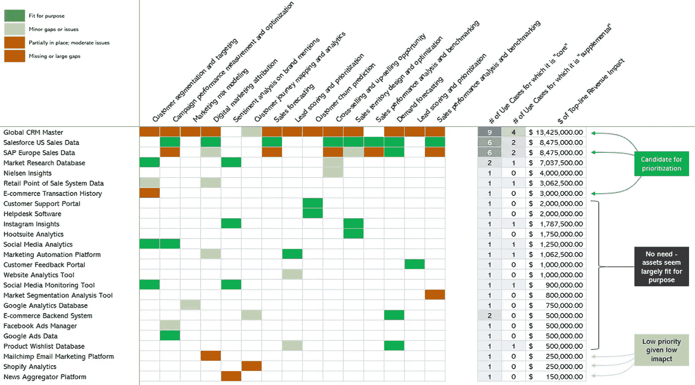

图 11 — 数据资产与用例及其驱动的价值的热图。图像由作者提供。

现在变得更清楚了哪些数据资产可以优先进行增强和投资。例如，很明显 *全球 CRM 主数据* 是一个大问题，因为它没有最佳地支持 9 (!) 个用例，影响超过 1300 万美元。各种数据资产，如 *Instagram Insights*、*客户支持门户* 和 *Google Ads 数据* 都是合适的，因此似乎不需要修复。然后我们有一些在底部的数据资产，如 *Shopify Analytics* 和 *新闻聚合平台*，这些数据资产可能尚未到位，但只支持 1 个用例，影响有限。

如果你是首席数据官，而这个全景图反映了你组织在特定领域的数据资产和用例，那么一个以影响为驱动的路线图将向你展开。显然有机会挑选一两个数据资产，并将其作为战略位置来提升战略性数据的治理。这可以用来嵌入和实现各种数据治理能力，如数据所有权和管理、元数据管理和数据质量，因为这些都是确保数据资产得到适当治理的关键。

# 第 7 步：数据资产组合

众所周知，首席数据官等数据领导者的预期任期很短，平均不到 2.5 年。这在很大程度上是因为首席数据官在短期到中期内难以实现有意义的业务影响。

这正是本观点中所述方法如此强大的原因——如果你按照步骤 1–6 中的逻辑来优先排序数据资产，你几乎可以确保产生影响。而且因为你从用例及其影响开始，你从一开始就与业务和职能部门进行了接触，因此避免了“为了数据而做数据”的陷阱，这将大大避免数据治理被视为成本和对业务的阻碍。

你还没完成。你所识别的数据资产是[类似于房地产投资组合中的属性](https://medium.com/zs-associates/the-best-way-to-explain-data-governance-to-beginners-c3b7a8feec15)——你需要主动管理它们，确保它们保持更新，数据用户继续满意，新的需求出现时被纳入，并且价值生成不是假设的，而是明确地跟踪记录。

下图 12 展示了我们在这一观点中分析的组织的数据资产投资组合仪表板。它显示了已认证的数据资产数量、与其映射的用例数量，以及通过增量收入和风险缓解创造的价值。

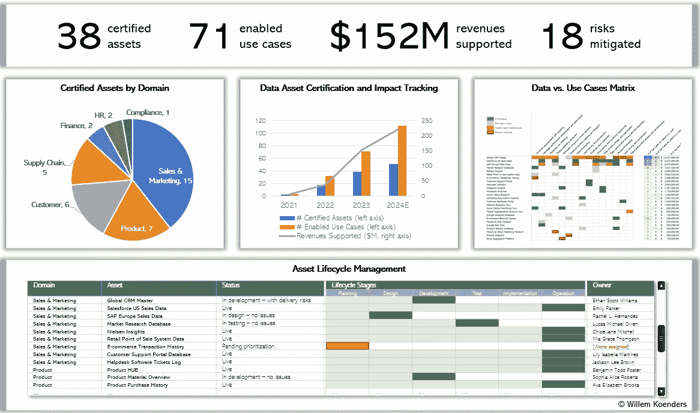

图 12——数据资产的仪表板。图像由作者提供。

在中心，你可以看到一个图表，跟踪了认证的数据资产数量随时间的变化，以及更关键的启用用例数量和通过收入表达的相关影响。这对首席数据官的职业生涯长久至关重要，能够证明通过有针对的数据启用和治理活动创造的价值。

在底部，你可以看到数据资产的管道视图。其中一些正在经过结构化的激活生命周期，而其他一些已经在使用中。你会看到我们之前调查的*全球 CRM 主数据*确实已被优先考虑——它目前处于“开发”阶段。

# 市场的轶事

图片由 [Lalit Kumar](https://unsplash.com/@klalit) 提供，通过 [Unsplash](https://unsplash.com/)。

正如在这一观点开始时提到的，我已经在欧洲和美国的多家公司中使用并完善了这种方法，涵盖了银行、保险、零售、技术和制造业。

在制造业的一个例子中，我们遵循了这里概述的 7 个步骤的略微调整版本。由于这是一个复杂的全球公司，识别整个组织中的用例并不可行。相反，我们选择了一个业务领域作为主要关注点，即商业部门，然后是市场营销和销售的子领域（类似于上面第 3 步中的用例范围）。

我们确定了一组约 30 个用例，其中大多数已经被定义用于其他目的。我们执行了一个简化的、加速版本的步骤 2-4，以识别所需的数据及其来源，并将用例与来源进行映射。我们跳到步骤 5，与用例所有者和主题专家沟通，询问他们是否有访问适合目的的数据。如果没有，那么缺少什么数据或来源——问题是什么？

我们很快确定了一组 8 个在所需数据方面有困难的使用案例，并发现 2 个特定的数据源对其中 6 个使用案例存在问题。我们没有继续扩展工作，而是开始了实际操作。与中央数据团队和商业团队一起，我们对这 2 个数据源进行了负责人分配，按照一套正式认证标准进行了评估，并制定了弥补差距的计划。

几个月后，第一个数据资产已经过增强和认证，以满足文档中描述的使用案例的需求。在撰写时，具体的影响还未被测量（因为影响需要时间来体现），但初步的轶事证据表明，营销效果可能提高了高个位数甚至双位数。不管怎样，相关的首席数据官能够引入并完善该方法，取得了小幅成功，并启动了一个涵盖更多资产、使用案例和领域的更广泛的路线图。

# 祝好运！

建立和管理数据组合并不一定简单或快速，但这是值得付出努力的。我希望这里列出的步骤对你有所帮助。我很想听听你的进展情况，如果你有反馈或自己的故事要分享，欢迎在评论中告诉我。

在数据资产赋能之旅中祝你一路顺风！
