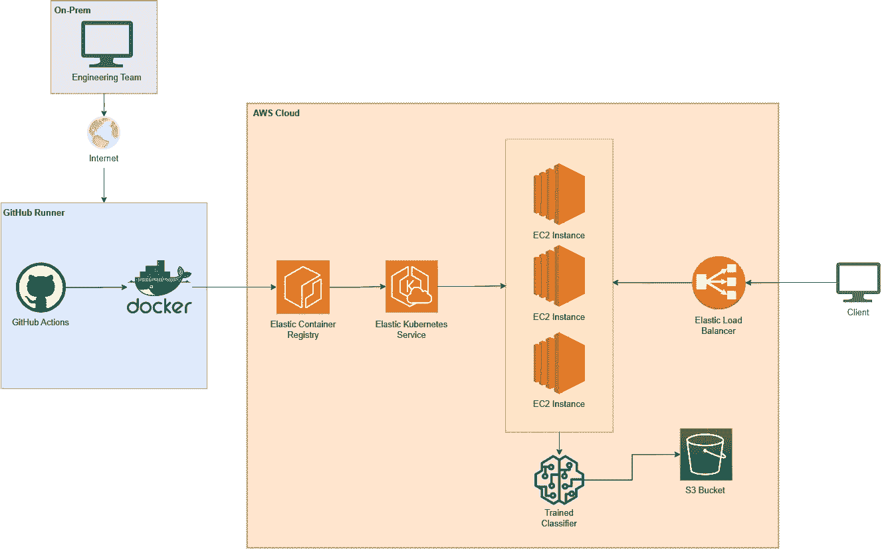
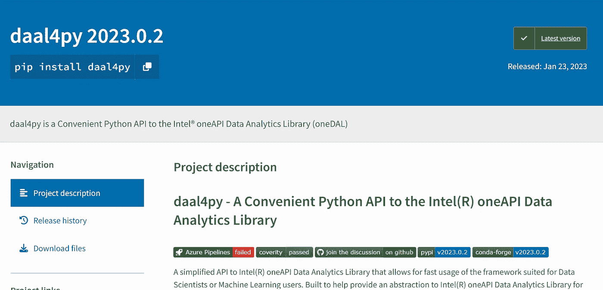
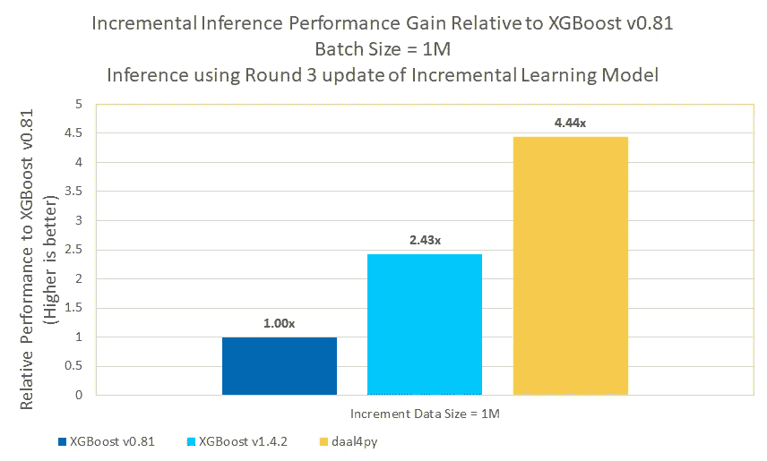
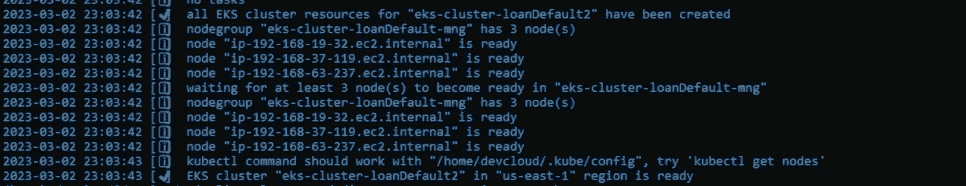
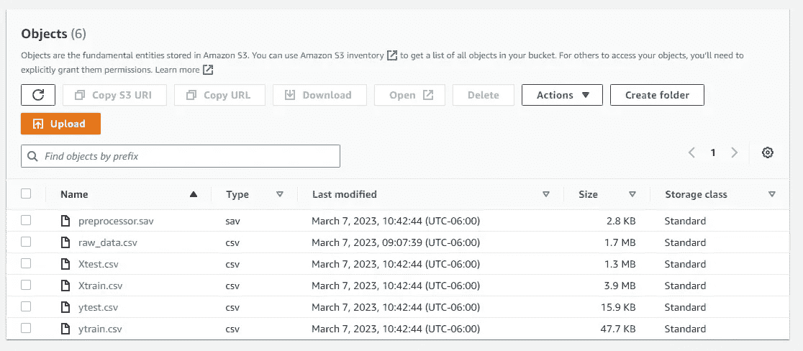
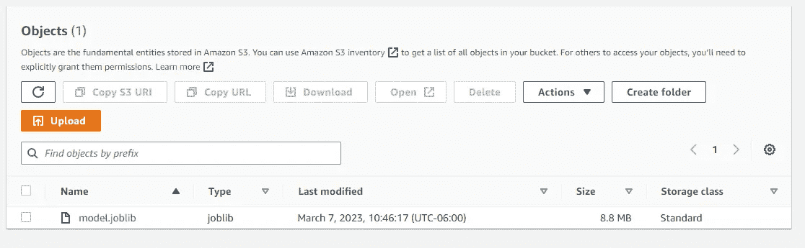
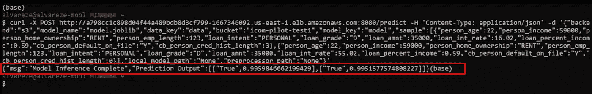

# 如何在 AWS 云上使用 Kubernetes 和 oneAPI 构建 ML 应用

> 原文：[`towardsdatascience.com/how-to-build-distributed-ml-applications-on-the-aws-cloud-with-kubernetes-and-oneapi-81535012d136?source=collection_archive---------9-----------------------#2023-03-17`](https://towardsdatascience.com/how-to-build-distributed-ml-applications-on-the-aws-cloud-with-kubernetes-and-oneapi-81535012d136?source=collection_archive---------9-----------------------#2023-03-17)


[图片来源](https://www.freepik.com/free-photo/business-network-background-connecting-dots-technology-design_21629783.htm#query=distributed&position=1&from_view=search&track=sph)

## 学习 Kubernetes 和 Intel AI Analytics Toolkit 的基础知识，以构建分布式 ML 应用

[](https://eduand-alvarez.medium.com/?source=post_page-----81535012d136--------------------------------)[](https://towardsdatascience.com/?source=post_page-----81535012d136--------------------------------) [Eduardo Alvarez](https://eduand-alvarez.medium.com/?source=post_page-----81535012d136--------------------------------)

·

[关注](https://medium.com/m/signin?actionUrl=https%3A%2F%2Fmedium.com%2F_%2Fsubscribe%2Fuser%2Fe49cc416a8ef&operation=register&redirect=https%3A%2F%2Ftowardsdatascience.com%2Fhow-to-build-distributed-ml-applications-on-the-aws-cloud-with-kubernetes-and-oneapi-81535012d136&user=Eduardo+Alvarez&userId=e49cc416a8ef&source=post_page-e49cc416a8ef----81535012d136---------------------post_header-----------) 发表在 [Towards Data Science](https://towardsdatascience.com/?source=post_page-----81535012d136--------------------------------) ·12 min 阅读·2023 年 3 月 17 日[](https://medium.com/m/signin?actionUrl=https%3A%2F%2Fmedium.com%2F_%2Fvote%2Ftowards-data-science%2F81535012d136&operation=register&redirect=https%3A%2F%2Ftowardsdatascience.com%2Fhow-to-build-distributed-ml-applications-on-the-aws-cloud-with-kubernetes-and-oneapi-81535012d136&user=Eduardo+Alvarez&userId=e49cc416a8ef&source=-----81535012d136---------------------clap_footer-----------)

--

[](https://medium.com/m/signin?actionUrl=https%3A%2F%2Fmedium.com%2F_%2Fbookmark%2Fp%2F81535012d136&operation=register&redirect=https%3A%2F%2Ftowardsdatascience.com%2Fhow-to-build-distributed-ml-applications-on-the-aws-cloud-with-kubernetes-and-oneapi-81535012d136&source=-----81535012d136---------------------bookmark_footer-----------)

构建和部署高性能 AI 应用程序可能是一项具有挑战性的任务，需要大量的计算资源和专业知识。幸运的是，现代技术如 Kubernetes、Docker 和 Intel AI Analytics Toolkit ([AI Kit](https://www.intel.com/content/www/us/en/developer/tools/oneapi/ai-analytics-toolkit.html)) 使得开发和部署优化性能和可扩展性的 AI 应用程序变得更加容易。此外，通过使用像 Amazon Web Services (AWS) 这样的云服务，开发人员可以进一步简化流程，利用云提供的灵活和可扩展的基础设施。

在本文中，我们将探讨如何使用 Kubernetes、Docker 和 Intel AI Analytics Toolkit 在 AWS 云上构建和部署 AI 应用程序。具体而言，我们将重点关注第一个 Intel 云优化模块，它作为一个模板，包含各种 AI 工作负载的 Intel 加速方案。我们还将介绍在过程中使用的 AWS 服务，包括 Amazon Elastic Kubernetes Service (EKS)、Amazon Elastic Container Registry (ECR)、Amazon Elastic Compute Cloud (EC2) 和 Elastic Load Balancer (ELB)。



图 1\. 该架构设计用于 AI 生产场景，其中需要训练许多离散模型，并且计算需求较低至中等。 — 作者提供的图片

我们将部署的示例应用程序聚焦于贷款违约预测，这是金融行业中的一个常见问题。我们将使用 daal4Py 库来加速 XGBoost 分类器的推理，使我们能够在减少训练和部署模型所需时间的同时实现高性能。



图 2\. 一个简化的 Intel(R) oneAPI 数据分析库 API，允许数据科学家或机器学习用户快速使用该框架。旨在帮助提供对 Intel(R) oneAPI 数据分析库的抽象，以便直接使用或集成到自己的框架中。 — [图片来源](https://pypi.org/project/daal4py/)

在本文结束时，读者将对如何使用 Kubernetes、Docker 和 Intel AI Analytics Toolkit 在 AWS 云上构建和部署高性能 AI 应用程序有基本的了解。此外，他们还将获得一个实际示例，展示如何利用这些技术加速贷款违约预测模型的推理。

*你可以在我们的公共* [*GitHub 仓库*](https://github.com/intel/kubernetes-intel-aws-high-availability-training)*中找到本教程的所有源代码。*

## 准备你的开发环境

**安装 AWS CLI —** AWS CLI（命令行界面）工具是一个用于管理各种 Amazon Web Services (AWS) 资源和服务的命令行工具。

```py
curl "https://awscli.amazonaws.com/awscli-exe-linux-x86_64.zip" -o "awscliv2.zip"
sudo apt install unzip
unzip awscliv2.zip
sudo ./aws/install
```

使用`aws configure`配置 AWS 凭证 — 了解更多有关使用 aws cli 设置凭证的信息，请点击[这里](https://docs.aws.amazon.com/cli/latest/userguide/cli-configure-quickstart.html)。

**安装 eksctl** — eksctl 是一个用于在 EKS 上创建、管理和操作 Kubernetes 集群的命令行工具。

```py
curl --silent --location "https://github.com/weaveworks/eksctl/releases/latest/download/eksctl_$(uname -s)_amd64.tar.gz" | tar xz -C /tmp
sudo mv /tmp/eksctl /usr/local/bin
eksctl version
```

**安装 aws-iam-configurator** — AWS IAM Authenticator 是一个命令行工具，使用户能够使用其 AWS IAM 凭证与 EKS 上的 Kubernetes 集群进行身份验证。

```py
curl -Lo aws-iam-authenticator https://github.com/kubernetes-sigs/aws-iam-authenticator/releases/download/v0.5.9/aws-iam-authenticator_0.5.9_linux_amd64
chmod +x ./aws-iam-authenticator
mkdir -p $HOME/bin && cp ./aws-iam-authenticator $HOME/bin/aws-iam-authenticator && export PATH=$PATH:$HOME/bin
echo 'export PATH=$PATH:$HOME/bin' >> ~/.bashrc
aws-iam-authenticator help
```

**安装 kubectl** — Kubectl 是一个命令行工具，用于与 Kubernetes 集群进行交互。它允许用户部署、检查和管理 Kubernetes 集群上运行的应用程序和服务，并执行各种管理任务，如扩展、更新和删除资源。

```py
curl -LO "https://dl.k8s.io/release/$(curl -L -s https://dl.k8s.io/release/stable.txt)/bin/linux/amd64/kubectl"
curl -LO "https://dl.k8s.io/$(curl -L -s https://dl.k8s.io/release/stable.txt)/bin/linux/amd64/kubectl.sha256"
echo "$(cat kubectl.sha256)  kubectl" | sha256sum --check
sudo install -o root -g root -m 0755 kubectl /usr/local/bin/kubectl
```

## **我们的贷款违约预测应用程序**

我们将要部署的应用程序基于[贷款违约风险预测 AI 参考套件](https://www.intel.com/content/www/us/en/developer/articles/reference-kit/loan-default-risk-prediction.html)。


[图片来源](https://www.freepik.com/free-photo/loan-buy-house-pressure-buy-house_28492444.htm#query=loan&position=32&from_view=search&track=sph)

我们将参考解决方案中的代码进行了重构，使其更加模块化，以支持我们的三个主要 API：

+   **数据处理** — 该端点预处理数据并将其存储在数据湖或其他结构化格式中。此代码库还处理用于基准测试的数据集扩展。

+   **模型训练** — 该端点训练一个 XGBoost 分类器，并将其转换为推理优化的 daal4py 格式。

+   **推理** — 该端点接收一个包含原始数据的负载，并返回每个样本的贷款违约分类。

下面的目录树概述了代码库的各种脚本、资产和配置文件。大多数 ML 应用程序代码位于[app/文件夹](https://github.com/intel/kubernetes-intel-aws-high-availability-training/tree/main/app)。该文件夹包含[loan_default](https://github.com/intel/kubernetes-intel-aws-high-availability-training/tree/main/app/loan_default)和[utils](https://github.com/intel/kubernetes-intel-aws-high-availability-training/tree/main/app/utils)包 — loan_default 包包含支持我们三个主要 API 的服务器端 Python 模块。[server.py](https://github.com/intel/kubernetes-intel-aws-high-availability-training/blob/main/app/server.py)脚本包含 FastAPI 端点配置、负载数据模型和启动 uvicorn 服务器的命令。

```py
├───app/
|   ├───loan_default/
|   |   ├───__init__.py
|   |   ├───data.py
|   |   ├───model.py
|   |   └───predict.py
|   ├───utils/
|   |   ├───__init__.py
|   |   ├───base_model.py
|   |   ├───logger.py
|   |   └───storage.py  
|   ├───logs/
|   ├───server.py
|   └───requirements.txt    
|
├───kubernetes/
|   ├───cluster.yaml
|   ├───deployment.yaml
|   ├───service.yaml
|   └───serviceaccount.yaml
|
├─README.md
├─Dockerfile
├─SECURITY.md
```

深入代码库超出了本教程的范围。然而，值得指出的是，我们在哪里利用 daal4py 来提高推理性能。在 [model.py](https://github.com/intel/kubernetes-intel-aws-high-availability-training/blob/main/app/loan_default/model.py) 文件中，你会找到“train”方法，该方法处理模型训练并使用 `d4p.get_gbt_model_from_xgboost()` 函数将模型转换为 daal4py 格式。

```py
def train(self):
        # define model
        params = {
            "objective": "binary:logistic",
            "eval_metric": "logloss",
            "nthread": 4,  # flags.num_cpu
            "tree_method": "hist",
            "learning_rate": 0.02,
            "max_depth": 10,
            "min_child_weight": 6,
            "n_jobs": 4,  # flags.num_cpu,
            "verbosity": 0,
            "silent": 1,
        }

        log.info("Training XGBoost model")
        self.clf = xgb.train(params, self.DMatrix, num_boost_round=500)
        self.clf = d4p.get_gbt_model_from_xgboost(self.clf)
```

在原始参考工具包的性能测试中，这一简单转换导致了大约 4.44 倍的性能提升（图 3）。



图 3\. 对于大小为 1M 的批量推理，Intel® v1.4.2 提供了比标准 XGBoost v0.81 高达 1.34 倍的加速，使用 Intel® oneDAL 时，高达 4.44 倍的加速。— 图片由作者提供

## 配置和启动 Elastic Kubernetes Service 集群

Elastic Kubernetes Service 是一种完全托管的服务，它使得在 Amazon Web Services (AWS) 上使用 Kubernetes 部署、管理和扩展容器化应用变得容易。它消除了在自己的基础设施上安装、操作和扩展 Kubernetes 集群的需要。

要启动我们的 EKS 集群，我们必须首先创建我们的 [集群配置文件](https://github.com/intel/kubernetes-intel-aws-high-availability-training/blob/main/kubernetes/cluster.yaml)。

```py
apiVersion: eksctl.io/v1alpha5
kind: ClusterConfig

metadata:
  name: "eks-cluster-loanDefault"
  version: "1.23"
  region: "us-east-1"

managedNodeGroups:
- name: "eks-cluster-loanDefault-mng"
  desiredCapacity: 3
  instanceType: "m6i.large"
```

我们可以在“metadata”部分配置集群部署的名称和区域，以及我们希望运行的 EKS 版本。最重要的是，我们可以在“managedNodeGroups”部分配置计算资源的基本需求：

+   desiredCapacity — 创建堆栈时要扩展到的节点数量。在本教程中，我们将其设置为 3。

+   instanceType — 节点的实例类型。本教程使用 **m6i.large** 实例，即第三代 Xeon（2vCPU 和 8GiB）。一旦开放使用，我们建议尝试 [**r7iz** 实例系列](https://aws.amazon.com/ec2/instance-types/r7iz/) 以利用 [Intel 高级矩阵扩展 (AMX)](https://www.intel.com/content/www/us/en/products/docs/accelerator-engines/advanced-matrix-extensions/overview.html) —— 这是专为深度学习工作负载设计的加速器，内置于 [Intel 第四代 Xeon CPUs](https://www.intel.com/content/www/us/en/newsroom/news/4th-gen-xeon-scalable-processors-max-series-cpus-gpus.html) 中。

我们执行 `eksctl create cluster -f cluster.yaml` 以创建 Cloud Formation 堆栈并配置所有相关资源。根据当前配置，此过程应需要 10 到 15 分钟。你应该会看到类似图 4 的日志。



图 4\. EKS 集群配置工作流的 Cloud Formation 日志 — 图片由作者提供

你应该运行一个快速测试以确保你的集群已正确配置。运行 `eksctl get cluster` 以获取可用集群的名称，运行 `eksctl get nodegroup --cluster <cluster name>` 以检查集群的节点组。

## 设置所有 Kubernetes 应用程序资源

让我们深入了解如何启动您的 Kubernetes 应用程序。此过程包括创建命名空间、部署清单和 Kubernetes 服务。所有这些文件都可以在 [教程的代码库](https://github.com/intel/kubernetes-intel-aws-high-availability-training) 中找到。

**在继续本部分教程之前，请：**

+   [使用应用程序代码库中的 Dockerfile 创建 docker 镜像，并将其推送到 AWS 的 Elastic Container Registry。](https://medium.com/@eduand-alvarez/creating-an-ecr-registry-and-pushing-a-docker-image-93e372e74ff7)

+   [创建并配置您的 Kubernetes 服务账户，以授予应用程序对 S3 资源的适当访问权限。](https://eduand-alvarez.medium.com/how-to-assign-aws-service-permissions-to-kubernetes-resources-cb1e0257ca22?sk=6a2c485933741deacd4f39a46e90bf22)


作者提供的图像

Kubernetes 命名空间是一个虚拟集群，将物理集群中的资源划分和隔离。我们来创建一个名为“loan-default-app”的命名空间。

```py
kubectl create namespace loan-default-app
```

现在，让我们配置我们的 Kubernetes [部署清单](https://github.com/intel/kubernetes-intel-aws-high-availability-training/blob/main/kubernetes/deployment.yaml)。Kubernetes 部署是一种 Kubernetes 资源，允许您声明性地管理给定应用程序的一组副本 pod，确保所需数量的副本始终运行并可用，同时启用如扩展、滚动更新和回滚等功能。它还提供了对 pod 的抽象层，允许您定义应用程序的期望状态，而无需担心底层基础设施。

```py
apiVersion: apps/v1
kind: Deployment
metadata:
  name: "eks-loan-default-app"
  namespace: "loan-default-app"
  labels:
    app: "loan-default"
spec:
  replicas: 3
  selector:
    matchLabels:
      app: "loan-default"
  template:
    metadata:
      labels:
        app: "loan-default"
    spec:
     serviceAccountName: "loan-default-service-account"
     topologySpreadConstraints:
        - maxSkew: 1
          topologyKey: kubernetes.io/hostname
          whenUnsatisfiable: ScheduleAnyway
          labelSelector:
            matchLabels:
              app: "loan-default"
     containers:
       - name: "loan-app-image"
         image: <insert image uri>
         ports:
           - containerPort: 80
         imagePullPolicy: "Always"
```

上面的 Kubernetes 部署清单（deployment.yaml）定义了以下内容：

+   kind: Deployment — Kubernetes 资源的类型

+   name: “eks-loan-default-app” — 我们的部署名称

+   namespace: “loan-default-app” — 此部署应分配的命名空间

+   app: “loan-default” — 我们为应用程序分配的名称

+   replicas: 3 — 要创建并始终维持的 pod 复制品数量。

+   serviceAccountName: “loan-default-service-account” — 确保这与您之前创建的服务账户匹配。

+   topologySpreadConstraints: — 帮助定义 pod 应如何在集群中分布。当前配置将保持 pod 在可用节点上的均匀分布。

+   containers: name/image — 在这里提供应用程序容器镜像的 URI，并为镜像分配一个名称。

运行 `kubectl apply -f deployment.yaml` 以创建您的 Kubernetes 部署。

现在让我们配置我们的 Kubernetes [服务](https://github.com/intel/kubernetes-intel-aws-high-availability-training/blob/main/kubernetes/service.yaml)。Kubernetes 服务是一个抽象层，为运行相同应用程序的一组 pods 提供稳定的 IP 地址和 DNS 名称，使客户端可以访问该应用程序，而无需知道单个 pods 的具体 IP 地址。它还提供了一种在多个应用程序副本之间负载均衡流量的方法，并可用于定义外部访问的入口规则。

```py
apiVersion: v1
kind: Service
metadata:
  name: "loan-default-service"
  namespace: "loan-default-app"

spec:
  ports:
  - port: 8080
    targetPort: 5000
  selector:
    app: "loan-default"
  type: "LoadBalancer"
```

上面的 Kubernetes 服务清单（service.yaml）定义了以下内容：

+   kind: Service — Kubernetes 资源的类型。

+   name: “loan-default-service” — 我们部署的名称。

+   namespace: “loan-default-app” — 该服务应分配到的命名空间。

+   port: 8080 — 服务将监听的端口。

+   targetPort: 5000 — 服务与 pod 之间通信的端口。

+   app: “loan-default” — 我们为应用程序指定的名称。

+   type: “LoadBalancer” — 我们选择的服务类型。

运行`kubectl apply -f service.yaml`以创建你的 Kubernetes 服务。

这将自动启动一个 Elastic Load Balancer — 一项云服务，它将传入的网络流量分配到多个目标，如 EC2 实例、容器和 IP 地址，以提高应用程序的可用性和容错性。我们可以使用 ELB 的公共 DNS 从全球任何地方向我们的 API 端点发起请求。

在继续之前，这里有一些提示：

+   运行`kubectl get all -n loan-default-app`以获取你所配置的 Kubernetes 资源的全面概述。你应该能看到你的 pods、服务和副本组。

+   运行`kubectl -n loan-default-app describe pod <pod-id>`以获取有关你的 pod 的详细描述。

+   如果你需要诊断特定 pod 的行为，可以通过运行`kubectl exec -it <pod-id> -n loan-default-app -- bash`在 pod 内启动一个 bash shell — 输入 exit 并按回车键退出 shell。

## 测试我们的贷款违约预测 Kubernetes 应用程序

现在我们的基础设施已经到位，我们可以设置应用程序的数据组件并测试我们的端点。

我们将开始 [从 Kaggle 下载数据集](https://www.kaggle.com/datasets/laotse/credit-risk-dataset)。用于本演示的数据集是一个包含 32581 个模拟贷款的数据集。它有 11 个特征，包括客户和贷款特征，以及一个标签，即贷款的结果。一旦我们在工作目录中获得了 .csv 文件，我们可以创建一个 S3 桶并上传我们的 Kaggle 数据集。

```py
# create S3 Bucket for data
aws s3api create-bucket --bucket loan-default --region us-east-1

# upload dataset
aws s3api put-object --bucket loan-default --key data/credit_risk_dataset.csv --body <local path to data
```

**向我们的 API 端点发起 HTTP 请求**

我们将使用 Curl 来向我们的服务器发送 HTTP 请求。Curl 允许你通过提供一个命令行接口来发送 HTTP 请求，在这个接口中，你可以指定 URL、请求方法、头部信息和数据。然后，它处理建立连接、发送请求和接收响应的底层细节，使得自动化 HTTP 交互变得容易。

我们将从向我们的数据处理端点发送请求开始。这将创建测试/训练文件，并将我们的预处理管道保存为 .sav 文件到 S3。请求的主体需要以下参数：

+   bucket: S3 桶的名称

+   key: 你的原始数据在 S3 中保存的路径

+   size: 你想处理的样本总数

+   backend: 选项包括“local”或“s3” — 代码库支持在本地运行整个应用程序以进行调试。当使用“s3”后端时，“local_path”和“target_path”参数可以设置为“None”。

```py
curl -X POST <loadbalancerdns>:8080/data -H 'Content-Type: application/json' -d '{"bucket":"loan-default","backend":"s3","key":"data/credit_risk_dataset.csv","target_path":"None","local_path":"None","size":400000}'
```

你可以在 AWS 控制台中导航到你的 S3 桶，以验证所有文件是否已正确生成（图 5）。



图 5\. S3 桶包含由我们 /data 端点生成的输出 — 图片由作者提供

现在我们准备训练我们的 XGBoost 分类器模型。我们将向我们的 /train 端点发出请求，这将训练我们的模型，将其转换为 daal4py 格式，并保存到 S3。请求的主体需要以下参数：

+   bucket: S3 桶的名称

+   data_key: 包含由我们数据处理 API 创建的处理数据的文件夹路径

+   model_key: 我们希望存储训练模型的文件夹

+   model_name: 我们希望给训练模型起的名字

+   backend: 选项包括“local”或“s3” — 代码库支持在本地运行整个应用程序以进行调试。当使用“s3”后端时，“local_model_path”和“local_data_path”参数可以设置为“None”。

```py
curl -X POST <loadbalancerdns>:8080/train -H 'Content-Type: application/json' -d '{"bucket":"loan-default","backend":"s3","local_model_path":"None","data_key":"data","model_key":"model","model_name":"model.joblib","local_data_path":"None"}'
```

你可以在 AWS 控制台中导航到你的 S3 桶，以验证你的模型文件是否已创建（图 6）。



图 6\. S3 桶包含由我们 /train 端点生成的输出 — 图片由作者提供

现在我们已经有了一个训练过的 daal4py 优化的 XGBoost 分类器，我们可以向我们的 API 发出推断请求。/predict 端点将返回一个二元分类，True 表示高违约可能性，False 表示低违约可能性。响应还包括分类器生成的概率。在代码库中，我们将任何超过 50% 的概率标记为高违约可能性。这可以调整为返回更离散的标签，如低、中和高违约可能性。请求的主体需要以下参数：

+   bucket: S3 桶的名称

+   model_name: 训练模型的名称是 S3

+   data_key: 包含 .sav 处理管道文件的文件夹路径（应与处理数据的文件夹相同）

+   model_key: 你训练的模型在 S3 中保存的文件夹

+   示例：将你的模型输入作为字典列表

+   后端：选项包括“local”或“s3” — 代码库支持在本地运行整个应用程序以进行调试。当使用“s3”后端时，可以将“local_model_path”和“preprocessor_path”参数设置为“None”。

```py
curl -X POST <loadbalancerdns>:8080/predict -H 'Content-Type: application/json' -d '{"backend":"s3","model_name":"model.joblib","data_key":"data","bucket":"loan-default","model_key":"model","sample":[{"person_age":22,"person_income":59000,"person_home_ownership":"RENT","person_emp_length":123,"loan_intent":"PERSONAL","loan_grade":"D","loan_amnt":35000,"loan_int_rate":16.02,"loan_percent_income":0.59,"cb_person_default_on_file":"Y","cb_person_cred_hist_length":3},{"person_age":22,"person_income":59000,"person_home_ownership":"RENT","person_emp_length":123,"loan_intent":"PERSONAL","loan_grade":"D","loan_amnt":35000,"loan_int_rate":55.02,"loan_percent_income":0.59,"cb_person_default_on_file":"Y","cb_person_cred_hist_length":0}],"local_model_path":"None","preprocessor_path":"None"}'
```

你可以很快收到服务器的响应（见图 7）。



图 7\. /predict 端点的有效载荷和响应 — 作者提供的图像

你可以在我们的公共 [GitHub 仓库](https://github.com/intel/kubernetes-intel-aws-high-availability-training) 找到本教程的所有源代码。如果你有任何问题，欢迎留言或 [在 LinkedIn 上联系我](https://www.linkedin.com/in/eduandalv/)。

# 总结与讨论

在本教程中，我们展示了如何在 AWS 云上基于高可用性解决方案架构构建 Kubernetes 应用程序。我们重点介绍了使用英特尔 Xeon 处理器和 AI Kit 组件来提高性能，同时实现与 Kubernetes 的扩展。

我们鼓励读者关注即将举办的研讨会和未来的英特尔云优化模块（ICOMs），因为利用这些模块中的英特尔优化可以使他们的应用程序获得“由英特尔加速”徽章。

我们的 ICOMs 目标是帮助开发人员通过英特尔的软件和硬件提升应用程序的性能和可扩展性。随着对高性能云应用程序的需求增加，开发人员需要保持信息更新，利用最新的技术和工具。

***别忘了关注*** [***我的个人资料以获取更多类似文章***](https://eduand-alvarez.medium.com/) ***！***
