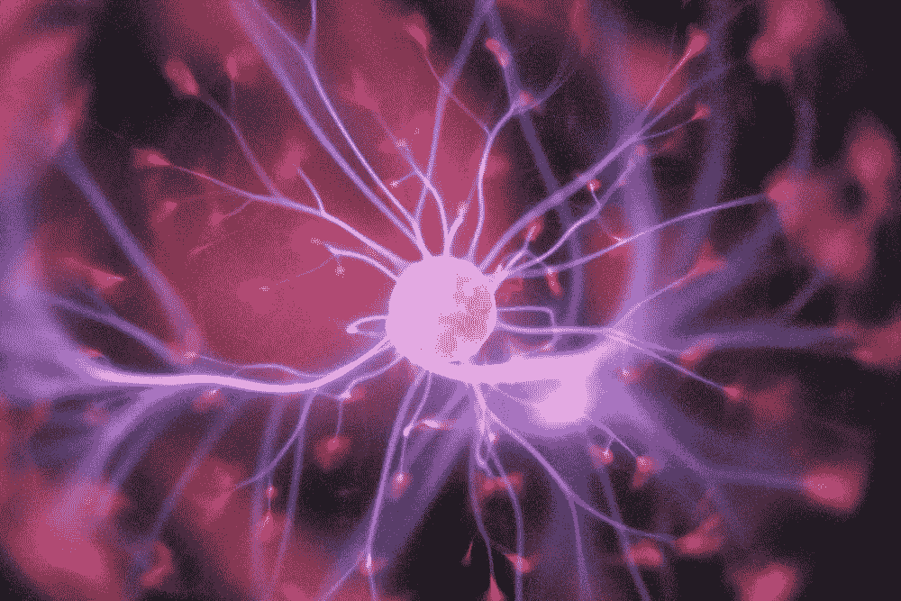
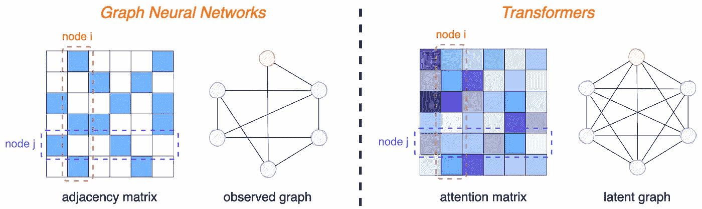
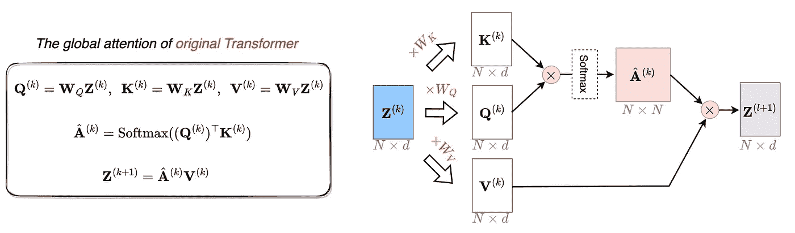
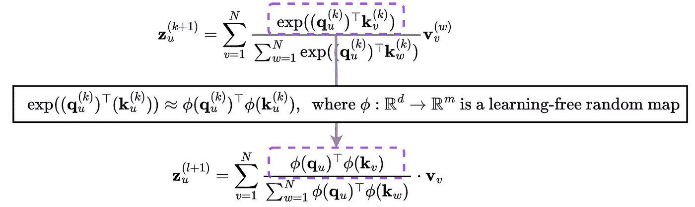
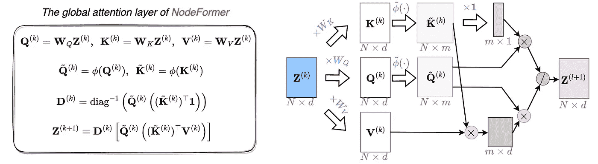
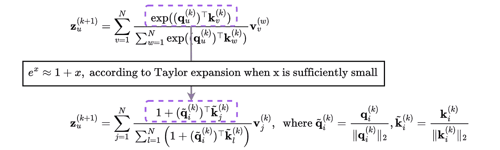
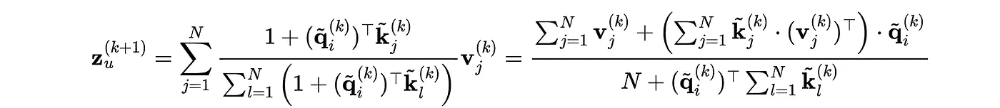
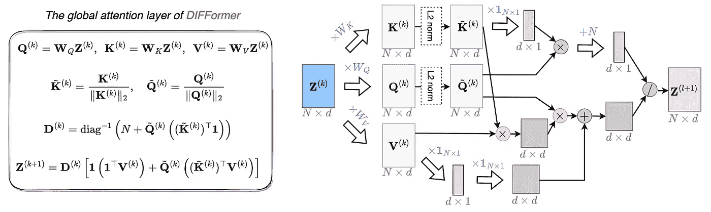

# 如何构建具有 O(N) 复杂度的图 Transformer

> 原文：[`towardsdatascience.com/how-to-build-graph-transformers-with-o-n-complexity-d507e103d30a?source=collection_archive---------6-----------------------#2023-04-19`](https://towardsdatascience.com/how-to-build-graph-transformers-with-o-n-complexity-d507e103d30a?source=collection_archive---------6-----------------------#2023-04-19)

## 大图网络 Transformer 教程

[](https://medium.com/@qitianwu228?source=post_page-----d507e103d30a--------------------------------)[](https://towardsdatascience.com/?source=post_page-----d507e103d30a--------------------------------) [Qitian Wu](https://medium.com/@qitianwu228?source=post_page-----d507e103d30a--------------------------------)

·

[关注](https://medium.com/m/signin?actionUrl=https%3A%2F%2Fmedium.com%2F_%2Fsubscribe%2Fuser%2F268302525672&operation=register&redirect=https%3A%2F%2Ftowardsdatascience.com%2Fhow-to-build-graph-transformers-with-o-n-complexity-d507e103d30a&user=Qitian+Wu&userId=268302525672&source=post_page-268302525672----d507e103d30a---------------------post_header-----------) 发表在 [Towards Data Science](https://towardsdatascience.com/?source=post_page-----d507e103d30a--------------------------------) ·7 分钟阅读·2023 年 4 月 19 日[](https://medium.com/m/signin?actionUrl=https%3A%2F%2Fmedium.com%2F_%2Fvote%2Ftowards-data-science%2Fd507e103d30a&operation=register&redirect=https%3A%2F%2Ftowardsdatascience.com%2Fhow-to-build-graph-transformers-with-o-n-complexity-d507e103d30a&user=Qitian+Wu&userId=268302525672&source=-----d507e103d30a---------------------clap_footer-----------)

--

[](https://medium.com/m/signin?actionUrl=https%3A%2F%2Fmedium.com%2F_%2Fbookmark%2Fp%2Fd507e103d30a&operation=register&redirect=https%3A%2F%2Ftowardsdatascience.com%2Fhow-to-build-graph-transformers-with-o-n-complexity-d507e103d30a&source=-----d507e103d30a---------------------bookmark_footer-----------)

图片： [Unsplash](https://unsplash.com/photos/OgvqXGL7XO4)。

构建强大的图 Transformer 已成为图机器学习社区的热门话题，因为最近的研究表明，纯 Transformer 基础的模型在许多 GNN 基准测试中表现出色，甚至优于其他模型（可以参见一些典型的工作 [1, 2, 3]）。

然而，挑战在于 Transformers 的关键设计[4]，即注意力机制，通常需要**相对于输入标记的二次复杂度**。在图学习的背景下，Transformers 的输入标记是图中的节点，旨在捕捉节点间长距离交互的全局注意力对于具有任意数量节点的图而言难以扩展。例如，在常见的节点分类数据集 Pubmed（约 10K 节点）上，*在 16GB 内存的 GPU 上运行一个单层单头 Transformer 并进行全对全注意力计算是不可行的。*

本教程将介绍两个最近的可扩展图 Transformer[5, 6]，它们设计了具有**相对于标记（节点）数量的线性复杂度**的特殊全局注意力机制。本教程的目标是提供关于：

1.  *如何在保留全对全注意力的情况下实现线性复杂度；*

1.  *如何使用 Pytorch 代码实现新的注意力函数。*

这些与专注于高层次思想描述的已发表科学论文是互补的。

## O(N²) 从哪里来？

Transformers 可以被视为图神经网络（GNNs）的推广，其中 GNNs 中的固定邻接矩阵扩展为 Transformers 中的可变注意力矩阵。从图的角度来看，GNNs 在固定观察图（通常具有稀疏连接）上进行消息传递，而 Transformers 的消息传递则基于密集连接的潜在图（其边权由成对注意力分数生成）。



GNNs 和 Transformers 在不同结构上的消息传递比较：GNNs 在稀疏观察图上传播信号，而 Transformers 可以被视为在具有层次边权的密集连接图上传播信号。后者需要对 N*N 注意力矩阵进行估计，并在如此密集的矩阵上进行特征传播。

接下来我们将总结原始 Transformer[4] 中的标准注意力计算。当前层的嵌入首先映射到查询、键和值向量，然后计算全对全注意力以进行特征聚合：


我们使用 z 表示节点嵌入，q、k 和 v 分别表示查询、键和值向量。W_Q、W_K 和 W_V 是第 k 层的可学习权重。

由于上述更新的计算需要 O(N)，因此在一层中更新 N 个节点的总复杂度将需要 O(N²)。从矩阵视角看 O(N²) 复杂度的一个更直观的方式是，它在实际应用中使用深度学习工具（如 Pytorch、Tensorflow 等）时被考虑。具体而言，我们可以在下面说明一个注意力层的计算流程。



左侧部分展示了从矩阵视角看待的全局注意力层，右侧部分展示了对应的数据流，其中红色标记的矩阵乘积引入了 O(N²)的复杂度。

上述注意力层可以通过 PyTorch 轻松实现（在这里我们使用“einsum”函数，这是一个广义矩阵乘积实现，详细信息请参见[这里](https://pytorch.org/docs/stable/generated/torch.einsum.html?highlight=einsum#torch.einsum)）：

```py
# qs: [N, H, D], ks: [L, H, D], vs: [L, H, D]

attn = torch.einsum("nhd,lhd->nlh", qs, ks)  # [N, L, H]
attn = torch.softmax(attn, dim=1) # [N, L, H]
z_next = torch.einsum("nlh,lhd->nhd", attn, vs)  # [N, H, D]
```

尽管二次复杂度很麻烦，我们接下来介绍两种有效的方法，可以*严格*地将 O(N²)减少到 O(N)，更重要的是，*仍然保持了对所有对之间影响的明确建模的表达能力*。

## NodeFormer: 核化 Softmax 消息传递

最近的工作 NodeFormer [5] ([一种用于节点分类的可扩展图结构学习 Transformer](https://openreview.net/pdf?id=sMezXGG5So))利用随机傅里叶特征[8, 9]通过核近似将*点积然后指数*操作转换为*映射然后点积*替代方案：



这里的\phi 函数是一个非参数随机特征映射，其中特征维度 m 控制了对原始指数项的近似能力。有关随机特征映射及其理论属性的更多介绍，请参见参考文献[8]。

通过这种方式，原始的 Softmax 注意力可以被转化为一种高效的版本：


从左侧到右侧的推导是依据矩阵乘积的基本关联规则，即改变矩阵乘积的顺序。

注意，在右侧，N 个节点上的两个求和项与节点 u 无关，这意味着它们在计算一次后可以被所有节点重复使用。因此，对于每一层更新 N 个节点，可以先花费 O(N)来计算这两个求和项，然后基于此，计算所有 N 个节点的下一层嵌入只需 O(N)，从而总复杂度为 O(N)。

为了更好地理解如何实现线性复杂度，我们可以将矩阵形式的计算流程写成如下。



左侧部分展示了从矩阵视角看待的 NodeFormer 的全局注意力层，右侧部分展示了对应的数据流，其中红色标记的矩阵乘积是计算瓶颈，需要 O(Nmd)。

注意，矩阵乘积的顺序在减少复杂度中发挥了重要作用。在上述计算中，尽管我们成功实现了全对全注意力聚合，但避免了 N*N 的注意力矩阵。一层的确切复杂度是 O(Nmd)。由于对于大图，N 通常比 m 和 d 大几个数量级，因此在实际应用中计算效率可以显著提高。例如，具有三层 Transformer 的 NodeFormer 仅需 4GB GPU 内存即可计算 0.1M 节点之间的全对全注意力。以下是实现上述高效全对全注意力的 Pytorch 代码。完整的开源模型实现公开可用，地址为[GitHub](https://github.com/qitianwu/NodeFormer/blob/main/nodeformer.py)。

```py
# qs: [N, H, D], ks: [L, H, D], vs: [L, H, D]

qs = softmax_kernel(qs) # [N, H, M]
ks = softmax_kernel(ks) # [L, H, M]

# numerator
kvs = torch.einsum("lhm,lhd->hmd", ks, vs)
attn_num = torch.einsum("nhm,hmd->nhd", qs, kvs) # [N, H, D]

# denominator
all_ones = torch.ones([ks.shape[0]])
ks_sum = torch.einsum("lhm,l->hm", ks, all_ones)
attn_den = torch.einsum("nhm,hm->nh", qs, ks_sum)  # [N, H]

# attentive aggregated results
z_next = attn_num / attn_den # [N, H, D]
```

## DIFFormer: 简化的注意力计算

我们可以从 NodeFormer 中学到的教训是，复杂性减少的关键在于矩阵乘积相对于注意力聚合的顺序。接下来，我们可以利用这个思想设计另一种高效的注意力函数，而无需任何随机近似，即[DIFFormer](https://arxiv.org/abs/2301.09474)中提到的简单注意力（在原始论文中也称为简单扩散模型，灵感来自于潜在结构上的扩散）。

我们的观察来源于指数函数的泰勒展开，这可以用来激发一个新的注意力函数：



注意，尽管新的注意力函数是从 e^x 的一级泰勒展开中激发出来的，但它并不要求是对原始 Softmax 注意力的良好近似。也就是说，我们发现它在实际应用中通过广泛的实验表现稳定良好。

由于我们可以继承重新排序矩阵乘积的技巧，这个新的注意力层可以通过线性复杂度高效计算：



再次强调，右侧的两个求和项被所有节点共享，因此只需要计算一次。为了清楚地看到 O(N)复杂度，我们可以用矩阵视图写出计算流程。



矩阵乘积的计算瓶颈在右侧的红色部分标记，导致 O(Nd²)复杂度。再次注意，d 在实际应用中通常比 N 小几个数量级：例如，d 的范围可能从 32 到 256，而 N 可以达到百万甚至十亿。

以下是单层 DIFFormer 简单注意力的 Pytorch 实现，完整的模型实现公开可用，地址为[GitHub](https://github.com/qitianwu/DIFFormer/blob/main/node%20classification/difformer.py)。特别是，当配备简单注意力时，DIFFormer（在原始论文中也称为 DIFFormer-s）可以扩展到具有百万节点的大规模图。

```py
# qs: [N, H, D], ks: [L, H, D], vs: [L, H, D]

qs = qs / torch.norm(qs, p=2) # [N, H, D]
ks = ks / torch.norm(ks, p=2) # [L, H, D]
N = qs.shape[0]

# numerator
kvs = torch.einsum("lhm,lhd->hmd", ks, vs)
attn_num = torch.einsum("nhm,hmd->nhd", qs, kvs) # [N, H, D]
all_ones = torch.ones([vs.shape[0]])
vs_sum = torch.einsum("l,lhd->hd", all_ones, vs) # [H, D]
attn_num += vs_sum.unsqueeze(0).repeat(vs.shape[0], 1, 1) # [N, H, D]

# denominator
all_ones = torch.ones([ks.shape[0]])
ks_sum = torch.einsum("lhm,l->hm", ks, all_ones)
attn_den = torch.einsum("nhm,hm->nh", qs, ks_sum)  # [N, H]

# attentive aggregated results
attn_den = torch.unsqueeze(attn_den, len(attn_den.shape))  # [N, H, 1]
attn_den += torch.ones_like(attn_den) * N
z_next = attn_num / attn_den # [N, H, D]
```

参考文献

[1] *邢成轩等人,* [*变换器在图表示中真的表现不好吗？*](https://arxiv.org/abs/2106.05234), NeurIPS 2021.

[2] *拉迪斯拉夫·兰帕塞克等人,* [*通用、强大、可扩展的图形变换器的配方*](https://arxiv.org/abs/2205.12454), NeurIPS 2022.

[3] *金宇等人,* [*纯变换器是强大的图学习者*](https://arxiv.org/abs/2207.02505), NeurIPS 2022.

[4] *阿什希什·瓦斯瓦尼等人,* Attention is All you Need, NeurIPS 2017.

[5] *吴启天等人,* [*NodeFormer: 一种可扩展的图结构学习 Transformer 用于节点分类*](https://openreview.net/pdf?id=sMezXGG5So)*, NeurIPS 2022\.* 本文提出了一种用于大规模节点分类图的高效 Transformer。关键设计是具有线性复杂度的核化 Softmax 消息传递，并且作者进一步将核技巧扩展到 Gumbel-Softmax，从可能的全对连接图中学习稀疏潜在结构。

[6] *吴启天等人,* [*DIFFormer: 由能量约束扩散引发的可扩展（图形）变换器*](https://arxiv.org/abs/2301.09474#)*, ICLR 2023.* 本工作设计了一种可扩展的图形 Transformer，其注意力函数来源于对潜在结构扩散的扩散性估计。在模型架构方面，DIFFormer 将 NodeFormer 中用于实现 O(N) 复杂度的关键思想进行了泛化，因此可以被视为 NodeFormer 的 2.0 版本。

[7] [*线性变换器综述*](https://desh2608.github.io/2021-07-11-linear-transformers/) 本博客介绍了最近高效变换器中成功将注意力复杂度降低到 O(N) 的几种典型策略，例如低秩近似、局部-全局注意力以及将 softmax 用作核函数。

[8] *阿里·拉希米和本杰明·雷赫特.* [*大规模核机器的随机特征*](https://papers.nips.cc/paper_files/paper/2007/file/013a006f03dbc5392effeb8f18fda755-Paper.pdf)*, NeurIPS 2007\.* 本早期工作介绍了随机特征图作为处理大量数据点的有效近似技术，以及其理论性质。

[9] *刘方辉等人,* [*核近似中的随机特征- 算法、理论及其应用的综述*](https://arxiv.org/abs/2004.11154)*, IEEE TPAMI 2022\.* 本综述总结了不同随机特征在核近似中的全面集合，并讨论了它们的不同特性和适用性。

*除非另有说明，否则所有图片均由作者提供。*
