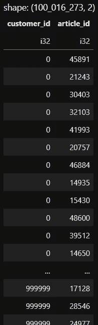

# 如何使用 Polars 构建基于人气的推荐系统

> 原文：[`towardsdatascience.com/how-to-build-popularity-based-recommenders-with-polars-cc7920ad3f68`](https://towardsdatascience.com/how-to-build-popularity-based-recommenders-with-polars-cc7920ad3f68)

## [推荐系统](https://medium.com/tag/recommendation-system)

## 基本的推荐系统易于理解和实现，且训练速度快

[](https://dr-robert-kuebler.medium.com/?source=post_page-----cc7920ad3f68--------------------------------)[](https://towardsdatascience.com/?source=post_page-----cc7920ad3f68--------------------------------) [Dr. Robert Kübler](https://dr-robert-kuebler.medium.com/?source=post_page-----cc7920ad3f68--------------------------------)

·发布于 [Towards Data Science](https://towardsdatascience.com/?source=post_page-----cc7920ad3f68--------------------------------) ·阅读时间 6 分钟·2023 年 4 月 28 日

--


由我在 [dreamstudio.ai](https://beta.dreamstudio.ai/) 创建

推荐系统是旨在根据用户的过去行为、偏好和互动提供推荐的算法。它们已成为各种行业（包括电子商务、娱乐和广告）的重要组成部分，提升用户体验、增加客户保留率并推动销售。

虽然存在各种高级推荐系统，但今天我想向你展示其中一种最简单的——但往往难以超越——推荐系统：**基于人气的推荐系统**。它是一个优秀的基线推荐系统，除了更高级的模型（如矩阵分解）外，你应该始终尝试一下。

[](/introduction-to-embedding-based-recommender-systems-956faceb1919?source=post_page-----cc7920ad3f68--------------------------------) ## 基于嵌入的推荐系统简介

### 学习如何在 TensorFlow 中构建一个简单的矩阵分解推荐系统

towardsdatascience.com

我们将在本文中使用 [**polars**](https://pola.rs/) 创建*两*种不同风格的基于人气的推荐系统。如果你之前没有使用过快速的 pandas 替代品 polars，不必担心；这篇文章是学习它的绝佳机会。让我们开始吧！

# 初步想法

基于人气的推荐系统通过向客户推荐最常购买的产品来工作。这一模糊的概念可以转化为至少两种具体的实现：

1.  检查哪些文章在**所有客户中**最常被购买。将这些文章推荐给每位客户。

1.  检查哪些文章在**每位客户**中最常被购买。将这些每位客户的文章推荐给对应的客户。

现在我们将展示如何使用我们自己创建的数据集具体实现这些。

如果你想跟随一个真实的数据集，Kaggle 上的[H&M 个性化时尚推荐](https://www.kaggle.com/competitions/h-and-m-personalized-fashion-recommendations/overview)挑战为你提供了一个很好的例子。由于版权原因，我不会在这篇文章中使用这个可爱的数据显示集。

## 数据

首先，我们将创建自己的数据集。如果你还没有安装 polars，请确保安装：

```py
pip install polars
```

然后，让我们创建一个随机数据集，包括**（customer_id, article_id）对**，你应该将其理解为“拥有此 ID 的客户购买了拥有该 ID 的商品。”我们将使用 1,000,000 名可以购买 50,000 种产品的客户。

```py
import numpy as np

np.random.seed(0)

N_CUSTOMERS = 1_000_000
N_PRODUCTS = 50_000
N_PURCHASES_MEAN = 100 # customers buy 100 articles on average

with open("transactions.csv", "w") as file:
    file.write(f"customer_id,article_id\n") # header

    for customer_id in range(N_CUSTOMERS):
        n_purchases = np.random.poisson(lam=N_PURCHASES_MEAN)
        articles = np.random.randint(low=0, high=N_PRODUCTS, size=n_purchases)
        for article_id in articles:
            file.write(f"{customer_id},{article_id}\n") # transaction as a row
```



图片由作者提供。

这个中等大小的数据集有**超过 100,000,000 行（交易）**，这是你在商业环境中可能会遇到的数量。

## 任务

我们现在想构建推荐系统来扫描这个数据集，以推荐*受欢迎*的项目。我们将阐明两种解释这个问题的变体：

+   在所有客户中最受欢迎的产品

+   每位客户最受欢迎的产品

我们的推荐系统应该为**每位客户推荐十篇文章**。

> ***注意：*** *我们将* ***不会*** *在这里评估推荐系统的质量。不过，如果你对这个话题感兴趣，可以给我发消息，因为这值得另写一篇文章。*

# 在所有客户中最受欢迎的产品

在这个推荐系统中，我们甚至不关心谁购买了这些文章——我们所需的所有信息仅在**article_id**列中。

高层次地，它的工作原理是这样的：

1.  加载数据。

1.  计算每篇文章在**article_id**列中出现的频率。

1.  将出现频率最高的十种产品作为每位客户的推荐。

## 熟悉的 Pandas 版本

作为一个温和的开始，让我们看看你如何**在 pandas 中**完成这个任务。

```py
import pandas as pd

data = pd.read_csv("transactions.csv", usecols=["article_id"])
purchase_counts = data["article_id"].value_counts()
most_popular_articles = purchase_counts.head(10).index.tolist()
```

在我的机器上，这大约需要**31 秒**。这听起来有点少，但数据集仍然**只是一个中等大小**；对于更大的数据集情况会变得很糟糕。公平地说，10 秒是用来加载 CSV 文件的。使用更好的格式，例如[parquet](https://en.wikipedia.org/wiki/Apache_Parquet)，可以减少加载时间。

> ***注意：*** *我使用的是最新和最优化的版本 pandas 2.0.1。*

但为了进一步准备 polars 版本，让我们使用**方法链**，这是一种我逐渐喜爱的技术，来完成 pandas 版本。

```py
most_popular_articles = (
    pd.read_csv("transactions.csv", usecols=["article_id"])
    .squeeze() # turn the dataframe with one column into a series
    .value_counts()
    .head(10)
    .index
    .tolist()
)
```

这很棒，因为你可以从上到下阅读发生了什么，无需很多通常很难命名的中间变量（*df_raw → df_filtered → df_filtered_copy → … → df_final，怎么样？*）。不过运行时间还是一样。

## 更快的 Polars 版本

让我们使用方法链在 **polars** 中实现相同的逻辑。

```py
import polars as pl

most_popular_articles = (
    pl.read_csv("transactions.csv", columns=["article_id"])
    .get_column("article_id")
    .value_counts()
    .sort("counts", descending=True) # value_counts does not sort automatically
    .head(10)
    .get_column("article_id") # there are no indices in polars
    .to_list()
)
```

除了运行时间：**3 秒** 替代 31 秒，这点令人印象深刻外，其他方面看起来相似！

> Polars 真的比 pandas 快得多。

不可否认，这也是 polars 相较于 pandas 的主要优势之一。除此之外，polars 还有一个 **创建复杂操作的便捷语法**，这是 pandas 所没有的。我们将在创建其他基于受欢迎程度的推荐器时看到更多。

同样重要的是，pandas 和 polars 产生的输出如预期一致。

# 每个客户的最受欢迎产品

与我们第一个推荐器不同，我们现在希望按客户切片数据框，并获取每个客户的最受欢迎的产品。这意味着我们现在需要 **customer_id** 和 **article_id**。

我们通过一个仅包含三位客户 A、B 和 C 购买四个文章 1、2、3 和 4 的十个交易的小数据框来说明逻辑。我们希望获取 **每个客户的前两篇文章**。我们可以通过以下步骤实现：


图片由作者提供。

1.  我们从原始数据框开始。

1.  然后我们按 **customer_id** 和 **article_id** 分组，并通过计数进行聚合。

1.  然后我们再次对 **customer_id** 进行聚合，并将 **article_id** 写入列表中，就像在我们上一个推荐器中一样。不同的是我们 **按照计数列对这个列表进行排序**。

这样，我们最终得到的正是我们想要的。

+   A 最常购买的产品是 1 和 2。

+   B 最常购买的产品是 4 和 2。产品 4 和 1 也会是正确的解决方案，但内部排序刚好把产品 2 推入了推荐中。

+   C 只购买了产品 3，所以就只有这些了。

这个过程的第 3 步听起来特别困难，但 polars 让我们可以方便地处理它。

```py
most_popular_articles_per_user = (
    pl.read_csv("transactions.csv")
    .group_by(["customer_id", "article_id"]) # first arrow from the picture
    .agg(pl.count())                        # first arrow from the picture
    .group_by("customer_id")                                               # second arrow
    .agg(pl.col("article_id").sort_by("count", descending=True).head(10)) # second arrow
)
```

**顺便提一下：** 这个版本在我的机器上 **运行大约一分钟**。我没有为此创建 pandas 版本，而且我绝对害怕这样做并让它运行。如果你勇敢的话，可以试试看！

## 小改进

到目前为止，一些用户可能收到的推荐少于十个，甚至有些没有。一个简单的做法是将每个客户的推荐补充到十个文章。例如，

+   使用随机文章，或者

+   使用我们第一个基于受欢迎程度的推荐器中所有客户的最受欢迎文章。

我们可以这样实现第二个版本：

```py
improved_recommendations = (
    most_popular_articles_per_user
    .with_columns([
        pl.col("article_id").fill_null([]).alias("personal_top_<=10"),
        pl.Series([most_popular_articles]).alias("global_top_10")
    ])
    .with_columns(
        pl.col("personal_top_<=10").list.concat(pl.col("global_top_10")).list.head(10).alias("padded_recommendations")
    )
    .select(["customer_id", "padded_recommendations"])
)
```

# 结论

基于受欢迎程度的推荐系统在推荐系统领域占据了重要地位，因为它们的简单性、易于实现以及作为初始方法和难以超越的基准的有效性。

在这篇文章中，我们学会了如何使用出色的 polars 库将基于流行度的简单推荐思想转化为代码。

主要缺点，特别是个性化的基于流行度的推荐系统，是推荐内容**没有启发性**。人们之前都见过推荐的所有内容，这意味着他们陷入了一个极端的回声室。

缓解这一问题的一个方法是使用其他方法，例如协同过滤或混合方法，如下所示：

[](/a-performant-recommender-system-without-cold-start-problem-69bf2f0f0b9b?source=post_page-----cc7920ad3f68--------------------------------) ## 无冷启动问题的高效推荐系统

### 当协作和基于内容的推荐系统融合时

towardsdatascience.com

希望你今天学到了新的、有趣的和值得的东西。感谢阅读！

> *如果你有任何问题，可以通过* [*LinkedIn*](https://www.linkedin.com/in/dr-robert-k%C3%BCbler-983859150/)*联系我！*

如果你想深入了解算法的世界，可以试试我新的出版物**《算法全解》**！我仍在寻找作者！

[](https://medium.com/all-about-algorithms?source=post_page-----cc7920ad3f68--------------------------------) [## 《算法全解》

### 从直观解释到深入分析，算法通过实例、代码和精彩内容展现生命力……

medium.com](https://medium.com/all-about-algorithms?source=post_page-----cc7920ad3f68--------------------------------)
