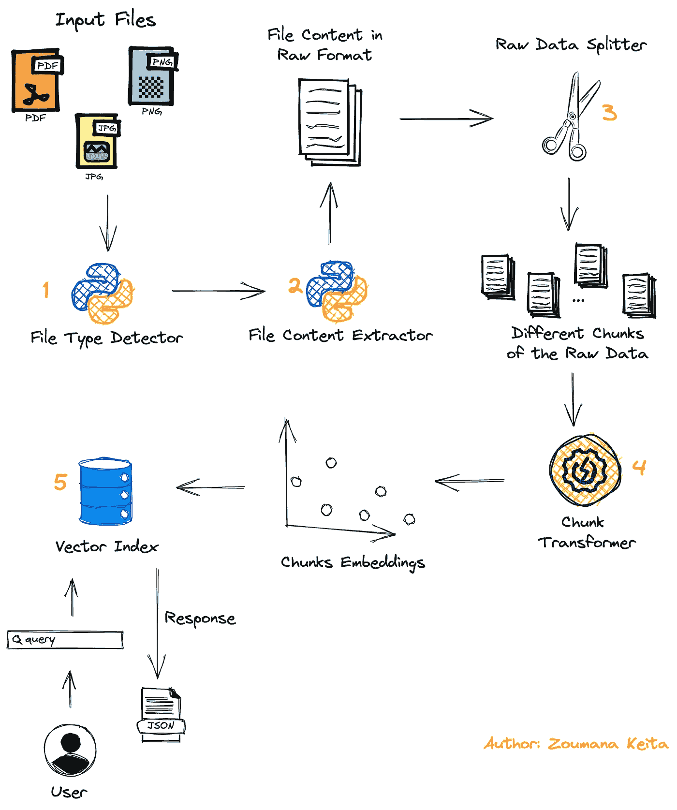
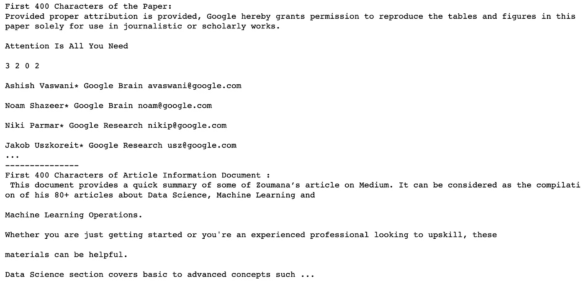
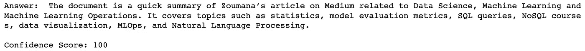
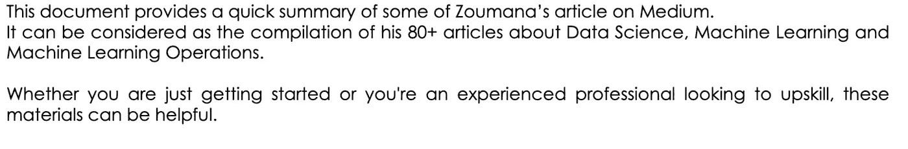
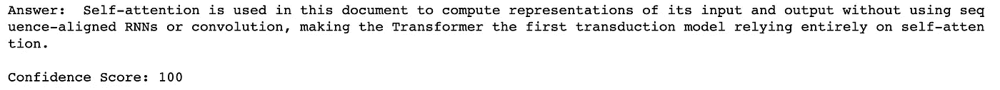

# 如何使用大型语言模型与任何 PDF 和图像文件进行聊天 — 带代码

> 原文：[`towardsdatascience.com/how-to-chat-with-any-file-from-pdfs-to-images-using-large-language-models-with-code-4bcfd7e440bc`](https://towardsdatascience.com/how-to-chat-with-any-file-from-pdfs-to-images-using-large-language-models-with-code-4bcfd7e440bc)

## 完整指南，教你如何构建一个可以回答任何文件问题的 AI 助手

[](https://zoumanakeita.medium.com/?source=post_page-----4bcfd7e440bc--------------------------------)[](https://towardsdatascience.com/?source=post_page-----4bcfd7e440bc--------------------------------) [Zoumana Keita](https://zoumanakeita.medium.com/?source=post_page-----4bcfd7e440bc--------------------------------)

·发表于 [Towards Data Science](https://towardsdatascience.com/?source=post_page-----4bcfd7e440bc--------------------------------) ·9 分钟阅读·2023 年 8 月 5 日

--

# 介绍

PDF 和图像文件中困藏着如此宝贵的信息。幸运的是，我们有这些强大的大脑，能够处理这些文件以找到特定信息，这实际上非常棒。

> 但我们中有多少人，内心深处并不希望拥有一个能回答关于给定文档的任何问题的工具呢？

这就是本文的全部目的。我将逐步解释如何构建一个能够与任何 PDF 和图像文件聊天的系统。

> 如果你更愿意观看视频，请查看下面的链接：

文章的视频格式

## 项目的总体工作流程

清楚了解系统的主要组件总是好的。那么，让我们开始吧。



整个聊天系统的端到端工作流程（作者提供的图像）

+   首先，用户提交需要处理的文档，可以是 PDF 或图像格式。

+   第二个模块用于检测文件格式，以便应用相关的内容提取功能。

+   然后，文档的内容使用`Data Splitter`模块被拆分成多个块。

+   这些块最终通过`Chunk Transformer`转换为嵌入，然后存储在向量存储中。

+   在处理结束时，用户的查询被用来找到包含该查询答案的相关块，结果以 JSON 格式返回给用户。

## 1\. 检测文档类型

对于每个输入文档，根据其类型应用特定的处理，无论是`PDF`还是`image.`

这可以通过结合使用`detect_document_type`的辅助函数和内置 Python 模块中的`guess`函数来实现。

```py
def detect_document_type(document_path):

    guess_file = guess(document_path)
    file_type = ""
    image_types = ['jpg', 'jpeg', 'png', 'gif']

    if(guess_file.extension.lower() == "pdf"):
        file_type = "pdf"

    elif(guess_file.extension.lower() in image_types):
        file_type = "image"

    else:
        file_type = "unkown"

    return file_type
```

现在我们可以在两种类型的文档上测试这个功能：

+   `transformer_paper.pdf` 是 Transformers 研究论文 [来自 Arxiv](https://arxiv.org/pdf/1706.03762.pdf)。

+   `zoumana_article_information.png` 是包含有关我在 Medium 上所涵盖的主要主题信息的图像文档。

```py
research_paper_path = "./data/transformer_paper.pdf"
article_information_path = "./data/zoumana_article_information.png"

print(f"Research Paper Type: {detect_document_type(research_paper_path)}")
print(f"Article Information Document Type: {detect_document_type(article_information_path)}")
```

输出：


文件类型成功检测（图片由作者提供）

`detect_document_type` 函数成功检测了这两种文件类型。

## 2\. 基于文档类型提取内容

`[langchain](https://python.langchain.com/docs/get_started/introduction.html)` 库提供了不同的模块来提取特定类型文档的内容。

+   `UnstructuredImageLoader` 提取图像内容。

+   `UnstructuredFileLoader` 提取任何 pdf 和 Txt 文件的内容。

我们可以将这些模块与上述`detect_document_type`函数结合起来，实现文本提取逻辑。

这些模块可以用于在`extract_file_content`函数中实现端到端的文本提取逻辑。

让我们看看它们的实际效果！ 🔥

```py
from langchain.document_loaders.image import UnstructuredImageLoader
from langchain.document_loaders import UnstructuredFileLoader

def extract_file_content(file_path):

    file_type = detect_document_type(file_path)

    if(file_type == "pdf"):
        loader = UnstructuredFileLoader(file_path)

    elif(file_type == "image"):
        loader = UnstructuredImageLoader(file_path)

    documents = loader.load()
    documents_content = '\n'.join(doc.page_content for doc in documents)

    return documents_content
```

现在，让我们打印每个文件内容的前 `400` 个字符。

```py
research_paper_content = extract_file_content(research_paper_path)
article_information_content = extract_file_content(article_information_path)

nb_characters = 400

print(f"First {nb_characters} Characters of the Paper: \n{research_paper_content[:nb_characters]} ...")
print("---"*5)
print(f"First {nb_characters} Characters of Article Information Document :\n {research_paper_content[:nb_characters]} ...")
```

输出：

以上每个文档的前 400 个字符如下：

+   研究论文的内容以`Provided proper attribution is provided` 开始，以`Jacod Uszkoreit* Google Research usz@google.com.` 结束。

+   图像文档的内容以`This document provides a quick summary` 开始，以`Data Science section covers basic to advance concepts.` 结束。



Transformers 论文和文章信息文档的前 400 个字符（图片由作者提供）

## 3\. 聊天实现

输入文档被分成块，然后为每个块创建嵌入，之后实现问答逻辑。

**a. 文档分块**

这些块代表了较大文本的一小段。这一过程对于确保内容尽可能少的噪音，并保持语义相关性至关重要。

可以应用多种分块策略。例如，我们有 `NLTKTextSplitter`、`SpacyTextSplitter`、`RecursiveCharacterTextSplitter`、`CharacterTextSplitter` 等。

这些策略各有优缺点。

本文的重点是 `CharacterTextSplitter`，它根据 `\n\n` 从输入文档中创建块，并通过字符数量（`length_function`）来衡量每个块的长度。

```py
text_splitter = CharacterTextSplitter(        
    separator = "\n\n",
    chunk_size = 1000,
    chunk_overlap  = 200,
    length_function = len,
)
```

`chunk_size` 指定我们希望每个块最多包含 1000 个字符，而较小的值将导致更多的块，而较大的值将生成更少的块。

需要注意的是，`chunk_size` 的选择方式会影响整体结果。因此，一个好的方法是尝试不同的值，选择最适合自己用例的那个。

此外，`chunk_overlap` 表示我们希望连续块之间有最多 200 个重叠字符。

例如，假设我们有一个包含文本 `Chat with your documents using LLMs` 的文档，并想使用 `Chunk Size = 10` 和 `Chunk overlap = 5` 来应用块化。

该过程在下面的图像中进行了说明：


文档块化示例（作者提供的图片）

我们可以看到，对于一个包含 35 个字符（包括空格）的输入文档，我们最终得到了 7 个块。

> 但是，我们为什么要使用这些重叠部分呢？

包括这些重叠部分，`CharacterTextSplitter` 确保在块之间保持底层上下文，这在处理长文档时特别有用。

类似于 `chunk_size`，`chunk_overlap` 没有固定值。需要测试不同的值以选择效果更好的值。

现在，让我们看看它们在我们的场景中的应用：

```py
research_paper_chunks = text_splitter.split_text(research_paper_content)
article_information_chunks = text_splitter.split_text(article_information_content)

print(f"# Chunks in Research Paper: {len(research_paper_chunks)}")
print(f"# Chunks in Article Document: {len(article_information_chunks)}")
```

输出：


每个文档中的块数（作者提供的图片）

对于像研究论文这样的较大文档，我们有更多的块（51 个），而一页文章文档只有 2 个块。

**b. 创建块的嵌入**

我们可以使用 `OpenAIEmbeddings` 模块，该模块默认使用 `text-embedding-ada-002` 模型来创建块的嵌入。

可以通过更改以下参数，使用不同的模型（例如 `gpt-3.5-turbo-0301`）来代替 `text-embedding-ada-002`：

+   model = “`gpt-3.5-turbo-0301`”

+   deployment = "`<DEPLOYMENT-NAME>` "，这对应于在模型部署期间给出的名称。默认值也是 `text-embedding-ada-002`

为了简单起见，在本教程中我们将坚持使用默认参数值。但在此之前，我们需要获取 OpenAI 凭据，所有步骤在 [以下文章](https://medium.com/geekculture/how-to-fine-tune-gpt3-using-openai-api-and-python-9ef813879af4) 中提供。

```py
from langchain.embeddings.openai import OpenAIEmbeddings
import os

os.environ["OPENAI_API_KEY"] = "<YOUR_KEY>"
embeddings = OpenAIEmbeddings()
```

**c. 创建文档搜索**

要回答给定的查询，我们需要创建一个向量存储，以找到与该查询最匹配的块。

这样的向量存储可以使用 `FAISS` 模块中的 `from_texts` 函数创建，该函数需要两个主要参数：`text_splitter` 和 `embeddings`，这两者都已定义。

```py
from langchain.vectorstores import FAISS

def get_doc_search(text_splitter):

    return FAISS.from_texts(text_splitter, embeddings)
```

通过在研究论文块上运行 `get_doc_search`，我们可以看到结果是 `vectorstores`。如果我们使用 article_information_chunks，结果也会相同。

```py
doc_search_paper = get_doc_search(research_paper_chunks)
print(doc_search_paper)
```

输出：


研究论文的向量存储（作者提供的图片）

**d. 开始与你的文档聊天**

恭喜你走到这一步！ 🎉

`chat_with_file` 函数用于实现聊天的端到端逻辑，将所有上述函数与 `similarity_search` 函数结合使用。

最终函数需要两个参数：

+   我们想要聊天的文件，以及

+   用户提供的查询

```py
from langchain.llms import OpenAI
from langchain.chains.question_answering import load_qa_chain
chain = load_qa_chain(OpenAI(), chain_type = "map_rerank",  
                      return_intermediate_steps=True)

def chat_with_file(file_path, query):

    file_content = extract_file_content(file_path)
    text_splitter = text_splitter.split_text(file_content)

    document_search = get_doc_search(text_splitter)
    documents = document_search.similarity_search(query)

    results = chain({
                        "input_documents":documents, 
                        "question": query
                    }, 
                    return_only_outputs=True)
    answers = results['intermediate_steps'][0]

    return answers
```

让我们退一步，以正确理解上述代码块中发生的事情。

+   `load_qa_chain` 提供了一个接口，用于在一组文档上执行问答。在这个特定的案例中，我们使用的是默认的 `OpenAI GPT-3` 大型语言模型。

+   `chain_type` 是 `map_rerank` 。通过这样做，`load_qa_chain` 函数根据链提供的置信度分数返回答案。还有其他可以使用的 `chain_type`，如 `map_reduce`、`stuff`、`refine` 等。每种都有其优缺点。

+   通过设置 `return_intermediate_steps=True`，我们可以访问诸如上述置信度分数等元数据。

它的输出是一个包含两个键的字典：查询的 **答案** 和置信度 **分数**。

我们终于可以开始与我们的文件聊天，从图像文档开始：

+   **与图像文档聊天**

要与图像文档聊天，我们提供文档路径和我们希望模型回答的问题。

```py
query = "What is the document about"

results = chat_with_file(article_information_path, query)

answer = results["answer"]
confidence_score = results["score"]

print(f"Answer: {answer}\n\nConfidence Score: {confidence_score}")
```

输出：



对图像文档的查询结果（图像来源：作者）

模型对其响应有 100% 的信心。通过查看下面的原始文档的第一段，我们可以看到模型的响应确实是正确的。



原始文章图像文档的前两段（图像来源：作者）

最有趣的部分之一是它提供了文档中主要主题的简要总结（统计、模型评估指标、SQL 查询等）。

+   **与 PDF 文件聊天**

PDF 文件的处理过程类似于上述部分。

```py
query = "Why is the self-attention approach used in this document?"

results = chat_with_file(research_paper_path, query)

answer = results["answer"]
confidence_score = results["score"]

print(f"Answer: {answer}\n\nConfidence Score: {confidence_score}")
```

输出：

我们再次从模型中获得了 100% 的置信度分数。问题的答案看起来非常正确！



对 PDF 文档的查询结果（图像来源：作者）

在这两种情况下，模型都能够在几秒钟内提供类似人类的响应。让一个人经历相同的过程将需要几分钟，甚至几小时，具体取决于文档的长度。

# 结论

恭喜！！！🎉

我希望这篇文章提供了足够的工具来帮助你提升知识水平。代码可在 [我的 GitHub](https://github.com/keitazoumana/Medium-Articles-Notebooks/blob/main/Chat_With_Any_Document.ipynb) 上获取。

在我的下一篇文章中，我将解释如何将这个系统集成到一个漂亮的用户界面中。敬请期待！

如果你喜欢阅读我的故事并希望支持我的写作，考虑成为 Medium 会员。每月 $5，你将获得对成千上万的 Python 指南和数据科学文章的无限访问。

通过使用 [我的链接](https://zoumanakeita.medium.com/membership)，我将获得少量佣金，而你无需额外支付。

[](https://zoumanakeita.medium.com/membership?source=post_page-----4bcfd7e440bc--------------------------------) [## 通过我的推荐链接加入 Medium - Zoumana Keita]

### 作为 Medium 会员，你的会员费用的一部分会用于支持你阅读的作者，同时你可以完全访问每个故事……

[zoumanakeita.medium.com](https://zoumanakeita.medium.com/membership?source=post_page-----4bcfd7e440bc--------------------------------)

欢迎通过 [Twitter](https://twitter.com/zoumana_keita_) 和 [YouTube](https://www.youtube.com/channel/UC9xKdy8cz6ZuJU5FTNtM_pQ) 关注我，或者在 [LinkedIn](https://www.linkedin.com/in/zoumana-keita/) 上打个招呼。

[在这里与我联系进行一对一讨论](https://topmate.io/zoumanakeita)

离开之前，下面还有更多你可能感兴趣的优质资源！

[使用 OpenAI API 进行文本嵌入介绍](https://medium.com/geekculture/introduction-to-text-embeddings-with-the-openai-api-1f83d2a15fda)

[如何从任何 PDF 和图像中提取文本以供大型语言模型使用](https://medium.com/towards-data-science/how-to-extract-text-from-any-pdf-and-image-for-large-language-model-2d17f02875e6)
