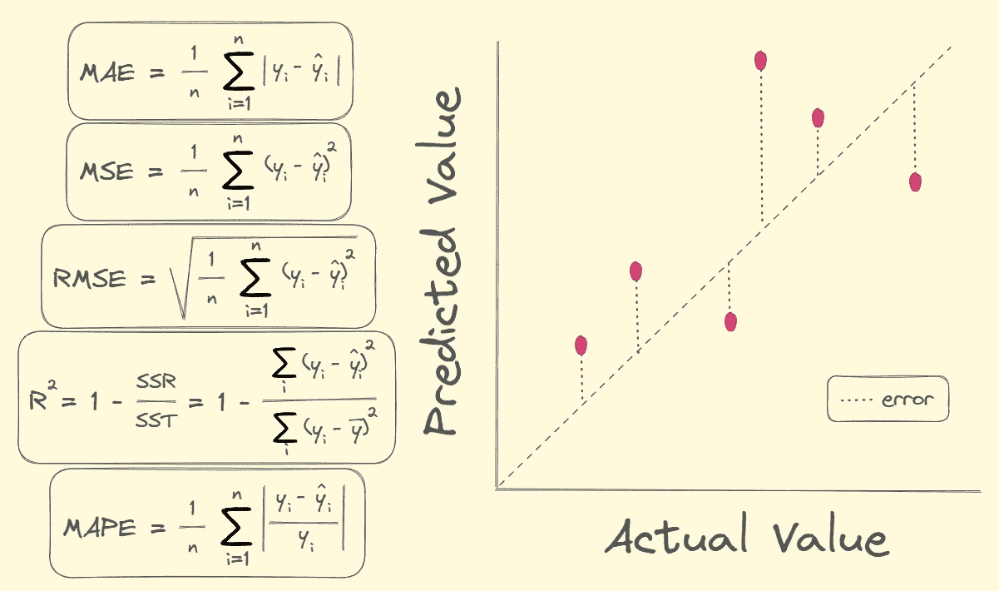

# 如何选择最佳的回归问题评估指标

> 原文：[`towardsdatascience.com/how-to-choose-the-best-evaluation-metric-for-regression-problems-b9f2e60e25ef?source=collection_archive---------3-----------------------#2023-04-24`](https://towardsdatascience.com/how-to-choose-the-best-evaluation-metric-for-regression-problems-b9f2e60e25ef?source=collection_archive---------3-----------------------#2023-04-24)

## 一份全面的指南，涵盖回归中最常用的评估指标及其在不同场景中的实用性

 [托马斯·A·多费尔](https://thomasdorfer.medium.com/?source=post_page-----b9f2e60e25ef--------------------------------)

·

[关注](https://medium.com/m/signin?actionUrl=https%3A%2F%2Fmedium.com%2F_%2Fsubscribe%2Fuser%2F7c54f9b62b90&operation=register&redirect=https%3A%2F%2Ftowardsdatascience.com%2Fhow-to-choose-the-best-evaluation-metric-for-regression-problems-b9f2e60e25ef&user=Thomas+A+Dorfer&userId=7c54f9b62b90&source=post_page-7c54f9b62b90----b9f2e60e25ef---------------------post_header-----------) 发表在 [数据科学的未来](https://towardsdatascience.com/?source=post_page-----b9f2e60e25ef--------------------------------) ·8 分钟阅读·2023 年 4 月 24 日

--

作者提供的图片。

在构建回归模型之前，值得花点时间仔细考虑如何评估它。多种因素将影响这一决定，包括是否应该对大误差给予比小误差更严厉的惩罚，或度量标准对于利益相关者的可理解性和直观性。

本文将介绍回归问题中最常用的评估指标。对于每个指标，我们将通过一个示例用例进行讲解，这将为您提供选择合适指标所需的信息。

# 回归

回归问题是一个监督学习问题，其特征是根据一个或多个输入变量预测连续的数值型输出变量。

想象一个回归模型，旨在基于诸如卧室数量、浴室数量、平方英尺、位置等各种特征来预测房屋价格。由于我们可以选择多种评估指标，因此选择最合适的指标至关重要…
