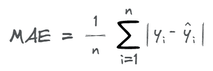
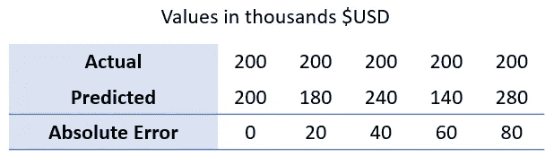
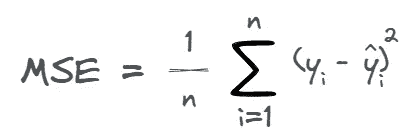
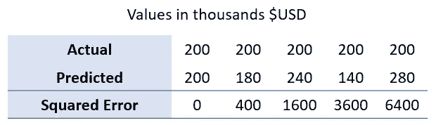
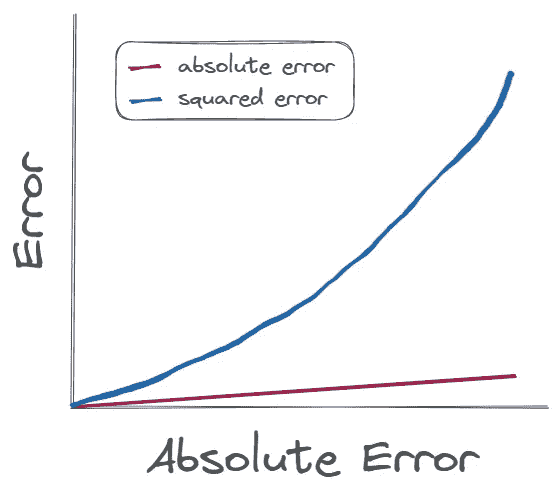
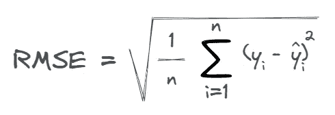
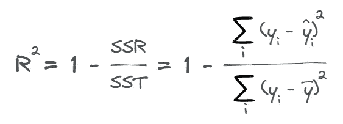
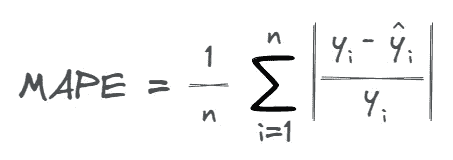

# 如何选择最佳的回归问题评估指标

> 原文：[`towardsdatascience.com/how-to-choose-the-best-evaluation-metric-for-regression-problems-b9f2e60e25ef`](https://towardsdatascience.com/how-to-choose-the-best-evaluation-metric-for-regression-problems-b9f2e60e25ef)

## 一份全面的指南，涵盖回归中最常用的评估指标及其在不同场景中的实用性。

 [Thomas A Dorfer](https://thomasdorfer.medium.com/?source=post_page-----b9f2e60e25ef--------------------------------)

·发表于 [Towards Data Science](https://towardsdatascience.com/?source=post_page-----b9f2e60e25ef--------------------------------) ·阅读时间 8 分钟·2023 年 4 月 24 日

--

作者提供的图片。

在构建回归模型之前，值得花点时间仔细考虑如何评估它。这个决策中会涉及各种因素，包括是否应该更惩罚大错误而非小错误，或指标需要对利益相关者多么易懂和直观。

本文将涵盖回归问题中最常用的评估指标。对于每个指标，我们还将通过一个示例用例，这将为你提供选择它们所需的信息。

# 回归

回归问题是一个监督式机器学习问题，其特征是根据一个或多个输入变量预测一个连续的数值输出变量。

想象一个回归模型，旨在根据各种特征（如卧室和浴室的数量、面积、位置等）预测房价。由于我们拥有各种评估指标，我们选择与目标最一致的指标至关重要。

例如，如果我们选择一个显著放大——并因此惩罚——大错误的指标，这可能意味着即使是一个大的错误也会大幅提高我们模型的整体误差，使其看起来表现不佳。然而，一个大的错误可能没有很多小错误那么重要。因此，如果目标是准确预测房价，而不是最小化整体误差，选择一个对所有错误权重相等的指标可能更为合适。

现在让我们探讨一些常用的评估指标，并讨论它们在不同场景中的实用性。

# 评估指标

## 平均绝对误差（MAE）

平均绝对误差，或称 MAE，是回归问题中常用的指标，因为误差的单位与目标变量的单位一致。例如，如果目标变量以*美元（$USD）*为单位，则误差也以*美元（$USD）*为单位。

> ***平均绝对误差***测量的是预测值与实际值之间的平均绝对差异。

计算公式如下：

这里，*y*表示实际值，*ŷ*表示预测值，*n*对应数据中的观测数量。

当我们的目标是以一种对所有误差赋予相等权重的方式评估回归模型的性能时，这是一种特别有用的指标，无论误差的大小如何。

为了说明这一点，我们来看下面的表格，该表格显示了实际值和预测值以及对应的 MAE。请注意，绝对误差始终为正，无论预测值高于还是低于实际值。此外，为了突出绝对误差的线性增长，我将实际值固定在 200，并线性增加预测的误差。

作者提供的表格。

根据这些数据，我们可以使用上述公式计算 MAE，结果为$40。

MAE 是一个非常易于解释的指标，有助于理解预测值与实际值的偏差程度。此外，它对离群值更具鲁棒性，因为它不会通过平方等方式放大大误差。这在大误差不比小误差更为重要的情况下尤为有用。

*示例：* 如上所述，MAE 可以作为预测房价的直观指标。通过测量实际值和预测值之间的平均绝对差异，它提供了一个更具关联性的指标，使我们能够理解预测的平均偏差程度。其他示例包括预测学生考试成绩、产品需求预测或预测患者住院时长。

## 均方误差（MSE）

均方误差，或称 MSE，通常在目标是比重较小的误差更多地惩罚较大误差时使用。

> ***均方误差***测量的是预测值与实际值之间的平均平方差异。

计算公式如下：

当目标是强调较大误差时，MAE 较为常用，因为 MSE 会对实际值和预测值之间的差异进行平方，从而放大误差。为了进一步说明这一点，请查看下面实际值和预测值，并观察随着预测偏差的增加，平方误差的加速增长。

作者提供的表格。

这里的 MSE 将是 2400 *$平方* — 一个相当不直观的单位，这常常会导致利益相关者的困惑。

与绝对误差相比，绝对误差随偏差的增加线性增长，而平方误差非线性地且更快速地增加，从而对较大误差赋予更高的权重。

作者提供的图像。

*示例:* MSE 可应用于股票价格预测任务，目标是最小化整体预测误差。在这种情况下，可解释性可能不如准确性重要。此外，它对大误差的惩罚尤为关键，因为这些误差往往会导致重大财务损失。

## 均方根误差（RMSE）

均方根误差（RMSE），像 MSE 一样，是当目标是对大误差进行比小误差更严重惩罚时的一个流行度量。此外，它是一个更直观的度量，因为它的单位与目标变量相同。换句话说，如果目标变量是 *$USD*，则 RMSE 也是 *$USD*。

> ***均方根误差*** 衡量预测值与实际值之间平方差的平均值的平方根。更简单地说，它是均方误差（MSE）的平方根。

计算方法如下：

根据前一部分，我们知道样本数据的 MSE 是 2400 *$平方*。因此，RMSE 只是其平方根，即$48.99。

*示例:* RMSE 通常应用于天气预测，其中目标变量通常是某种温度或降水量的测量。在这种情况下，对大误差赋予更多权重是有益的，因为这强调了准确预测极端天气事件的重要性，这不仅会影响我们是否带伞的决策，还会影响基础设施、交通和农业。此外，得到与目标变量相同单位的误差度量有助于更直观地理解模型的准确性。

## R 平方（R2）

R 平方度量，或 R2，提供了回归模型如何拟合数据的指示。

> ***R 平方***，也称为 ***决定系数***，表示由预测变量解释的目标变量方差的比例。

计算方法如下：

在这里，*SSR* 代表平方残差和，*SST* 代表总平方和，ȳ 代表样本的均值。

该度量的范围从 0 到 1，其中 0 表示模型没有解释目标（因变量）的方差，而 1 表示模型解释了所有的方差。因此，我们可以得出结论，R 平方度量越高，模型对数据的拟合越好。

根据上面的样本数据，我们的 R 平方分数实际上会是 `NaN` 值，因为我们的 *实际* 值是常数，导致 *SST* 为 0。

我还应该指出，在实际操作中，R 平方值可能为负。这发生在模型的表现比简单的水平线（即目标变量的均值）更差时。换句话说，这意味着模型的预测甚至比仅仅使用目标变量的均值作为所有观察值的预测还要糟糕。

*示例:* R 平方常用于营销活动中的评估指标，公司可以通过分析广告支出与销售收入增加之间的关系来衡量其效果。高 R 平方值表明广告支出与销售收入之间存在强关系，意味着营销活动在推动销售方面非常有效。

## 均值绝对百分比误差 (MAPE)

均值绝对百分比误差（MAPE）通常用于衡量预测模型的准确性。

> ***均值绝对百分比误差*** 衡量预测值与实际值之间的平均绝对百分比差异。

计算方法如下：

MAPE 的输出是非负的，0 是最佳值，表示模型的预测完全准确，没有误差。

根据上面的样本数据，MAPE 会产生 0.2 的值，表明平均而言，预测偏差为 20%。

*示例:* MAPE 指标常应用于金融领域，在该领域，预测百分比变化被认为比预测绝对值更为重要。例如，预测股票价格或汇率涉及预测百分比变化而非绝对值，此时 MAPE 可以作为合适的评估指标。

# 结论

通常建议使用多种指标来评估回归模型，因为每种指标都有其自身的优点和缺点。这种方法可以让我们对模型在准确性、稳健性和一致性等不同方面的表现有一个更全面的了解。

如果误差度量需要与目标变量具有相同的单位，可能会更倾向于使用 MAE 和 RMSE 分数。然而，与 MAE 相比，RMSE 和 MSE 对离群值更为敏感。R 平方指标对于评估模型与基础数据的整体拟合度很有用，但它不提供关于单个预测的信息。最后，MAPE 是一种易于解释的指标，因此通常用于预测问题，因为它提供了预测偏差的百分比指示。

选择用于特定回归问题的评价指标最终将取决于许多因素，包括当前具体的问题，是否需要对较大误差进行比对小误差更多的惩罚，或者指标的可解释性，以便在需要向利益相关者或管理者清晰解释时。

## 喜欢这篇文章吗？

让我们联系吧！你可以在 [Twitter](https://twitter.com/ThomasADorfer)、[LinkedIn](https://www.linkedin.com/in/thomasdorfer/) 和 [Substack](https://thomasdorfer.substack.com/) 上找到我。

如果你喜欢支持我的写作，可以通过 [Medium 会员](https://thomasdorfer.medium.com/membership) 来实现，这将为你提供访问我所有故事的权限以及 Medium 上其他成千上万位作者的故事。

[## 通过我的推荐链接加入 Medium - 托马斯·A·多费尔](https://medium.com/@thomasdorfer/membership?source=post_page-----b9f2e60e25ef--------------------------------)

### 阅读托马斯·A·多费尔（Thomas A Dorfer）的每一篇故事（以及 Medium 上其他成千上万的作者的故事）。你的会员费将直接支持…

[medium.com](https://medium.com/@thomasdorfer/membership?source=post_page-----b9f2e60e25ef--------------------------------)
