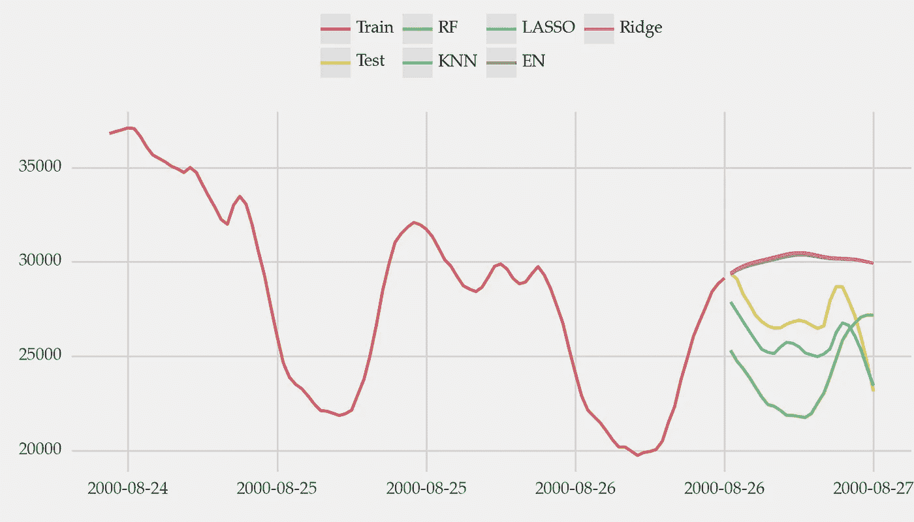
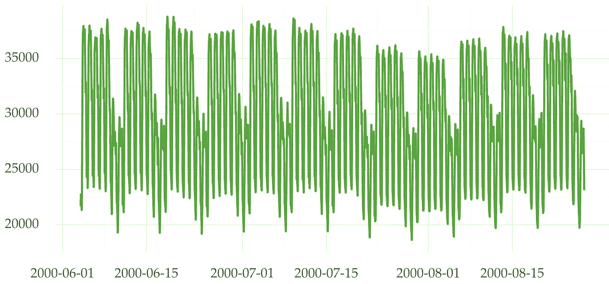
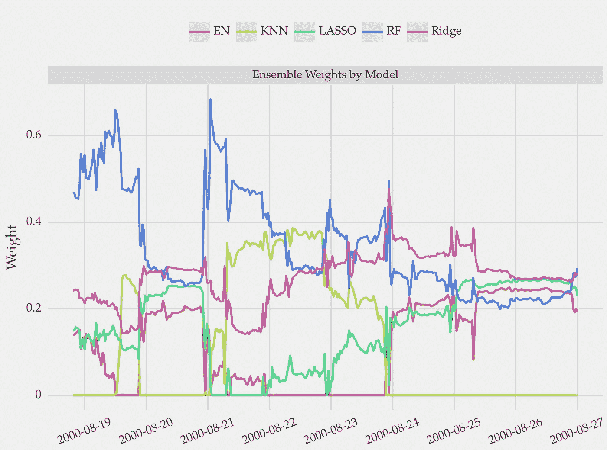
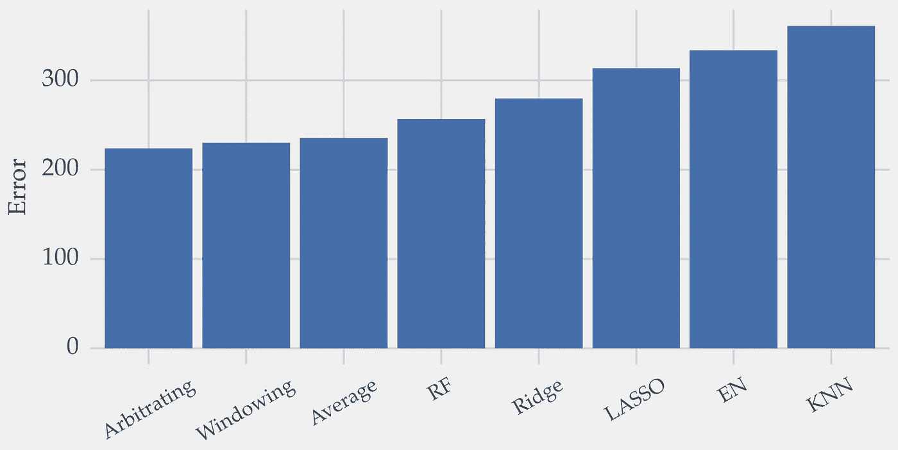

# 如何组合预测结果

> 原文：[`towardsdatascience.com/how-to-combine-the-forecasts-of-an-ensemble-11022e5cac25`](https://towardsdatascience.com/how-to-combine-the-forecasts-of-an-ensemble-11022e5cac25)

## 使用动态预测组合应对时间序列中的变化

[](https://vcerq.medium.com/?source=post_page-----11022e5cac25--------------------------------)[](https://towardsdatascience.com/?source=post_page-----11022e5cac25--------------------------------) [Vitor Cerqueira](https://vcerq.medium.com/?source=post_page-----11022e5cac25--------------------------------)

·发表于 [Towards Data Science](https://towardsdatascience.com/?source=post_page-----11022e5cac25--------------------------------) ·6 分钟阅读·2023 年 1 月 19 日

--


图片由 [Chris Lawton](https://unsplash.com/@chrislawton?utm_source=medium&utm_medium=referral) 提供，来自 [Unsplash](https://unsplash.com/?utm_source=medium&utm_medium=referral)

在 [上一篇文章](https://medium.com/towards-data-science/introduction-to-forecasting-ensembles-f63877a2498) 中，我们探讨了构建组合的主要步骤。

在这篇文章中：

+   我们深入探讨了预测组合；

+   我们讨论了如何将多个预测结果进行组合；

+   我们探索了用于预测组合的动态加权平均方法；

+   我们将动态组合应用于一个使用 Python 的案例研究

# 介绍

组合多个模型的预测结果 [提高了预测性能](https://medium.com/towards-data-science/introduction-to-forecasting-ensembles-f63877a2498)。这些方法可以通过动态组合规则进一步改进。

构建预测组合的方法有很多。然而，标准的方法并没有考虑时间序列的动态特性。

在时间序列中，由于存在非平稳性，事物会随时间而变化。例如，不同的阶段或季节效应。这些因素会导致相对表现的变异。不同的预测模型在不同的时期表现更好。

在组合预测时，这种表现的变异性应得到反映。在每个时间步长上，每个模型的权重应根据你对其表现的预期进行调整。

随着时间推移而调整权重的组合被称为动态组合。

# 从静态到动态的组合



一个时间序列以及多个模型的预测。图像由作者提供。

## 常量权重

Bagging、boosting、chaining 或 stacking 是一些组合的示例。

Bagging 或 boosting 集成通过简单的平均值来组合各个预测。因此，集成中的所有模型权重相等。在 stacking 或 chaining 中，权重不相等。最佳组合规则在训练过程中学习得到。

在这些情况下，组合规则是静态的。每个模型的权重在任何时候都是相同的。

但是，固定权重无法适应时间序列中的变化。这个问题通过动态组合规则得到解决。

## 动态权重


[Jan Huber](https://unsplash.com/@jan_huber?utm_source=medium&utm_medium=referral)拍摄的照片，来自[Unsplash](https://unsplash.com/?utm_source=medium&utm_medium=referral)

动态权重的集成模型能够应对时间序列中的变化。

挑战在于估计在给定时刻哪个模型更强。结果表明，这是一个棘手的任务。不过，有许多方法可以解决这个问题。

动态集成模型分为三种可能的类别：

+   窗口化：权重基于模型在过去最近数据窗口中的表现进行计算。例如，你可以计算滚动平方误差。然后，在每个时刻，你通过归一化误差分数来获得权重。你可以在[我的 Github 上找到窗口化的实现](https://github.com/vcerqueira/blog/blob/main/src/ensembles/windowing.py)。

+   遗憾最小化：一些方法尝试最小化称为遗憾的指标。例子包括指数加权平均、均方加权平均或固定份额聚合。参考文献[2]中第二章详细描述了这些方法。你也可以在 R 包*opera***中找到它们的实现。

+   元学习：其他技术学习并预测每个模型在给定时刻的权重。[Arbitrating 是这种方法的一个例子。](https://github.com/vcerqueira/blog/blob/main/src/ensembles/ade.py)

# 案例研究

在本文的其余部分，我们将创建一个动态预测集成模型。

我们将使用与能源需求相关的时间序列。下面是它的样子：



半小时电力需求时间序列。数据来源于参考文献[3]。图片由作者提供。

## 构建集成模型

我们开始通过时间延迟嵌入来转换时间序列，以进行监督学习。你可以查看[我之前的帖子](https://medium.com/towards-data-science/machine-learning-for-forecasting-transformations-and-feature-extraction-bbbea9de0ac2)以了解更多关于这种方法的信息。

然后，我们构建集成模型。下面是实现这一点的脚本。查看代码中的注释以获取更多背景信息。

```py
import pandas as pd

# methods and validation split
from sklearn.model_selection import train_test_split
from sklearn.ensemble import RandomForestRegressor
from sklearn.neighbors import KNeighborsRegressor
from sklearn.linear_model import Lasso, Ridge, ElasticNetCV

# time series example -- GPL-3 license
from pmdarima.datasets import load_taylor

# src module available here: https://github.com/vcerqueira/blog
from src.tde import time_delay_embedding

# loading the data
series = load_taylor(as_series=True)

# train test split
train, test = train_test_split(series, test_size=0.1, shuffle=False)

# ts for supervised learning
train_df = time_delay_embedding(train, n_lags=10, horizon=1).dropna()
test_df = time_delay_embedding(test, n_lags=10, horizon=1).dropna()

# creating the predictors and target variables
# the goal is to forecast the next observation of energy demand
X_train, y_train = train_df.drop('Series(t+1)', axis=1), train_df['Series(t+1)']
X_test, y_test = test_df.drop('Series(t+1)', axis=1), test_df['Series(t+1)']

# defining the five models composing the ensemble
models = {
    'RF': RandomForestRegressor(),
    'KNN': KNeighborsRegressor(),
    'LASSO': Lasso(),
    'EN': ElasticNetCV(),
    'Ridge': Ridge(),
}

# training and getting predictions
train_forecasts, test_forecasts = {}, {}
for k in models:
    models[k].fit(X_train, y_train)
    train_forecasts[k] = models[k].predict(X_train)
    test_forecasts[k] = models[k].predict(X_test)

# predictions as pandas dataframe
ts_forecasts_df = pd.DataFrame(test_forecasts)
tr_forecasts_df = pd.DataFrame(train_forecasts)
```

我们构建了一个由五个模型组成的集成：一个随机森林，一个 KNN，一个 LASSO，一个 Ridge 和一个 Elastic-net。

在上述脚本中，我们还将每个模型的训练预测存储在一个 pd.DataFrame 中。在最初的几个实例中，权重估计的信息很少。因此，训练预测对于暖启动权重估计是有用的。

## 动态组合规则

在构建集合模型后，我们准备制定一个动态组合规则。我们关注两种方法：窗口法和仲裁法。此外，我们还包括了一种基于预测简单平均的静态方法。

```py
# src module available at https://github.com/vcerqueira/blog
# windowing 
from src.ensembles.windowing import WindowLoss
# arbitrating (a meta-learning strategy)
from src.ensembles.ade import Arbitrating

# combining training and testing predictions
forecasts_df = pd.concat([tr_forecasts_df, ts_forecasts_df], axis=0).reset_index(drop=True)
# combining training and testing observations
actual = pd.concat([y_train, y_test], axis=0).reset_index(drop=True)

# setting up windowloss dynamic combinatio rule
windowing = WindowLoss()
window_weights = windowing.get_weights(forecasts_df, actual)
window_weights = window_weights.tail(X_test.shape[0]).reset_index(drop=True)

# setting up arbitrating dynamic combinatio rule
arbitrating = Arbitrating()
arbitrating.fit(tr_forecasts_df, y_train, X_train)
arb_weights = arbitrating.get_weights(X_test)
arb_weights = arb_weights.tail(X_test.shape[0])

# weighting the ensemble dynamically
windowing_fh = (window_weights.values * ts_forecasts_df.values).sum(axis=1)
arbitrating_fh = (arb_weights.values * ts_forecasts_df.values).sum(axis=1)

# combining the models with static and equal weights (average)
static_average = ts_forecasts_df.mean(axis=1).values
```

最终的预测是加权平均。通过将权重与单独的预测值相乘，然后进行求和操作来完成。

这是每个模型根据窗口法的权重演变：



每个模型在时间序列中的权重。较高的权重意味着在最终预测中更重要。图片由作者提供。

在早期，随机森林（RF）是最相关的模型。但在系列的最后部分，岭回归变得更加重要。

这是每种方法的最终误差：



每种方法的平均绝对误差。图片由作者提供。

集合模型比单独的模型表现更好。尤其是动态模型，比简单地取预测值的平均值要好。

# 收获

+   不同的预测模型在不同的时期表现更好；

+   在动态集合模型中，不同模型的权重随着时间的推移而变化。因此，这些方法可以应对时间序列中的变化；

+   在每个时间步中，权重应反映我们对模型表现的预期；

+   构建动态集合模型有几种方法。这些方法通常可以分为窗口法、悔恨最小化法或元学习法。

希望你觉得这个有用！感谢阅读，下次故事见！

## 相关文章

+   [预测集合简介](https://medium.com/towards-data-science/introduction-to-forecasting-ensembles-f63877a2498)

## 参考文献

[1] Opera R 包：[`pbil.univ-lyon1.fr/CRAN/web/packages/opera/opera.pdf`](https://pbil.univ-lyon1.fr/CRAN/web/packages/opera/opera.pdf)

[2] Cesa-Bianchi, N., & Lugosi, G.（2006）。《预测、学习与游戏》。纽约，美国：剑桥大学出版社。

[3] [taylor 时间序列：半小时电力需求](https://www.rdocumentation.org/packages/forecast/versions/8.9/topics/taylor)（许可证：GPL-3）
