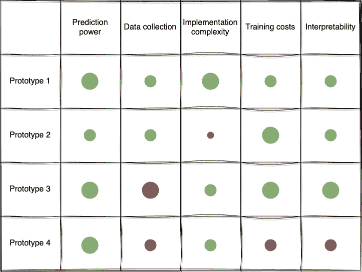

# 如何有效比较机器学习解决方案

> 原文：[`towardsdatascience.com/how-to-compare-ml-solutions-effectively-28384e2cbca1`](https://towardsdatascience.com/how-to-compare-ml-solutions-effectively-28384e2cbca1)

图片由作者使用 [Midjourney](https://www.midjourney.com/app/) 创建。

## 提高将模型投入生产的几率

 [Hennie de Harder](https://hennie-de-harder.medium.com/?source=post_page-----28384e2cbca1--------------------------------)

·发表于 [Towards Data Science](https://towardsdatascience.com/?source=post_page-----28384e2cbca1--------------------------------) ·6 分钟阅读·2023 年 7 月 6 日

--

**在评估和比较机器学习解决方案时，你首先会关注的评价指标可能是预测能力。用单一指标来比较不同模型非常简单，这在 Kaggle 比赛中是完全可以接受的。但在现实生活中，情况则有所不同。假设有两个模型：一个使用了 100 个特征和复杂的架构，另一个使用了 10 个特征和 XGBoost。复杂模型的得分仅比 XGBoost 模型高一点。在这种情况下，你会选择性能最好的模型，还是选择更简单的模型？**

本文将概述在比较不同机器学习解决方案时可以考虑的不同因素。我将通过一个示例向你展示如何比仅使用预测能力更好地比较模型。开始吧！

除了预测结果外，还有几个重要因素需要在比较机器学习原型时考虑。这些因素提供了关于模型在现实场景中整体适用性和有效性的有价值见解。通过不仅关注预测能力，你将增加将机器学习解决方案投入生产的机会。

这些因素分为四类：维护、实施复杂性、成本和业务需求。项目团队应事先决定哪些因素对项目重要。在原型解决方案创建过程中，开发人员可以开始记录不同因素的情况。

# 维护

*收集数据*或进行*特征工程*有多难？你是否使用了*许多不同的库*，模型是否*对参数调优敏感*？项目是否使用了你可以放入管道中的*标准 API*？这些方面使得一个解决方案更容易或更难维护。

如果你的数据来自许多不同的内部和外部来源，这相较于完全依赖公司内部数据的解决方案会存在一个劣势。原因在于，你不能完全依赖外部来源保持不变，任何在这些来源中的更改或更新都需要在你的解决方案中进行重构或调整。这是可能出现的维护问题的一个例子。

维护性的另一个部分是*监控*。这涉及到跟踪指标、检测异常或性能下降，以及调试可能出现的问题。一些模型提供了强大的监控和调试功能。这可能是比其他模型的一个优势。

# 实施复杂性

实施复杂性衡量将模型部署到生产系统中的难度和工作量。它考虑了诸如*必要库的可用性*、*模型架构的复杂性*以及*与现有基础设施的兼容性*等因素。一个易于实施并且能与现有系统集成的模型可以在部署阶段节省宝贵的时间和资源。

另一个可以影响实施复杂性的因素是*对方法的熟悉程度*。选择一个与团队技能相匹配的模型可以显著影响开发时间线。

复杂的道路结构。照片由 [Timo Volz](https://unsplash.com/@magict1911?utm_source=medium&utm_medium=referral) 拍摄，发布在 [Unsplash](https://unsplash.com/?utm_source=medium&utm_medium=referral)

# 成本

开发一个成本很高的模型很容易。成本对于几乎所有公司来说都是一个重要因素。如果你需要为某个解决方案购买昂贵的许可证，你应该能够证明这个许可证的成本是值得的。

你可以花钱在*数据采集*、*数据存储*、*(再)训练*、*推理*或*许可证*和*订阅*上。开发解决方案的*资源*也有一定的成本。通过对每个解决方案这些成本进行有根据的预测，这将成为另一个比较解决方案的因素。

如果成本超出预算（或模型带来的价值），你应该重新考虑一种方法。也可能出现两种解决方案在所有因素上得分相同，除了成本。在这种情况下，选择就很简单，成本较低的解决方案就是更好的选择。

# 业务要求

最后但同样重要的是业务要求。它们可以有多种形式；以下是一些常见的：

+   *可解释性* 能够理解和解释具体预测是一些业务流程中的重要部分。在这种情况下，易于解释的模型可能比预测能力更为重要。如果可解释性很重要，你应该尽量保持模型简单。你可以尝试不同的解释技术，并评估这些技术与模型结合使用的难易程度。

+   *上市时间* 在竞争激烈的行业或处理时间敏感的机会时，模型开发和部署的速度可能是一个关键的业务要求。最小化上市时间对获得竞争优势至关重要。在这种情况下，能够快速开发和部署的模型，并且迭代次数或复杂的预处理步骤最少，将是有利的。

+   *法规合规性*

    某些行业，如金融、医疗和保险，具有严格的法规和合规标准。业务需求可能包括确保所选模型遵守这些法规，如数据隐私法（例如 GDPR）、行业特定指南或伦理考虑。模型必须符合相关法规，以避免法律和声誉风险。

+   *实时推断* 一些应用程序需要（接近）实时预测，在严格的时间限制内做出决策。业务需求可能规定需要低延迟模型，能够快速处理传入数据并实时生成预测。提供高效实时推断能力的模型对于时间敏感的应用程序如欺诈检测或推荐系统至关重要。

# 比较原型

在了解了可能在评估和比较解决方案时发挥重要作用的不同因素之后，你的下一个问题可能是如何比较这些因素。

这并不一定很复杂。首先，团队确定对用例最重要的因素。假设他们想专注于*预测能力*、*数据收集*、总体*实施复杂性*、*训练成本*和*可解释性*。

在原型创建过程中，每个人都记录这 5 个主题的笔记。最后，你可以填充一个类似于下面的矩阵：

比较原型。图片由作者提供。

上面列出了团队确定的因素。左侧是比较中的四个原型。点的含义如下：点越大，影响越大。点的颜色表示正面（绿色）、中性（灰色）或负面（红色）。因此，预测能力对原型 1、3 和 4 来说非常好，对原型 2 来说还可以。数据收集对原型 1 和 2 来说还可以，对原型 3 来说非常困难，对原型 4 来说也有些困难。

这只是一个示例，完全可以创建你自己的比较方法。你可以决定量化分数，而不是使用点数。这种方法的优点是，它提供了清晰的概览，并且直接理解你应该继续的原型，即原型 1。你也可以考虑原型 3，但那部分数据收集比较困难。

# 结论

通过以本文所述的方式比较用例中的原型，你将大大增加进入生产的机会！这样可以很容易地向公司中的任何人说明你选择某种方法的理由。

提前与其他项目成员讨论重要的评估因素，以确保大家意见一致是很有帮助的。实施复杂性、维护、成本和业务需求在大多数项目中难以忽视。只关注预测能力可能会遗漏后续可能出现的复杂性。在原型创建过程中，你可以记录相关标准，并在评估时与团队讨论，以选择最有可能成功的原型。

## 相关

 ## 简化你的机器学习项目

### 为什么花费大量时间和精力在复杂模型上是一个坏主意，以及应该怎么做

towardsdatascience.com  ## 适用于任何机器学习模型的模型无关方法

### 解释方法概述：置换特征重要性、部分依赖图、LIME、SHAP 等。

towardsdatascience.com  ## 创建优秀数据科学产品的步骤

### 从问题到生产。

towardsdatascience.com
