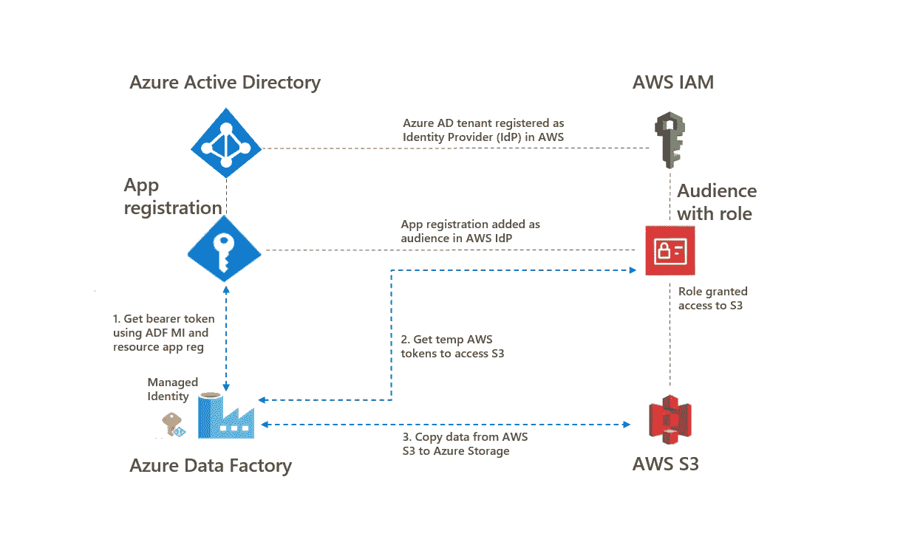
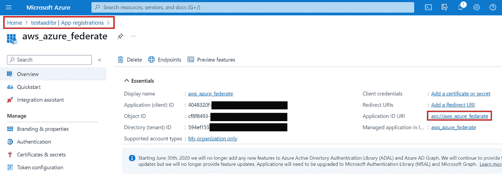
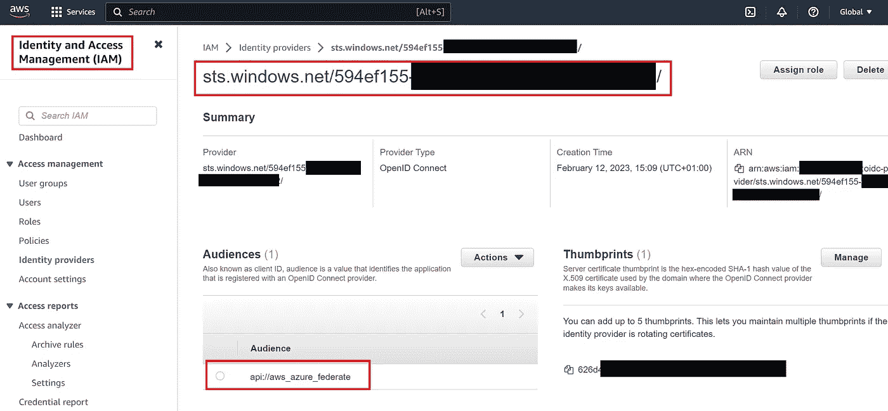
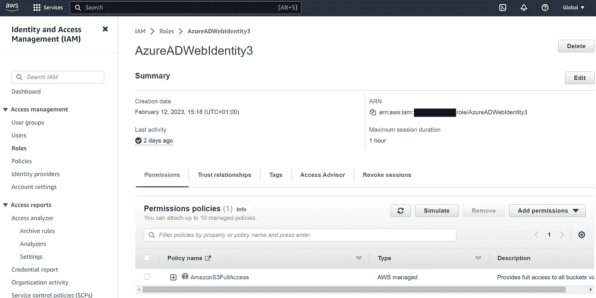
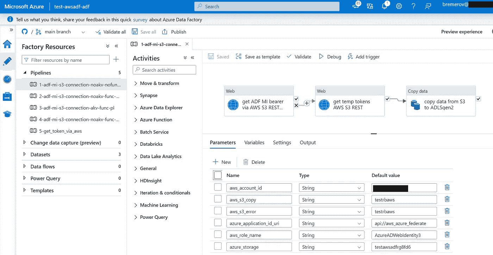
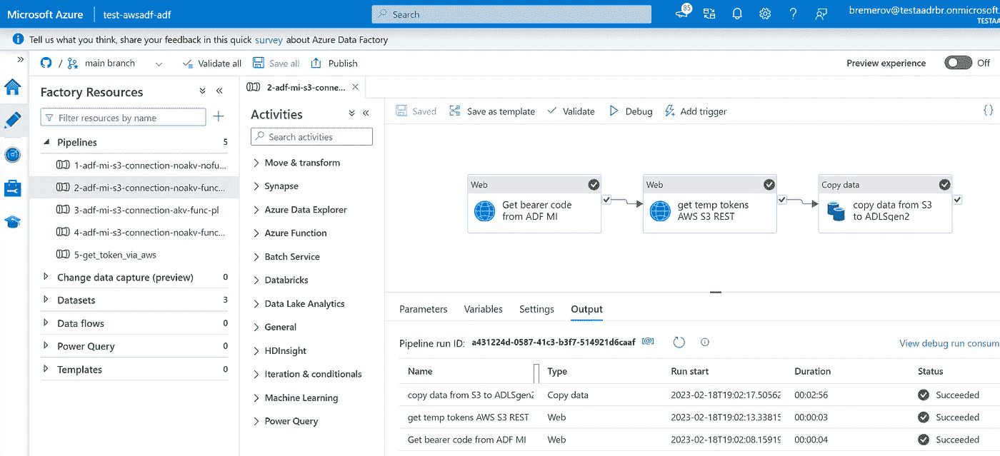

# 如何将 Azure AD 管理身份连接到 AWS 资源

> 原文：[`towardsdatascience.com/how-to-connect-azure-ad-managed-identities-to-aws-resources-9353f3309efb?source=collection_archive---------7-----------------------#2023-02-21`](https://towardsdatascience.com/how-to-connect-azure-ad-managed-identities-to-aws-resources-9353f3309efb?source=collection_archive---------7-----------------------#2023-02-21)

## 从 Azure Data Factory 设置无密钥访问 AWS S3

[](https://rebremer.medium.com/?source=post_page-----9353f3309efb--------------------------------)[](https://towardsdatascience.com/?source=post_page-----9353f3309efb--------------------------------) [René Bremer](https://rebremer.medium.com/?source=post_page-----9353f3309efb--------------------------------)

·

[关注](https://medium.com/m/signin?actionUrl=https%3A%2F%2Fmedium.com%2F_%2Fsubscribe%2Fuser%2F11e5e7fb3771&operation=register&redirect=https%3A%2F%2Ftowardsdatascience.com%2Fhow-to-connect-azure-ad-managed-identities-to-aws-resources-9353f3309efb&user=Ren%C3%A9+Bremer&userId=11e5e7fb3771&source=post_page-11e5e7fb3771----9353f3309efb---------------------post_header-----------) 发表在 [Towards Data Science](https://towardsdatascience.com/?source=post_page-----9353f3309efb--------------------------------) ·5 分钟阅读·2023 年 2 月 21 日[](https://medium.com/m/signin?actionUrl=https%3A%2F%2Fmedium.com%2F_%2Fvote%2Ftowards-data-science%2F9353f3309efb&operation=register&redirect=https%3A%2F%2Ftowardsdatascience.com%2Fhow-to-connect-azure-ad-managed-identities-to-aws-resources-9353f3309efb&user=Ren%C3%A9+Bremer&userId=11e5e7fb3771&source=-----9353f3309efb---------------------clap_footer-----------)

--

[](https://medium.com/m/signin?actionUrl=https%3A%2F%2Fmedium.com%2F_%2Fbookmark%2Fp%2F9353f3309efb&operation=register&redirect=https%3A%2F%2Ftowardsdatascience.com%2Fhow-to-connect-azure-ad-managed-identities-to-aws-resources-9353f3309efb&source=-----9353f3309efb---------------------bookmark_footer-----------)

图片由 [Susan Q Yin](https://unsplash.com/@syinq) 提供，来源于 [Unsplash](https://unsplash.com/)

# 1\. 介绍

对开发人员来说，一个常见的挑战是管理凭据以确保服务之间的通信安全。[Azure 托管标识](https://learn.microsoft.com/en-us/azure/active-directory/managed-identities-azure-resources/overview) 消除了开发人员管理这些凭据的需求。应用程序可以使用托管标识来获取 Azure AD 令牌，以访问 Azure 中的资源。在这篇博客中，解释了如何使用 Azure Data Factory 托管标识来访问 AWS S3，详见下文。



1\. 概述 — Azure AD 托管标识连接 AWS

在本博客的其余部分，将解释如何将 Azure 租户注册为 AWS 中的身份提供者，以便托管标识可以访问 S3。然后，作为示例，使用 Data Factory 托管标识将数据从 AWS S3 复制到 Azure 存储。本教程重度依赖于[Uday Hegde 的这篇博客](https://blog.identitydigest.com/azuread-access-aws/)，其中详细讨论了 Azure AD 和 AWS 的访问。

# 2\. 将 Azure AD 租户设置为 AWS 身份提供者

在本章中，将 Azure AD 租户设置为 AWS 身份提供者。在此过程中执行以下步骤：

+   2.1 在 Azure 中创建应用注册

+   2.2 在 AWS 中创建 Azure AD 租户作为身份提供者（IdP）

+   2.3 将角色添加到 IdP 并授予对 S3 的访问权限

## 2.1 在 Azure 中创建应用注册

在这一段中，创建了一个[应用注册](https://learn.microsoft.com/en-us/azure/active-directory/develop/quickstart-register-app)。登录 Azure 门户，选择 Azure Active Directory，然后选择“应用注册”，并创建一个应用注册。创建应用注册后，需要指定应用程序 ID URL。作为 URI，可以使用 `api://aws_azure_federate`，详见下图。



2.1 使用 URI 方案 app:// 进行应用注册

## 2.2 在 AWS 中创建 Azure AD 租户作为身份提供者（IdP）

在这一段中，将你的 Azure AD 租户注册为 AWS 中的身份提供者（IdP）。登录 AWS 控制台，选择 IAM，然后选择添加身份提供者。使用 OpenID Connect 作为提供者类型，使用 `https://sts.windows.net/<<your Azure AD tenant id>>/`（不要忘记结尾的 /）作为 URL，并使用应用程序 ID URI 作为受众，详见下图。



2.2 在 AWS 中创建 Azure AD 租户作为身份提供者

## 2.3 将角色添加到 IdP 并授予对 S3 的访问权限

在这一段中，在 IdP 中创建一个角色，并将该角色授予对 S3 桶的访问权限。前往你在 AWS 中新创建的 IdP，选择创建角色，选择 Web 身份验证，并选择你的应用注册作为受众。作为权限，选择 `AmazonS3FullAccess`（在生产环境中，创建更细化的策略）。最后，将你的角色命名为 `AzureADWebidentity3` 并创建它，详见下图。



2.3 在 IdP 中使用应用注册作为受众的角色，具有对 S3 的完全访问权限

在此步骤之后，您的 Azure AD 租户将注册为身份提供者。在下一步中，Azure Data Factory 托管的身份将用于将文件从 S3 复制到 Azure 存储。

# 3\. 示例：使用 Data Factory MI 连接到 S3

在本章中，使用 Data Factory 管道将数据从 AWS S3 复制到 Azure 存储。执行以下步骤：

+   3.1 创建 Azure Data Factory、Azure 存储账户和 AWS S3

+   3.2 部署 Data Factory 管道

+   3.3 运行 Data Factory 管道

## 3.1 创建 Azure Data Factory、Azure 存储账户和 AWS S3

在本段中，所需资源已创建。

+   访问这个 [链接](https://learn.microsoft.com/en-us/azure/data-factory/quickstart-create-data-factory) 创建 Azure Data Factory 实例。

+   访问这个 [链接](https://learn.microsoft.com/en-us/azure/storage/common/storage-account-create?tabs=azure-portal) 创建 Azure 存储账户。创建存储账户后，请确保 ADF 托管的身份具有 Blob 存储贡献者角色。同时在存储账户上创建一个文件系统。

+   访问这个 [文档](https://docs.aws.amazon.com/AmazonS3/latest/userguide/GetStartedWithS3.html) 创建 S3 存储桶并向存储桶中添加一些文件。

## 3.2 部署 Data Factory 管道

在本段中，管道已在您的 Azure Data Factory 实例中创建。管道可以在下面的 Git 仓库中找到：

```py
https://github.com/rebremer/data-factory-managed-identity-connection-aws-s3
```

有多种方法可以将管道添加到您自己的 ADF 实例中，例如：

+   将上述 Git 仓库分叉到您的自己的仓库中，并将仓库添加到您的 ADF 实例中，请参见这个 [链接](https://learn.microsoft.com/en-us/azure/data-factory/source-control#connect-to-a-git-repository)

+   使用 Azure CLI 部署 [Git 仓库中的 ARM 模板](https://github.com/rebremer/data-factory-managed-identity-connection-aws-s3/blob/main/test-awsadf-adf/ARMTemplateForFactory.json)，请参见这个 [链接](https://learn.microsoft.com/en-us/azure/azure-resource-manager/templates/deploy-cli) 了解如何操作。

+   （快速而简便）创建一个名为`[1-adf-mi-s3-connection-noakv-nofunc-pl](https://github.com/rebremer/data-factory-managed-identity-connection-aws-s3/blob/main/pipeline/1-adf-mi-s3-connection-noakv-nofunc-pl.json)`的空管道和一个名为`[2-adf-mi-s3-connection-noakv-func-pl2](https://github.com/rebremer/data-factory-managed-identity-connection-aws-s3/blob/main/pipeline/2-adf-mi-s3-connection-noakv-func-pl2.json)`的空管道，以及一个名为`[AmazonS3_linkedservice.json](https://github.com/rebremer/data-factory-managed-identity-connection-aws-s3/blob/main/linkedService/AmazonS3_linkedservice.json)`的链接服务。一旦创建，使用 Git 仓库中的相应 JSON 文件填充管道和链接服务。

最后，转到前两个管道的参数并用您的变量填充它们（其他管道将不会被使用，仅供参考），参见下面的图片。



3.2 成功创建管道，填写参数

## 3.3 运行数据工厂管道

在这一段中，运行了前两个管道。两个管道都使用 ADF MI 获取临时 AWS S3 访问令牌，用于将数据从 AWS S3 复制到 Azure 存储。管道可以描述如下：

+   管道 1：尝试使用 ADF MI 访问 S3 桶，解析错误信息以获取 ADF MI 托管令牌，使用 ADF MI 托管令牌获取临时 AWS S3 令牌，将数据从 S3 复制到 Azure 存储

+   管道 2：与管道 1 相同，但现在使用了一个 [Azure Function](https://learn.microsoft.com/en-us/azure/azure-functions/create-first-function-vs-code-python?pivots=python-mode-decorators) 来传递 ADF MI 托管令牌，而不是 S3 错误信息。

显然，管道 2 更适合企业使用，但需要一个包含 3 行代码的**Azure Function**，如下所示：

```py
# Code of Azure Function:
import azure.functions as func
def main(req: func.HttpRequest) -> func.HttpResponse: 
    return func.HttpResponse(req.headers['Authorization'])
```

在管道成功运行后，使用复制活动将数据从 S3 复制到 Azure 存储，详见下图。



3.3 成功的管道运行，未使用凭证将文件从 S3 复制到 Azure 存储

# 4\. 结论

对开发人员来说，一个常见的挑战是管理凭证以确保服务之间的安全通信。 [Azure 托管身份](https://learn.microsoft.com/en-us/azure/active-directory/managed-identities-azure-resources/overview) 消除了开发人员管理这些凭证的需求。这也可以用于从 Azure AD 访问 AWS 资源。在本博客中，解释了如何使用 Azure Data Factory 托管身份访问 AWS S3，详见下方概述。


4\. 概述 — Azure AD 托管身份与 AWS 的连接
