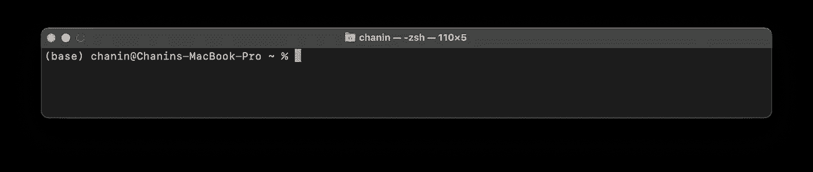

# 如何连接 Streamlit 到 Snowflake

> 原文：[`towardsdatascience.com/how-to-connect-streamlit-to-snowflake-b93256d80a40?source=collection_archive---------5-----------------------#2023-04-06`](https://towardsdatascience.com/how-to-connect-streamlit-to-snowflake-b93256d80a40?source=collection_archive---------5-----------------------#2023-04-06)

## [实践教程](https://towardsdatascience.com/tagged/hands-on-tutorials)

## 一个逐步的实用教程

[](https://data-professor.medium.com/?source=post_page-----b93256d80a40--------------------------------)[](https://towardsdatascience.com/?source=post_page-----b93256d80a40--------------------------------) [Chanin Nantasenamat](https://data-professor.medium.com/?source=post_page-----b93256d80a40--------------------------------)

·

[关注](https://medium.com/m/signin?actionUrl=https%3A%2F%2Fmedium.com%2F_%2Fsubscribe%2Fuser%2Ff94b47c3cfca&operation=register&redirect=https%3A%2F%2Ftowardsdatascience.com%2Fhow-to-connect-streamlit-to-snowflake-b93256d80a40&user=Chanin+Nantasenamat&userId=f94b47c3cfca&source=post_page-f94b47c3cfca----b93256d80a40---------------------post_header-----------) 发布于 [Towards Data Science](https://towardsdatascience.com/?source=post_page-----b93256d80a40--------------------------------) ·10 min read·2023 年 4 月 6 日[](https://medium.com/m/signin?actionUrl=https%3A%2F%2Fmedium.com%2F_%2Fvote%2Ftowards-data-science%2Fb93256d80a40&operation=register&redirect=https%3A%2F%2Ftowardsdatascience.com%2Fhow-to-connect-streamlit-to-snowflake-b93256d80a40&user=Chanin+Nantasenamat&userId=f94b47c3cfca&source=-----b93256d80a40---------------------clap_footer-----------)

--

[](https://medium.com/m/signin?actionUrl=https%3A%2F%2Fmedium.com%2F_%2Fbookmark%2Fp%2Fb93256d80a40&operation=register&redirect=https%3A%2F%2Ftowardsdatascience.com%2Fhow-to-connect-streamlit-to-snowflake-b93256d80a40&source=-----b93256d80a40---------------------bookmark_footer-----------)

图片由 Chanin Nantasenamat 在 [BlueWillow](https://www.bluewillow.ai/) 上生成。

# 1\. 介绍

Streamlit 是一个用于 Python 编程语言的低代码 Web 框架。它允许你在最少编码的情况下构建一个互动 Web 应用程序。

在本教程中，我将向你展示如何使用 Streamlit 创建一个简单的 Web 应用程序，该应用程序连接到基于云的 Snowflake 数据库，从数据库表中加载数据，并输出数据。

无论你是数据分析师、软件开发人员，还是对用 Python 构建 Web 应用程序感兴趣的人，本教程将逐步指导你如何开始使用 Streamlit 和 Snowflake。

让我们预览一下我们正在构建的 Streamlit 应用：


# 2\. 创建 Snowflake 数据库

在本教程中，我们将创建一个 Snowflake 数据库，并在我们正在构建的 Streamlit 应用程序中连接它。

1\. 在 [`signup.snowflake.com`](https://signup.snowflake.com) 注册一个 Snowflake 账户

2\. 检查你的 *“欢迎使用 Snowflake！”* 邮件，获取账户 URL 以访问你的 Snowflake 账户。接着，点击 **LOG IN TO SNOWFLAKE** 按钮，或者将账户 URL `https://<your-unique-account-id>.snowflakecomputing.com` 复制粘贴到互联网浏览器中。


3\. 继续输入你的 Snowflake 凭据。


4\. 登录后，默认会看到工作表面板。

5\. 按照以下说明创建一个新的 SQL 工作表：


6\. 在查询框中输入以下 SQL 查询（请参见代码框下的截图）：

```py
CREATE DATABASE PETS;

CREATE TABLE MYTABLE (
    NAME            varchar(80),
    PET             varchar(80)
);

INSERT INTO MYTABLE VALUES ('Mary', 'dog'), ('John', 'cat'), ('Robert', 'bird');

SELECT * FROM MYTABLE;
```


7\. PETS 数据库现在已经创建。接下来，点击左上角的链接返回主页面。


8\. 从主页面，点击 “Data” 标签查看我们的数据库。


9\. 在这里，我们可以看到新创建的 PETS 数据库。


现在我们的数据库已经准备好了，让我们继续设置编码环境。

# 3\. 设置编码环境

## 创建 conda 环境

首先，让我们通过在终端（也称为 *命令行*）窗口中输入以下内容来创建一个名为 `snowpark` 的 conda 环境：

```py
conda create -n snowpark python=3.8
```

几分钟后，你会看到 conda 请求你确认它将安装以下新包。要确认，请输入 `Y`


等待几分钟，让各种 Python 库安装完成。

一切设置好后，底部会有一条消息，说明如何激活和停用环境。


## 激活 conda 环境

按照上述说明，我们可以通过在终端窗口中输入以下内容来激活名为 `snowpark` 的 conda 环境：

```py
conda activate snowpark
```

一旦 conda 环境被激活，你会注意到终端提示符左侧会显示 conda 环境的名称。

特别地，在下面的第一个截图中，我们使用的是基础环境（注意用户名左侧的 `(base)`），而第二个截图显示了已激活的 `snowpark` conda 环境（注意用户名左侧的 `(snowpark)`）。



接下来，我们将需要安装一些先决的 Python 库，以便我们可以构建一个可以连接到 Snowflake 数据库的 Streamlit 应用。

在终端提示符中输入以下内容：

```py
pip install snowflake-snowpark-python streamlit
```

这将安装上述两个 Python 库：


恭喜你，你的编码环境现在已经准备好让我们进行操作了！

## 停用 conda 环境

最后，当我们完成编码会话时，我们可以通过在终端窗口中输入以下内容来退出 conda 环境：

```py
conda deactivate
```

一旦 conda 环境被停用，你会注意到我们将退出到`(base)`环境。


# 4. 设置目录和文件

## 导航目录

首先，你需要弄清楚你当前所在的目录路径。

要做到这一点，请在终端提示符中输入`pwd`。

```py
pwd
```


你会看到在我的电脑上，我的位置是`/Users/chanin`。假设我想导航到我的工作目录`/Users/chanin/Documents/sandbox`，那么我需要通过`cd`命令切换目录，后面跟上两个子文件夹`Documents/sandbox`。

```py
cd Documents/sandbox
```


## 创建目录

继续通过`mkdir`命令创建`snowflake-first-app`目录：

```py
mkdir snowflake-first-app
```

接下来，让我们切换到新创建的目录：

```py
cd snowflake-first-app
```

## 创建文件

最后，让我们为我们的 Streamlit 应用创建两个空文件，下一部分将对其进行更深入的讲解：

```py
touch streamlit_app.py
```

```py
mkdir .streamlit
touch .streamlit/secrets.toml
```

## 列出目录内容

要查看我们所在的当前目录的内容，可以使用`ls`命令：


等一下，为什么我们只看到一个文件，而我们已经创建了两个文件。缺少的文件是位于隐藏的`.streamlit`目录中的`secrets.toml`文件。

要查看隐藏目录，我们需要添加额外的参数`-a`，如下所示：

```py
ls -a
```


现在我们可以看到隐藏目录了！

在这里，我们可以注意到内容是水平列出的，如果我们想要垂直列出内容怎么办？那么我们需要额外的参数`-l`，如下所示：

```py
ls -a -l
```


我们不仅可以以垂直列表的形式查看内容，还可以看到内容的其他信息，例如读/写权限、文件大小、文件创建/修改日期等。

# 5. 构建 Streamlit 应用

现在 conda 环境已经准备好了，让我们继续构建应用。

首先，让我们用以下代码填充你的`streamlit_app.py`文件：

```py
# Modified from Johannes Rieke's example code

import streamlit as st
from snowflake.snowpark import Session

st.title('❄️ How to connect Streamlit to a Snowflake database')

# Establish Snowflake session
@st.cache_resource
def create_session():
    return Session.builder.configs(st.secrets.snowflake).create()

session = create_session()
st.success("Connected to Snowflake!")

# Load data table
@st.cache_data
def load_data(table_name):
    ## Read in data table
    st.write(f"Here's some example data from `{table_name}`:")
    table = session.table(table_name)

    ## Do some computation on it
    table = table.limit(100)

    ## Collect the results. This will run the query and download the data
    table = table.collect()
    return table

# Select and display data table
table_name = "PETS.PUBLIC.MYTABLE"

## Display data table
with st.expander("See Table"):
    df = load_data(table_name)
    st.dataframe(df)

## Writing out data
for row in df:
    st.write(f"{row[0]} has a :{row[1]}:")
```

要在终端中执行此操作，我们将使用 Vim 文本编辑器，它可以通过`vi`命令调用，后面跟上文件名。

```py
vi streamlit_app.py
```

这将启动你的 Vim 文本编辑器，以编辑`streamlit_app.py`文件的内容。


然后，按 `i` 键，你应该会看到终端窗口底部显示编辑器处于 **INSERT** 模式。


接下来，按 **Ctrl+V**（在 Windows 上）或 **CMD+V**（在 Mac OSX 上）将复制的内容粘贴到文件中。

然后，按 **Esc** 键并输入以下内容，随后按 **Enter** 键：

```py
:wq!
```

这意味着将内容写入文件并退出文本编辑器。

为了确保内容已正确粘贴，让我们使用 `cat` 命令查看文件内容：

```py
cat streamlit_app.py
```


现在 `streamlit_app.py` 文件已经准备好，我们接下来处理 Snowflake 访问凭据。

# 6\. 通过秘密管理添加访问凭据

记住我们之前创建的 `.streamlit/secrets.toml` 文件，现在我们要将以下内容填充到该文件中：

```py
[snowflake]
user = "enter_your_password_here"
password = "enter_your_password_here"
account = "enter_your_account_key_here"
```


保存并退出（参考之前的说明）编辑器。

恭喜，你的应用程序现在已经完成，并准备好启动！

```py
💡 **Note:** - Your "user" and "password" was set by you when registering for your Snowflake account.
- Your "account" key is the sub-domain name from the "account URL" that was sent to you in the "Welcome to Snowflake!" email. 
(See the above screenshot for the "user" and "account" details)
```

# 7\. 启动 Streamlit 应用

现在我们的 `streamlit_app.py` 和 `.streamlit/secrets.toml` 文件都准备好了，让我们回到终端，启动 Streamlit 应用。

继续在终端窗口中输入以下内容：

```py
streamlit run streamlit_app.py
```

几分钟后，你会注意到终端窗口中出现以下消息，提供有关访问 Streamlit 应用程序的说明。


同时，你应该能够看到一个新的互联网浏览器启动，Streamlit 应用程序位于本地的 `http://localhost:8503`


# 8\. 行级代码解释

在概念层面，Streamlit Python 库用于连接到 Snowflake 数据库，从数据库表中加载数据并在应用程序中显示数据。

1\. 导入所需的 Python 库（即 `streamlit` 和 `snowpark`）。

```py
import streamlit as st
from snowflake.snowpark import Sessionp
```

2\. 将 Streamlit 应用的标题设置为 `"❄️ 如何将 Streamlit 连接到 Snowflake 数据库"`

```py
st.title('❄️ How to connect Streamlit to a Snowflake database')p
```

3\. 定义一个自定义函数来创建 Snowflake 会话，并使用 Streamlit 的缓存机制缓存该会话。

```py
# Establish Snowflake session
@st.cache_resource
def create_session():
    return Session.builder.configs(st.secrets.snowflake).create()

session = create_session()
st.success("Connected to Snowflake!")
```

4\. 使用一个缓存结果的函数从 Snowflake 数据库中的表中加载数据。

```py
# Load data table
@st.cache_data
def load_data(table_name):
    ## Read in data table
    st.write(f"Here's some example data from `{table_name}`:")
    table = session.table(table_name)

    ## Do some computation on it
    table = table.limit(100)

    ## Collect the results. This will run the query and download the data
    table = table.collect()
    return table
```

5\. 在 Streamlit 应用中显示加载的数据，放在一个可折叠的扩展器中。

```py
# Select and display data table
table_name = "PETS.PUBLIC.MYTABLE"

## Display data table
with st.expander("See Table"):
    df = load_data(table_name)
    st.dataframe(df)
```

6\. 通过 `st.write` 输出加载的数据，遍历数据表中的行。

配合 `st.write` 使用，f-string 用于将静态文本与来自数据表的每一行的第一列（`row[0]`）和第二列（`row[1]`）的动态值结合起来。

Emoji 是通过在 `row[1]` 值前后添加冒号来显示的。

```py
## Writing out data
for row in df:
    st.write(f"{row[0]} has a :{row[1]}:")
```

# 9\. 总结

总结一下，本教程展示了如何使用 Streamlit 创建一个连接到 Snowflake 数据库的 Web 应用程序。这代表了一个基本的启动模板，你可以在此基础上扩展，构建更复杂的数据驱动型 Web 应用。

如果你有任何问题，请在下方评论区留言，或通过 Twitter 联系我[@thedataprof](https://twitter.com/thedataprof) 或 [LinkedIn](https://www.linkedin.com/in/chanin-nantasenamat/)。

[](https://data-professor.medium.com/membership?source=post_page-----b93256d80a40--------------------------------) [## 通过我的推荐链接加入 Medium - Chanin Nantasenamat

### 如果你觉得这篇文章对你有帮助，可以成为 Medium 会员来支持我作为作者。每月费用为 $5，并且可以…

data-professor.medium.com](https://data-professor.medium.com/membership?source=post_page-----b93256d80a40--------------------------------)

# 阅读这些内容…

[](/streamlit-quests-getting-started-with-streamlit-42fa6f11c2a8?source=post_page-----b93256d80a40--------------------------------) ## Streamlit 探索任务：Streamlit 入门

### 学习 Streamlit 的指导路径

towardsdatascience.com [](/how-to-master-scikit-learn-for-data-science-c29214ec25b0?source=post_page-----b93256d80a40--------------------------------) ## 如何掌握 Scikit-learn 以进行数据科学

### 这里是数据科学中你需要的基本 Scikit-learn

towardsdatascience.com [](/how-to-master-python-for-data-science-1fb8353718bf?source=post_page-----b93256d80a40--------------------------------) ## 如何掌握 Python 以进行数据科学

### 这里是数据科学中你需要的基本 Python

towardsdatascience.com

# 下一步观看…

+   [Streamlit YouTube 播放列表](https://www.youtube.com/watch?v=ZZ4B0QUHuNc&list=PLtqF5YXg7GLmCvTswG32NqQypOuYkPRUE) — 我在 YouTube 频道[*Data Professor*](https://www.youtube.com/@DataProfessor) 创建的 52 个 Streamlit 教程视频的不断增加的集合。
