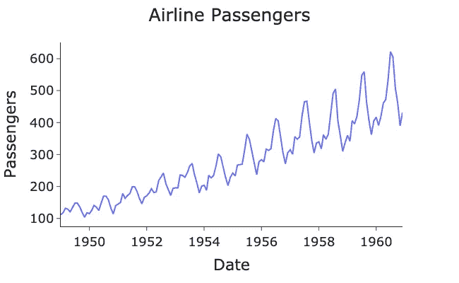

# 如何正确地对时间序列进行交叉验证

> 原文：[`towardsdatascience.com/how-to-correctly-perform-cross-validation-for-time-series-b083b869e42c`](https://towardsdatascience.com/how-to-correctly-perform-cross-validation-for-time-series-b083b869e42c)

## 避免在将交叉验证应用于时间序列和预测模型时常见的陷阱。

 [Egor Howell](https://medium.com/@egorhowell?source=post_page-----b083b869e42c--------------------------------)

·发布于 [Towards Data Science](https://towardsdatascience.com/?source=post_page-----b083b869e42c--------------------------------) ·阅读时间 5 分钟·2023 年 1 月 10 日

--

图片由 [aceofnet](https://unsplash.com/@aceofnet?utm_source=medium&utm_medium=referral) 提供，来源于 [Unsplash](https://unsplash.com/?utm_source=medium&utm_medium=referral)

# 背景

[交叉验证](https://www.youtube.com/watch?v=1rZpbvSI26c&t=29s)是构建任何统计或机器学习模型时的基本过程，并且在数据科学中非常普遍。然而，对于更小众的[时间序列分析](https://en.wikipedia.org/wiki/Time_series)和预测领域，*错误地*进行交叉验证是非常容易的。

在这篇文章中，我想展示将常规交叉验证应用于时间序列模型的问题以及缓解这些问题的常见方法。我们还将通过一个例子演示如何在 Python 中使用交叉验证进行*超参数调整*。

附加视频

# 什么是交叉验证？

交叉验证是一种通过在不同数据部分上训练和测试模型来确定最佳表现模型和参数的方法。最常见和基础的方法是经典的*训练-测试拆分*。在这种方法中，我们将数据拆分为一个*训练集*，用于拟合模型，然后在*测试集*上进行评估。

这个想法可以进一步扩展，通过多次进行*训练-测试拆分*，改变我们训练和测试的数据。这一过程就是**交叉验证**，因为我们使用每一行数据进行训练和评估，以确保我们选择的模型在所有可能的数据中最为稳健。

以下是使用`kfold` sklearn 函数进行交叉验证的可视化，其中我们将`n_splits=5`应用于美国航空乘客数据集：

> 数据[来自 Kaggle](https://www.kaggle.com/datasets/ashfakyeafi/air-passenger-data-for-time-series-analysis)，使用 CC0 许可证。

作者的 GitHub Gist。

由作者在 Python 中生成的图。

正如我们所看到的，数据被分成了***5***个部分，每个部分包含一个新的*训练*和*测试*数据集，用于构建和评估我们的模型。

> 注意：另一种方法是将数据拆分为训练集和测试集，然后进一步将训练集拆分为更多的训练集和验证集。然后，您可以对不同的训练集和验证集进行交叉验证，并在测试集上获得最终模型性能。这就是大多数机器学习模型在实践中会发生的情况。

# 时间序列交叉验证

上述交叉验证对于预测模型并不是一种有效或有效的策略，因为它们具有时间依赖性。对于时间序列，我们总是预测未来。然而，在上述方法中，我们将**在比评估测试数据更远的时间的数据上进行训练**。这就是*数据泄漏*，应该尽一切可能避免。

为了克服这个困境，我们需要确保**测试集的索引总是高于训练集的索引（时间序列数据中的索引通常是时间）。** 这意味着我们的测试总是在模型拟合的数据的未来。

下图展示了使用`TimeSeriesSplit` sklearn 函数和我们上面编写的`plot_cross_val`函数的新交叉验证方法：

作者的 GitHub Gist。

由作者在 Python 中生成的图。

测试集现在总是比训练集更向前的时间，从而避免在构建模型时任何数据泄漏。

# 超参数调整

交叉验证通常与超参数调整一起使用，以确定模型的最佳超参数值。让我们快速回顾一下这个过程的一个例子，针对一个预测模型，在 Python 中进行。

首先绘制数据：

> 数据[来自 Kaggle](https://www.kaggle.com/datasets/ashfakyeafi/air-passenger-data-for-time-series-analysis)，使用 CC0 许可证。

作者的 GitHub Gist。

由作者在 Python 中生成的图。

数据具有[**明确的趋势**](https://medium.com/towards-data-science/time-series-stationarity-simply-explained-125269968154)和[**高度的季节性**](https://medium.com/towards-data-science/seasonality-of-time-series-5b45b4809acd)。对于这个时间序列，一个合适的模型是[*霍尔特-温特斯指数平滑*](https://en.wikipedia.org/wiki/Exponential_smoothing#Triple_exponential_smoothing_(Holt_Winters))模型，它结合了趋势和季节性成分。如果你想了解更多关于霍尔特-温特斯模型的信息，可以查看我之前的帖子：

 ## 霍尔特-温特斯时间序列预测

### 讨论和实现最强大且有用的指数平滑模型

[towardsdatascience.com

在以下代码片段中，我们使用[*网格搜索*](https://www.yourdatateacher.com/2021/05/19/hyperparameter-tuning-grid-search-and-random-search/)和交叉验证调整季节性平滑因子`smoothing_seasonal`，并绘制结果：

作者的 GitHub Gist。

作者用 Python 生成的图表。

从图中可以看出，`smoothing_seasonal`超参数的最佳值似乎是**0.8**。

> 在这种情况下，我们手动进行了网格搜索交叉验证，但许多软件包可以为您完成这项工作。

如果你想了解更多关于超参数调整的领域，查看我之前关于使用[*贝叶斯优化*](https://en.wikipedia.org/wiki/Bayesian_optimization)通过*Hyperopt*包的文章：

 ## Hyperopt 教程：优化超参数调整

### 使用 Hyperopt 进行贝叶斯超参数调整的简单解释和实现

[towardsdatascience.com

# 总结与进一步思考

在这篇文章中，我们展示了为什么不能仅仅对时间序列模型使用常规交叉验证，因为时间依赖性会导致数据泄漏。因此，在为预测模型执行交叉验证时，必须确保测试集**始终**在时间上晚于训练集。这可以很容易地完成，许多软件包也提供了帮助实现这种方法的功能。

由于文章的流动性，Gist 中的代码通常很难跟随，因此我建议查看我 GitHub 上的完整代码：

 [## Medium-Articles/cross_validation.py 在主分支 · egorhowell/Medium-Articles

### 我在我的 Medium 博客/文章中使用的代码。通过创建帐户来贡献 egorhowell/Medium-Articles 的开发...

[github.com](https://github.com/egorhowell/Medium-Articles/blob/main/Time%20Series/Time%20Series%20Tools/cross_validation.py?source=post_page-----b083b869e42c--------------------------------)

# 另一个事项！

我有一个免费的新闻通讯，[**数据分享**](https://dishingthedata.substack.com/)，我在其中分享每周的提高数据科学家技能的小贴士。这里没有“废话”或“点击诱饵”，只有来自实践数据科学家的纯粹可操作的见解。

 [## 数据分享 | Egor Howell | Substack

### 如何成为更好的数据科学家。点击阅读《数据分享》，由 Egor Howell 编写，是一个包含…

newsletter.egorhowell.com](https://newsletter.egorhowell.com/?source=post_page-----b083b869e42c--------------------------------)

# 与我联系！

+   [**YouTube**](https://www.youtube.com/@egorhowell?sub_confirmation=1)

+   [**LinkedIn**](https://www.linkedin.com/in/egor-howell-092a721b3/)

+   [**Twitter**](https://twitter.com/EgorHowell)

+   [**GitHub**](https://github.com/egorhowell)

# 参考文献及进一步阅读

+   *预测：原理与实践:* [`otexts.com/fpp2/`](https://otexts.com/fpp3/holt-winters.html)

+   [`en.wikipedia.org/wiki/Cross-validation_(statistics)`](https://en.wikipedia.org/wiki/Cross-validation_(statistics))

+   [`en.wikipedia.org/wiki/Hyperparameter_optimization`](https://en.wikipedia.org/wiki/Hyperparameter_optimization)

+   [`github.com/hyperopt/hyperopt`](https://github.com/hyperopt/hyperopt)
