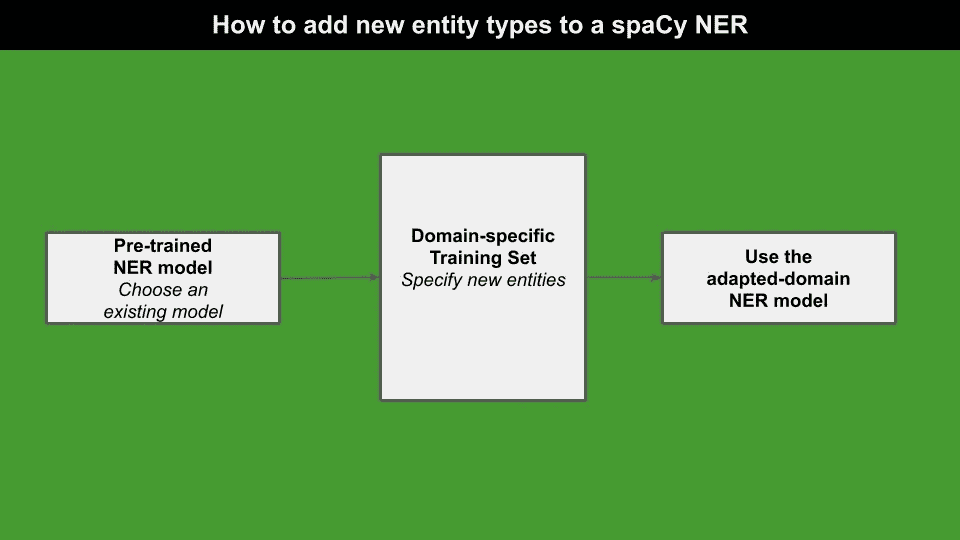
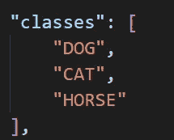
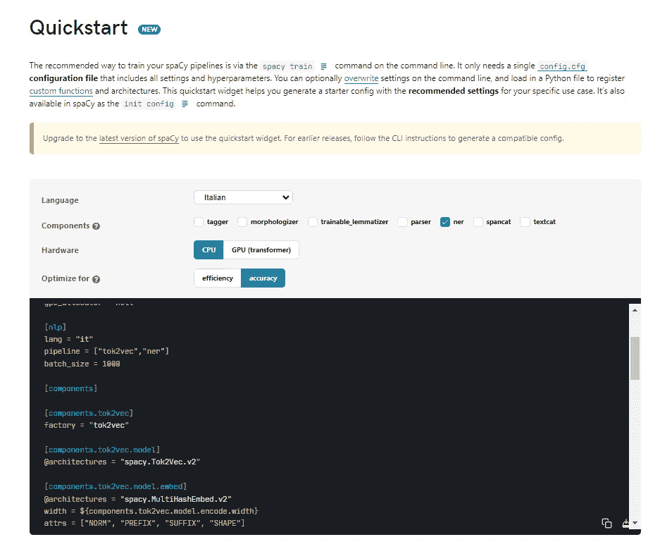
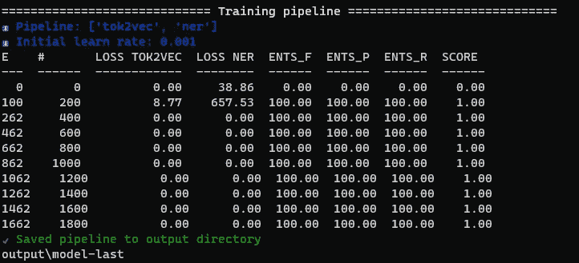

# 如何在 Spacy 3.5 中创建自定义 NER

> 原文：[`towardsdatascience.com/how-to-create-a-custom-ner-in-spacy-3-5-c9942aab3c91`](https://towardsdatascience.com/how-to-create-a-custom-ner-in-spacy-3-5-c9942aab3c91)

## 自然语言处理

## 从文本中提取自定义实体的**快速教程**

[](https://alod83.medium.com/?source=post_page-----c9942aab3c91--------------------------------)[](https://towardsdatascience.com/?source=post_page-----c9942aab3c91--------------------------------) [Angelica Lo Duca](https://alod83.medium.com/?source=post_page-----c9942aab3c91--------------------------------)

·发表于[Towards Data Science](https://towardsdatascience.com/?source=post_page-----c9942aab3c91--------------------------------) ·5 分钟阅读·2023 年 4 月 25 日

--


照片由[Max Chen](https://unsplash.com/ja/@maxchen2k?utm_source=medium&utm_medium=referral)拍摄，[Unsplash](https://unsplash.com/?utm_source=medium&utm_medium=referral)

你是否厌倦了使用不符合你特定需求的通用命名实体识别（NER）模型？不必再找了！本文将指导你如何在 Spacy 3.5 中创建自定义 NER。

通过一些调整和训练数据，你可以拥有一个准确识别特定领域或用例实体的模型。告别“一刀切”的 NER 模型，迎接定制化的精准识别。让我们深入探讨吧！

我们将涵盖：

+   对 spaCy 及其竞争对手的**快速介绍**

+   问题设置

+   生成训练集

+   生成和训练模型

+   测试你的模型。

# 对 spaCy 及其竞争对手的**快速介绍**

如果你第一次听说 spaCy，请知道它是一个流行的开源自然语言处理（NLP）库，提供高效且快速的 NLP 功能，如分词、词性标注、实体识别、依赖解析等。SpaCy 的主要优势在于其速度和内存效率，使其成为大规模文本处理任务的理想选择。

spaCy 的一些替代品包括：

+   **NLTK**（自然语言工具包），是最古老和最全面的 NLP 库之一，提供广泛的文本分析工具，包括情感分析、词干提取和词形还原。

+   **Stanford CoreNLP** 支持包括英语、德语和法语在内的多种语言，具有强大的功能，如命名实体识别和共指解析。

+   **Spark NLP** 提供生产级、可扩展和可训练的最新 NLP 研究版本，支持 Python、Java 和 Scala。

# 问题设置

假设我们有一段文本，希望从中提取实体（人、地点等）。如果实体是经典的，比如人、地点、日期等，我们可以使用 spaCy 提供的预训练 NER 模型。

然而，预训练的通用模型无法再从我们的文本中提取特定实体。特定实体的例子包括狗的品种、细菌的名称等。我们需要一个适应我们领域的模型来识别这种实体类型。

下图展示了构建新的自定义 NER 模型的工作流程：



作者提供的图像

我们从一个通用的、已经**预训练的 NER 模型**开始，然后将其适应我们的领域，为模型提供额外的训练数据。

因此，首先需要构建一个训练集，其中的文本需要准确标注待提取的实体。然后，我们构建模型并用标注好的文本进行训练。

最后，我们使用新数据模型来预测新文本。

现在，让我们实际了解如何在 Python 和 spaCy 中实现所描述的工作流程。

# 生成训练集

首先定义你想要提取的实体类型。例如，你可以提取动物类型：狗、猫、马等。然后，将数据集拆分为训练集和测试集。仅对训练集进行标注。

按照以下步骤生成你可以作为 spaCy 输入的训练集：

+   首先，标注你的文本。使用 [`tecoholic.github.io/ner-annotator/`](https://tecoholic.github.io/ner-annotator/) 进行标注。

+   导出标注文件，命名为 `annotations.json`

+   打开`annotations.json`文件，删除开头部分的类定义。保持 JSON 一致性（如有必要，删除 `{}` 括号）。保存文件。在下面的示例中，删除`classes`：



作者提供的图像

+   将 JSON 文件转换为 spaCy 格式。使用以下代码，最初由 [Zachary Lim](https://medium.com/u/e7a41934a7cc?source=post_page-----c9942aab3c91--------------------------------) 在他的 文章 中实现。

现在你的训练集保存在一个名为 `train.spacy` 的文件中。

# 生成和训练模型

要生成训练模型，请按照以下步骤操作：

+   访问 [`spacy.io/usage/training`](https://spacy.io/usage/training) 并填写表单以构建你的 `config_base.cfg` 文件



从 Spacy 网站提取的图像

+   通过点击右下角的下载按钮下载文件。将模型保存在与`annotations.json`相同的文件夹中。

+   下载你将用来训练数据的基础模型。打开 `config_base.cfg` 查看你使用的是哪个预训练模型。以下示例下载 `it_core_news_lg model`：

```py
python -m spacy download it_core_news_lg
```

+   运行以下命令以初始化模型：

```py
python -m spacy init fill-config base_config.cfg config.cfg
```

+   训练模型：

```py
python -m spacy train config.cfg --output ./output --paths.train ./train.spacy --paths.dev ./dev.spacy
```

命令需要一个包含测试集的 `dev.spacy` 文件。如果你没有测试集，可以使用你的训练集（`train.spacy`）。

训练过程可能需要一些时间。在训练过程结束时，你应该看到类似于以下的输出：



图片由作者提供

# 测试你的模型

现在你的模型已经保存在 `output/model-best` 目录中。在 Python 脚本中按如下方式加载它：

```py
nlp = spacy.load('output/model-best') 
```

现在使用你刚刚训练的模型来提取一些实体：

```py
doc = nlp('My simple text')

spacy.displacy.render(doc, style="ent", jupyter=True) # display in Jupyter
```

# 摘要

恭喜！你刚刚学会了如何在 spaCy 中训练自定义模型进行命名实体识别（NER）！

在 Spacy 3.5 中创建自定义 NER 是一个简单的过程，只需正确的设置和编码知识。现在你已经知道如何使用 Python 和 Spacy 创建自定义 NER，你可以开始为你需要的任何应用程序开发模型。

# 相关文章

[](/how-to-install-spark-nlp-5fcd36fab378?source=post_page-----c9942aab3c91--------------------------------) ## 如何安装 Spark NLP

### 关于如何使 Spark NLP 在本地计算机上工作的逐步教程

towardsdatascience.com [](/how-to-add-new-data-to-a-pretrained-model-in-scikit-learn-ce16911afe33?source=post_page-----c9942aab3c91--------------------------------) ## 如何向 Scikit-learn 中的预训练模型添加新数据

### 关于如何在 scikit-learn 中使用 warm_start=True 和 partial_fit() 的逐步教程

towardsdatascience.com [](https://heartbeat.comet.ml/how-to-use-the-comet-registry-to-track-your-machine-learning-models-4b18e7f61500?source=post_page-----c9942aab3c91--------------------------------) [## 如何使用 Comet 注册表跟踪你的机器学习模型

### 关于 Comet 注册表功能的教程

heartbeat.comet.ml](https://heartbeat.comet.ml/how-to-use-the-comet-registry-to-track-your-machine-learning-models-4b18e7f61500?source=post_page-----c9942aab3c91--------------------------------)
