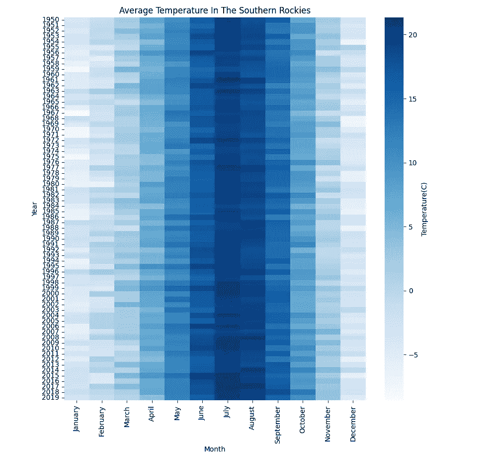

# 如何创建热力线图

> 原文：[`towardsdatascience.com/how-to-create-a-heat-line-plot-82f8038d1659?source=collection_archive---------11-----------------------#2023-11-23`](https://towardsdatascience.com/how-to-create-a-heat-line-plot-82f8038d1659?source=collection_archive---------11-----------------------#2023-11-23)

## 创建多维分段线图

 [barrysmyth](https://barrysmyth.medium.com/?source=post_page-----82f8038d1659--------------------------------)

·

[关注](https://medium.com/m/signin?actionUrl=https%3A%2F%2Fmedium.com%2F_%2Fsubscribe%2Fuser%2Fa995c3b2ae8&operation=register&redirect=https%3A%2F%2Ftowardsdatascience.com%2Fhow-to-create-a-heat-line-plot-82f8038d1659&user=barrysmyth&userId=a995c3b2ae8&source=post_page-a995c3b2ae8----82f8038d1659---------------------post_header-----------) 发布于 [Towards Data Science](https://towardsdatascience.com/?source=post_page-----82f8038d1659--------------------------------) ·4 min read·Nov 23, 2023

--

你可能已经听说过[热力图](https://en.wikipedia.org/wiki/Heat_map)。那些用来表示多个（通常是三个）数据维度的二维色彩编码网格；例如，下面的热力图显示了根据月份和年份在南落基山的平均温度。

一幅热力图显示了从 1950 年到 2020 年南落基山的平均温度。[[知识共享署名-相同方式共享 4.0 国际许可协议](https://creativecommons.org/licenses/by-sa/4.0)]

当我需要可视化一些 Strava 数据时，我想到了热图。我想比较一些最近跑过的马拉松，通过查看每场比赛的 42.2 公里中我的配速和心率（区域）。这让我想到了线图，使用每 1 公里间隔作为*x 值*，并使用这些间隔期间的配速作为*y 值*。但是，在这些间隔期间我的心率（作为努力的一种衡量）如何呢？标准的 Matplotlib（我选择的图形库）[线图](https://matplotlib.org/stable/api/_as_gen/matplotlib.pyplot.plot.html)并没有提供一种直接的方法来编码这样的额外维度，因为诸如线条颜色、粗细和样式等属性是固定的，作用于整个图形。对于我的使用场景，我希望能够变化每条线段的属性，这样我就可以例如使用颜色来显示比赛不同部分的心率区域。

这样做相当简单，是超越 Matplotlib 默认内置功能的一个有用示例。基本思路是分别绘制每条线…
