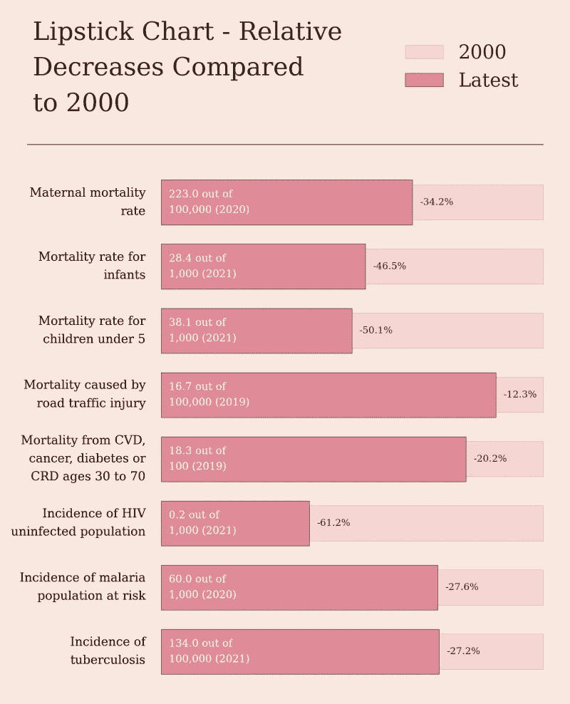
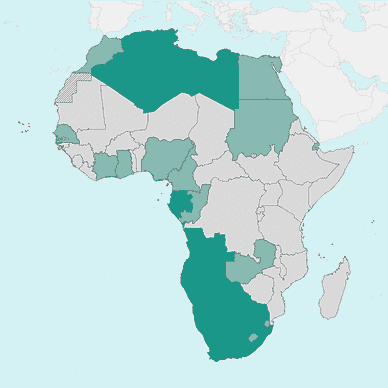
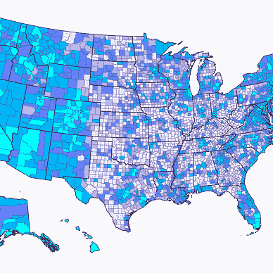

# 如何使用 Matplotlib 创建唇膏图

> 原文：[`towardsdatascience.com/how-to-create-a-lipstick-chart-with-matplotlib-2fde5412fee9?source=collection_archive---------14-----------------------#2023-09-02`](https://towardsdatascience.com/how-to-create-a-lipstick-chart-with-matplotlib-2fde5412fee9?source=collection_archive---------14-----------------------#2023-09-02)

## Matplotlib 教程

## 当数值越低越好时的数据可视化

 [Oscar Leo](https://medium.com/@oscarleo?source=post_page-----2fde5412fee9--------------------------------)

·

[关注](https://medium.com/m/signin?actionUrl=https%3A%2F%2Fmedium.com%2F_%2Fsubscribe%2Fuser%2Fd7e5c1ca65b7&operation=register&redirect=https%3A%2F%2Ftowardsdatascience.com%2Fhow-to-create-a-lipstick-chart-with-matplotlib-2fde5412fee9&user=Oscar+Leo&userId=d7e5c1ca65b7&source=post_page-d7e5c1ca65b7----2fde5412fee9---------------------post_header-----------) 发表在 [Towards Data Science](https://towardsdatascience.com/?source=post_page-----2fde5412fee9--------------------------------) · 6 分钟阅读 · 2023 年 9 月 2 日

--

今天，我将向你展示如何创建一个用于可视化进度的唇膏图，其中数值越低越好。

当指标具有相似的趋势和主题但尺度不同的时候，使用这种图表非常合适。我的目标是传达一个信息，而不仅仅是“只是”一个图表。

我准备了一个关于死亡率和疾病的简单数据集，以便你可以专注于创建可视化。

数据来源于[世界银行](https://data.worldbank.org/)，并在知识共享许可证下公开。如果你想了解更多，我在我的新免费通讯[数据奇观](https://open.substack.com/pub/datawonder/p/the-worlds-progress-on-mortality?r=17ashl&utm_campaign=post&utm_medium=web)中写了关于可视化的内容。

如果你喜欢这个教程，确保也看看我的其他教程。

[奥斯卡·里奥](https://medium.com/@oscarleo?source=post_page-----2fde5412fee9--------------------------------)

## Matplotlib 教程

[查看列表](https://medium.com/@oscarleo/list/matplotlib-tutorials-262e5d7f0847?source=post_page-----2fde5412fee9--------------------------------)8 篇故事！

让我们开始吧。

## 第一步 - 导入库
