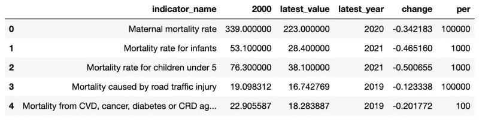
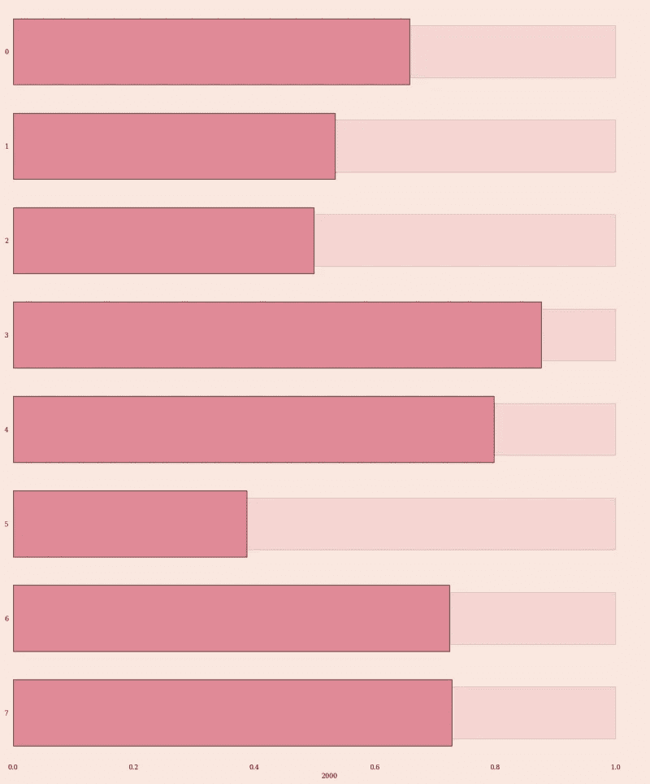
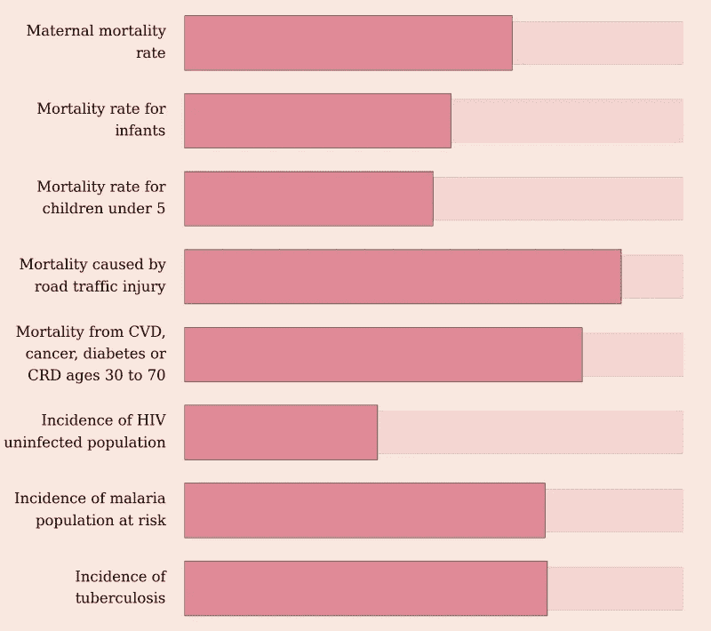
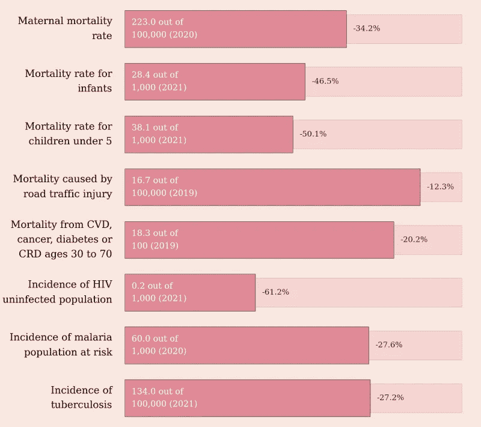
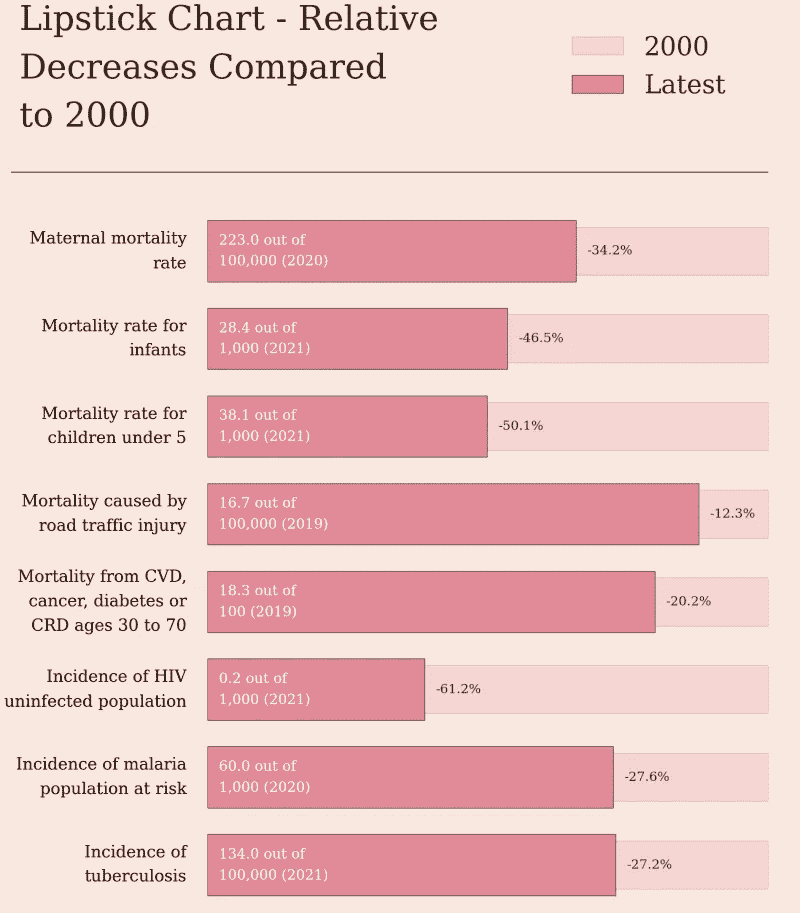
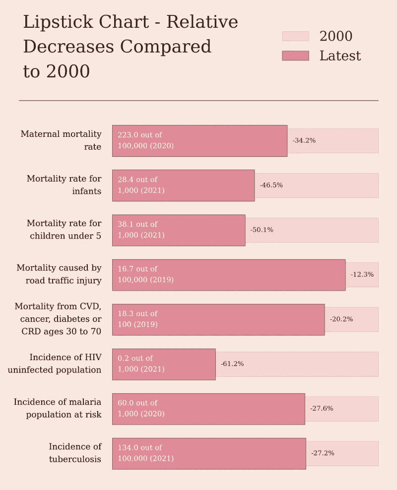

# 如何使用 Matplotlib 创建口红图

> 原文：[`towardsdatascience.com/how-to-create-a-lipstick-chart-with-matplotlib-2fde5412fee9`](https://towardsdatascience.com/how-to-create-a-lipstick-chart-with-matplotlib-2fde5412fee9)

## Matplotlib 教程

## 一个数据可视化示例，数值越低越好

[](https://medium.com/@oscarleo?source=post_page-----2fde5412fee9--------------------------------)[](https://towardsdatascience.com/?source=post_page-----2fde5412fee9--------------------------------) [Oscar Leo](https://medium.com/@oscarleo?source=post_page-----2fde5412fee9--------------------------------)

·发布于[数据科学探索](https://towardsdatascience.com/?source=post_page-----2fde5412fee9--------------------------------) ·6 分钟阅读·2023 年 9 月 2 日

--


今天，我将向你展示如何创建一个口红图，以可视化那些数值越低越好的指标的进展。

当指标具有相似的趋势和主题但尺度不同时，这种方法非常适合。我的目标是分享一个信息，而不仅仅是一个图表。

我准备了一个关于死亡率和疾病的简单数据集，以便你可以专注于创建可视化。

数据来自于[世界银行](https://data.worldbank.org/)，在 Creative Commons 许可证下公开。如果你想了解更多，我在我的新免费通讯[数据奇迹](https://open.substack.com/pub/datawonder/p/the-worlds-progress-on-mortality?r=17ashl&utm_campaign=post&utm_medium=web)中写了关于该可视化的内容。

如果你喜欢这个教程，确保也看看我的其他教程。


[Oscar Leo](https://medium.com/@oscarleo?source=post_page-----2fde5412fee9--------------------------------)

## Matplotlib 教程

[查看列表](https://medium.com/@oscarleo/list/matplotlib-tutorials-262e5d7f0847?source=post_page-----2fde5412fee9--------------------------------)8 个故事

让我们开始吧。

## 第 1 步 - 导入库

最简单的部分是导入所需的库，如 pandas 和 matplotlib。

```py
import numpy as np
import pandas as pd

import seaborn as sns
import matplotlib.pyplot as plt

from PIL import Image
from matplotlib.lines import Line2D
```

恭喜，你刚刚完成了第 1 步！ 🥳

## 第 2 步 — 创建 Seaborn 样式

接下来，我想创建一个颜色方案并选择一个字体。像[Coolors](https://coolors.co/)和[Colorhunt](https://colorhunt.co/)这样的网站是寻找美丽颜色的好资源。

这是我为本教程创建 seaborn 样式的代码和设置。

```py
FONT_FAMILY = "serif"
BACKGROUND_COLOR = "#FAE8E0"
TEXT_COLOR = "#33261D"
BAR_COLOR = "#EF7C8E"

sns.set_style({
    "axes.facecolor": BACKGROUND_COLOR,
    "figure.facecolor": BACKGROUND_COLOR,
    "text.color": TEXT_COLOR,
    "font.family": FONT_FAMILY,
    "xtick.bottom": False,
    "xtick.top": False,
    "ytick.left": False,
    "ytick.right": False,
    "axes.spines.left": False,
    "axes.spines.bottom": False,
    "axes.spines.right": False,
    "axes.spines.top": False,
})
```

我正在移除所有刻度线和线条，以创建一个干净的可视化，网格线对我们的口红图没有额外的信息。

## 步骤 3 — 读取数据

你可以像我在下面的代码中那样直接从 URL 读取 CSV。

```py
df = pd.read_csv(
    "https://raw.githubusercontent.com/oscarleoo/matplotlib-tutorial-data/main/mortality-and-decease.csv"
)
```

下面是数据框的样子。



截图由作者提供

大多数值是不言而喻的，除了“per”，它显示每行的刻度。例如，最新的“孕产妇死亡率”值是每 10 万次分娩中有 223 例。

## 步骤 4 — 添加条形图

现在，是时候添加一些数据了。

我正在为 2000 年及最新值添加条形图。由于我的目标是展示每个值的相对减少，我将每一行除以其 2000 年的值。

这意味着 2000 年的每个条形图都会达到 1，因此这只是一个视觉辅助，不会添加任何额外的信息。

```py
def add_bars(ax, x, width, alpha, label):
    sns.barplot(
        ax=ax, x=x, y=[i for i in range(len(x))], label=label,
        width=width, alpha=alpha,
        color=BAR_COLOR,
        edgecolor=TEXT_COLOR,
        orient="h"
    )
```

我创建一个图形，并像这样运行`add_bars()`函数。

```py
fig, ax = plt.subplots(nrows=1, ncols=1, figsize=(18, 2.7 * len(df)))

add_bars(
    ax=ax, x=df["2000"] / df["2000"],
    width=0.55, alpha=0.2, label="2000"
)
add_bars(
    ax=ax, x=df["latest_value"] / df["2000"],
    width=0.7, alpha=1, label="Latest"
)
```

到目前为止的代码结果如下。



图表由作者创建

让我们继续。

## 步骤 5 — 格式化坐标轴

每行的名称太长，无法不换行使用。这就是为什么我创建了以下函数，在几个地方添加`\n`到字符串中的原因。

```py
def split_name(name, limit=20):
    split = name.split()
    s = ""
    for s_ in split:
        if len(s.split("\n")[-1] + s_) > limit:
            s += "\n" + s_
        else:
            s += " " + s_
    return s.strip()
```

我还想增加字体大小并移除不必要的信息，以使图表易于阅读。现在创建可视化的代码如下所示。

```py
fig, ax = plt.subplots(nrows=1, ncols=1, figsize=(18, 2.7 * len(df)))
...

ax.set(xlabel=None, ylabel=None, xticks=[])
ax.tick_params("y", labelsize=28, pad=32)
ax.tick_params("x", labelsize=20, pad=16)

ax.set_yticks(
    ticks=[i for i in range(len(df))],
    labels=[split_name(n, limit=19) for n in df["indicator_name"]],
    linespacing=1.7, va="center"
)
```

这是更新后的结果。



截图由作者提供

让我们添加一些额外的信息。

## 步骤 5 — 添加有用的信息

你总是希望确保用户理解他们看到的内容。目前，我们没有任何有用的信息。

首先，我想添加当前值，使用以下函数来实现。

```py
def add_info_text(ax, row, index):
    value = round(row["latest_value"], 1)
    per = row["per"]
    year = row["latest_year"]
    text = "{:,} out of\n{:,} ({})".format(value, per, year)

    ax.annotate(
        text=text, 
        xy=(0.02, index), 
        color="#fff", 
        fontsize=24,
        va="center", 
        linespacing=1.7
    )
```

由于目的是展示每个指标相对于 2000 年的值的相对减少，我还有另一个函数显示每行的变化。

```py
def add_change_text(ax, row, index):
    change = round(100 * row["change"], 1)
    text = "{:,}%".format(change)
    x = row["latest_value"] / row["2000"] + 0.02

    ax.annotate(
        text="{:,}%".format(change), xy=(x, index), fontsize=22,
        va="center",  linespacing=1.7
    )
```

我将这两个函数添加到一个 for 循环中。

```py
fig, ax = plt.subplots(nrows=1, ncols=1, figsize=(18, 2.7 * len(df)))
...

for index, row in df.reset_index().iterrows():
    add_info_text(ax, row, index)
    add_change_text(ax, row, index)
```

这是输出结果。



图表由作者创建

开始看起来不错。

## 步骤 6 — 添加标题和图例

在这一步，我只是使用一些内置的 Matplotlib 函数来添加标题和图例。由于我们在`add_bars()`中定义了`label`，所以大部分样式是自动的。

除了定义标题和图例外，我还使用`Line2D`添加了边框以实现视觉效果。

```py
fig, ax = plt.subplots(nrows=1, ncols=1, figsize=(18, 2.7 * len(df)))
...

line = Line2D([-0.33, 1.0], [-0.9, -0.9], color=TEXT_COLOR)
line.set_clip_on(False)
ax.add_artist(line)
title = "Lipstick Chart - Relative\nDecreases Compared\nto 2000"
plt.title(title, x=-0.32, y=1.11, fontsize=58, ha="left", linespacing=1.6)
plt.legend(bbox_to_anchor=(0.75, 1.14), loc='lower center', borderaxespad=0, ncol=1, fontsize=44, edgecolor="#FAE8E0")
```

现在图表看起来是这样的。



图表由作者创建

## 步骤 7 — 创建图像并添加填充

图表看起来有点拥挤，所以最后一步是添加一些填充。我通过将图形转换为 PIL 图像来实现这一点，使用如下函数。

```py
def create_image_from_figure(fig):
    plt.tight_layout()

    fig.canvas.draw()
    data = np.frombuffer(fig.canvas.tostring_rgb(), dtype=np.uint8)
    data = data.reshape((fig.canvas.get_width_height()[::-1]) + (3,))

    plt.close() 
    return Image.fromarray(data)
```

这是添加填充的函数。

```py
def add_padding_to_chart(chart, left, top, right, bottom, background):
    size = chart.size
    image = Image.new("RGB", (size[0] + left + right, size[1] + top + bottom), background)
    image.paste(chart, (left, top))
    return image
```

现在我们已经编写了所有创建数据可视化所需的代码。

这是使用所有函数创建最终口红图的完整代码片段。

```py
fig, ax = plt.subplots(nrows=1, ncols=1, figsize=(18, 2.7 * len(df)))

add_bars(
    ax=ax, x=df["2000"] / df["2000"],
    width=0.55, alpha=0.2, label="2000"
)

add_bars(
    ax=ax, x=df["latest_value"] / df["2000"],
    width=0.7, alpha=1, label="Latest"
)

ax.set(xlabel=None, ylabel=None, xticks=[])
ax.tick_params("y", labelsize=28, pad=32)
ax.tick_params("x", labelsize=20, pad=16)

ax.set_yticks(
    ticks=[i for i in range(len(df))],
    labels=[split_name(n, limit=20) for n in df["indicator_name"]],
    linespacing=1.7, va="center"
)

for index, row in df.reset_index().iterrows():
    add_info_text(ax, row, index)
    add_change_text(ax, row, index)

line = Line2D([-0.35, 1.0], [-0.9, -0.9], color=TEXT_COLOR)
line.set_clip_on(False)
ax.add_artist(line)

title = "Lipstick Chart - Relative\nDecreases Compared\nto 2000"
plt.title(title, x=-0.32, y=1.11, fontsize=58, ha="left", linespacing=1.6)
plt.legend(bbox_to_anchor=(0.75, 1.14), loc='lower center', borderaxespad=0, ncol=1, fontsize=44, edgecolor="#FAE8E0")

image = create_image_from_figure(fig)
image = add_padding_to_chart(image, 20, 50, 10, 50, BACKGROUND_COLOR)
```

这是完成的产品。



作者提供的截图

完成了！

# 结论

感谢你阅读本教程；我希望你学到了一些可以在数据可视化项目中重复使用的技巧。

如果你想查看更多教程和美丽的数据可视化，请在这里关注我，订阅[数据奇迹](https://datawonder.substack.com/)以及在 Twitter 上关注[oscarl3o](https://twitter.com/oscarl3o)。

下次见。
