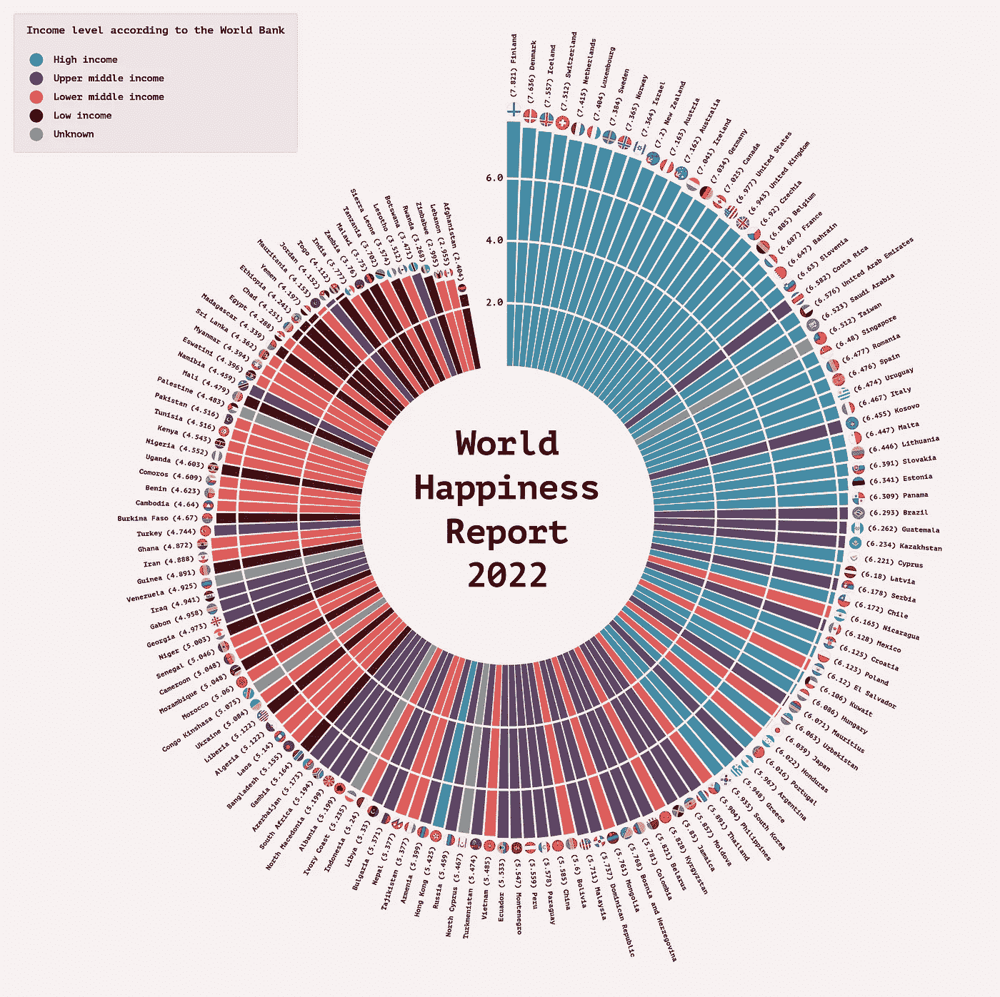
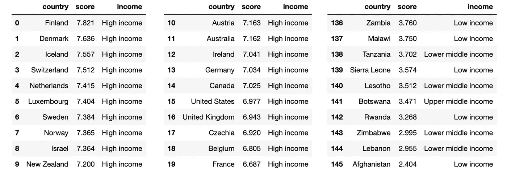

# 如何使用 Python 和 Matplotlib 创建极坐标直方图

> 原文：[`towardsdatascience.com/how-to-create-a-polar-histogram-with-python-and-matplotlib-9e266c22c0fa?source=collection_archive---------10-----------------------#2023-08-24`](https://towardsdatascience.com/how-to-create-a-polar-histogram-with-python-and-matplotlib-9e266c22c0fa?source=collection_archive---------10-----------------------#2023-08-24)

## Matplotlib 教程

## 创建一个吸引眼球并能给观众讲述有见地故事的图表。

 [Oscar Leo](https://medium.com/@oscarleo?source=post_page-----9e266c22c0fa--------------------------------)

·

[关注](https://medium.com/m/signin?actionUrl=https%3A%2F%2Fmedium.com%2F_%2Fsubscribe%2Fuser%2Fd7e5c1ca65b7&operation=register&redirect=https%3A%2F%2Ftowardsdatascience.com%2Fhow-to-create-a-polar-histogram-with-python-and-matplotlib-9e266c22c0fa&user=Oscar+Leo&userId=d7e5c1ca65b7&source=post_page-d7e5c1ca65b7----9e266c22c0fa---------------------post_header-----------) 发表在 [Towards Data Science](https://towardsdatascience.com/?source=post_page-----9e266c22c0fa--------------------------------) ·10 分钟阅读·2023 年 8 月 24 日

--

作者创建的图表

嗨，欢迎来到这个 Python + Matplotlib 教程，在这里我将展示如何创建上面看到的美丽极坐标直方图。

极坐标直方图在值的数量太多而无法用标准条形图展示时非常有效。每个条形在向中间收缩的圆形形状允许我们在相同的区域内容纳更多的信息。

一个很好的特点是，最终的视觉效果可以比较最低值和最高值，它们在绕中心转一圈后相遇。

在本教程中，我使用了来自[世界幸福报告](https://worldhappiness.report/)的数据以及来自[世界银行](https://data.worldbank.org/)的收入水平信息。这些数据源均在创意共享许可证下公开可用。

我的数据框包含 146 个国家和三列数据。

这就是它的样子。

作者提供的截图

我将展示并解释创建可视化所需的每一行代码。如果…
