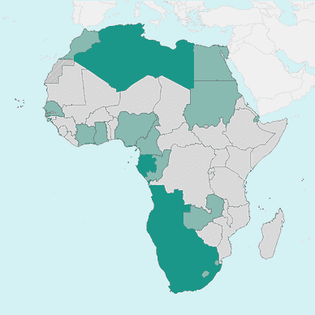
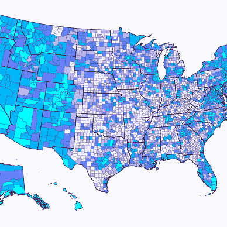

# 如何用 Python 和 Matplotlib 创建极坐标直方图

> 原文：[`towardsdatascience.com/how-to-create-a-polar-histogram-with-python-and-matplotlib-9e266c22c0fa`](https://towardsdatascience.com/how-to-create-a-polar-histogram-with-python-and-matplotlib-9e266c22c0fa)

## Matplotlib 教程

## 创建一个吸引眼球并向观众讲述深刻故事的图表。

[](https://medium.com/@oscarleo?source=post_page-----9e266c22c0fa--------------------------------)[](https://towardsdatascience.com/?source=post_page-----9e266c22c0fa--------------------------------) [Oscar Leo](https://medium.com/@oscarleo?source=post_page-----9e266c22c0fa--------------------------------)

·发表于[数据科学前沿](https://towardsdatascience.com/?source=post_page-----9e266c22c0fa--------------------------------) ·10 分钟阅读·2023 年 8 月 24 日

--


作者创建的图表

你好，欢迎来到这个 Python + Matplotlib 教程，我将向你展示如何创建上面看到的美丽极坐标直方图。

极坐标直方图非常适合当标准条形图的数据值过多时。每个条形在中间变细的圆形形状使我们能在相同的区域内容纳更多信息。

一个很好的特点是，经过一圈后，最低值和最高值的可视化比较效果很好。

在本教程中，我使用了[世界幸福报告](https://worldhappiness.report/)中的数据和[世界银行](https://data.worldbank.org/)中的收入水平信息。这两个数据源都在 Creative Commons 许可下公开提供。

我的数据框包含 146 个国家和三列。

这就是它的样子。


作者截图

我会展示并解释创建可视化所需的每一行代码。如果你想跟着操作，你可以在这个[GitHub 仓库](https://github.com/oscarleoo/polar-histogram-tutorial)找到我使用的代码和数据。

让我们开始吧。

# 第一步：准备

## 导入库

我们只需要大家都熟悉的标准 Python 库。PIL 不是强制的，但它是我处理图像的首选工具，我们在添加标志时会用到。

```py
import math
import numpy as np
import pandas as pd

import seaborn as sns
import matplotlib.pyplot as plt

from PIL import Image
from matplotlib.lines import Line2D
from matplotlib.patches import Wedge
from matplotlib.offsetbox import OffsetImage, AnnotationBbox
```

唯一突出的地方是最后的几个特定 Matplotlib 导入。我会在教程后面详细讲解这些组件。

像往常一样，我使用 pandas 加载数据。

```py
df = pd.read_csv("./hapiness_report_2022.csv", index_col=None)
df = df.sort_values("score").reset_index(drop=True)
```

让我们继续。

## Seaborn 样式设置

接下来，我使用 Seaborn 来创建基础样式，通过定义背景、文本颜色和字体来完成。

```py
font_family = "PT Mono"
background_color = "#F8F1F1"
text_color = "#040303"

sns.set_style({
    "axes.facecolor": background_color,
    "figure.facecolor": background_color,
    "font.family": font_family,
    "text.color": text_color,
})
```

set_style 还有几个参数，但这些四个是本教程中所需的。

我使用网站如[`colorhunt.co/`](https://colorhunt.co/)和[`coolors.co/`](https://coolors.co/)来创建美丽的颜色调色板。

## 全局设置

我还添加了一些全局设置来控制总体外观。前四个定义了直方图中楔形的范围、大小和宽度。

```py
START_ANGLE = 100 # At what angle to start drawing the first wedge
END_ANGLE = 450 # At what angle to finish drawing the last wedge
SIZE = (END_ANGLE - START_ANGLE) / len(df) # The size of each wedge
PAD = 0.2 * SIZE # The padding between wedges

INNER_PADDING = 2 * df.score.min()
LIMIT = (INNER_PADDING + df.score.max()) * 1.3 # Limit of the axes
```

内部填充在原点和每个楔形的起始点之间创建了距离。它在图形的中间打开了一个空间，我可以在其中添加标题。

## 模板代码

作为一名软件工程师，我力求编写可重用的代码，在数据可视化工作中也是如此。

这就是为什么我总是从创建几行模板代码开始，然后用可重用的函数扩展它们。

```py
fig, ax = plt.subplots(nrows=1, ncols=1, figsize=(30, 30))
ax.set(xlim=(-LIMIT, LIMIT), ylim=(-LIMIT, LIMIT))

for i, row in df.iterrows():
    bar_length = row.score
    name = row.country
    length = bar_length + INNER_PADDING
    start = 100 + i*SIZE + PAD
    end = 100 + (i+1)*SIZE
    angle = (end + start) / 2

    # Create variables here

    # Add wedge functions here

# Add general functions here

plt.axis("off")
plt.tight_layout()
plt.show()
```

在接下来的教程中，我将根据三个评论之一创建并添加函数和变量。

# 步骤 2：绘制楔形图

为了在 Matplotlib 中获得更多的视觉效果，使用底层组件而不是内置图形函数是有帮助的。

## 绘制楔形图

例如，与其使用`plt.pie()`来创建饼图，不如使用`plt.patches.Wedge()`来绘制单个部分。

这就是我创建以下函数的原因，该函数根据角度、长度、条形长度和颜色绘制一个楔形图。

```py
def draw_wedge(ax, start_angle, end_angle, length, bar_length, color):
    ax.add_artist(
        Wedge((0, 0),
            length, start_angle, end_angle,
            color=color, width=bar_length
        )
    )
```

在模板代码中，我在“在此处添加函数”评论下添加`draw_wedge()`，如下所示。

```py
bar_length = row.score
length = bar_length # + INNER_PADDING
start = 100 + i*SIZE + PAD
end = 100 + (i+1)*SIZE
.
.
.

# Add functions here    
draw_wedge(ax, start, end, length, bar_length, "#000")
```

我使用`row.score`来定义`bar_length`，以便条形图的可见部分之间有一个准确的尺寸关系。目前，我已经移除了`INNER_PADDING`以展示它的效果。

当我运行代码时，我得到以下图形。


图形由作者创建

正如你所见，我们还有很长的路要走，才能得到类似于开始时看到的极坐标直方图，但至少我们已经成功地绘制了楔形图。

我们在中间附近得到很多视觉伪影，所以让我们取消注释`INNER_PADDING`。

这是我们得到的结果。


图形由作者创建

好得多。

## 添加颜色

接下来，我有一个简单的颜色函数，根据该国家的收入水平决定每个楔形的颜色。

```py
def color(income_group):
    if income_group == "High income":
        return "#468FA8"
    elif income_group == "Lower middle income":
        return "#E5625E"
    elif income_group == "Upper middle income":
        return "#62466B"
    elif income_group == "Low income":
        return "#6B0F1A"
    else:
        return "#909090"
```

我将该函数作为输入传递给 draw_wedge 函数。

```py
# Add functions here    
draw_wedge(ax, start, end, length, bar_length, color(row.income))
```

这是结果。


图形由作者创建

使用`INNER_PADDING`和`color()`后，没有留下奇怪的伪影。现在是时候添加解释我们所看到的内容的信息了。

# 步骤 3：添加标签

让我们为极坐标直方图中的每个条形添加标签。我希望每个条形显示国家的国旗、名称和幸福指数。

## 定义位置

当你在 Matplotlib 中向图表添加标志和文本时，需要计算正确的位置。

这通常很棘手，特别是当你有像极坐标直方图这样的不寻常形状时。

下面的函数接受楔形的长度和角度来计算一个位置。填充将位置从条形图中推开，以增加一些视觉空间。

```py
def get_xy_with_padding(length, angle, padding):
    x = math.cos(math.radians(angle)) * (length + padding)
    y = math.sin(math.radians(angle)) * (length + padding)
    return x, y
```

我们可以使用这个函数来处理旗帜和文本。

## 添加旗帜

对于旗帜，我使用这些来自 FlatIcon 的圆角旗帜：[`www.flaticon.com/packs/countrys-flags`](https://www.flaticon.com/packs/countrys-flags)。它们需要许可证，因此不幸的是，我不能分享它们，但你可以在其他地方找到类似的旗帜。

这是我的函数，用于在图表上添加旗帜。它接受位置、国家名称（对应正确文件的名称）、缩放和旋转。

```py
def add_flag(ax, x, y, name, zoom, rotation):
    flag = Image.open("<location>/{}.png".format(name.lower()))
    flag = flag.rotate(rotation if rotation > 270 else rotation - 180)
    im = OffsetImage(flag, zoom=zoom, interpolation="lanczos", resample=True, visible=True)

    ax.add_artist(AnnotationBbox(
        im, (x, y), frameon=False,
        xycoords="data",
    ))
```

如果角度超过 270 度，我会改变旗帜的旋转方式。这发生在我们开始在图表的右侧添加条形图时。那时，旗帜位于文本的左侧，改变旋转使阅读更加自然。

现在，我们可以计算角度，使用`get_xy_with_padding()`并在图表上放置旗帜。

```py
bar_length = row.score
length = bar_length + INNER_PADDING
start = START_ANGLE + i*SIZE + PAD
end = START_ANGLE + (i+1)*SIZE

# Add variables here
angle = (end + start) / 2
flag_zoom = 0.004 * length
flag_x, flag_y = get_xy_with_padding(length, angle, 0.1 * length)

# Add functions here
...
add_flag(ax, flag_x, flag_y, row.country, flag_zoom, angle)
```

`flag_zoom`参数决定旗帜的大小，并取决于分数。如果一个国家的分数较低，那么旗帜的空间就更小，我们需要将其稍微缩小一点。


图表由作者创建

太棒了。

## 添加国家名称和分数

为了添加国家名称和分数，我编写了以下函数。

就像旗帜一样，如果角度超过 270 度，我会改变旋转。否则，文本将会倒置。

```py
def add_text(ax, x, y, country, score, angle):
    if angle < 270:
        text = "{} ({})".format(country, score)
        ax.text(x, y, text, fontsize=13, rotation=angle-180, ha="right", va="center", rotation_mode="anchor")
    else:
        text = "({}) {}".format(score, country)
        ax.text(x, y, text, fontsize=13, rotation=angle, ha="left", va="center", rotation_mode="anchor")
```

我们以与旗帜相同的方式计算文本的位置。唯一的不同是我们添加了更多的填充，因为我们希望它远离楔形。

```py
bar_length = row.score
length = bar_length + INNER_PADDING
start = START_ANGLE + i*SIZE + PAD
end = START_ANGLE + (i+1)*SIZE

# Add variables here
angle = (end + start) / 2
flag_zoom = 0.004 * length
flag_x, flag_y = get_xy_with_padding(length, angle, 0.1 * length)
text_x, text_y = get_xy_with_padding(length, angle, 16*flag_zoom)

# Add functions here
...
add_flag(ax, flag_x, flag_y, row.country, flag_zoom, angle)
add_text(ax, text_x, text_y, row.country, bar_length, angle)
```

现在我们有了如下图表，并且它开始看起来好多了。


图表由作者创建

现在是告诉用户他们正在查看什么的时候了。

# 第 4 步：添加信息

我们已经添加了所有数据。现在是通过添加有用的信息和指导来使图表更具可读性的时刻。

## 绘制参考线

一种优秀的视觉辅助工具是参考线；它们在这里的效果和标准条形图上一样好。

这个想法是在线上绘制一个特定的分数，这间接地帮助我们比较不同的国家。

这是我的函数，用于绘制参考线。我重用`draw_wedge()`函数，从 0 到 360 度绘制一个楔形。

```py
def draw_reference_line(ax, point, size, padding, fontsize=18):
    draw_wedge(ax, 0, 360, point+padding+size/2, size, background_color)
    ax.text(-0.6, padding + point, point, va="center", rotation=1, fontsize=fontsize)
```

我对每个分数运行一次函数，以绘制多个参考线。

```py
# Add general functions here
draw_reference_line(ax, 2.0, 0.05, INNER_PADDING)
draw_reference_line(ax, 4.0, 0.05, INNER_PADDING)
draw_reference_line(ax, 6.0, 0.05, INNER_PADDING)
```

这是结果。


图表由作者创建

这会产生显著的差异。

## 添加标题

图表中心的空隙目的是为标题创建一个自然的位置。标题在中心位置是很不寻常的，这样可以立即吸引观众的兴趣。

添加标题的代码是标准的 Matplotlib 功能。

```py
# Add general functions here
...
plt.title(
  "World Happiness Report 2022".replace(" ", "\n"), 
  x=0.5, y=0.5, va="center", ha="center", 
  fontsize=64, linespacing=1.5
)
```

这就是它的样子。


图表由作者创建

已经接近了，但我们还有最后一件事要做。

## 添加图例

观众无法理解颜色的含义，但我们可以通过添加图例来解决这个问题。

为了添加图例，我创建了以下函数，该函数接受要添加的标签、颜色和标题。

```py
def add_legend(labels, colors, title):
    lines = [
        Line2D([], [], marker='o', markersize=24, linewidth=0, color=c) 
        for c in colors
    ]

    plt.legend(
        lines, labels,
        fontsize=18, loc="upper left", alignment="left",
        borderpad=1.3, edgecolor="#E4C9C9", labelspacing=1,
        facecolor="#F1E4E4", framealpha=1, borderaxespad=1,
        title=title, title_fontsize=20,
    )
```

我在“在此添加通用函数”下添加了功能，并与其他内容一起运行。

```py
# Add general functions here
...

add_legend(
    labels=["High income", "Upper middle income", "Lower middle income", "Low income", "Unknown"],
    colors=["#468FA8", "#62466B", "#E5625E", "#6B0F1A", "#909090"],
    title="Income level according to the World Bank\n"
)
```

最终结果看起来是这样的。


图由作者创建

就这样。我们重新创建了你在顶部看到的漂亮的极坐标直方图。

你的整个主代码块现在应该如下所示。

```py
fig, ax = plt.subplots(nrows=1, ncols=1, figsize=(30, 30))
ax.set(xlim=(-LIMIT, LIMIT), ylim=(-LIMIT, LIMIT))

for i, row in df.iterrows():
    bar_length = row.score
    length = bar_length + INNER_PADDING
    start = START_ANGLE + i*SIZE + PAD
    end = START_ANGLE + (i+1)*SIZE
    angle = (end + start) / 2

    # Add variables here
    flag_zoom = 0.004 * length
    flag_x, flag_y = get_xy_with_padding(length, angle, 8*flag_zoom)
    text_x, text_y = get_xy_with_padding(length, angle, 16*flag_zoom)

    # Add functions here
    draw_wedge(ax, start, end, length, bar_length, color(row.income))
    add_flag(ax, flag_x, flag_y, row.country, flag_zoom, angle)
    add_text(ax, text_x, text_y, row.country, bar_length, angle)

ax.text(1-LIMIT, LIMIT-2, "+ main title", fontsize=58)

# Add general functions here
draw_reference_line(ax, 2.0, 0.06, INNER_PADDING)
draw_reference_line(ax, 4.0, 0.06, INNER_PADDING)
draw_reference_line(ax, 6.0, 0.06, INNER_PADDING)
plt.title("World Happiness Report 2022".replace(" ", "\n"), x=0.5, y=0.5, va="center", ha="center", fontsize=64, linespacing=1.5)

add_legend(
    labels=["High income", "Upper middle income", "Lower middle income", "Low income", "Unknown"],
    colors=["#468FA8", "#62466B", "#E5625E", "#6B0F1A", "#909090"],
    title="Income level according to the World Bank\n"
)

plt.axis("off")
plt.tight_layout()
plt.show()
```

本教程就到这里；恭喜你完成了。

# 结论

今天，我们学习了如何使用 Matplotlib 和 Python 创建一个漂亮的极坐标直方图。

极坐标直方图的创建非常简单，可以让我们在一个图表中包含更多的信息。

我在本教程中使用了《世界幸福报告》，但你可以将其更改为其他有启发性的数据集。

我希望你学到了一些技术，帮助你将图表创意变为现实。

如果你喜欢，确保查看我的其他 Matplotlib 教程。


[Oscar Leo](https://medium.com/@oscarleo?source=post_page-----9e266c22c0fa--------------------------------)

## Matplotlib 教程

[查看列表](https://medium.com/@oscarleo/list/matplotlib-tutorials-262e5d7f0847?source=post_page-----9e266c22c0fa--------------------------------)8 个故事

下次见。
