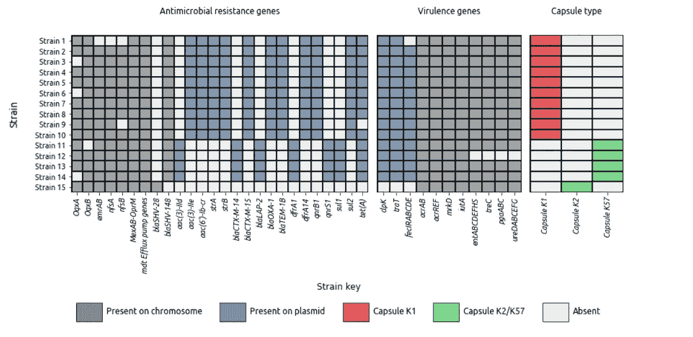
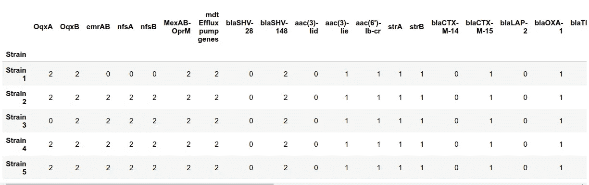
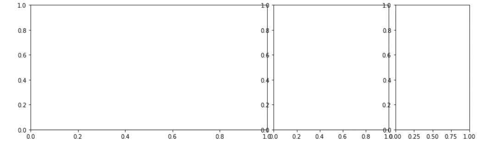
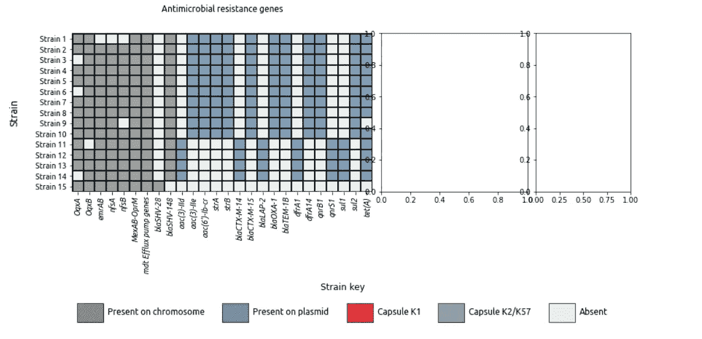
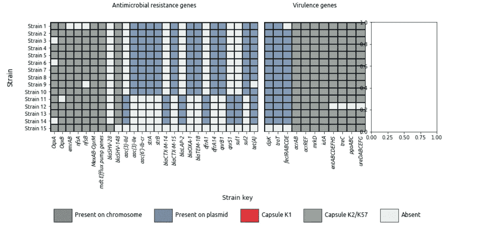

# 如何在 Python 中创建出版质量的热图

> 原文：[`towardsdatascience.com/how-to-create-a-publication-quality-heatmap-in-python-e4a7feb3c079`](https://towardsdatascience.com/how-to-create-a-publication-quality-heatmap-in-python-e4a7feb3c079)

## Python 中的热图教程指南

[](https://medium.com/@stephenfordham?source=post_page-----e4a7feb3c079--------------------------------)[](https://towardsdatascience.com/?source=post_page-----e4a7feb3c079--------------------------------) [Stephen Fordham](https://medium.com/@stephenfordham?source=post_page-----e4a7feb3c079--------------------------------)

·发表于[Towards Data Science](https://towardsdatascience.com/?source=post_page-----e4a7feb3c079--------------------------------) ·6 分钟阅读·2023 年 8 月 28 日

--



## 介绍

热图可以作为信息图形用于传达定量数据。它们可以以易于阅读的格式传达数据，提供简洁的数据总结。

Python 有许多工具可以帮助制作出版质量的热图。这些工具包括 Seaborn 和 Matplotlib 库，以及 subplot2grid 库，这些库可以提供方便的方式来组织热图中的数据。

在本教程中，我将详细介绍制作热图的步骤，重点关注关键元素的存在/缺失。为此，我将使用一个包含虚构数据的 CSV 文件，这些数据涉及一组选定的细菌分离株。这些细菌菌株具有包括抗生素抗性基因、致病基因和某些胶囊类型等特征。热图将允许快速检查和比较各种菌株。

虽然所使用的示例集中在细菌菌株上，但所应用的技术可以更广泛地用于其他数据集，帮助你使用热图可视化数据。在接下来的教程中，所有图片均由作者提供。

## 目标

创建一个展示虚构细菌菌株关键基因存在/缺失的出版质量热图。

本教程将使用以下 CSV 文件，‘Bacterial_strain_heatmap_tutorial_data.csv’，可从[Github 仓库](https://github.com/StephenFordham/Visualisation_Portfolio)获取。

## 开始

首先，需要一些导入语句来读取数据并稍后美化图形。我们将首先一起包含所有导入语句。

```py
import pandas as pd 
import numpy as np
import matplotlib.pyplot as plt 
from matplotlib.colors import ListedColormap
import seaborn as sns 
from matplotlib.patches import Patch
from matplotlib.lines import Line2D
from matplotlib.patches import Rectangle
```

接下来，我们读取数据框，使用“Strain”列设置索引，并查看前 5 行。

```py
df = pd.read_csv('Bacterial_strain_heatmap_tutorial_data.csv').set_index('Strain')
df.head()
```



从前 5 行可以看到数据以基因名称作为列进行组织，而索引则指向每个特定的菌株。一个从 0 到 5 的数字被用来指示特定基因的存在/缺失。这是因为我们将创建一个关键字来表示基因在菌株中的位置。

为了提高可读性，热图将被组织成 3 个部分。这些部分包括抗生素耐药基因部分、毒力基因部分和胶囊类型部分。为了实现这一点，我们首先需要将每个部分的关键列提取为一个单独的列表。

```py
amr_columns_to_extract = ['OqxA', 'OqxB', 'emrAB', 'nfsA', 'nfsB', 'MexAB-OprM',
       'mdt Efflux pump genes','blaSHV-28', 'blaSHV-148', 'aac(3)-IId', 'aac(3)-IIe',
       "aac(6')-Ib-cr", "strA", "strB", 'blaCTX-M-14',
       'blaCTX-M-15', 'blaLAP-2', 'blaOXA-1', 'blaTEM-1B', 'dfrA1', 'dfrA14',
       'qnrB1', 'qnrS1', 'sul1', 'sul2', 'tet(A)']

virulence_columns_to_extract = ['clpK', 'traT',
       'fecIRABCDE', 'acrAB', 'acrREF', 'mrkD', 'iutA', 'entABCDEFHS', 'treC',
       'pgaABC', 'ureDABCEFG']

capsule_type = ['Capsule K2', 'Capsule K3','Capsule K123']
```

接下来，我们将为每个基因类别创建一个独特的颜色。为此，我们将创建一个字典，其中键匹配原始 CSV 文件中编码的值，而该键的值是一个唯一的十六进制颜色码。然后，我们将使用 `matplotlib.colors` 中的 ListedColormap 类，并在开头使用列表推导式创建一个颜色映射，这样我们就可以将其用作调用 sns.heatmap 时 cmap 参数的一个参数。

```py
cmap_dict = {0: '#E9EEEC', 1: '#6B83A9',2: '#868B89'}
cmap = ListedColormap([cmap_dict[i] for i in range(0,3)])

cmap_dict_2 = {3: '#D43B34', 4: '#79D170',5: '#E9EEEC'}
cmap2 = ListedColormap([cmap_dict_2[i] for i in range(3,6)])
```

## 图形网格模式组织

下一步是决定热图的组织方式。我们将把热图分为 3 个部分，包括一个初始的抗生素耐药基因热图、一个毒力基因热图，最后一个胶囊类型热图。

为了将热图划分为这 3 个部分，我们将使用 matplotlib.pyplot 库中的 subplot2grid。

```py
fig = plt.figure(figsize=(15, 4))

ax1 = plt.subplot2grid((1, 12), (0, 0), colspan=6)
ax2 = plt.subplot2grid((1, 12), (0, 6), colspan=3)
ax3 = plt.subplot2grid((1, 12), (0, 9), colspan=2)
```

首先，我们决定图形的大小，然后在 subplot2grid 函数调用中的第一个元组中设置行数和列数（整个图形的）。接下来，我们确定每个部分的起始位置，在第二个元组中设置，然后将指定的列数分配给 colspan 参数。这将产生如下所示的布局。



我们现在可以开始热图的第一个部分的工作。我们将开始处理 ax1。

在调用 sns.heatmap 时，我们首先从原始数据框中提取列 amr_columns_to_extract，将自定义颜色映射添加到 cmap 参数中，移除颜色条，添加线宽和颜色，并添加 alpha 值以使颜色更柔和。

然后，我们遍历 x 轴刻度标签，并为它们分配不同的字体，然后将其斜体化。根据惯例，基因名称在遗传学中是斜体的。我们还遍历 y 轴标签，并将 x 和 y 轴的标签大小设置为 10.5。

接下来的图例元素将是图形的关键。我们创建了一个 Patch 对象的列表，每个对象都分配了面色、边缘颜色和相应的标签。这个 Patch 对象的列表被赋值给变量名 'legends elements'，然后可以作为参数传递给 ax1.legend 属性。这 5 个图例元素被组织成一行，传递给 ncol 参数的值为 5。

最后，我们使用`axhline/axvline`在第一个热图周围添加了黑色边框，以提高清晰度。

```py
fig = plt.figure(figsize=(15, 4))

ax1 = plt.subplot2grid((1, 12), (0, 0), colspan=6)
ax2 = plt.subplot2grid((1, 12), (0, 6), colspan=3)
ax3 = plt.subplot2grid((1, 12), (0, 9), colspan=2)

ax1.set_title('Antimicrobial resistance genes',size=12, pad=30, fontname='Ubuntu')

ax1 = sns.heatmap(df[amr_columns_to_extract], cmap=cmap, cbar=False,linewidths=0.4, 
                  linecolor='black', alpha=0.8, ax=ax1)

for tick in ax1.get_xticklabels():
    tick.set_fontname('Ubuntu')
    tick.set_style('italic')
ax1.tick_params(axis='x', labelsize=10.5)

for tick in ax1.get_yticklabels():
    tick.set_fontname('Ubuntu')
ax1.tick_params(axis='y', labelsize=10.5)

ax1.set_ylabel("Strain\n", fontname='Ubuntu', fontsize=14)

legend_elements = [ Patch(facecolor='#868B89', edgecolor='#323436',
                         label='Present on chromosome'),
                   Patch(facecolor='#6B83A9', edgecolor='#323436',
                         label='Present on plasmid'),
                  Patch(facecolor='#D43B34', edgecolor='#323436',
                         label='Capsule K1'),
                  Patch(facecolor='#79D170', edgecolor='#323436',
                         label='Capsule K2/K57'),
                  Patch(facecolor='#E9EEEC', edgecolor='#323436',
                         label='Absent')]

ax1.legend(handles=legend_elements, 
          bbox_to_anchor=[0.9, -0.7], 
          title='Strain key', 
          ncol=5,
          frameon=False,
          prop={'size': 12, 'family': 'Ubuntu'},
          title_fontsize=12,
          handleheight=3, 
          handlelength=3,
          handletextpad=0.5,
          labelspacing=1.2,
          loc='center')

ax1.axhline(y=0, color='k',linewidth=3)
ax1.axhline(y=df[amr_columns_to_extract].shape[1], color='k',linewidth=3)
ax1.axvline(x=0, color='k',linewidth=3)
ax1.axvline(x=df[amr_columns_to_extract].shape[1], color='k',linewidth=3); 
```

这生成了热图的第一部分。



我们现在可以添加热图的第二部分代码。在这里，关键的毒力基因被提取并作为传递给`sns.heatmap`的第二个数据框表示，并分配给`ax2`变量。至关重要的是，对于第二个热图，我们移除了 y 轴刻度标签及其名称，因为这些信息已经通过第一个热图提供。水平和垂直线再次被添加，以增强图形的定义。

```py
ax2 = sns.heatmap(df[virulence_columns_to_extract], cmap=cmap, cbar=False,linewidths=0.4, 
                  linecolor='black', alpha=0.8, ax=ax2)

ax2.set_title('Virulence genes',size=12, pad=30, fontname='Ubuntu')

for tick in ax2.get_xticklabels():
    tick.set_fontname('Ubuntu')
    tick.set_style('italic')
ax2.tick_params(axis='x', labelsize=10.5)

for tick in ax2.get_yticklabels():
    tick.set_visible(False)

ax2.tick_params(left=False)
ax2.set_ylabel('')    

ax2.axhline(y=0, color='k',linewidth=3)

ax2.axvline(x=0, color='k',linewidth=3)
ax2.axvline(x=df[virulence_columns_to_extract].shape[1], color='k',linewidth=3); 
```

这生成了以下热图。



现在可以添加热图的第三部分，使用相同的技术。这一次，从原始数据框中提取不同的列。

```py
ax3 = sns.heatmap(df[capsule_type], cmap=cmap2, cbar=False,linewidths=0.4, 
                  linecolor='black', alpha=0.8, ax=ax3)

ax3.set_title('Capsule type',size=12, pad=30, fontname='Ubuntu')

for tick in ax3.get_xticklabels():
    tick.set_fontname('Ubuntu')
    tick.set_style('italic')
ax3.tick_params(axis='x', labelsize=10.5)

for tick in ax3.get_yticklabels():
    tick.set_visible(False)

ax3.tick_params(left=False)
ax3.set_ylabel('')

ax3.axvline(x=0, color='k',linewidth=3)
ax3.axvline(x=df[capsule_type].shape[1], color='k',linewidth=3); 
```

将代码全部组合起来，产生以下图形。通过简单的图形组织和与键的颜色协调，一张发布质量的热图已经准备好，供你下一次工作使用！


## 结论

通过使用 Python 绘图库和 matplotlib.pyplot 中的 subplot2grid 模块，可以生成信息丰富的热图，以提供全面的数据摘要。将热图与键结合使用也可以包含所包含的信息级别。虽然这里展示的示例特定于遗传学，但这些技术具有广泛的适用性，并且适用于其他数据集，只要原始数据被适当地编码。支持本教程的代码、csv 文件和图像可以在我的[Github repository](https://github.com/StephenFordham/Visualisation_Portfolio)中找到。
