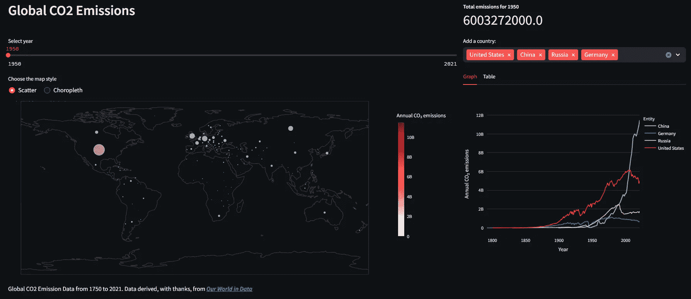

# 如何使用 Plotly 和 Streamlit 创建一个简单的 GIS 地图

> 原文：[`towardsdatascience.com/how-to-create-a-simple-gis-map-with-plotly-and-streamlit-7732d67b84e2`](https://towardsdatascience.com/how-to-create-a-simple-gis-map-with-plotly-and-streamlit-7732d67b84e2)

## 数据可视化

## Plotly 地图功能与 Streamlit 用户界面组件相结合，提供了一种创建 GIS 风格仪表盘的方法

[](https://medium.com/@alan-jones?source=post_page-----7732d67b84e2--------------------------------)[](https://towardsdatascience.com/?source=post_page-----7732d67b84e2--------------------------------) [Alan Jones](https://medium.com/@alan-jones?source=post_page-----7732d67b84e2--------------------------------)

·发布于 [Towards Data Science](https://towardsdatascience.com/?source=post_page-----7732d67b84e2--------------------------------) ·14 分钟阅读·2023 年 12 月 22 日

--


约翰·霍普金斯大学的 COVID 数据仪表盘 — 图片由 [Clay Banks](https://unsplash.com/@claybanks?utm_source=medium&utm_medium=referral) 提供，来自 [Unsplash](https://unsplash.com/?utm_source=medium&utm_medium=referral)

在 2020 年，我们都习惯了在媒体上看到比以前更多的数据。约翰·霍普金斯大学等创建的精密数据仪表盘成为了关于 COVID-19 扩散的新闻报道中的重要内容。

因此，如果疫情有任何积极的方面，也许就是更多的人能够理解数据的图形表示。

这种经验可能导致了图表和仪表盘在各种数据呈现中的更广泛使用，无论是医学、金融还是新闻中的其他数字。

除了展示感染率的指数增长和追踪 R 数字的图表外，我们还习惯了约翰·霍普金斯仪表盘上看到的地理信息类型。这展示了全球疫情的发展情况，但我们也都有这些系统的本地版本。

这些应用程序使用了复杂的软件来表示数据和地理位置，但我们可以尝试做一些类似的事情——虽然相对简单一些——使用 Plotly 和 Streamlit。

我们将从在 Plotly 中创建一些简单的地图开始，然后逐步使用 Streamlit 创建一个受约翰·霍普金斯大学启发的数据仪表盘。

最终的应用程序将类似于下图所示。


但在我们进入应用程序之前，我们需要探讨如何使用 Plotly 地图。

# Plotly 地图

Plotly 支持几种地图类型，但我们将使用*轮廓*地图，因为它们简单易用且清晰。下面的图片展示了一个 Streamlit 应用，其中包含两种 Plotly 轮廓地图，表示澳大利亚各州的人口。左侧的是 Choropleth：一个带有颜色区域的地图，颜色代表某个值——在这种情况下是人口。

另一个是 Scatter Map，它使用圆圈来显示值，圆圈的大小和颜色都代表数据——在这种情况下，大小和颜色都代表人口。

要创建这样的地图，我们使用 Plotly Express 的 `choropleth` 和 `scatter_geo` 函数。


数据来源：澳大利亚统计局——见注释

我们稍后将讨论如何创建这些地图，但你可能已经注意到在这个例子中使用大小来表示 Scatter Map 中值的一个缺点：北领地的人口相对于其他地区非常少，以至于圆圈不可见。Choropleth 中的颜色较浅，但由于它覆盖了整个州区域，因此非常明显。

*本文中将使用的代码和数据文件都可以下载，并且演示应用也将发布在 Streamlit Community Cloud。我会在文章末尾提供一个 GitHub 仓库的链接，您可以查看和/或下载代码和数据，还会提供一个应用链接。当我在下文中提到文件或文件夹时，是指 GitHub 仓库。*

## 获取数据

我们的最终仪表板将使用 CO2 排放数据。这些数据来源于 [Our World in Data](https://ourworldindata.org/) 的 GitHub 仓库中的表格（参见注释）。OWID 是一个很好的数据和分析来源，我已经使用过多次（例如，[新的数据表明 2023 年是有记录以来最热的夏天](https://medium.com/towards-data-science/new-data-demonstrates-that-2023-was-the-hottest-summer-ever-d92d500a8f01)）。

我从 OWID 复制的数据代表自 1750 年以来的各国 CO2 排放。原始数据包含的信息远远超出我们所需，所以我创建了数据的子集，并将其存储在应用中。您会在 `data` 文件夹中找到它们。

我们将从创建一个简单的应用开始，该应用会显示 2021 年的排放数据，使用 choropleth。下面的代码读取一个包含多年数据的 CSV 文件，并筛选出仅用于 2021 年的 Pandas 数据框。

```py
df_total = pd.read_csv('data/co2_total.csv')
df_total_2021 = df_total[df_total['Year']==2021]
```

你可以从下面的图片看到数据的样子。*Entity*列包含了国家的名称；*Code*列是一个国际公认的三字母代码（[ISO 3166–1 alpha-3](https://en.wikipedia.org/wiki/ISO_3166-1_alpha-3)），用于表示国家；*Year*显而易见，在这个数据框中总是 2021 年；*Annual CO2 emissions*列给出了每年的 CO2 排放量（以吨为单位）。


一旦我们有了数据，就可以从中创建地图。

# 着色图

如我所提到的，着色图是具有阴影区域的地图——这些区域可能是国家、州或地球上的其他定义部分，阴影的程度代表一个值。

我们将使用上面的 CO2 数据。首先，我们可以忽略年份——它总是 2021 年——排放量列的值将决定颜色，而 ISO 代码将指定地图上将被着色的区域。

我们首先定义几个变量：我们将从中读取数据的列以及数据的最大值和最小值。我们将使用这些值来设置地图上颜色的范围。

```py
col = 'Annual CO₂ emissions'
max = df_total_2021[col].max()
min = df_total_2021[col].min()
```

现在我们可以使用 Plotly Express 的`choropleth`创建地图。如下面的代码所示，共有 5 个参数：

1.  第一个是我们将要读取的数据框。

1.  `locations`设置为指代数据框中数据所对应地图部分的列。这里我们指定了包含国家 ISO 代码的“Code”列，例如安道尔为‘AND’或赞比亚为‘ZMB’（如上表所示）。这个代码将与地图上的相同代码（即位置）匹配。

1.  第三个参数`color`指定了颜色的设置方式。这里我们使用“Annual CO₂ emissions”列，因此地图上由 ISO 代码指定的区域的颜色将根据排放水平设置。

1.  下一个参数`hover_name`指定了可以找到国家名称的列（实际名称，而不是代码），当你的指针悬停在地图的该部分时，这个名称将会显示出来。

1.  传递给函数的最终值是`color_range`，它表示用于表示排放水平的颜色范围。我们之前计算了最大值和最小值，这些值将映射到默认颜色范围的开始和结束。

```py
fig = px.choropleth(df_total_2021, 
                    locations="Code",
                    color=col,
                    hover_name="Entity",
                    range_color=(min,max)
                    )
```

还有几个其他参数可供我们使用，但我们目前将依赖于这些参数的默认值。

## 地图在哪里？

你可能觉得我们在这里遗漏了什么。我一直提到地图，但它在哪里呢？答案是，虽然我们确实可以指定一张地图（如后面所见），但 Plotly 方便地包含了一些代表世界不同部分的地图——它默认使用的是整个世界的地图。这个默认的世界地图被划分为带有适当 ISO 代码的国家。

如果我们在 Streamlit 中使用`plotly_chart(fig)`运行上述代码，或者在标准 Python 环境或 Jupyter Notebook 中使用`fig.show()`，我们将得到如下所示的图形。


你可以看到，在这个截图中，鼠标悬停在美国上，这样我们可以看到那个国家的具体信息。这相当不错，而且没有花费太多精力。

但如果我们不想看到整个世界怎么办？

正如我所说，Plotly 很贴心地包括了内置地图。这些地图包括`'world'`、`'usa'`、`'europe'`、`'asia'`、`'africa'`、`'north america'`或`'south america'`。

因此，简单地在函数调用中添加一个新参数可以将地图从默认的`'world'`更改为上述任何一个。这个参数是`scope`，在下面的代码中设置为`'europe'`。

```py
fig = px.choropleth(df_total_2021, 
                    locations="Code",
                    scope = 'europe',
                    color=col,
                    hover_name="Entity",
                    range_color=(min,max),
                    title = 'Europe'
                    )
```

结果地图如下面的截图所示，你可以在代码和地图中看到，我也为图表设置了一个标题。


欧洲排放

颜色范围仍然设置为整个世界，因此考虑到不同欧洲国家的排放量差异不大，这里很难区分它们。为了更好地了解欧洲的排放情况，我们可能希望将范围设置为仅关注的国家。

但我们在这里的目的是仅仅说明`scope`参数的使用。因此，这里有一组其他内置地图的图片。


创建这些地图的代码在仓库中。

然而，你并不局限于内置地图；你也可以提供你自己的地图，例如我们之前看到的澳大利亚州地图。

下一个代码面板包含一个完整的 Streamlit 应用程序，用于生成我们之前看到的澳大利亚颜色图层。

```py
import streamlit as st
import pandas as pd
import plotly.express as px
import json

st.title("Population of Australian States")
st.info("Hover over the map to see the names of the states and their population")
f = open('geo/australia.geojson')
oz = json.load(f)

df = pd.read_csv('data/Australian Bureau of Statistics.csv')
fig = px.choropleth(df, geojson=oz, 
                    color="Population at 31 March 2023 ('000)",
                    locations="State", 
                    featureidkey="properties.name",
                    color_continuous_scale="Reds",
                    range_color=(0, 10000),
                    fitbounds = 'geojson',
                    template = 'plotly_white'
                   )
st.plotly_chart(fig)
```

在导入和介绍文本之后，我们从*geo*文件夹中打开一个名为*australia.geojson*的*GeoJSON*文件（见注释）。这是一个可以替代内置地图的地图文件。（要找到类似的地图，你可以进行互联网搜索，或者使用 GitHub，那里有几个 GeoJSON 地图的仓库。）

在`px.choropleth`的调用中，我们看到一个额外的参数`geojson`，它标识了我们加载的地图。我们还需要指定一个地图上的特征，用于显示数据。我们可以通过检查 JSON 代码找到特征：`oz['features'][0]`将显示此地图上的特征。我们要找的是`properties.name`。因此，这将作为参数`featureidkey`的值。

如果我们就这样做，我们会得到一张整个世界的地图，颜色图层被隐藏在角落里！


没有设置边界的地图

因此，我们需要告诉颜色图层函数地图的边界：我们将参数`fitbounds`设置为`'geojson'`，这将确保仅显示由地图定义的世界部分。

# 散点地图

散点图与分层色彩图非常相似，但不是用颜色填充区域，而是将有颜色的圆圈放置在这些区域中（类似于散点图）。

这里是一个欧洲国家人口的散点图。


欧洲人口——数据来源 Eurostat（见备注）

这段代码与分层色彩图非常相似，但除了指定表示数据的颜色外，我们还可以设置圆圈的大小。

下面是绘制上述地图的代码。

```py
df = pd.read_csv('data/europop.csv')

fig = px.scatter_geo(df, scope = 'europe', 
                    color="Population (historical estimates)",
                    size="Population (historical estimates)",
                    locations="Code", 
                    hover_name = 'Entity',
                    color_continuous_scale="Purples",
                    range_color=(0, 100000000),
                    fitbounds = 'locations',
                    template = 'plotly_white',
                    title = "European populations"
                   )

st.plotly_chart(fig)
```

人口数据来自于 Eurostat（见备注），虽然我添加了三字母的 ISO 国家代码，而不是 EU 通常使用的两字母代码，并且仅使用了 2021 年的数据。以下是数据的一个示例。


欧洲人口数据：来源，Eurostat

从代码中可以看到，散点图的参数与分层色彩图非常相似，但在这里我将`size`参数设置为与`colour`相同的列，因此圆圈的大小也随人口数量而变化。

# 交互性

如果我们要构建一个仪表盘，那么我们希望包含一些交互性。在下面的截图中，我们回到我们的二氧化碳排放数据，并显示了两个使用不同投影的分层色彩图。我们不会详细讨论地图投影，但有一个值得提及的。右侧的分层色彩图将世界表示为地球仪，并且它的行为也像一个地球仪。如果你点击地球仪并移动鼠标，地球仪会旋转。这可能比有用更有趣，但玩起来非常令人满意。

## 正射投影


下面是地球仪表示的代码。

```py
fig = px.choropleth(df_total[df_total['Year']==year], 
                    locations="Code",
                    color=col,
                    hover_name="Entity",
                    range_color=(min,max),
                    scope= 'world',
                    projection="orthographic",
                    color_continuous_scale=px.colors.sequential.Reds)
st.plotly_chart(fig)
```

除了我们已经看到的内容几乎一样之外，这里有一个新的参数`projection`，它被设置为`'orthographic'`，正是这个正射投影视图给我们提供了一个互动地球仪。我们将在稍后看到这些代码的具体应用。

## 用户输入

然而，这个应用程序的主要用户交互是通过一个滑块条来实现的，滑块条允许我们选择一个年份以显示排放量。这是一个内置的 Streamlit 输入控件，是获取用户输入的有效方法。

下面是上面展示的应用程序的完整代码。

```py
import streamlit as st
import pandas as pd
import plotly.express as px

st.set_page_config(layout="wide")

st.title("CO2 Emissions")
st.write("""The following maps display the CO2 emissions for a
            range of countries over a range of time""")

st.info("""Use the slider to select a year to display
           the total emissions for each country. 
           Scroll down to see an interactive 3D representation.""")

col1, col2 = st.columns(2)

df_total = pd.read_csv('data/co2_total.csv')
col = 'Annual CO₂ emissions'
max = df_total[col].max()
min = df_total[col].min()

# To get the whole range replace 1950 with the comment that follows it
first_year = 1950 #df_total['Year'].min()
last_year = df_total['Year'].max()
year = st.slider('Select year',first_year,last_year, key=col)

col1.write("""This map uses the 'Natural Earth' projection""")
fig = px.choropleth(df_total[df_total['Year']==year], 
                    locations="Code",
                    color=col,
                    hover_name="Entity",
                    range_color=(min,max),
                    scope= 'world',
                    projection="natural earth",
                    color_continuous_scale=px.colors.sequential.Reds)
col1.plotly_chart(fig)

col2.write("""This map uses the 'Orthographic' projection.
Click on the globe and move the pointer to rotate it.
""")

fig = px.choropleth(df_total[df_total['Year']==year], locations="Code",
                    color=col,
                    hover_name="Entity",
                    range_color=(min,max),
                    scope= 'world',
                    projection="orthographic",
                    color_continuous_scale=px.colors.sequential.Reds)
col2.plotly_chart(fig)
```

与之前的应用程序相比，这个应用程序的主要区别在于我们使用了一个涵盖 1750 年至 2021 年整个范围的数据文件，以及包含选择变量`year`的滑块条。这个变量然后在分层色彩图代码中用于从数据框中过滤数据，并显示所选年份的地图。

现在我们有了创建一个令人愉悦的仪表盘应用程序的基本要素。

# 仪表盘

我们已经涵盖了仪表盘中使用的大部分代码，除了些标准的 Streamlit 布局代码和一些 Pandas 过滤。

它有可选视图：左侧是一个地图，可以选择为分级图或散点图，通过单选按钮选择；右侧的多选框允许你选择一个或多个国家——这些国家的数据可以使用 Streamlit 选项卡以表格或图形形式查看。

Streamlit 使得这种功能变得非常简单，正如下面的代码所示，实现了国家选择和在两个选项卡中显示折线图或数据框的功能。

```py
 # add/subtract from the selected countries
    c = st.multiselect('Add a country:', countries, default=['United States', 'China', 'Russia', 'Germany'])
    tab1, tab2 = col2.tabs(["Graph", "Table"])

    with tab1:
        # plot a line graph of emissions for selected countries
        fig = px.line(df_total[df_total['Entity'].isin(c)], x='Year', y='Annual CO₂ emissions', color = 'Entity')
        st.plotly_chart(fig, use_container_width=True)
    with tab2:
        table = df_total[df_total['Year']==st.session_state['year']]
        st.dataframe(table[table['Entity'].isin(c)], use_container_width=True)
```

排放量显示的年份可以从顶部的滑块条中选择，并且该年份的全球总数也显示在左上角，当年份发生变化时，数据视图会自动更新。



完整代码过长，无法在这里包括，但整个仪表板和展示所有上述代码的页面已发布在 Streamlit Cloud 上：[CO2_Emissions_Dashboard](https://co2-dashboard.streamlit.app/CO2_Emissions_Dashboard)。

你也可以通过应用程序或点击直接链接[这里](https://github.com/alanjones2/st-choropleth/tree/main)访问包含所有代码和数据的 GitHub 存储库。

# 它真的算是一个 GIS 吗？

仪表板使用地理数据表示，但不允许进行深入分析，因此它更像是一个仪表板，而不是一个严肃的 GIS。但它确实允许你探索全球及时间范围内的 CO2 排放。

我们可以从图表中看到，例如，在工业革命（1750 年左右的 80 年间）期间，只有英国产生了严重的排放，但在 20 世纪，这些排放很快被美国和其他国家的排放所超越。这些图表还可以显示出一些国家在过去几年里成功减少了排放，而其他国家则没有。

表格视图允许我们按排放量对选定的县进行排序。你可能会认为人口较多的国家是最严重的排放者，就中国而言，你是对的，但看看印度和美国，你会看到完全不同的情况：印度的人口与中国相近，但排放量却低得多；而美国的排放量正在下降，而中国的排放量仍在增加。

不管它是否是真正的 GIS，我希望你发现这是一项如何在 Streamlit 中使用其映射元素创建一个有吸引力且有用的仪表板的有用练习。

感谢阅读。

# 备注

+   除非另有说明，所有的图像、截图和代码均由作者创建。

+   澳大利亚的人口数据来源于澳大利亚统计局，[国家、省州和领地人口](https://www.abs.gov.au/statistics/people/population/national-state-and-territory-population/latest-release)[,](https://www.abs.gov.au/statistics/people/population/national-state-and-territory-population/latest-release),) ABS 网站，访问日期：2023 年 12 月 13 日，CC-BY 4.0 许可证。

+   全球 CO₂ 排放数据来源于 [我们的数据世界（OWID）co2-data GitHub 仓库](https://github.com/owid/co2-data)，[创意共享 BY 许可证](https://creativecommons.org/licenses/by/4.0/)。这里使用的数据是基于 OWID 原始数据创建的，时间为 2023 年 9 月。

+   澳大利亚州的 GeoJSON 数据来自 [GitHub 上的 Click that Hood](https://github.com/codeforgermany/click_that_hood)，检索日期为 2023 年 12 月 16 日，MIT 许可证。

+   欧洲人口数据来自 [欧盟统计局](https://ec.europa.eu/eurostat/web/interactive-publications/demography-2023)，检索日期为 2023 年 12 月 16 日，CC-BY 4.0 许可证。

+   你可以在我的 [网站](http://alanjones2.github.io) 上找到更多我的作品，也可以在 Medium 上关注我，或通过我的偶尔 [通讯](http://technofile.substack.com) 进行关注。
