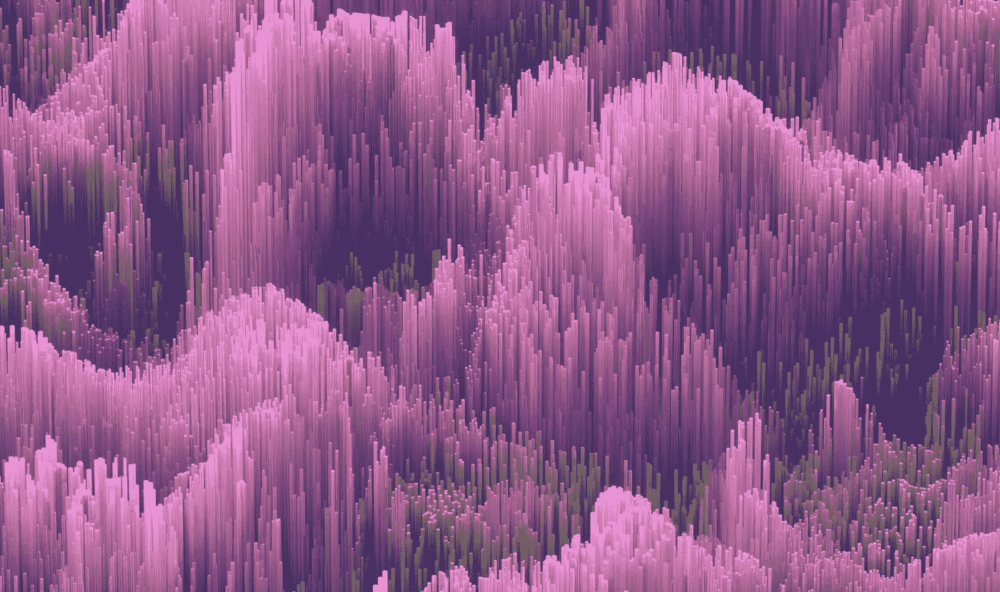
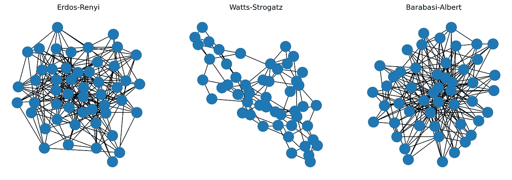
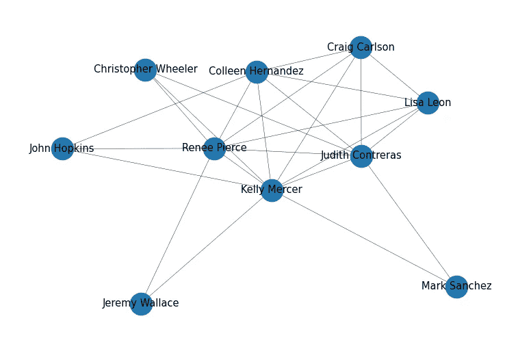

# 如何使用 Python 创建合成社交网络

> 原文：[`towardsdatascience.com/how-to-create-a-synthetic-social-network-using-python-eff6451cab14`](https://towardsdatascience.com/how-to-create-a-synthetic-social-network-using-python-eff6451cab14)

## 了解图生成算法在创建合成图中的应用

[](https://medium.com/@rohithtejam?source=post_page-----eff6451cab14--------------------------------)[](https://towardsdatascience.com/?source=post_page-----eff6451cab14--------------------------------) [Rohith Teja](https://medium.com/@rohithtejam?source=post_page-----eff6451cab14--------------------------------)

·发表于 [Towards Data Science](https://towardsdatascience.com/?source=post_page-----eff6451cab14--------------------------------) ·阅读时间 4 分钟·2023 年 1 月 31 日

--



[Maxim Berg](https://unsplash.com/@maxberg?utm_source=unsplash&utm_medium=referral&utm_content=creditCopyText) 拍摄于 [Unsplash](https://unsplash.com/photos/kE8-rUKjtQU?utm_source=unsplash&utm_medium=referral&utm_content=creditCopyText)

有时找到合适的图数据集来评估算法可能是一个令人畏惧的任务。有多种选择可用，通常需要花费相当长的时间来逐一查看。

即使你找到了完美的图数据集，你还需要验证其使用、共享和隐私政策。

这将引导我们进入这个讨论。

有没有更快速的方法来找到用于评估的图数据集？幸运的是，有！我们需要一些叫做合成图的数据集。这些图数据集是人工生成的。

# 合成图的需求

直接来说，第一个理由是方便。

生成你自己的数据集是很方便的，不用担心如下问题：

+   控制图的大小

+   隐私和数据共享限制

+   图数据格式

这些理由可能并不能说服所有人，也有一些人需要现实世界的图数据用于一些合成图无法完成的图分析任务。

但我认为合成图提供了一种快速测试算法的方法，在开发框架后，你可以将其部署到现实世界的场景中。

# 合成图究竟是什么？

合成图是使用图生成模型生成的。它们被构造得尽可能模拟真实世界的图。

存在生成合成图的算法。其中一些包括：

1.  **Erdös-Rényi 模型**——在此模型中，我们从一个预定义的节点集合开始，例如`N`。现在我们使用概率在节点之间添加边以生成图形。概率是固定的，对图中所有节点对都是相同的。因此，更高的概率会生成密集图，而较低的概率则生成稀疏图。这是一个简单的模型，与现实世界的图形相差甚远。

1.  **Watts-Strogatz 模型——** 这是一种生成具有小世界特性的图形的方法。在这个背景下，小世界被定义为具有较小的路径长度和较高的聚类系数的东西。

> 路径长度：这是测量图中两个节点之间距离的指标。路径长度越短，节点之间的距离越近。
> 
> 聚类系数：它衡量节点的邻居之间的连接紧密程度。

该模型从一个固定数量节点的规则网格状结构开始，并将边连接到节点的最近邻居。它使用重连概率，这意味着某些边会随机从一个位置移除并添加到其他地方。

它用于建模现实世界的网络，这些网络是类似小世界的社交网络和交通网络的实例。

3\. **Barabasi-Albert 模型——** 这个图生成模型遵循“富者越富”的原则。该模型将新节点连接到已经有更多连接的现有节点。这导致图中出现几个高度连接的节点和一些连接较少的节点。它用于建模无标度网络，如互联网和社交网络。

# 合成社交网络

我们可以使用`NetworkX` Python 库生成一个合成社交网络。

让我们查看合成图如何使用所有三种模型，并观察它们的效果。

下面是使用`NetworkX`生成图形的代码：

```py
import networkx as nx
import numpy as np
import matplotlib.pyplot as plt

# Erdos-Renyi model
G1 = nx.erdos_renyi_graph(n=50, p=0.2, seed=42)

# Watts-Strogatz model
G2 = nx.watts_strogatz_graph(n=50, k=5, p=0.4, seed=42)

# Barabasi-Albert model
G3 = nx.barabasi_albert_graph(n=50, m=5, seed=42)

# plot side by side
fig, ax = plt.subplots(1, 3, figsize=(15, 5))
# add title to each plot
ax[0].set_title('Erdos-Renyi')
ax[1].set_title('Watts-Strogatz')
ax[2].set_title('Barabasi-Albert')
nx.draw(G1, ax=ax[0])
nx.draw(G2, ax=ax[1])
nx.draw(G3, ax=ax[2])
plt.show()
```

图形可视化如下所示：



合成图比较（作者提供的图片）

调整超参数会生成截然不同的图形。

对于社交网络，我们希望添加节点特征和节点标签。这可以使用`faker` Python 库完成，它生成虚假姓名。

让我们看看它的样子。

```py
from faker import Faker
import networkx as nx
import matplotlib.pyplot as plt

faker = Faker()

names = []

# generate 10 unique names
for i in range(10):
    # Generate a random name 
    name = faker.name()
    # Append the name to the list
    names.append(name)

# Barabasi-Albert model
G = nx.barabasi_albert_graph(n=10, m=5, seed=42)

# add the names to the graph
mapping = {i: names[i] for i in range(len(names))}
G = nx.relabel_nodes(G, mapping)

fig, ax = plt.subplots(figsize=(3, 2), dpi=300)
nx.draw(G, with_labels=True, node_size=50,width=0.1, font_size=3.5)
plt.show()
```



合成社交网络

合成社交网络现在已经有了标签。每个节点代表一个人，他们的名字作为节点标签。

可以生成其他节点属性，如每个人的年龄、性别和职业，并更新图形。

现在我们有一个完全加载的合成社交网络，可以用于进行图分析任务。

感谢阅读，干杯！

**想要联系？**

请通过[LinkedIn](https://www.linkedin.com/in/rohithteja/)、[Twitter](https://twitter.com/rohithtejam)、[GitHub](https://github.com/rohithteja)或[网站](https://rohithteja.github.io/)联系我！
