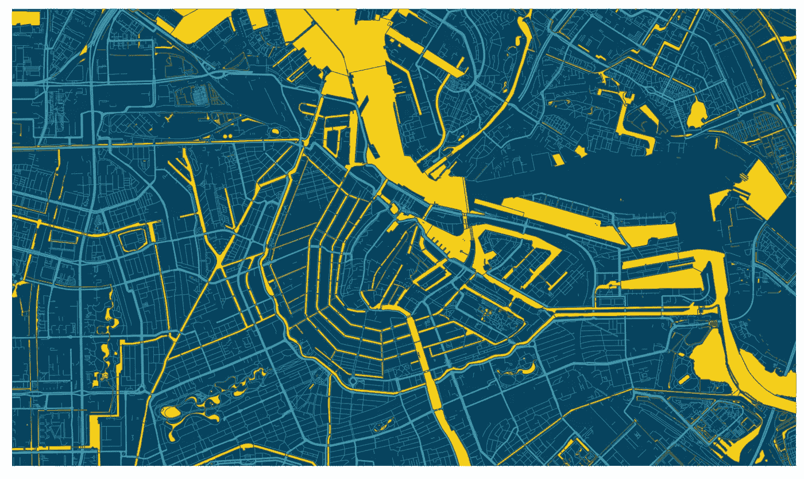
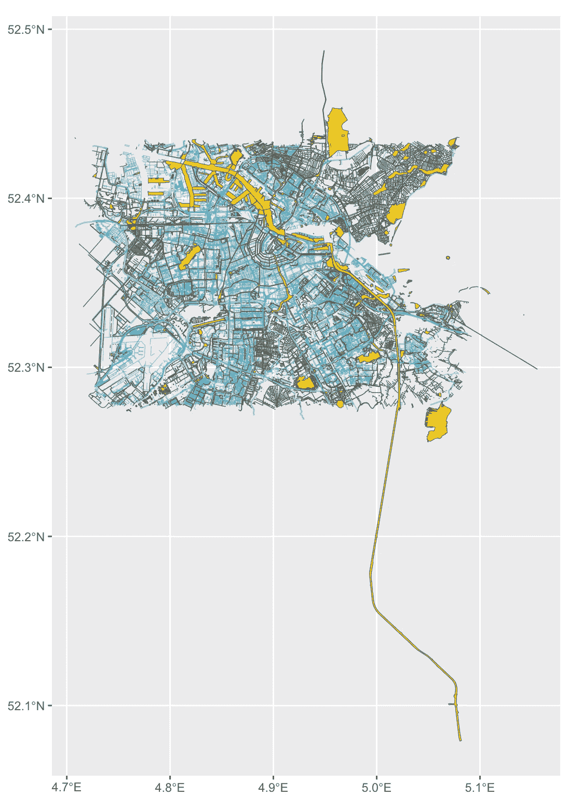
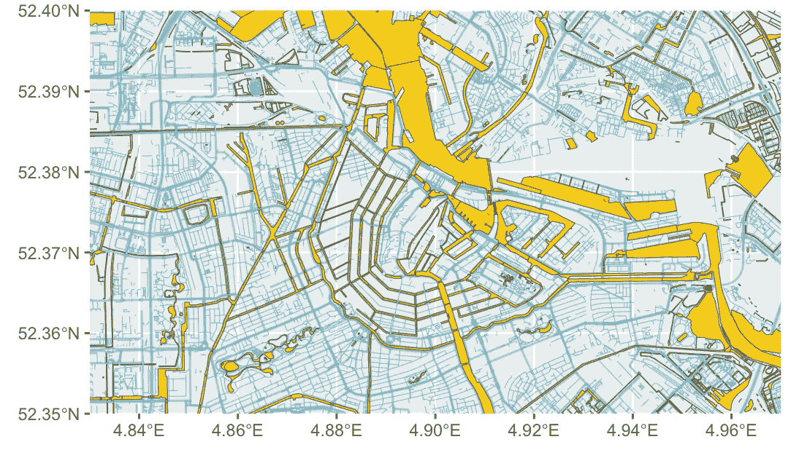
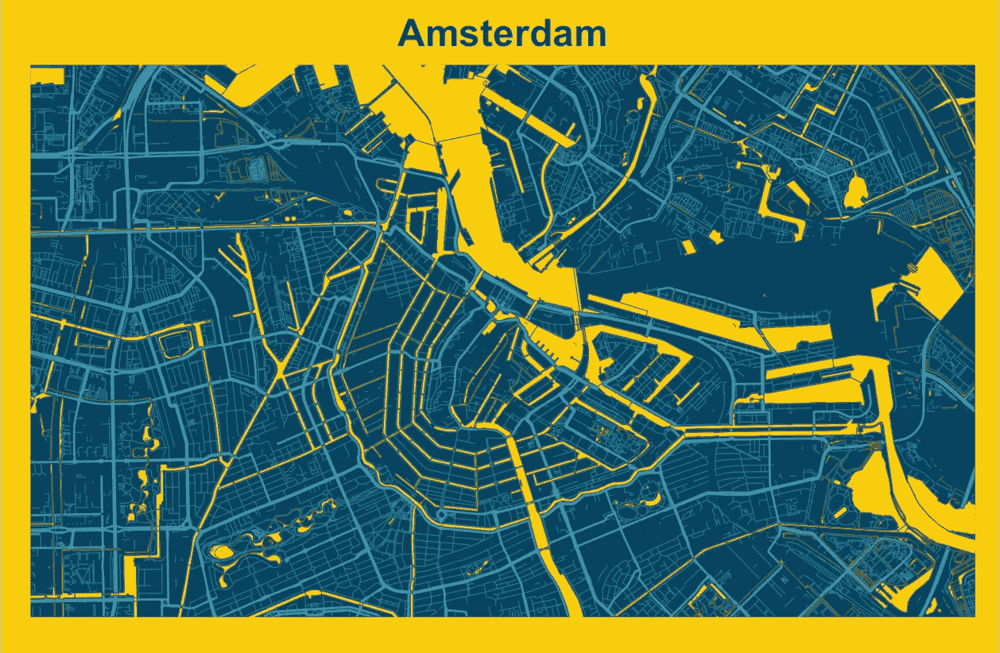

# 如何使用 R 创建艺术地图

> 原文：[`towardsdatascience.com/how-to-create-an-artistic-map-using-r-2a4932a23d10`](https://towardsdatascience.com/how-to-create-an-artistic-map-using-r-2a4932a23d10)

## OpenStreetMap + 数据可视化 = 艺术

[](https://medium.com/@irfanalghani11?source=post_page-----2a4932a23d10--------------------------------)[](https://towardsdatascience.com/?source=post_page-----2a4932a23d10--------------------------------) [Irfan Alghani Khalid](https://medium.com/@irfanalghani11?source=post_page-----2a4932a23d10--------------------------------)

·发表于 [Towards Data Science](https://towardsdatascience.com/?source=post_page-----2a4932a23d10--------------------------------) ·5 分钟阅读·2023 年 1 月 24 日

--



阿姆斯特丹地图。地图由作者创建。

> TL;DR

本文将展示如何使用 R 创建艺术地图。我们将从 OpenStreetMap 获取数据，并使用 ggplot 库自定义视觉效果。

# 介绍

当你想到地图时，第一个浮现在脑海中的可能就是它仅仅是一条信息。通过它，我们可以导航到想去的地方。

随着时间的推移，通过自定义视觉效果，地图可以成为一件艺术品，而不会失去关于位置的任何见解。

在开放数据存在之前，制作地图可能需要通过调查和创建地图本身花费大量时间。

但幸运的是，通过使用像 OpenStreetMap 这样的开放数据和编程，我们可以根据我们的视觉偏好创建自己的地图。如果你愿意，你还可以将地图艺术卖给市场，获得额外收入。

在这篇文章中，我将展示如何使用 R 创建艺术地图。不再赘述，我们开始吧！

# 实现

## 加载库

要构建地图，我们需要几个库。这些库包括：

+   osmdata 用于下载和加载 OpenStreetMap 数据。

+   tidyverse 提供数据处理和可视化的功能。

+   sf 库用于将 OSM 数据转换为 sf 格式

如果你没有那些库，你可以先用这些代码行下载它们：

```py
install.packages('osmdata')
install.packages('sf')
install.packages('sysfonts')
```

如果你遇到超时错误，你可以执行这段代码来延长超时：

```py
options(timeout=600)
```

下载这些库后，你可以使用这些代码行来加载库：

```py
library(osmdata)
library(tidyverse)
library(sf)
```

## 加载数据

正如我提到的，我们将使用 OpenStreetMap 数据获取空间数据，如道路、建筑物、河流等。我们将使用一个名为 osmdata 的库。现在让我们使用这些代码行检索街道和水体的空间数据：

```py
streets <- getbb('Amsterdam Netherlands') %>%
  opq() %>%
  add_osm_feature(key='highway',
                  value=c('motorway', 'primary',
                          'secondary', 'tertiary')) %>%
  osmdata_sf()

small_streets <- getbb('Amsterdam Netherlands') %>%
  opq() %>%
  add_osm_feature(key='highway',
                  value=c('residential', 'living_street',
                          'service', 'footway')) %>%
  osmdata_sf()

rivers <- getbb('Amsterdam Netherlands') %>%
  opq() %>%
  add_osm_feature(key='natural',
                  value=c('water')) %>%
  osmdata_sf()
```

正如你从上述代码中看到的，我将空间数据分为三种不同的变量，如街道、小街道和河流。分开变量的原因是为了便于自定义视觉效果，如颜色、大小和可见性。你将在之后理解这个目的。

每个变量都有类似的工作流程。

+   首先，我们调用 `getbb` 函数来检索所需位置的边界框。在这种情况下，我们将检索阿姆斯特丹的边界框。

+   然后，我们初始化 Overpass API，通过调用 `opq` 函数从指定的边界框中查询数据。

+   接下来，我们调用 `add_osm_feature` 来通过指定相应的键和值检索特定的空间数据。存在许多键值对，你可以查看 OSM 维基页面 [**这里**](https://wiki.openstreetmap.org/wiki/Map_features)。

+   最后，你可以使用 `osmdata_sf` 函数将数据转换为 sf 格式。

## 构建地图

数据加载后，现在进入有趣的部分。我们将使用 `ggplot` 库来构建地图。首先，让我们通过以下代码行可视化原始地图：

```py
ggplot() +
  geom_sf(data=streets$osm_lines,
          inherit.aes = FALSE,
          color = '#58b9c7',
          size = .5,
          alpha = .6) +
  geom_sf(data=small_streets$osm_lines,
          inherit.aes = FALSE,
          color = '#239dc1',
          size = .2,
          alpha = .6) +
  geom_sf(data=rivers$osm_polygons,
          inherit.aes = FALSE,
          fill='#f8cc0a',
          size = .2)
```

基本上，我们调用 `ggplot` 函数来创建图表。然后，我们使用 `geom_sf` 函数可视化空间对象。我们对每个变量应用这个函数，因为它们有不同的样式格式。结果如下：



这张图片由作者创建。

地图显示出来了！但看起来不太好。我们现在可以通过添加 `coord_sf` 函数来裁剪坐标，如下所示：

```py
ggplot() +
  geom_sf(data=streets$osm_lines,
          inherit.aes = FALSE,
          color = '#58b9c7',
          size = .5,
          alpha = .6) +
  geom_sf(data=small_streets$osm_lines,
          inherit.aes = FALSE,
          color = '#239dc1',
          size = .2,
          alpha = .6) +
  geom_sf(data=rivers$osm_polygons,
          inherit.aes = FALSE,
          fill='#f8cc0a',
          size = .2) +
  # ADD THIS CODE
  coord_sf(ylim=c(52.35, 52.40),
           xlim=c(4.83, 4.97),
           expand=FALSE)
```

结果如下：



这张图片由作者创建。

看起来很棒！最后，我们可以使用 `theme` 函数调整视觉效果。你可以根据自己的喜好更改任何参数。以下是实现这一点的代码：

```py
ggplot() +
  geom_sf(data=streets$osm_lines,
          inherit.aes = FALSE,
          color = '#58b9c7',
          size = .5,
          alpha = .6) +
  geom_sf(data=small_streets$osm_lines,
          inherit.aes = FALSE,
          color = '#239dc1',
          size = .2,
          alpha = .6) +
  geom_sf(data=rivers$osm_polygons,
          inherit.aes = FALSE,
          fill='#f8cc0a',
          size = .2) +
  coord_sf(ylim=c(52.35, 52.40),
           xlim=c(4.83, 4.97),
           expand=FALSE)
  # ADD THIS CODE
  theme(
    plot.background = element_blank(),
    panel.background = element_rect(color='#08435f', 
                                    fill='#08435f',
                                    size = 20),
    panel.grid = element_blank(),
    axis.ticks = element_blank(),
    axis.text  = element_blank(),
  )
```

我们通过这段代码做的是去除坐标轴刻度并改变背景颜色。结果如下：


这张图片由作者创建。

不错！如果你想添加标题和边框，你可以使用 `labs` 函数来设置标题。同时，别忘了调整 `theme` 函数。以下是代码：

```py
ggplot() +
  geom_sf(data=streets$osm_lines,
          inherit.aes = FALSE,
          color = '#58b9c7',
          size = .5,
          alpha = .6) +
  geom_sf(data=small_streets$osm_lines,
          inherit.aes = FALSE,
          color = '#239dc1',
          size = .2,
          alpha = .6) +
  geom_sf(data=rivers$osm_polygons,
          inherit.aes = FALSE,
          fill='#f8cc0a',
          size = .2) +
  coord_sf(ylim=c(52.35, 52.40),
           xlim=c(4.83, 4.97),
           expand=FALSE) +
  # ADD THIS CODE
  labs(title = 'Amsterdam') + 
  theme(
    plot.background = element_rect(fill="#f8cc0a",color='#f8cc0a'),
    plot.margin = unit(c(0.3, 0.4, 0.5, 0.4), 'cm'),
    panel.background = element_rect(color='#08435f', 
                                    fill='#08435f',
                                    size = 20),
    panel.grid = element_blank(),
    axis.ticks = element_blank(),
    axis.text  = element_blank(),
    plot.title = element_text(size=18, 
                              face='bold',
                              hjust=.5,
                              color='#08435f'),
  )
```

结果如下：



这张图片由作者创建。

太棒了！最后，如果你想保存你的图表，你可以使用 `ggsave` 函数来设置你喜欢的图片尺寸。

```py
ggsave('<YOUR FINLE NAME>.png', width=1920, height=1080, units='px')
```

# 最后说明

做得好！现在你已经学会了如何使用 R 创建艺术风格的地图。我希望这篇文章能帮助你更多地了解数据可视化，特别是地理空间数据方面。

如果你对我的文章感兴趣，你可以在 Medium 上关注我，以获取更多有关数据科学和机器学习的文章。

感谢阅读我的文章！

## 参考资料

[1] [`www.youtube.com/watch?v=TDVXff6i3kw&t=986s`](https://www.youtube.com/watch?v=TDVXff6i3kw&t=986s)

[2] [`cran.r-project.org/web/packages/osmdata/vignettes/osmdata.html`](https://cran.r-project.org/web/packages/osmdata/vignettes/osmdata.html)

[3] [`wiki.openstreetmap.org/wiki/Map_features`](https://wiki.openstreetmap.org/wiki/Map_features)
