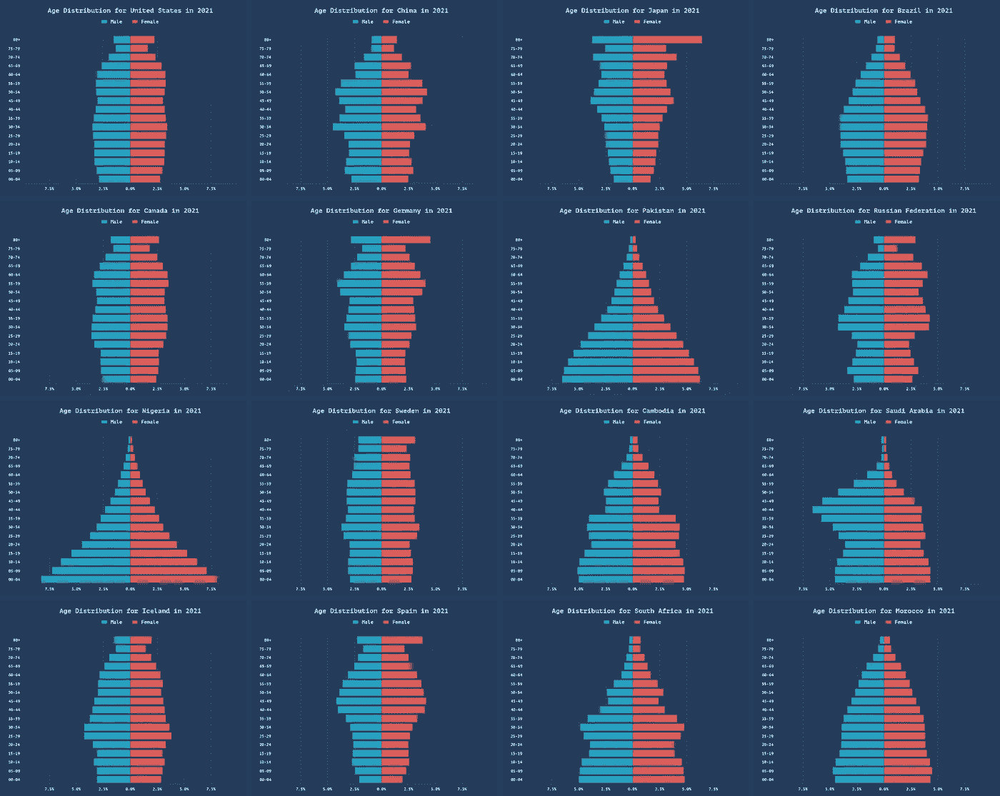

# 如何使用 Seaborn 和 Matplotlib 创建美丽的年龄分布图（包括动画）

> 原文：[`towardsdatascience.com/how-to-create-beautiful-age-distribution-graphs-with-seaborn-and-matplotlib-including-animation-68ebabff41bd?source=collection_archive---------5-----------------------#2023-06-22`](https://towardsdatascience.com/how-to-create-beautiful-age-distribution-graphs-with-seaborn-and-matplotlib-including-animation-68ebabff41bd?source=collection_archive---------5-----------------------#2023-06-22)

## 图表教程

## 可视化国家和地区的人口统计数据

 [Oscar Leo](https://medium.com/@oscarleo?source=post_page-----68ebabff41bd--------------------------------)

·

[关注](https://medium.com/m/signin?actionUrl=https%3A%2F%2Fmedium.com%2F_%2Fsubscribe%2Fuser%2Fd7e5c1ca65b7&operation=register&redirect=https%3A%2F%2Ftowardsdatascience.com%2Fhow-to-create-beautiful-age-distribution-graphs-with-seaborn-and-matplotlib-including-animation-68ebabff41bd&user=Oscar+Leo&userId=d7e5c1ca65b7&source=post_page-d7e5c1ca65b7----68ebabff41bd---------------------post_header-----------) 发表在 [Towards Data Science](https://towardsdatascience.com/?source=post_page-----68ebabff41bd--------------------------------) ·9 分钟阅读·2023 年 6 月 22 日

--

作者创建的图表

今天，我想向你展示如何使用 `matplotlib` 和 `seaborn` 创建像上面那样美丽的年龄分布图。

年龄分布图非常适合可视化一个国家或地区的人口统计数据。它们很有趣，但默认的 Seaborn + Matplotlib 图表效果不够好。

在这个教程中，你将学习：

+   如何创建 Seaborn 样式

+   改进坐标轴，使其易于阅读和富有信息

+   添加标题和美观的图例

+   将 Matplotlib 图形转换为 PIL 图像并添加外部填充

+   创建多个图像的网格（如上例所示）

+   创建时间推移动画以展示人口如何随时间变化

如果你想跟随教程，你可以在这个[GitHub 仓库](https://github.com/oscarleoo/age-distribution-tutorial/tree/main)找到数据和我的代码。

开始吧。

## 数据的快速浏览
