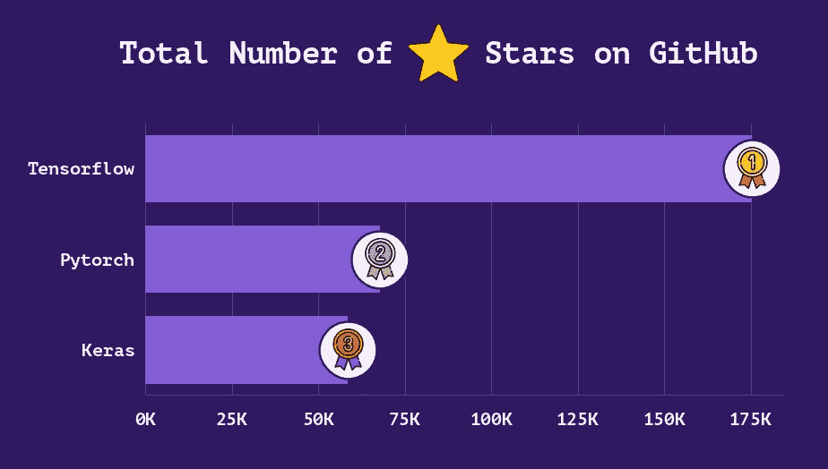
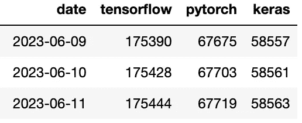
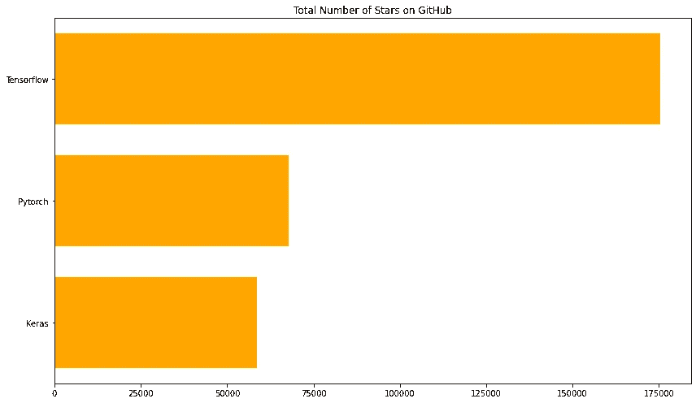
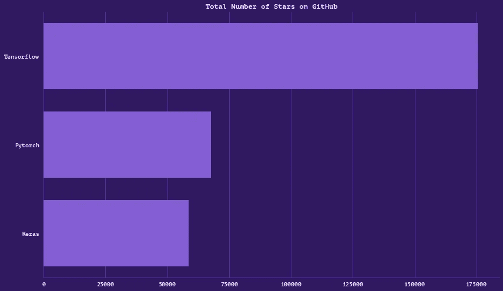
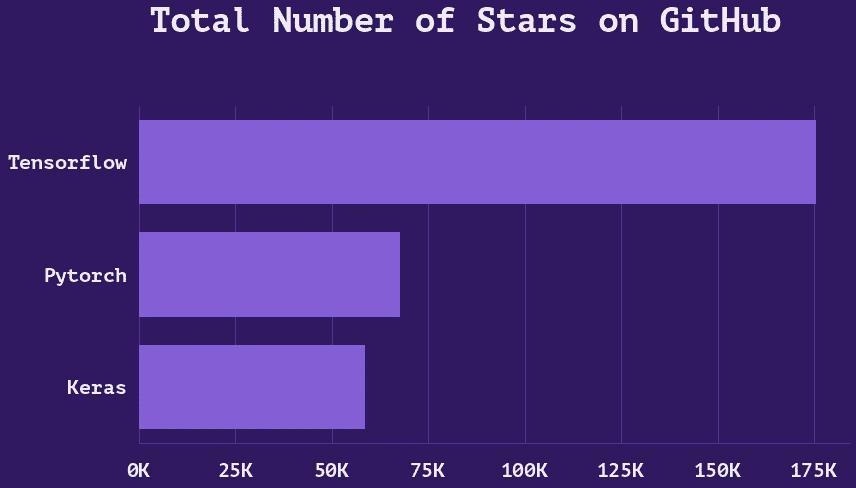
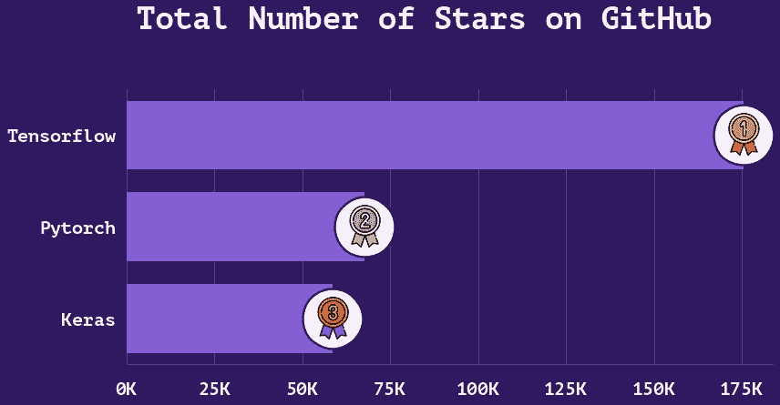
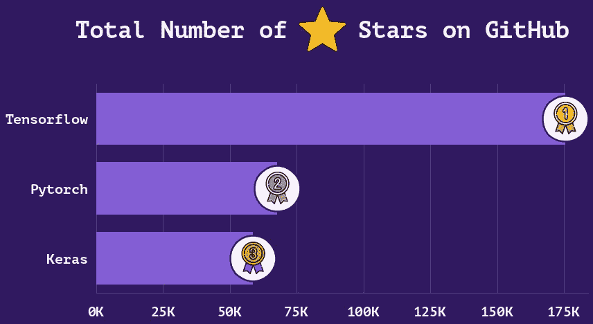
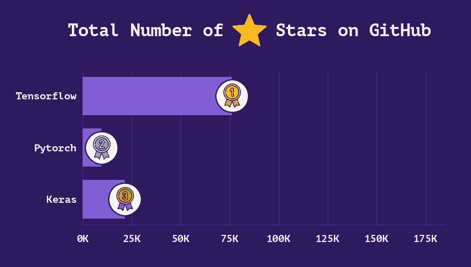

# 如何使用 Seaborn 和 Matplotlib 创建美丽的条形图（包括动画）

> 原文：[`towardsdatascience.com/how-to-create-beautiful-bar-charts-with-seaborn-and-matplotlib-including-animation-c2bc9ade1d7c`](https://towardsdatascience.com/how-to-create-beautiful-bar-charts-with-seaborn-and-matplotlib-including-animation-c2bc9ade1d7c)

## 图表教程

## Python 数据可视化教程

[](https://medium.com/@oscarleo?source=post_page-----c2bc9ade1d7c--------------------------------)[](https://towardsdatascience.com/?source=post_page-----c2bc9ade1d7c--------------------------------) [Oscar Leo](https://medium.com/@oscarleo?source=post_page-----c2bc9ade1d7c--------------------------------)

·发布在 [Towards Data Science](https://towardsdatascience.com/?source=post_page-----c2bc9ade1d7c--------------------------------) ·7 分钟阅读·2023 年 6 月 15 日

--



作者创建的图表

你好，欢迎来到我的第一个 Matplotlib 和 Seaborn 教程。今天，我将向你展示如何将默认条形图转变为令人惊叹的视觉效果，配有图标和动画。

如果你喜欢这种内容，请告诉我。如果是这样，我可以创建更多类似的内容！ :)

你可以在这个仓库中找到代码和预处理数据：[simple-bar-chart-tutorial](https://github.com/oscarleoo/simple-bar-chart-tutorial)。

让我们开始吧。

## 第 1 步：创建默认条形图

对于本教程，我创建了一个简单的数据集，其中包含三个流行的开源深度学习框架（`Tensorflow`、`PyTorch` 和 `Keras`）随时间变化的星级总数。



作者截图

这是一个简单的函数，它为数据框中的一行创建一个简单的条形图。

```py
def create_bar_chart(row, color):    
    return sns.barplot(
        y=row.index.str.capitalize().values,
        x=row.values,
        orient="h",
        saturation=1,
        color=color,
        width=0.75,
    )
```

要创建第一个视觉效果，我像这样运行上述代码。

```py
row = df.iloc[-1]

fig = plt.figure(figsize=(12, 7))
ax = create_bar_chart(row, color=bar_color)

plt.title("Total Number of Stars on GitHub")
plt.tight_layout()
plt.show()
```

如果我对数据集的最后一行运行这个函数，并使用橙色，这就是我得到的默认条形图。



作者创建的条形图

在接下来的步骤中，我将创建一些额外的函数，我们可以与上述代码一起运行，以改进图表。

让我们尝试创建一些更美丽的东西。

## 第 2 步：创建主题

首先，我想创建一个函数，允许我测试图表的不同颜色和字体。

Matplotlib 和 Seaborn 中有大量的方法，可以帮助你改变图表的外观。

我更喜欢首先通过使用 `sns.set_style()` 来创建主题。下面是我用来快速创建新主题的代码片段。

```py
def set_seaborn_style(font_family, background_color, grid_color, text_color):
    sns.set_style({
        "axes.facecolor": background_color,
        "figure.facecolor": background_color,

        "grid.color": grid_color,
        "axes.edgecolor": grid_color,
        "axes.grid": True,
        "axes.axisbelow": True,

        "axes.labelcolor": text_color,
        "text.color": text_color,
        "font.family": font_family,
        "xtick.color": text_color,
        "ytick.color": text_color,

        "xtick.bottom": False,
        "xtick.top": False,
        "ytick.left": False,
        "ytick.right": False,

        "axes.spines.left": False,
        "axes.spines.bottom": True,
        "axes.spines.right": False,
        "axes.spines.top": False,
    }
)
```

`sns.set_style()` 还有更多选项，你可能会想以不同的方式使用它。但这是最适合我的设置。

我经常去 [colorhunt.co](https://colorhunt.co) 或 [canva.com](https://www.canva.com/colors/color-palettes) 寻找灵感以创建配色方案。当我有喜欢的基础颜色时，如果还需要更多颜色，我会去 [coolors.co](https://coolors.co/)。

这是我为本教程创建的颜色调色板（是的，我喜欢紫色）。


作者截图

我选择的字体是“PT Mono”，根据这个决定，我可以运行以下代码。

```py
background_color = "#2F195F"
grid_color = "#582FB1"
bar_color = "#835ED4"
text_color = "#eee"

set_seaborn_style(font_family, background_color, grid_color, text_color)
```

如果我现在运行原始代码以创建条形图，我得到以下结果。



作者创建的条形图

这是一项明显的改进，但还不够好。让我们继续格式化标题文本和轴标签。

## 步骤 3: 文本格式化

我首先注意到的是轴标签需要更大。图表中显示的所有信息都应该易于一眼看清。

我不喜欢 x 轴上数字的显示方式。我想用 75K 替代 75000，以获得一个更不令人畏惧的外观。

这就是我创建这个函数的原因。

```py
def format_axes(ax):
    ax.tick_params("x", labelsize=20, pad=16)
    ax.tick_params("y", labelsize=20, pad=8)

    plt.xticks(
        ticks=ax.get_xticks()[:-1],
        labels=["{}K".format(int(x / 1000)) for x in ax.get_xticks()[:-1]]
    )
```

对于标题，我添加了参数以增加字体大小并调整位置。

这是创建带有我新修改的图表的代码。

```py
row = df.iloc[-1]

fig = plt.figure(figsize=(12, 7))
ax = create_bar_chart(row, color=bar_color)

# New function
format_axes(ax)

plt.title("Total Number of Stars on GitHub", fontsize=34, y=1.2, x=0.46)
plt.tight_layout()
plt.show()
```

这是结果。



作者创建的条形图

现在看起来相当不错，但现在是时候添加一些图标魔法了。

## 步骤 4: 添加图标

向图表中添加图像和图标很有趣，但也很棘手。将它们放在完美的位置或以理想的大小显示并不总是那么简单。

以下函数通过使用`xycoords="data"`和来自我的数据框的值，将图形中每个条形的末尾添加图标。

`bboxprops`中的`boxstyle`参数创建了一个白色圆形背景。

```py
def add_bar_icons(ax, row, background_color, zoom, pad):
    for index, (name, value) in enumerate(row.items()): 
        icon = plt.imread("./icons/{}.png".format(name.lower()))
        image = OffsetImage(icon, zoom=zoom, interpolation="lanczos", resample=True, visible=True)
        image.image.axes = ax

        ax.add_artist(AnnotationBbox(
            image, (value, index), frameon=True,
            xycoords="data",
            bboxprops={
                "facecolor": "#fff",
                "linewidth": 3,
                "edgecolor": background_color,
                "boxstyle": "circle, pad={}".format(pad),
            }
        ))
```

我想将图标放在一个白色圆圈上，并用与图表背景相同的深紫色添加边框。

到目前为止，我还没有找到一种好的方法来动态处理`zoom`参数，所以我手动调整以获得正确的尺寸。

现在我创建图表的代码如下。

```py
row = df.iloc[-1]

fig = plt.figure(figsize=(12, 7))
ax = create_bar_chart(row, color=bar_color)

# New functions
format_axes(ax)
add_bar_icons(ax, row, background_color, zoom=0.09, pad=0.9)

plt.title("Total Number of Stars on GitHub", fontsize=34, y=1.2, x=0.46)
plt.tight_layout()
plt.show()
```

这就是我得到的结果。



作者创建的条形图

为了添加星形图标，我创建了另一个函数，它使用 `xycoords="axes fraction"` 在图表上的任意位置添加自定义图标。

```py
def add_icon(ax, icon_name, x, y, zoom):
    icon = plt.imread("./icons/{}.png".format(icon_name))
    image = OffsetImage(icon, zoom=zoom, interpolation="lanczos", resample=True, visible=True)
    image.image.axes = ax

    ax.add_artist(AnnotationBbox(
        image, (x, y), frameon=False,
        xycoords="axes fraction",
    ))
```

在下一个技巧中，我通过在标题中添加额外的空格并调整`x`和`y`参数，为星形图标留出空间，以将图标放置在正确的位置。

```py
row = df.iloc[-1]

fig = plt.figure(figsize=(12, 7))
ax = create_bar_chart(row, color=bar_color)

# New functions
format_axes(ax)
add_bar_icons(ax, row, background_color, zoom=0.09, pad=0.9)
add_icon(ax, "star", x=0.46, y=1.26, zoom=0.13)

plt.title("Total Number of     Stars on GitHub", fontsize=34, y=1.2, x=0.46)
plt.tight_layout()
plt.show()
```

现在我们的条形图是这样的，我们快完成了。



作者创建的条形图

看起来很棒，但现在我想将图表转换为更通用的格式。

让我们通过添加一些填充来解决那个被挤压的外观问题。

## 步骤 5: 将图表转换为图像

在这一部分，我创建了一个函数，它将图形转换为 PIL 图像。PIL 图像在我们教程的最后步骤中更易于操作。

```py
def create_image_from_figure(fig):
    plt.tight_layout()

    fig.canvas.draw()
    data = np.frombuffer(fig.canvas.tostring_rgb(), dtype=np.uint8)
    data = data.reshape((fig.canvas.get_width_height()[::-1]) + (3,))
    plt.close() 

    return Image.fromarray(data)
```

我还创建了以下函数，以在图表周围添加填充。

```py
def add_padding_to_chart(chart, left, top, right, bottom, background):
    size = chart.size
    image = Image.new("RGB", (size[0] + left + right, size[1] + top + bottom), background)
    image.paste(chart, (left, top))
    return image
```

这是生成图表的新版本代码，我用我们的新方法替代了标准的`plt.show()`。

```py
row = df.iloc[-1]

fig = plt.figure(figsize=(12, 7))
ax = create_bar_chart(row, color=bar_color)\
plt.title("Total Number of     Stars on GitHub", fontsize=34, y=1.2, x=0.46)

# New functions
format_axes(ax)
add_bar_icons(ax, row, background_color)
add_icon(ax, "star", 0.46, 1.26)
image = create_image_from_figure(fig)
image = add_padding_to_chart(image, 0, 10, 10, 10, background_color)
```

这是结果。


作者创建的条形图

太棒了！

我们现在已经把默认的条形图变成了更美丽的样子。

让我们用一个额外的部分结束。

## 额外部分：创建动画

因为我们把代码分成了可重用的函数，所以创建动画相当简单。

我们需要做的就是多次运行代码，使用不同的值，并将帧拼接在一起。

这是一个循环，我从数据集中取了最后 2000 行中的 200 行。我还通过设置`xlim=(0, 185000)`来修复 x 轴，以避免值闪烁。

```py
images = []

for i in tqdm.tqdm(range(1, 2000, 10)):
    row = df.iloc[-i]

    fig = plt.figure(figsize=(12, 7))
    ax = create_bar_chart(row, color=bar_color)
    ax.set(xlim=(0, 185000))
    plt.title("Total Number of     Stars on GitHub", fontsize=34, y=1.2, x=0.46)

    format_axes(ax)
    add_bar_icons(ax, row, background_color, zoom=0.09, pad=0.9)
    add_icon(ax, "star", 0.46, 1.26)

    image = create_image_from_figure(fig)
    image = add_padding_to_chart(image, 20, 20, 40, 0, background_color)
    images.append(image)

images.reverse()
```

接下来，我使用`imageio`来创建一个 GIF。

```py
# Adding a few duplicates of the last frame to create a delay
images = images + [images[-1] for _ in range(20)]

imageio.mimwrite('./animation.gif', images, duration=50)
```

这是结果。



作者创建的可视化

这标志着本教程的结束，希望你喜欢。如果喜欢，请分享这个故事并订阅我的[频道](https://medium.com/@oscarleo)。

你也可以在 Twitter 上关注我：[@oscarle3o](https://twitter.com/oscarl3o)

感谢阅读。

下次见！ :)
