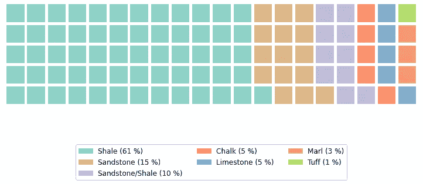
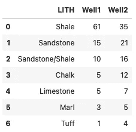
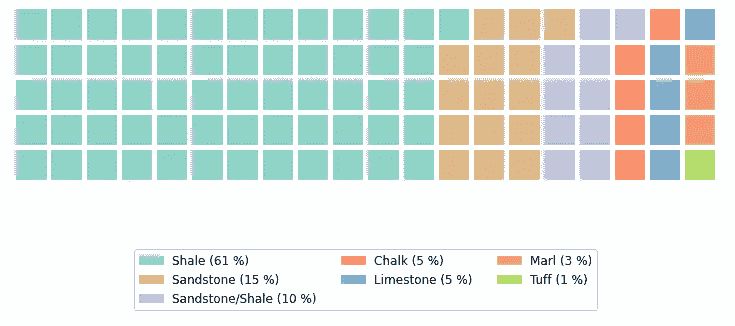
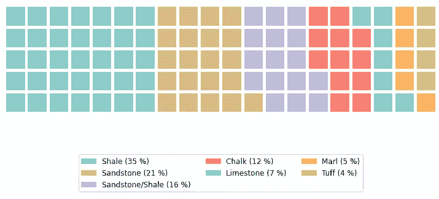
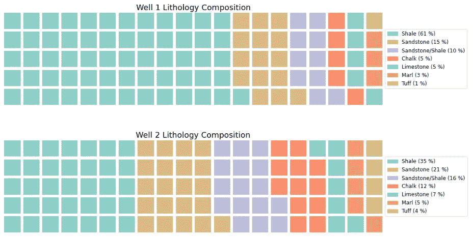
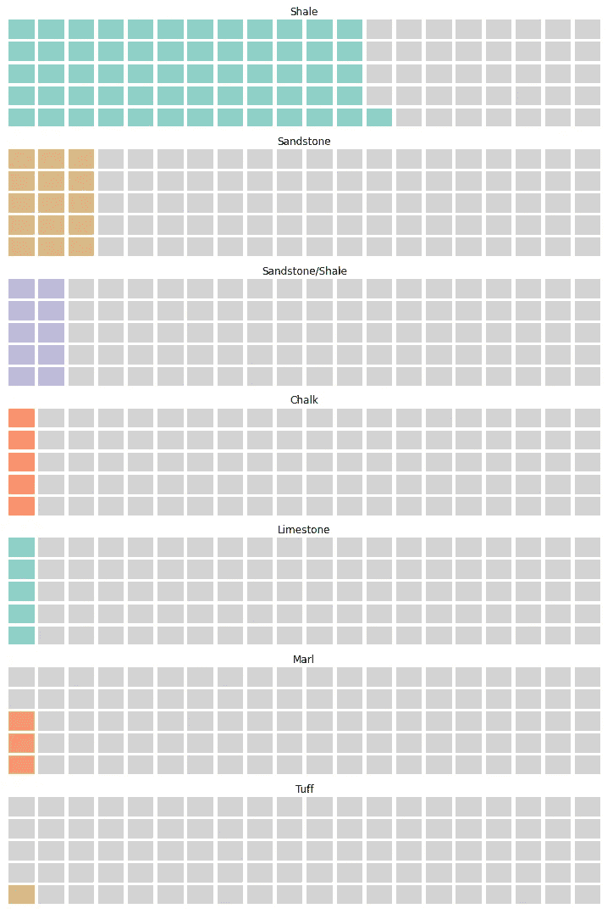
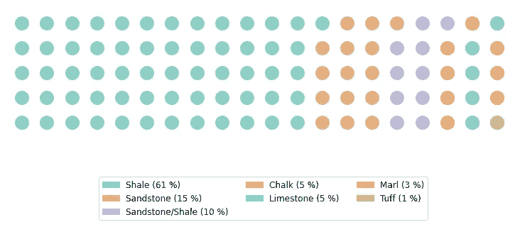

# 如何在 Python 中创建美丽的华夫图用于数据可视化

> 原文：[`towardsdatascience.com/how-to-create-beautiful-waffle-charts-for-data-visualisation-in-python-e9760a3f8594`](https://towardsdatascience.com/how-to-create-beautiful-waffle-charts-for-data-visualisation-in-python-e9760a3f8594)

## 数据可视化的绝佳替代方案

[](https://andymcdonaldgeo.medium.com/?source=post_page-----e9760a3f8594--------------------------------)[](https://towardsdatascience.com/?source=post_page-----e9760a3f8594--------------------------------) [Andy McDonald](https://andymcdonaldgeo.medium.com/?source=post_page-----e9760a3f8594--------------------------------)

·发表于[Towards Data Science](https://towardsdatascience.com/?source=post_page-----e9760a3f8594--------------------------------) ·7 分钟阅读·2023 年 2 月 8 日

--


图片由[Mae Mu](https://unsplash.com/es/@picoftasty?utm_source=medium&utm_medium=referral)拍摄，来源于[Unsplash](https://unsplash.com/?utm_source=medium&utm_medium=referral)

华夫图是可视化分类数据的绝佳方式，既美观又易于读者理解——这也是有效数据可视化的关键目标之一。它们还提供了一种比饼图更美观的替代方案。

华夫图是由网格模式中较小的方块组成的正方形或矩形显示图。最常见的是 10 x 10 网格，但它们可以是你想要的任何尺寸，这将取决于你要展示的数据。网格中的每个方块都根据一个类别进行着色，代表了整体的一部分。通过这些图表，我们可以看到各个类别的贡献或展示实现目标的进度。



显示井内不同岩石类型的华夫图示例。图像由作者提供。

华夫图有多种用途，包括可视化实现目标的进度、理解组成整体的各个部分，甚至查看费用对毛利润的影响。

## 华夫图的优缺点

与任何数据可视化工具一样，以特定格式展示数据有其优点和缺点。

华夫图在展示数据方面有多个优势，包括：

+   是饼图的绝佳替代方案

+   有趣且美观

+   易于阅读和解释

+   数据没有失真

+   视觉化少量类别的绝佳方式

+   易于可视化实现目标的进度

尽管有这些优点，但使用华夫图也有一些缺点：

+   如果要显示大量类别，可能会很难阅读

+   比较非相邻类别可能会很困难

+   由于尺寸问题，不能在方块中包含文本或数字

+   如果值小于方块的代表值，准确性可能会受到影响。例如，如果一个方块等于一个单位，而你有半个单位

在文章中，我们将使用地质岩性数据来查看如何使用 Python 显示华夫图。

# 使用 Python 和 PyWaffle 构建华夫图

## 导入库和创建数据

**使用 matplotlib 创建华夫图是可能的**；然而，有一个非常方便的库 [**pywaffle**](https://pywaffle.readthedocs.io/en/latest/)，它使这个过程变得更加简单。

首先，我们必须通过在终端中使用以下命令来安装 [**pywaffle library**](https://pypi.org/project/pywaffle/)：

```py
pip install pywaffle
```

然后，在我们的代码中，我们需要导入几个库：[**pandas**](https://pandas.pydata.org/) 和 [**matplotlib**](https://matplotlib.org/)。

```py
from pywaffle import Waffle
import pandas as pd
import matplotlib.pyplot as plt
```

在这个示例中，我们将使用一些基本的岩性数据。这表示两个不同井中的不同岩石类型的百分比。

与其加载数据，我们可以快速通过字典创建 pandas dataframe。

```py
lith_dict = {'LITH': ['Shale', 'Sandstone', 
                      'Sandstone/Shale', 'Chalk', 
                      'Limestone', 'Marl', 'Tuff'],
             'Well1': [61,15, 10, 5, 
                            5, 3, 1],
             'Well2': [35 ,21, 16, 12, 
                            7, 5, 4]}

lith_data_df = pd.DataFrame.from_dict(lith_dict)
```

当我们查看数据框时，我们会看到：



pandas dataframe 中两个井的不同岩性百分比。图片由作者提供。

最后，我们将创建一些基本颜色，使华夫图看起来更具视觉吸引力，并使我们能够轻松地比较不同井中的数据。

```py
colours = ['#8dd3c7', '#deb887', '#bebada', '#fb8072', 
           '#80b1d3', '#fdb462', '#b3de69']
```

## 使用 PyWaffle 创建简单的华夫图

在华夫图中包含值和标签可能会使图表非常混乱。因此，在这个示例中，我们将把这些信息存储在图例中。

为此，我们将创建一个新的变量 `plot_labels`，并使用列表推导将值与标签连接起来。

```py
plot_labels = [f'{i} ({str(j)} %)' for i,j in zip(lith_data_df.LITH, 
                                                    lith_data_df.Well1)]
```

接下来，我们可以继续创建华夫图。

我们通过调用 `plt.figure` 并将 `Waffle` 传递给 `FigureClass` 参数来实现这一点。随后是几个额外的参数，包括我们要显示的数据、颜色和标签。

最后，我们可以在调用 `plt.figure()` 时直接设置图例。

```py
plt.figure(FigureClass=Waffle, figsize=(10,10), rows=5, columns = 20, 
                 values=list(lith_data_df['Well1']),
                 colors=colours,
                 labels=plot_labels, 
                legend={'loc':'lower center', 'bbox_to_anchor': (0.5, -0.8), 
                        'ncol':3, 'fontsize':12})
plt.show()
```

当我们运行上述代码时，我们将得到以下华夫图。


使用 PyWaffle 创建的显示不同岩性的华夫图——一个 Python 库。图片由作者提供。

我们可以立即看到每种岩性对井的整体组成的贡献。

当方块被填充时，过程从左下角开始。如果我们想更改起始位置，可以通过将 `starting_location` 参数添加到 `plt.figure()` 方法来实现。

```py
plt.figure(FigureClass=Waffle, figsize=(10,10), rows=5, columns = 20, 
                 values=list(lith_data_df['Well1']),
                 colors=colours,
                 labels=plot_labels, 
                legend={'loc':'lower center', 'bbox_to_anchor': (0.5, -0.8), 
                        'ncol':3, 'fontsize':12},
                starting_location='NW')
plt.show()
```

当我们运行这段代码时，我们会看到华夫饼图沿水平轴翻转。



华夫饼图显示不同的岩石类型，修改了起始位置。图片由作者提供。

# 使用 Python 比较不同的华夫饼图

现在我们有了第一口井，我们可以对第二口井运行相同的代码。我们通过将值更改为使用 Well2 而不是 Well1 来实现这一点。

```py
fig = plt.figure(FigureClass=Waffle, figsize=(10,10), rows=5, columns = 20, 
                 values=list(lith_data_df['Well2']),
                 colors=colours,
                 labels=plot_labels, 
                legend={'loc':'lower center', 'bbox_to_anchor': (0.5, -0.8), 
                        'ncol':3, 'fontsize':12})
plt.show()
```



华夫饼图显示第二口井的不同岩石类型。图片由作者提供。

这看起来很棒，我们可以很容易地为每口井创建单独的图表，并在 PowerPoint 中将它们拼接在一起。然而，通过 PyWaffle 也有一种方法，那就是传递包含子图位置和内容的字典。

```py
fig = plt.figure(FigureClass=Waffle, 
                 plots = {211: {'values':list(lith_data_df['Well1']),
                               'labels': [f'{i} ({str(j)} %)' for i,j in zip(lith_data_df.LITH, 
                                                    lith_data_df.Well1)],
                               'legend':{'loc':'center left', 'bbox_to_anchor': (1.0, 0.5), 
                                          'ncol':1, 'fontsize':12},
                                'title':{'label':'Well 1 Lithology Composition', 'fontsize':18}
                               },

                          212: {
                              'values':list(lith_data_df['Well2']),
                              'labels': [f'{i} ({str(j)} %)' for i,j in zip(lith_data_df.LITH, 
                                         lith_data_df.Well2)],
                              'legend':{'loc':'center left', 'bbox_to_anchor': (1.0, 0.5), 
                                          'ncol':1, 'fontsize':12},
                              'title':{'label':'Well 2 Lithology Composition', 'fontsize':18}
                          }
                         },
                 figsize=(15,10), 
                 rows=5, 
                 columns = 20, 
                 colors=colours)

plt.tight_layout()
plt.show()
```

上述代码将生成以下华夫饼图，让我们可以比较两口井之间的岩性差异。



同一图形上的多个华夫饼图，使得比较不同数据组更容易。图片由作者提供。

# 如何将类别拆分为单独的华夫饼图

为了让我们的读者更容易理解，我们可以将每个类别拆分到它们各自的华夫饼子图中。这可以使读者更容易跟随故事，并与包含相同类别的其他组进行直接比较。

为此，我们需要利用 matplotlib 的子图功能。

我们需要遍历每个类别，然后使用 `Waffle.make_waffle()` 添加各个子图。

```py
# Set up the colour for unused squares
off_colour = 'lightgrey'

# Figsize numbers must be equal or the height greater than the width
# othewise the plot will appear distorted

fig, axs = plt.subplots(len(lith_data_df), 1, figsize=(10, 15))

for (i, ax), color in zip(enumerate(axs.flatten()), colours):
    plot_colours = [color, off_colour]
    perc = lith_data_df.iloc[i]['Well1']
    values = [perc, (100-perc)]
    lith = lith_data_df.iloc[i]['LITH']
    Waffle.make_waffle(ax=ax, rows=5, columns=20, 
                       values=values, colors=plot_colours)

    ax.set_title(lith)
plt.tight_layout()
plt.show()
```

当我们运行这段代码时，我们会得到带有各个类别的图形。



使用 matplotlib 的子图功能按类别划分的多个华夫饼图。图片由作者提供。

# 使用 Circles 和 Icons 替代 PyWaffle 中的 Squares

如果我们想让数据可视化更有趣，我们可以引入不同的形状和图标，而不是标准的方块。

为此，我们可以添加两个参数：`icons` 和 `font_size`。第一个允许我们从[**font-awesome**](https://fontawesome.com)网站中指定一个图标，第二个允许我们控制图标的大小。

```py
plt.figure(FigureClass=Waffle, figsize=(10,10), rows=5, columns = 20, 
                 values=list(lith_data_df['Well1']),
                 colors=colours,
                 labels=plot_labels, 
                icons='circle',
                font_size='20',
                legend={'loc':'lower center', 'bbox_to_anchor': (0.5, -0.8), 
                        'ncol':3, 'fontsize':12},
                 starting_location='NW')
plt.show()
```

运行代码后，我们会得到以下图表。



使用圆圈替代方块的华夫饼图。图片由作者提供。

这为用户提供了极大的自定义华夫饼图的方式，特别是当你在向用户展示数据时寻找特定风格时。例如，如果你正在创建一张讨论蜜蜂的海报，你可以用蜜蜂图标代替圆圈/方块。

# 总结

华夫饼图是数据可视化的优秀工具。它们为数据传达的故事增添了额外的趣味，并且是饼图的一个很好的替代选择。PyWaffle 库简单易用，适用于各种数据集，包括地质和岩石物理数据集。

*感谢阅读。在你离开之前，你应该订阅我的内容，并将我的文章送到你的收件箱。* [***你可以在这里做到这一点！***](https://andymcdonaldgeo.medium.com/subscribe)*另外，你还可以* [***订阅我的新闻简报***](https://fabulous-founder-2965.ck.page/2ca286e572) *以免费获取额外的内容直接送到你的收件箱。*

*其次，你可以通过订阅会员，获得完整的 Medium 体验，同时支持成千上万的其他作家和我。只需每月$5，你就能完全访问所有精彩的 Medium 文章，还可以通过写作赚钱。*

*如果你使用* [***我的链接***](https://andymcdonaldgeo.medium.com/membership)***，*** *你将直接支持我，你的费用不会增加。如果你这样做了，非常感谢你的支持。*
