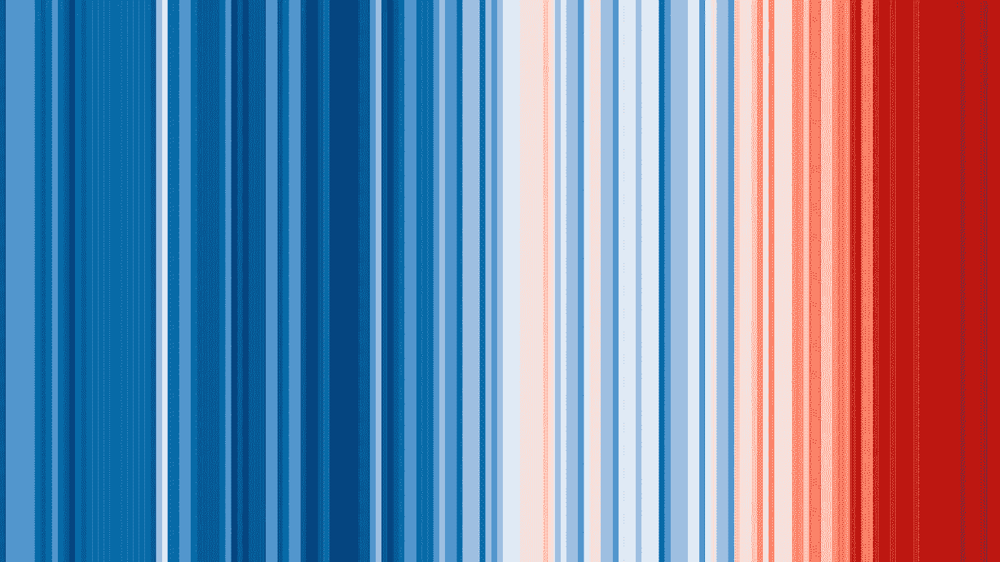

# 如何创建气候条纹

> 原文：[`towardsdatascience.com/how-to-create-climate-stripes-e46ab1bdade?source=collection_archive---------28-----------------------#2023-01-10`](https://towardsdatascience.com/how-to-create-climate-stripes-e46ab1bdade?source=collection_archive---------28-----------------------#2023-01-10)

## 使用 R 的数据可视化教程

 [Irfan Alghani Khalid](https://medium.com/@irfanalghani11?source=post_page-----e46ab1bdade--------------------------------)

·

[关注](https://medium.com/m/signin?actionUrl=https%3A%2F%2Fmedium.com%2F_%2Fsubscribe%2Fuser%2F44601cf05927&operation=register&redirect=https%3A%2F%2Ftowardsdatascience.com%2Fhow-to-create-climate-stripes-e46ab1bdade&user=Irfan+Alghani+Khalid&userId=44601cf05927&source=post_page-44601cf05927----e46ab1bdade---------------------post_header-----------) 发表在 [Towards Data Science](https://towardsdatascience.com/?source=post_page-----e46ab1bdade--------------------------------) ·5 分钟阅读·2023 年 1 月 10 日

--

气候条纹。（图片由作者制作）

> TL;DR

本文将教你如何使用 R 创建气候条纹可视化。我们将使用 MetOffice 的数据，并通过 ggplot 库生成条纹。

# 介绍

一图胜千言。数据可视化就是其中之一。当我们想要影响他人时，一张图表可以让你意识到一些你可能原本不在意的东西。气候条纹也是其中之一。但它到底是什么呢？

气候条纹是由 Ed Hawkins 教授在 2018 年制作的。这种可视化展示了一系列颜色条，表示相对于 1961–1990 年的温度变化。它只展示颜色，但正是这一点使得这张图既美丽又令人恐惧。

每个颜色条表示相对温度，1961–1990 年的条纹为基准。蓝色表示较低，红色表示较高。颜色越深，温度升高的程度就越大。

如果你注意到了，文章的封面是气候条纹。现在我们将使用 R 来创建这个图表。废话不多说，开始吧！

# 实现

## 数据来源
