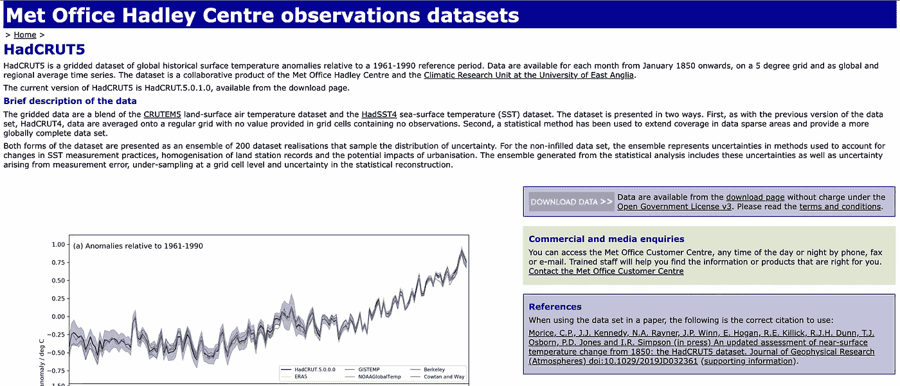
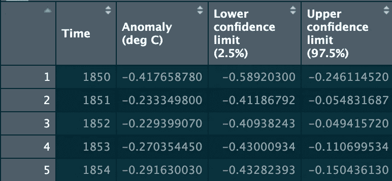
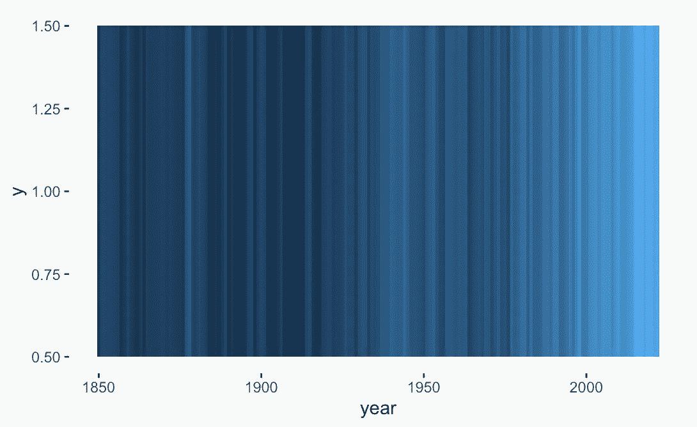
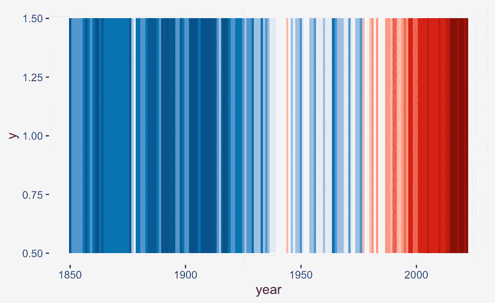
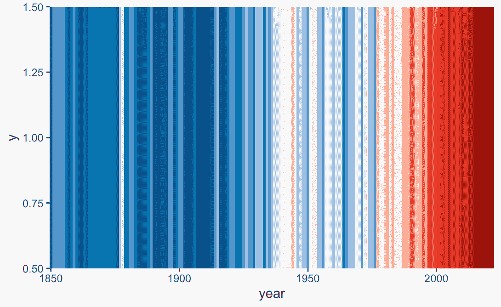
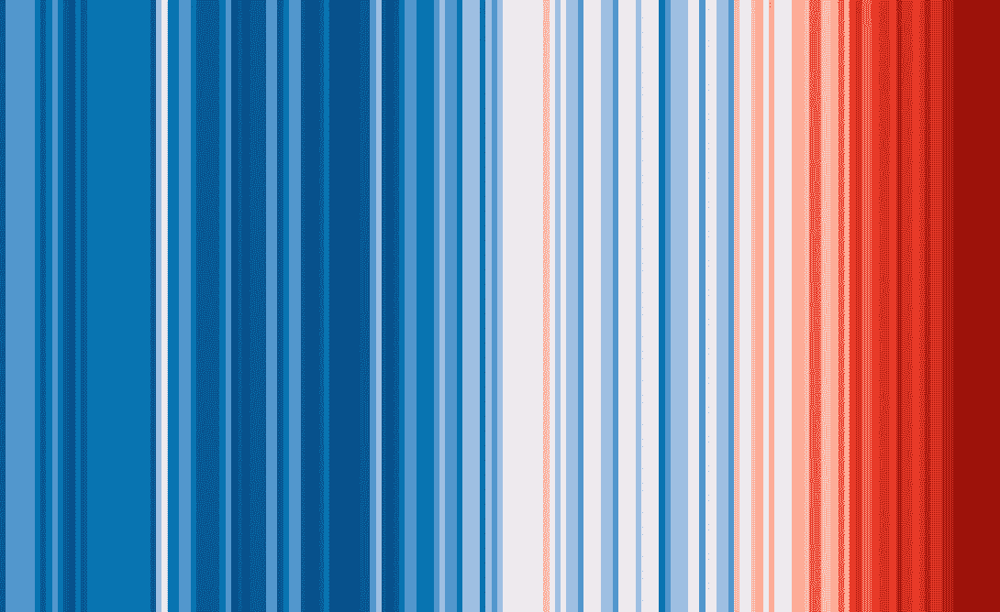
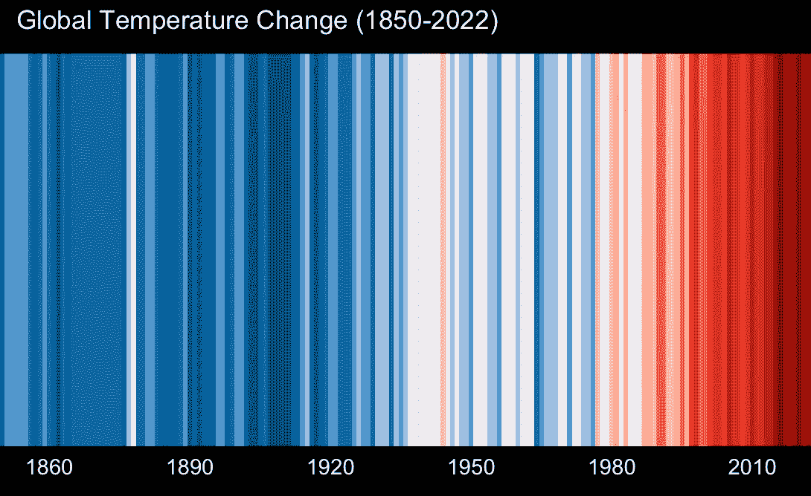

# 如何创建气候条纹

> 原文：[`towardsdatascience.com/how-to-create-climate-stripes-e46ab1bdade`](https://towardsdatascience.com/how-to-create-climate-stripes-e46ab1bdade)

## 使用 R 语言的数据可视化教程

[](https://medium.com/@irfanalghani11?source=post_page-----e46ab1bdade--------------------------------)[](https://towardsdatascience.com/?source=post_page-----e46ab1bdade--------------------------------) [Irfan Alghani Khalid](https://medium.com/@irfanalghani11?source=post_page-----e46ab1bdade--------------------------------)

·发布于[Towards Data Science](https://towardsdatascience.com/?source=post_page-----e46ab1bdade--------------------------------) ·阅读时间 5 分钟·2023 年 1 月 10 日

--


气候条纹。（图片由作者创建）

> TL;DR

本文将教你如何使用 R 语言创建气候条纹可视化。我们将使用气象局的数据并通过 ggplot 库生成条纹。

# 介绍

一张图片胜千言。数据可视化就是其中之一。当我们想要影响别人时，一张图表可以让你意识到你可能之前不在意的事情。气候条纹也是其中之一。但是它是什么呢？

气候条纹由 Ed Hawkins 教授于 2018 年创建。这种可视化展示了一系列颜色条，表示相对于 1961-1990 年的温度变化。它仅显示颜色，但这使得这个图表既美丽又令人惊恐。

每一条颜色条代表 1961-1990 年相对温度。蓝色表示温度较低，红色表示温度较高。颜色越深，温度上升越高。

如果你注意到了，文章的封面就是气候条纹。现在我们将使用 R 语言来创建这个图表。废话不多说，开始吧！

# 实现方法

## 数据来源

要实现图表，我们首先需要找到数据来源。在本文中，我们将使用来自气象局的名为 HadCRUT5 的数据集。

该数据集收集了多个区域的近地表温度。它结合了 CRUTEM5（地表空气温度）和 HadSST4（海表温度）数据集的数据。



图片由作者拍摄。

气象局提供了时间序列和网格格式的数据。在这种情况下，我们将使用时间序列数据。你可以通过链接[**这里**](https://www.metoffice.gov.uk/hadobs/hadcrut5/)阅读更多关于数据集的详细信息。

## 库

R 语言提供了一个名为 tidyverse 的库。这个一体化的库包含了对数据处理（dplyr）和可视化（ggplot）有用的函数。

我们将加载那个库以及 scales 和 glue 库。这里是实现这一点的代码：

```py
library(tidyverse)
library(scales)
library(glue)
```

## 加载数据

加载库后，下一步是加载数据。正如我之前提到的，我们将使用 HadCRUT5 的年度时间序列数据集。请通过这个链接[**这里**](https://www.metoffice.gov.uk/hadobs/hadcrut5/data/current/analysis/diagnostics/HadCRUT.5.0.1.0.analysis.summary_series.global.monthly.csv)下载数据集。

下载数据后，让我们使用 read_csv 函数加载数据，如下所示：

```py
t_data <- read_csv('HadCRUT.5.0.1.0.analysis.summary_series.global.annual.csv')
```

我们来看一下数据集：



如你所见，从左到右，每列代表年份、摄氏度的温度异常、下限置信度和上限置信度。为了可视化图表，我们将使用第一列和第二列。让我们运行这段代码：

```py
t_data <- t_data %>%
  select(year=Time, t_diff='Anomaly (deg C)')
```

代码将选择所需的列并同时转换名称。这种转换将使我们的数据处理更简单。

## 可视化数据

好了，现在进入激动人心的部分，我们将使用 ggplot 库来可视化数据。如果你第一次听说 ggplot，别担心！我会指导你生成图表。首先，让我们添加这些代码行：

```py
t_data %>%
  ggplot(aes(x=year, y=1, fill=t_diff)) +
  geom_tile(show.legend = FALSE)
```

所以，代码将使用 geom_tile 函数创建一组条纹。ggplot 函数将处理数据。通过这个函数，我们选择成为 XY 轴和颜色的列。结果将如下所示：



图片由作者创建。

嗯，还是不好。让我们调整图表。首先，我们将使用 scale_fill_stepsn 函数来更改颜色调色板，像这样：

```py
t_data %>%
  ggplot(aes(x=year, y=1, fill=t_diff)) +
  geom_tile(show.legend = FALSE) +
  # ADD THIS CODE
  scale_fill_stepsn(colors=c('#04346c', '#0483c3', 'white', '#ed2016', '#740404'), 
                    values=rescale(c(min(t_data$t_diff), 0, max(t_data$t_diff))),
                    n.breaks=12)
```

在函数内部，我们设置了颜色等参数，以设置颜色调色板，值因为数据中有负值，以及 n.breaks 以将颜色调色板分成 12 个不同的颜色范围。结果将如下所示：



图片由作者创建。

看起来更好了！但等等，图表上有些奇怪的间隙。让我们添加一个名为 coord_cartesian 的函数来去除间隙。这里是实现这一点的代码：

```py
t_data %>%
  ggplot(aes(x=year, y=1, fill=t_diff)) +
  geom_tile(show.legend = FALSE) +
  scale_fill_stepsn(colors=c('#04346c', '#0483c3', 'white', '#ed2016', '#740404'), 
                    values=rescale(c(min(t_data$t_diff), 0, max(t_data$t_diff))),
                    n.breaks=12) +
  # ADD THIS CODE
  coord_cartesian(expand=FALSE)
```

添加代码后，结果如下：



图片由作者创建。

很好！现在我们需要去除所有刻度和图表背景。这里是实现这一点的代码：

```py
t_data %>%
  ggplot(aes(x=year, y=1, fill=t_diff)) +
  geom_tile(show.legend = FALSE) +
  scale_fill_stepsn(colors=c('#04346c', '#0483c3', 'white', '#ed2016', '#740404'), 
                    values=rescale(c(min(t_data$t_diff), 0, max(t_data$t_diff))),
                    n.breaks=12) +
  coord_cartesian(expand=FALSE) +
  # ADD THIS CODE
  theme_void()
```

这是最终结果：



图片由作者创建。

干得好，你已经创建了气候条纹！让我们使用 ggsave 函数保存图表。这里是实现这一点的代码：

```py
ggsave('<FILE_NAME>.png', width=1920, height=1080, units='px')
```

## 附加：添加标签

如果你有兴趣给图表添加一些标签和标题，那是完全可能的！ggplot 的强大之处在于它可以覆盖我们之前设置的样式。让我们看看这段代码：

```py
t_data %>%
  ggplot(aes(x=year, y=1, fill=t_diff)) +
  geom_tile(show.legend = FALSE) +
  scale_fill_stepsn(colors=c('#04346c', '#0483c3', 'white', '#ed2016', '#740404'), 
                    values=rescale(c(min(t_data$t_diff), 0, max(t_data$t_diff))),
                    n.breaks=12) +
  coord_cartesian(expand=FALSE) +
  theme_void() +
  # ADD THIS CODE
  scale_x_continuous(breaks=seq(1860, 2010, 30)) +
  labs(title=glue('Global Temperature Change ({min(t_data$year)}-{max(t_data$year)})')) +
  theme(
    axis.text.x = element_text(color='white', 
                               margin=margin(t=5, b=10, unit='pt')),
    plot.title = element_text(color='white',
                              margin=margin(t=5, b=10, unit='pt'),
                              hjust=0.05),
    plot.background = element_rect(fill='black'),
  )
```

在底部，你可以看到我添加了三个函数。让我给你逐一解释：

+   `Scale_x_continuous` 将帮助你在 x 轴上生成标签，

+   实验室将帮助你在图表上可视化标题，

+   主题将调整背景和文本的外观。

在你再次运行代码后，最终结果将如下所示：



图片由作者创建。

# 最终备注

现在你已经学会了如何使用 R 创建气候条纹。我希望这能帮助你从这篇文章中学到更多，特别是数据可视化部分。

如果你对我的文章感兴趣，请在 Medium 上关注我。感谢阅读我的文章！

## 参考文献

[1] [`www.reading.ac.uk/planet/climate-resources/climate-stripes`](https://www.reading.ac.uk/planet/climate-resources/climate-stripes)

[2] [`www.youtube.com/watch?v=NrEdAtSlTMo`](https://www.youtube.com/watch?v=NrEdAtSlTMo)
