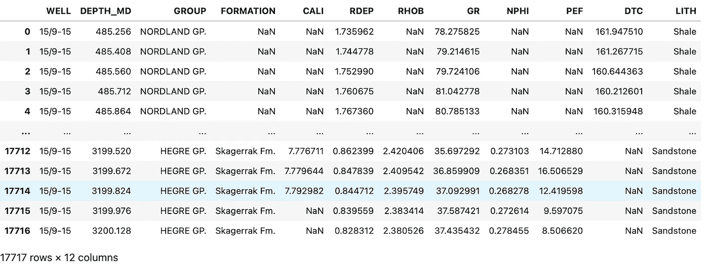

# 如何用最少的 Python 代码创建赛博朋克风格的 Seaborn 小提琴图

> 原文：[`towardsdatascience.com/how-to-create-cyberpunk-styled-seaborn-violin-plots-with-minimal-python-code-45897b82ed4c`](https://towardsdatascience.com/how-to-create-cyberpunk-styled-seaborn-violin-plots-with-minimal-python-code-45897b82ed4c)

## 关于如何轻松增强你的 Seaborn 小提琴图的简单教程

[点击这里访问 Andy McDonald 的文章](https://andymcdonaldgeo.medium.com/?source=post_page-----45897b82ed4c--------------------------------)[](https://towardsdatascience.com/?source=post_page-----45897b82ed4c--------------------------------) [Andy McDonald](https://andymcdonaldgeo.medium.com/?source=post_page-----45897b82ed4c--------------------------------)

·发表于[Towards Data Science](https://towardsdatascience.com/?source=post_page-----45897b82ed4c--------------------------------) ·6 分钟阅读·2023 年 6 月 26 日

--


赛博朋克风格的小提琴图，展示了不同岩性在井中的密度变化。图片由作者提供。

小提琴图是一种常见的数据可视化方式，它将箱形图和密度图的功能结合在一个图形中。这使我们能够在一个图形中可视化更多的信息。例如，我们可以查看箱形图中的基本统计数据，识别可能的异常值，并查看数据的分布。这有助于我们理解数据是否偏斜或包含多模态分布。

在我最新的系列文章中，我探索了使用各种主题（包括赛博朋克风格）来改进和增强基本 matplotlib 图形的方法。这种风格为图形提供了未来感的霓虹般外观，并只需几行代码即可应用于 matplotlib 和 seaborn 图形。

如果你想了解更多，你可以查看我在下面的文章中如何将其应用于 matplotlib 图形。

链接到赛博朋克 Matplotlib 图形 ## 赛博朋克化你的 Matplotlib 图形

### 通过几行代码将你的 Matplotlib 图形从无聊变得有趣

[链接到文章

在这个简短的教程中，我们将对基本的 seaborn 小提琴图进行赛博朋克风格的改造。

# 导入库和加载数据

我们将从导入本教程中使用的库开始。

这些是 [**matplotlib**](https://matplotlib.org/) 和 [**seaborn**](https://seaborn.pydata.org/) 用于可视化我们的数据，[**pandas**](https://pandas.pydata.org/) 用于加载和存储数据，[**mplcyberpunk**](https://github.com/dhaitz/mplcyberpunk) 用于将赛博朋克主题应用于 seaborn 图表。

```py
import matplotlib.pyplot as plt
import pandas as pd
import mplcyberpunk
import seaborn as sns
```

导入所需的库后，下一步是加载我们的数据。这是通过 pandas 的 `read_csv()` 函数完成的，并传入数据文件的位置。

我们将使用的数据是结合了[**XEEK 和 Force 2020 机器学习竞赛**](https://xeek.ai/challenges/force-well-logs)的一个子集，旨在通过测井数据预测岩性。数据集的进一步细节可以在文章末尾找到。

```py
df = pd.read_csv('data/Xeek_Well_15-9-15.csv')
```



Pandas 数据框包含 15/19–15 井的测井数据。图片由作者提供。

当我们查看数据框（`df`）时，我们得到如上图。我们可以看到我们有一口井的数据，从 485 米延伸到 3200 米。

# 创建 Seaborn 小提琴图

从数据框中，我们将使用两列。RHOB 列包含体积密度测量数据，LITH 列包含岩性描述。

我们可以调用以下代码来创建基本的小提琴图。

首先我们将图形大小设置为 10 x 5，这样会得到一个大小合适的图形，然后我们调用` sns.violinplot()`并传入所需的参数。

```py
plt.figure(figsize=(10,5))
sns.violinplot(x='LITH', y='RHOB', data=df)
```

当我们运行上述代码时，我们得到以下图表。


基本的 seaborn 小提琴图显示了每种岩性的体积密度 (RHOB) 的变化。图片由作者提供。

初看上去，返回的图表看起来不错且可用，但我们可以通过使用` mplcyberpunk` 库来改进样式。

# 将赛博朋克风格应用于 Seaborn 图形

要将赛博朋克风格应用到我们的图表中，我们只需在代码中添加一行额外的代码。这行代码使用了 with 语句，然后调用了` plt.style.context`，它允许我们仅将样式应用于此行下方调用的图表，而不是改变所有图表的全局样式。

```py
with plt.style.context('cyberpunk'):
    plt.figure(figsize=(10,5))
    sns.violinplot(x='LITH', y='RHOB', data=df)
```

当我们运行上述代码时，我们将得到以下小提琴图，大部分赛博朋克主题已经应用。


应用 mplcyberpunk 主题后的 Seaborn 小提琴图。图片由作者提供。

[**mplcyberpunk**](https://pypi.org/project/mplcyberpunk/) 库应该做的一个过程是更改小提琴的颜色。然而，在我们的例子中，这尚未应用。但可以轻松修复。

我们需要创建一个赛博朋克颜色列表来修复它。这些颜色提取自 mplcyberpunk 源代码，但可以更改为任何你想要的颜色。记住，如果你追求赛博朋克风格，我们可能会使用明亮的霓虹颜色。

除了创建颜色列表外，我们还可以对小提琴图进行排序，使其按字母顺序排列。这是一个可选的步骤，但非常有用，特别是在比较多个具有相同类别的数据集时。

```py
my_pal=['#08F7FE', '#FE53BB', '#F5D300', '#00ff41', 'r', '#9467bd', '#de014f']

lith_order = df['LITH'].sort_values().unique()
```

要将颜色应用到文件中，我们可以将`my_pal`传递给小提琴图的调色板参数。

然而，要将相同的颜色应用到图形的边缘/线条上，我们需要访问 collections，它们存储了小提琴图所有部分的列表。

在这个列表中，每两个连续的项对应一个小提琴：第一个是小提琴的主体，第二个是迷你箱型图。

因此，我们需要在 for 循环中考虑这一点。

```py
with plt.style.context('cyberpunk'):
    plt.figure(figsize=(15,10))
    g=sns.violinplot(x='LITH', y='RHOB', data=df, palette=my_pal,
                     order=lith_order)

    for i in range(len(g.collections)//2):  
        # divide by 2 because collections include both violin 
        # bodies and the mini box plots
        g.collections[i*2].set_edgecolor(my_pal[i])
        g.collections[i*2].set_alpha(0.8)
```

当我们运行上述代码时，我们得到以下带有赛博朋克小提琴图的图形。


赛博朋克风格的小提琴图，用于展示井下不同岩性。图片由作者提供。

现在我们能够控制图形的线条和颜色后，可以通过调整填充的 alpha 值使其稍微亮一点，并增加 x 轴和 y 轴标签的大小来做最后的调整。

```py
with plt.style.context('cyberpunk'):
    plt.figure(figsize=(15,10))

    g=sns.violinplot(x='LITH', y='RHOB', data=df, palette=my_pal,
                     order=lith_order)

    for i in range(len(g.collections)//2):
        g.collections[i*2].set_edgecolor(my_pal[i])
        g.collections[i*2].set_alpha(0.9)

    g.set_ylabel('RHOB\n\n', fontsize=16)
    g.set_xlabel('\n\nLithology', fontsize=16)
```


赛博朋克风格的小提琴图，用于展示井下不同岩性。图片由作者提供。

# 总结

[**mplcyberpunk**](https://github.com/dhaitz/mplcyberpunk)库提供了一种快速简便的方法，可以瞬间将图形从默认样式转换为具有未来感的外观。

在创建类似的图形时，考虑受众并确保你要传达的信息和故事仍然清晰是非常重要的。

# 本教程中使用的数据集

作为 Xeek 和 FORCE 2020 举办的机器学习竞赛的一部分使用的训练数据集的子集*(Bormann et al., 2020)*。此数据集使用 Creative Commons Attribution 4.0 International 许可。

完整的数据集可以通过以下链接访问：[`doi.org/10.5281/zenodo.4351155`](https://doi.org/10.5281/zenodo.4351155)。

*感谢阅读。在你离开之前，你应该订阅我的内容并在你的收件箱中收到我的文章。* [***你可以在这里做到这一点！***](https://andymcdonaldgeo.medium.com/subscribe)

*其次，你可以通过注册会员来获得完整的 Medium 体验并支持成千上万的其他作者和我。它只需每月$5，你可以完全访问所有精彩的 Medium 文章，并有机会通过写作赚钱。*

*如果你使用* [***我的链接***](https://andymcdonaldgeo.medium.com/membership)***,*** *你将直接通过你的费用支持我，而这不会增加你的开支。如果你这样做，非常感谢你的支持。*
